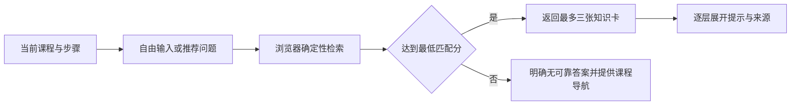
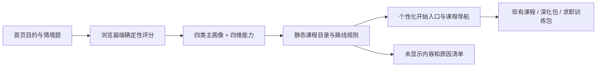
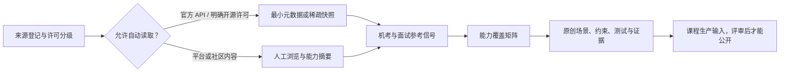

# 技术架构

## 当前阶段

当前项目以 GitHub 仓库和 MkDocs Material 文档站并行建设。Markdown 仍是唯一内容源；MkDocs 负责把公开内容生成可搜索、可导航的静态网站。

## 信息架构

项目采用四层六条默认主线，并允许跨主线专业领域组合多个后置能力。

四层和六条主线负责组织共同内容，[小白统一学习路线](../learning-paths/beginner-roadmap.md)负责定义唯一默认学习顺序，[完整课程地图](../learning-paths/curriculum-map.md)负责展示推荐深化、专业选修和跨主线依赖。跨主线专业领域只能在前置满足后解锁，不能覆盖默认顺序或伪装成第七条必修主线。

四层：

- `maps/`：学习地图，负责全局导航和能力关系。
- `content-inbox/`：本地素材收纳，负责登记未整理资料、处理状态和下一步动作；不进入 Git。
- `source-materials/`：本地素材加工区，负责保存原始抓取、清洗中间产物和临时导出；不进入 Git。
- `learning-paths/`：学习路线，负责阶段拆解和学习顺序。
- `projects/`、`exercises/`：项目实践，负责验证学习成果。
- `resources/`、`reviews/`：资源事实与资源评测，负责筛选、纠错和使用建议。

六线：

- 工程基础
- 编程语言
- Web 全栈
- CS 核心
- AI 基础
- LLM/Agent

默认顺序：

```text
工程基础前置
  -> Python 起步
    -> Python/C++ 双主修（Java 补充）
      -> CS 最小核心
        -> Web / CS 深化并行
          -> AI 基础
            -> LLM/Agent
```

按需跨主线专业领域：

```text
C++核心 + CS系统编程 / 并发 / 网络
  -> 设备系统共同基础
    -> MCU / RTOS
    -> 嵌入式 Linux / BSP
    -> 工业控制与实时通信

AI基础 + MCU/RTOS 或嵌入式 Linux/BSP
  -> 边缘智能 / 嵌入式AI

强化学习 + 设备平台能力
  -> 智能控制实验
```

课程层级：

```text
必修主干 -> 通过验收后解锁下一主线
推荐深化 -> 不阻塞默认路线，可作为专业选修前置
专业选修 -> 面向具体方向，可依赖多个主线或选修模块
```

路线口径：

- 工程基础中的 Docker 先作为最小认知进入语言前阶段，复杂 Dockerfile、docker compose 和部署在项目中深化。
- Python起步以可维护的小型程序为验收目标；Python/C++双主修按核心语言、工程化、并发网络、运行原理与性能、领域应用持续深化。
- CS 核心中的算法指通用算法和复杂度，不替代 AI 阶段的模型算法。
- 设备系统与边缘智能属于跨 C++、CS 与 AI 的可选专业领域，不阻塞 Web、AI 推荐深化、强化学习或 LLM/Agent 默认路线。
- MCU/RTOS、嵌入式 Linux/BSP 和工业控制并列；边缘智能需要 AI 基础与设备平台能力，强化学习只在智能控制方向成为前置。
- 设备路线采用仿真入门、真机毕业：一级允许仿真，二级和三级必须提供真实设备的构建、运行、调试、测试与故障证据。
- AI 基础中的算法指机器学习、深度学习、NLP/Transformer、强化学习等模型算法。
- 数据库实践优先使用 PostgreSQL 和 `psql`，MySQL作为常见生产数据库对照；SQLite只用于轻量本地练习或特定样例。
- CS、Web、AI和LLM/Agent入口必须同时展示必修主干、推荐深化和专业选修，并明确每个选修的前置、验收与跳过影响。

## 仓库结构

```text
become_engineer/
├── README.md
├── docs/
├── maps/
│   ├── README.md
│   └── become-engineer-map.md
├── content-inbox/              # 本地 ignored
├── source-materials/           # 本地 ignored
├── learning-paths/
│   ├── README.md
│   ├── curriculum-map.md
│   ├── engineering-foundation/
│   ├── programming-languages/
│   ├── web-fullstack/
│   ├── cs-core/
│   ├── ai-foundation/
│   ├── device-edge-systems/
│   └── llm-agent/
├── resources/
├── reviews/
├── notes/
├── exercises/
├── projects/
├── publications/
├── templates/
└── 个人学习/
```

## 内容模块

- `maps/`：总学习地图和主线关系。
- `content-inbox/`：本地待整理素材索引和处理队列，目录整体不入库。
- `source-materials/`：本地素材加工区，目录整体不入库。
- `learning-paths/`：六条默认主线、跨主线专业领域的路线入口和阶段规划。
- `resources/`：免费资源清单，记录事实信息。
- `reviews/`：资源评测，记录使用判断和推荐建议。
- `notes/`：公开知识笔记。
- `exercises/`：练习题、聚焦实验、阶段验证和答案提示。
- `projects/`：跨多篇笔记持续演进的项目主干。
- `publications/`：从个人学习资料提炼出的公开输出。
- `templates/`：资源、评测、路线、项目、笔记、练习和公开化模板。
- `docs/08_content_standard.md`：课程、笔记、练习和项目章节的内容生产与验收基线。

## 私有目录

```text
个人学习/
```

该目录只在本地使用，不进入公开仓库。适合存放个人草稿、下载资料、未整理想法和私人复盘。公开化时必须先删除隐私信息、版权风险内容和私人上下文，再沉淀到公开目录。

## 版本控制边界

- `content-inbox/`、`source-materials/`、`个人学习/`、私有目录和 UI 验收截图整体保留在本地，由根目录 `.gitignore` 保护。
- PDF、电子书、压缩包、音视频、Office 文件、大型数据格式和模型产物在仓库范围内统一忽略。
- PNG、JPG、SVG 等图片可以作为正式课程插图入库；小型 CSV、JSON 和 TXT 可以作为可复现练习或测试夹具入库。
- 公开课程只保留实际使用的必要来源链接，不公开候选来源队列、清洗记录或原始文件。
- 本轮只清理当前版本，不重写 Git 历史；原始素材从未进入历史。

## 未来技术选型

当前已采用：

- 静态站点：MkDocs + Material for MkDocs。
- 部署：GitHub Actions 发布到 GitHub Pages。

后续如果内容规模继续扩大，可考虑：

- 搜索：本地静态索引或站点搜索服务。
- 数据化资源库：JSON、YAML、SQLite 或轻量 CMS。
- 自动检查：链接检查、Markdown lint、拼写检查、资源字段校验。

## 学习体验前端边界

- Markdown 继续拥有课程正文、路线说明和验收规则；前端样式与脚本只增强呈现和浏览交互。
- CSS 组件负责入口、阶段、状态、按钮和响应式层级；原生 JavaScript 仅用于筛选、展开或本地状态等无法由语义化 HTML 完成的行为。
- 所有交互采用渐进增强：脚本失败时完整内容、链接和导航仍然可用。
- V1 不引入 React、Vue、Docusaurus、账号系统或服务端状态，不改变 GitHub Pages 静态发布边界。
- 任务驱动与助教样板已通过验收；40 节正式课程按统一课程契约组织，课程说明、首页、地图和项目页不挂载助教。
- `.agents/skills/become-engineer-course-authoring/` 是课程生产流程的仓库内唯一源，个人 Codex Skills 只保留其经校验的可用副本。

## 知识库助教 V1

每节正式课程通过稳定的课程标识挂载助教。浏览器按课程标识加载公开 JSON 知识卡，以课程和步骤上下文、标准问题、别名和关键词执行确定性检索；回答按诊断、提示、局部示例、参考答案和来源逐层展开。



- 知识库是公开、已审核的课程衍生内容，不读取本地素材目录。
- 检索和界面通过 `query + lesson context -> candidate cards` 边界解耦，为后续语义检索或 RAG 保留替换点。
- `localStorage` 只保存每张知识卡已展开的最高层级和面板状态，不保存原始提问。
- V1 无用户身份；不同浏览器配置各自隔离，跨设备同步必须另行设计后端、认证与隐私规则。
- 像素宠物只承担入口和状态反馈，JavaScript 或资源失败时不影响课程正文。
- 每节课程包含 5–7 个稳定步骤锚点、至少 8 张知识卡和 16 条固定问法；静态校验同时检查 Markdown 挂载点、任务锚点、来源和检索命中率。

## 公开站点与治理文档边界

- 根目录 `README.md` 通过 `site-src/README.md` 软链接同时作为 GitHub 仓库说明和公开站点首页。
- `docs/` 是项目治理源，只在 GitHub 仓库阅读；MkDocs 通过 `exclude_docs` 将其从页面生成和搜索索引中排除。
- 公开内容如需引用内容规范或治理决策，使用指向 `main` 分支的 GitHub 永久路径，不依赖站内 `docs/` URL。

## 入学测评与路线编排 V1

个性化继续部署在 GitHub Pages，不增加服务端：



- `personalization-core.js` 只负责配置校验、评分、路线编排和最小存储投影，可由 Node 测试直接调用。
- `personalization.js` 负责首页测评、确认状态、桌面与移动导航增强、完整路线切换和失败降级，不承担课程知识检索。
- `data/personalization/v1.json` 是题库、画像文案、课程目录和路线状态的静态契约；课程 URL 仍以 `mkdocs.yml` 为规范来源。
- 课程知识库助教和首页测评复用宠物视觉资源，但挂载点、状态键和业务逻辑隔离。
- 个性化导航只隐藏已登记叶子节点，不删除生成页面；搜索、直接 URL、无 JavaScript和存储失败均保持完整内容可达。
- 本地存储只持久化版本、目的、主画像、四维能力、确认状态、视图模式和手动加入项，不持久化答题明细。
- 公开学习页面只保留首页、开始学习和项目三个顶部入口；课程与项目既有 URL 保持稳定。
- 已批准的视觉组件统一由 `site-src/stylesheets/extra.css` 提供，项目级设计决策记录在 `.ai/design/system.md`。

## 求职参考素材生产链

求职素材只在本地 ignored 目录流转，不成为站点运行时数据：



- `content-inbox/` 登记来源、用途、许可、访问方式和刷新日期；`source-materials/raw/` 只保存许可证明确来源的最小快照和官方 API 元数据。
- `source-materials/working/` 保存归一化信号、人工复核队列、覆盖矩阵和原创草稿；`source-materials/exports/` 只导出后续课程生产需要的结构化输入。
- 受限平台信号固定 `full_content_stored: false`，不保存完整题面、答案、题解、用户名、评论或企业内部信息。
- 自动化不得使用登录态、验证码绕过、未公开接口或高频请求；访问边界不明确时降级为链接登记和人工浏览。
- 课程、个性化路线与小码助教均不读取本地素材目录。只有通过来源、原创、测试和课程位置评审的内容才可成为公开资产。

V2 保留 V1 只读快照，在独立版本目录中增加四层数据：来源登记、规范化信号、跨来源证据聚合、课程生产导出。规范化信号只能有一个主能力族，但可以映射多个课程和岗位；频率证据按独立来源族聚合，课程重点再使用跨来源重复 30%、前置中心性 25%、岗位覆盖 20%、项目证据 15% 和课程缺口 10% 计算。

课程生产 Skill 只访问 `source-materials/exports/recruiting-reference-v2/authoring-input.json`。该接口支持按课程、规划阶段、能力族、题型、频率证据和教学优先级查询，且不暴露外部原始正文。V2 不存在或校验失败时停止求职题生产，不允许回退到 raw 数据或自行猜测企业频率。

自动刷新只覆盖 Codeforces 题目元数据、AtCoder 题目与难度数据和 GitHub 仓库／许可证元信息。AtCoder 请求间隔固定大于 1 秒，不读取用户提交数据；无明确许可、受限平台和用户面经全部降级为人工目录观察。

## 质量控制

- 每个资源条目保留来源链接。
- 每个资源评测明确适合阶段和验证状态。
- 每个学习路线必须包含可验证产出。
- 项目不得与单篇笔记机械一一对应。
- 项目通过里程碑关联多篇笔记、代码产出和验收结果。
- 项目型笔记必须说明前置知识、关联项目、当前里程碑、实际产出和基础课回链。
- 纯理论笔记可以不关联项目，但必须说明能力去向。
- 框架、平台和部署教程优先作为项目阶段或对照实验，不自动成为项目。
- 每个 inbox 素材必须标注状态、主线和下一步动作。
- 不确定内容标记为待验证。
- 明确区分原创总结、引用、翻译和个人理解。
- 对外发布前检查版权、隐私和准确性。
- 每个课程单元必须提供前置、顺序、操作、错误排查、客观验收和下一步。
- 入口文档必须引用统一路线，不能让小白自行拼装学习顺序。
- 必修主干验收控制默认路线解锁；选修模块不得反向阻塞默认路线。
- 推荐深化和专业选修必须说明用途、适合人群、前置、时机、实践、验收、跳过影响、项目关联和素材状态。
- 选修可以依赖其他选修，但依赖必须在完整课程地图和主线入口中同时可见。
- 新增或扩写课程必须先选择课程类型，再执行课程内容规范对应的最低呈现要求。
- AI输出视为待验证输入；公开内容必须保留人工审阅、主动修改、运行测试和排错证据。
- 可复制代码必须注明文件、环境、依赖、运行命令、预期输出和失败路径。
- Mermaid、表格、代码和实验按问题选择，每个图表必须回答明确问题并有正文解释。

## 内容与实践流转


- 微练习位于单节课程正文，不建立项目目录。
- 阶段作品默认聚合连续3-6节相关课程；单模块作品进入 `exercises/`，推进既有项目时只更新项目里程碑。
- 长期项目放在 `projects/`，跨多节课程和主线持续演进。
- 纯理论课程组无法形成有意义阶段作品时可以跳过，但必须记录原因和替代验收证据。
- 课程写作和发布检查以[课程内容规范](08_content_standard.md)为准。

## 素材与课程边界

当前来源按统一路线逐阶段加工：

- 逐页分类明细、重复候选和风险标签保存在 ignored 加工区。
- 公开端只发布能力依赖图、覆盖说明和重组后的内容。
- CS DIY、FastAPI和大模型笔记均已登记为候选来源。
- 来源已登记不等于公开课程已经完成。
- `llama.cpp`、FastAPI 部署案例或 Codex Git 案例不能替代对应基础课程。
