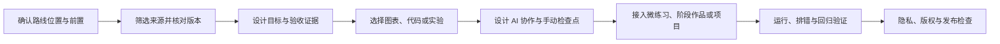
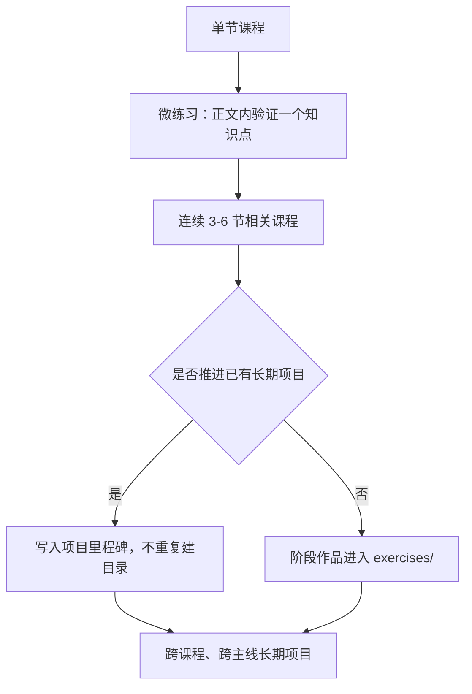

# 课程内容规范

## 目的与适用范围

本规范是 Become Engineer 后续课程正文、公开笔记、练习和项目章节的统一内容基线。新内容从创建时执行；已有内容在下一次扩写或重构时逐步迁移，不为了格式统一而批量返工。

规范解决四个问题：学习者为什么学、如何借助 AI 完成任务、怎样复现和验证结果、零散知识如何汇入阶段作品与长期项目。

## 核心原则

- **AI 协作优先，但不把判断交给 AI。** 可以让 AI 生成脚手架、样板代码、测试和分析，学习者负责约束、审阅、修改与验证。
- **内容丰富服务于理解。** Mermaid、表格、代码、输出和正反例按课程需要使用，不为满足数量制造装饰。
- **示例必须可复现。** 环境、依赖、文件位置、运行命令、预期输出和失败路径应足以让读者独立检查。
- **实践逐级汇聚。** 单节课用微练习验证知识点，连续课程形成阶段作品，长期项目跨课程和主线持续演进。
- **AI 输出是待验证输入。** 版本、接口、结论、安全性和性能必须由官方资料、实验或测试提供证据。

## 内容生产流程

下面的流程回答一个问题：一份素材如何变成可以公开学习和验收的课程内容？



课程作者先设计能力目标和验证方式，再组织讲解。不能先堆积概念，最后才临时补一个无法检验的练习。

## 每节课程的共同契约

每节课可以根据类型调整结构，但必须让学习者找到以下信息：

1. 前置知识：开始前需要会什么，缺少时去哪里补齐。
2. 学习目标：完成后能够解释、实现、观察或判断什么。
3. 核心内容：概念关系、关键步骤、边界和适用条件。
4. 实践任务：微练习、实验、阶段作品步骤或项目里程碑。
5. 验证证据：命令、输出、测试、指标、截图或解释记录。
6. 常见错误与排查：至少覆盖最可能阻塞学习者的失败路径。
7. 下一步：进入哪节课程、阶段作品或长期项目状态。
8. 来源与版本：关键事实依据、核查日期及适用版本。

## 不同课程类型的最低要求

| 类型 | 最低呈现与验收要求 |
| --- | --- |
| 概念 / 理论课 | 至少一个有效图表、概念关系或正反例；可以没有代码，但必须有可回答或可判断的练习。 |
| 编程课 | 可复制运行的代码、文件位置、环境与依赖、运行命令、预期输出、失败示例和验证。 |
| 算法课 | 数据结构或状态图、算法过程、复杂度、边界测试、AI 实现过程与核心手动检查点。 |
| Web 课 | 请求链路或组件关系图、可运行功能、浏览器或 API 输出、错误路径与回归检查。 |
| AI / LLM 课 | 数据或调用流程图、环境与依赖、实验输入输出、指标、失败分析、成本与离线替代方案。 |
| 项目课 | 当前里程碑、涉及文件、实际新增能力、运行方式、验收结果、回归检查和下一状态。 |

“最低要求”不是固定排版。理论课可以用对照表代替 Mermaid；编程课需要流程图时再画；项目课应优先呈现本次真实变化和证据。

## AI 协作规范

### AI 可以承担什么

- 生成目录、脚手架和重复性样板代码。
- 生成测试初稿、测试数据和边界用例候选。
- 解释错误信息，提出排查顺序和修复候选。
- 生成文档、图表、类型标注和重构建议。
- 比较多种实现方案，提示兼容性、成本和安全风险。

### 学习者必须留下什么证据

1. 能说明任务目标、输入、输出和约束。
2. 能审阅 AI 生成的文件或差异，不直接接受全部修改。
3. 能运行代码和测试，并记录关键结果。
4. 能解释关键逻辑，并主动修改至少一个可观察行为。
5. 能依据错误信息、日志或测试失败完成一次排查。
6. 能判断某个结论应使用官方资料、实验还是自动化测试验证。

学习记录只保留任务、约束、AI 产出摘要、人工修改和验证证据，不要求公开完整私人对话。

### 核心手动检查点

以下内容不能只凭“AI 生成后能够运行”通过验收：

- 算法与数据结构：手动解释状态变化、复杂度和至少一个边界用例。
- 语言内存机制：手动解释对象生命周期、引用或指针关系及资源释放责任。
- 模型关键步骤：手动解释数据、损失、指标或推理链路中决定结果的部分。
- 权限与安全逻辑：手动检查身份、授权、输入边界、密钥处理和最小权限。

检查点要求实现或解释关键部分，不要求机械手写整个项目。

### 可复用的 AI 任务模板

```text
任务目标：
已有输入与文件：
必须满足的约束：
禁止修改或禁止假设的内容：
期望输出：
请同时给出：关键设计理由、风险、验证命令和失败时的排查顺序。
```

### AI 协作记录

| 字段 | 记录内容 |
| --- | --- |
| 任务与约束 | 要解决的问题、输入输出、版本和不能突破的边界 |
| AI 产出摘要 | 生成或修改了什么，不粘贴完整私人对话 |
| 人工审阅 | 接受、拒绝或修正了哪些建议，为什么 |
| 主动修改 | 学习者改变的至少一个可观察行为 |
| 验证证据 | 运行命令、测试、输出、指标或截图 |
| 剩余风险 | 尚未验证的条件、成本、安全或兼容性问题 |

## 视觉呈现规范

每个图表必须回答一个具体问题，并在正文中解释读图方式和结论。

| 要回答的问题 | 推荐形式 |
| --- | --- |
| 步骤、依赖或分支如何推进 | Mermaid 流程图 |
| 请求、工具调用或服务如何交互 | Mermaid 时序图 |
| 对象如何经历不同状态 | Mermaid 状态图 |
| 数据、实体或模块如何关联 | Mermaid 类图、ER 图或关系图 |
| 多个方案有什么差异 | 对照表、决策表 |
| 输入变化如何影响结果 | 示例、图表、实验结果或正反例 |

控制节点数量和节点文字长度，复杂图拆成多张各自回答不同问题的图。图后必须有文字解释，不能让图成为唯一信息来源；构建后检查桌面和移动端是否溢出。

## 可复现代码规范

完整示例必须注明：

- 代码语言与文件名。
- 操作系统或运行时版本，存在差异时分别说明。
- 外部依赖及安装方式；没有依赖时明确写“仅使用标准库”。
- 从项目根目录执行的运行命令。
- 预期输出或可观察结果。
- 至少一个常见失败示例及排查方法。
- 适用的测试或检查命令。

完整示例不得使用省略号隐藏关键逻辑，不包含 Shell 提示符、真实密钥、私人路径和不可公开数据。涉及付费 API、硬件或高算力时，先提供 Mock、离线、小数据或低成本基线，再提供真实服务选项。

推荐使用以下呈现顺序：

**文件：`example.py`**

```python
def double(value: int) -> int:
    return value * 2


print(double(3))
```

**环境：** Python 3.11 或更高版本，仅使用标准库。

**运行：**

```bash
python example.py
```

**预期输出：**

```text
6
```

示例中的版本仅用于展示写法；正式课程必须按实际代码验证并记录核查日期。

## 三级实践体系

下面的关系图回答一个问题：课程中的实践最终应该放在哪里？



### 微练习

- 位于单节课程正文中，验证一个知识点。
- 有明确输入、操作和可判断结果。
- 不单独建立项目目录。

### 阶段作品

- 默认由连续 3-6 节相关课程共同完成，数量可按内容复杂度调整。
- 单一模块的独立作品进入 `exercises/`。
- 推进已有长期项目时，直接成为项目里程碑，不重复创建阶段作品目录。
- 纯理论课程组无法形成有意义作品时可以跳过，但必须说明原因和替代验收证据。

阶段作品必须说明关联课程、起始状态、最终产出、文件变化、运行方式、验收、常见失败和后续去向。

算法阶段作品优先采用分级题集、可视化或小型分析工具；Web、AI 和 LLM 阶段作品优先形成能够运行、观察和评估的功能。框架教程本身不单独包装成项目。

### 长期项目

- 放在 `projects/`，跨多节课程和多个主线逐步加码。
- 每个里程碑链接对应课程、代码变化和验收结果。
- 新知识优先接入已有项目；只有业务目标和能力终点明显不同，才新建长期项目。

## 推荐课程结构

课程可以从[单节课程模板](https://github.com/cafelemon/become_engineer/blob/main/templates/course_lesson_template.md)开始，并按类型删减不适用部分：

1. 本节定位与真实场景。
2. 前置知识和学习目标。
3. 概念关系、图表或正反例。
4. AI 协作任务与人工审阅要求。
5. 核心手动检查点。
6. 可复现实例或实验。
7. 微练习。
8. 阶段作品或长期项目里程碑。
9. 常见错误与排查。
10. 验收证据、来源版本和下一步。

若课程不需要代码、Mermaid 或阶段作品，应按课程类型契约提供等价表达，并简要记录原因。

## 风险与控制

| 风险 | 控制方式 |
| --- | --- |
| AI 幻觉或过时 API | 优先核查官方资料，记录版本与日期，运行示例和测试。 |
| 过度依赖 AI 导致判断能力不足 | 使用解释、主动修改、排错和核心手动检查点验收。 |
| 示例无法复现 | 补齐环境、依赖、文件、命令、输出、失败路径和测试。 |
| 图表成为装饰 | 按课程类型选择形式，每张图回答一个具体问题并有正文解释。 |
| 项目碎片化 | 微练习留在正文，阶段作品进入练习或既有里程碑，不恢复“一课一个项目”。 |
| 密钥、隐私或不安全代码 | 使用占位符、最小权限和隔离环境，公开前扫描敏感信息。 |
| 版权与素材搬运 | 保留来源，独立重写，不公开原始课程正文、附件或受限内容。 |
| API 费用、硬件和算力门槛 | 先提供 Mock、离线、小数据或低成本基线，再增加真实服务选项。 |
| Mermaid 渲染或移动端溢出 | 控制图的规模和文字长度，构建后检查桌面与移动页面。 |

## 发布检查表

- [ ] 已说明路线位置、前置知识、目标和下一步。
- [ ] 已满足对应课程类型的最低呈现要求。
- [ ] 关键事实具有来源、适用版本和核查日期。
- [ ] 可复制代码已实际运行，命令、输出和失败路径完整。
- [ ] AI 产出经过人工审阅、解释、主动修改和验证。
- [ ] 核心知识已设置必要的手动检查点。
- [ ] 图表回答明确问题，并完成桌面和移动端渲染检查。
- [ ] 微练习、阶段作品或长期项目关系清晰，没有机械新建项目。
- [ ] 已检查密钥、私人路径、版权、安全和成本风险。
- [ ] 链接、测试和站点构建结果已记录；未执行的检查明确说明原因。

## 相关模板

- [单节课程模板](https://github.com/cafelemon/become_engineer/blob/main/templates/course_lesson_template.md)
- [笔记模板](https://github.com/cafelemon/become_engineer/blob/main/templates/note_template.md)
- [练习模板](https://github.com/cafelemon/become_engineer/blob/main/templates/exercise_template.md)
- [项目模板](https://github.com/cafelemon/become_engineer/blob/main/templates/project_template.md)
