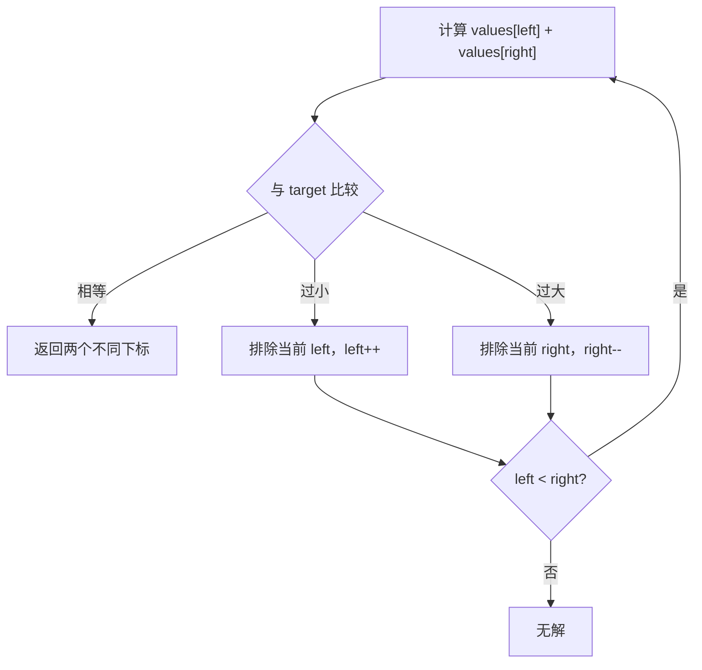

<div class="be-tutor-mount" data-tutor-lesson="algorithm-deepening-01" aria-hidden="true"></div>

<section id="overview-two-pointers" class="be-page-hero be-lesson-hero" data-learning-context="overview-two-pointers" data-context-type="overview" markdown="1">

<span class="be-page-eyebrow">算法深化 · 第 1 / 10 课 · 可追踪约束模式实验 v0.1</span>

# 有序双指针、候选消除与不变量

## 一次比较为什么能排除一整行候选

在非递减数组中寻找和为 8 的两个不同下标：

```text
input=1,2,3,4,6,8 target=8
step left=0 right=5 sum=9 action=right--
step left=0 right=4 sum=7 action=left++
step left=1 right=4 sum=8 action=match
result=1,4 values=2,6
invariant=outside-pairs-eliminated
```

和过大时移动右端，不是经验模板：当前最大值与最小剩余值相加都已过大，包含该右端的其他候选只会更大。和过小时同理排除当前左端。

</section>

<div class="be-lesson-overview">
  <div><span>课程位置</span><strong>算法深化 · 1 / 10</strong></div>
  <div><span>前置</span><strong>数组、排序、循环不变量与复杂度</strong></div>
  <div><span>实现</span><strong>Python 3.11 + C++20 固定轨迹</strong></div>
  <div><span>完成后留下</span><strong>候选消除证明、双语言报告与 6 项测试</strong></div>
</div>

## 学习目标

- 识别双指针成立所依赖的单调关系。
- 用循环不变量证明移动不会漏掉可行解。
- 区分“返回任意一对”和“返回特定字典序解”的契约。
- 处理无解、重复值、短输入与乱序输入。
- 将 `O(n²)` 候选枚举降到 `O(n)` 扫描。

<section id="concept-candidate-grid" data-learning-context="concept-candidate-grid" data-context-type="concept" markdown="1">

## 候选是上三角网格

每个合法候选是 `(left,right)` 且 `left<right`。暴力法检查约 `n(n-1)/2` 个格子；双指针从 `(0,n-1)` 开始，每一步删除一整行或一整列。



指针距离每步减 1，所以最多进行 `n-1` 次比较。

</section>

<section id="example-elimination-proof" data-learning-context="example-elimination-proof" data-context-type="example" markdown="1">

## 不变量：指针外的候选已经被证明不可能

循环开始时保持：

> 如果存在尚未找到的解，它一定在闭区间 `[left,right]` 的候选中。

第一步 `1+8=9>8`。因为数组有序，对任意 `i>left`，都有 `values[i]+8 >= 9`，所以右端 8 不可能与区间内任何值组成目标；`right--` 安全。

第二步 `1+6=7<8`。对任意 `j<right`，都有 `1+values[j] <= 7`，所以左端 1 不可能参与解；`left++` 安全。

</section>

<section id="reproduce-two-pointer-v01" data-learning-context="reproduce-two-pointer-v01" data-context-type="reproduce" markdown="1">

## 运行双语言固定轨迹

```bash
cd site-src/examples/algorithm-deepening/pattern-lab-v01
../../../../.venv/bin/python -m unittest -v test_two_pointer_trace.py
```

6 项测试覆盖：

1. `right-- → left++ → match` 的固定轨迹。
2. 无解扫描有界结束。
3. 重复值返回不同下标。
4. 乱序输入被明确拒绝。
5. 调用前后输入不变。
6. Python 与 C++20 固定报告逐字一致。

</section>

<section id="concept-contract-boundaries" data-learning-context="concept-contract-boundaries" data-context-type="concept" markdown="1">

## 先定义返回哪一种答案

本课返回指针扫描首先遇到的一对，不承诺下标和最小、字典序最小或列出全部解。若题目要求全部不重复值对，遇到匹配后还要跨过重复值并继续扫描；若要求原数组下标而输入未排序，必须保留值与原下标的映射，复杂度变为排序主导的 `O(n log n)`。

空数组和单元素数组直接无解。重复值合法，但两个指针必须指向不同位置。

</section>

<section id="modify-two-pointer" data-learning-context="modify-two-pointer" data-context-type="modify" markdown="1">

## 主动改变目标契约

1. 实现 `all_unique_value_pairs(values,target)`，匹配后跨过左右重复值。
2. 删除乱序检查，用 `[1,7,2,6]` 构造漏解反例。
3. 把循环条件改成 `left<=right`，观察为何可能把同一元素使用两次。
4. 返回比较次数，验证任意长度 `n` 的有序输入不超过 `n-1` 次。

修改后补充空输入、全重复、负数、无解和多个解测试。

</section>

<section id="troubleshoot-two-pointer" data-learning-context="troubleshoot-two-pointer" data-context-type="troubleshoot" markdown="1">

## 模板失效时先找单调性

| 现象 | 优先检查 | 恢复 |
| --- | --- | --- |
| 乱序输入漏解 | 移动是否仍能排除整组候选 | 先排序并处理下标映射 |
| 同一元素被用两次 | 循环是否允许 left==right | 保持 `left<right` |
| 多解时答案不符 | 是否误承诺特定答案 | 明确 first-match 或调整规则 |
| 重复输出同一值对 | 匹配后未跨重复值 | 按新契约跳过相同值 |
| Python/C++ 边界不同 | 整数范围是否一致 | 限定范围或安全处理溢出 |
| 复杂度仍为平方 | 每步只移动一格却又内层扫描 | 每次比较只移动一个边界 |

</section>

<section id="project-pattern-lab-v01" data-learning-context="project-pattern-lab-v01" data-context-type="project" markdown="1">

## 可追踪约束模式实验 v0.1

- Python 与 C++20 接受同一有序数组与目标和契约。
- 固定轨迹记录左右下标、当前和与移动原因。
- 双语言输出逐字一致，输入不被修改。
- 下一版本把固定两端扩展为可伸缩窗口，维护区间内频次状态。

</section>

## 四类学习者入口

- 零基础兴趣：在纸上画候选网格并划掉每次排除的行或列。
- 有基础兴趣：实现全部不重复值对并证明仍为线性。
- 零基础求职：用两步轨迹解释为什么不会漏解。
- 有基础求职：讨论原下标、多解顺序和定长整数溢出的契约取舍。

<section id="career-two-pointer-proof" data-learning-context="career-two-pointer-proof" data-context-type="career" markdown="1">

## 求职加练：不要只说“左右夹逼”

原创追问：面试官把输入从有序数组改成乱序数组，又要求返回原下标。原双指针为什么失去正确性？你会选择哈希 `O(n)`，还是排序映射 `O(n log n)`？分别说明空间、输出顺序、重复值与验证策略。

回答至少包含单调性、不变量、候选消除、原下标映射和契约差异。

</section>

## 完成检查

- 6 项测试通过，Python/C++20 报告一致。
- 能逐步证明和过大移动右端、过小移动左端不会漏解。
- `left<right` 保证两个不同位置。
- 无解有界结束，乱序输入明确拒绝。
- 能区分任意一解、特定顺序与全部不重复解。
- 时间 `O(n)`、额外空间 `O(1)`，不计轨迹输出。

## 来源与版本

- Python 3.11、C++20；核查日期 2026-07-23。
- [USACO Guide: Two Pointers](https://usaco.guide/silver/two-pointers)：双指针候选区间与复杂度。
- [CP-Algorithms: Two Pointers](https://cp-algorithms.com/others/two-pointers.html)：常见双指针模式；本课独立重写示例与测试。

## 下一步

进入第 2 课《滑动窗口、频次状态与最短覆盖》，从两个单调边界扩展到“右端加入、左端收缩”的区间状态机。
