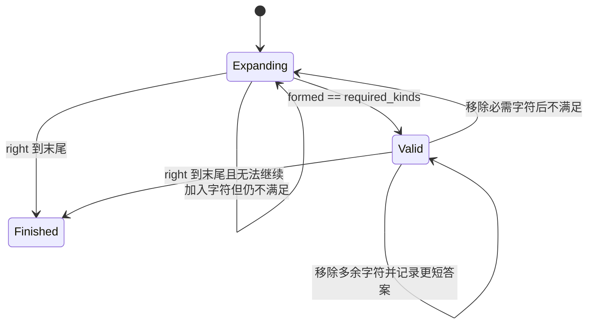

<div class="be-tutor-mount" data-tutor-lesson="algorithm-deepening-02" aria-hidden="true"></div>

<section id="overview-sliding-window" class="be-page-hero be-lesson-hero" data-learning-context="overview-sliding-window" data-context-type="overview" markdown="1">

<span class="be-page-eyebrow">算法深化 · 第 2 / 10 课 · 可追踪约束模式实验 v0.2</span>

# 滑动窗口、频次状态与最短覆盖

## 右端负责满足，左端负责变短

在 `ADOBECODEBANC` 中寻找覆盖 `ABC` 的最短连续子串：

```text
input=ADOBECODEBANC need=ABC
required_kinds=3
best=0:5 text=ADOBEC
best=8:12 text=EBANC
best=9:12 text=BANC
result=9:12 text=BANC
expands=13 shrinks=10
invariant=window-counts-match-state
```

窗口不是“套两个 while”：右端加入字符并更新频次；只有需求全部满足时，左端才收缩并寻找更短可行窗口。

</section>

<div class="be-lesson-overview">
  <div><span>课程位置</span><strong>算法深化 · 2 / 10</strong></div>
  <div><span>前置</span><strong>双指针候选消除 + 频次映射</strong></div>
  <div><span>实现</span><strong>Python 3.11 + C++20 固定轨迹</strong></div>
  <div><span>完成后留下</span><strong>最短覆盖、重复需求与线性边界证据</strong></div>
</div>

## 学习目标

- 定义窗口 `[left,right]` 与其频次状态。
- 用 `formed` 表示已满足的需求种类，而非出现过的字符数。
- 区分扩大窗口和收缩窗口的触发条件。
- 正确处理重复需求、无解和空需求。
- 证明两个边界都只向前，整体为线性时间。

<section id="concept-window-state" data-learning-context="concept-window-state" data-context-type="concept" markdown="1">

## 状态必须与窗口内容同步

`required[c]` 是需求频次，`current[c]` 是当前窗口频次。当某字符第一次达到需求量时 `formed++`；左端移除后从满足跌到不足时 `formed--`。



不变量是 `current` 准确对应 `text[left:right+1]`，`formed` 准确反映满足频次的需求种类。

</section>

<section id="example-duplicate-frequency" data-learning-context="example-duplicate-frequency" data-context-type="example" markdown="1">

## `AAC` 不是集合 `{A,C}`

若把需求存成集合，窗口 `AC` 会被错误判为满足。频次契约要求：

```text
required[A]=2
required[C]=1
```

只有 `current[A]>=2` 且 `current[C]>=1` 时窗口才有效。`formed` 按需求种类计数，因此 A 只在数量从 1 到 2 时增加一次；第三个 A 是多余字符，不再次增加。

</section>

<section id="reproduce-window-v02" data-learning-context="reproduce-window-v02" data-context-type="reproduce" markdown="1">

## 运行最短覆盖实验

```bash
cd site-src/examples/algorithm-deepening/pattern-lab-v02
../../../../.venv/bin/python -m unittest -v test_sliding_window_trace.py
```

6 项测试覆盖标准最短覆盖、重复需求、无解、空需求拒绝、边界移动上限和 Python/C++20 固定报告一致。

</section>

<section id="concept-minimum-proof" data-learning-context="concept-minimum-proof" data-context-type="concept" markdown="1">

## 为什么收缩不会错过更短答案

对固定 `right`，窗口有效时持续右移 `left`，会依次检查以该右端结尾的所有可行左边界，直到移除某个必需字符使窗口失效。最后一个有效位置就是该 `right` 下最短的窗口。

随后只有继续扩大右端才可能重新满足约束。每个字符被右端加入一次、被左端移除至多一次，所以即使代码有嵌套 while，总操作仍为 `O(n)`，不是 `O(n²)`。

</section>

<section id="modify-window-contract" data-learning-context="modify-window-contract" data-context-type="modify" markdown="1">

## 把“最短覆盖”改成另一种窗口问题

1. 实现“最长至多 K 种字符子串”，把有效条件改为种类数不超过 K。
2. 实现“长度固定为 K 的最大和”，窗口达到 K 后每次同步移出左端。
3. 故意在移除字符前先移动 left，构造频次与窗口错位失败。
4. 为并列最短窗口增加“最早左端”契约并补测试。

每次变化都先写有效条件、加入动作、移除动作和答案更新时机。

</section>

<section id="troubleshoot-sliding-window" data-learning-context="troubleshoot-sliding-window" data-context-type="troubleshoot" markdown="1">

## 窗口错误通常是状态更新次序错误

| 现象 | 优先检查 | 恢复 |
| --- | --- | --- |
| `AAC` 被 `AC` 满足 | 是否只记录存在性 | 使用 required/current 频次 |
| 最短答案长一位 | 更新答案与移动 left 的顺序 | 先记录当前窗口，再移除 |
| formed 过大 | 多余字符是否重复增加 | 只在刚好达到需求时增加 |
| formed 不会下降 | 移除后是否检查跌破需求 | current 减一后再比较 |
| 无解返回空字符串含义不清 | 空答案与合法空窗口混淆 | 返回显式 None/not-found |
| 误判为 O(n²) | 只看嵌套循环 | 统计每个边界总移动次数 |

</section>

<section id="project-pattern-lab-v02" data-learning-context="project-pattern-lab-v02" data-context-type="project" markdown="1">

## 可追踪约束模式实验 v0.2

- v0.1：有序两端指针按比较结果消除候选。
- v0.2：可伸缩窗口维护需求与当前频次，记录三次更优答案。
- 两种实现都要求边界单向移动、输入不变、双语言固定报告一致。
- 下一版本用前缀和与差分数组把多次区间查询和批量更新拆成预处理与还原。

</section>

## 四类学习者入口

- 零基础兴趣：用纸片维护 `ABC` 的三个计数，复现 BANC。
- 有基础兴趣：实现最长至多 K 种字符并写有效条件。
- 零基础求职：解释嵌套 while 为什么仍是 O(n)。
- 有基础求职：讨论 Unicode 单位、并列答案顺序和流式输入边界。

<section id="career-window-state" data-learning-context="career-window-state" data-context-type="career" markdown="1">

## 求职加练：从模板转成状态机

原创追问：需求从 `ABC` 改成 `AABC` 后原实现错误返回 `ABC`。你如何定位是集合还是频次问题？请定义窗口状态、有效条件、加入／移除顺序，并用什么最小反例和复杂度证据证明修复？

回答至少包含重复需求、formed 的增减时机、最小反例 `AC/AAC` 和双边界各移动至多 n 次。

</section>

## 完成检查

- 6 项测试通过，Python/C++20 报告一致。
- 最短答案为 `BANC`，并保留三次严格改进轨迹。
- 重复需求按频次满足，无解显式返回。
- `current` 与窗口同步，`formed` 只在跨越需求阈值时变化。
- 两个边界各移动至多 n 次，时间 O(n)，空间 O(字符种类数)。

## 来源与版本

- Python 3.11、C++20；固定示例按 ASCII 字节契约，核查日期 2026-07-23。
- [USACO Guide: Two Pointers](https://usaco.guide/silver/two-pointers)：窗口边界与摊还线性分析。
- [CPython `collections.Counter`](https://docs.python.org/3.11/library/collections.html#collections.Counter)：Python 频次状态。

## 下一步

进入第 3 课《前缀和、差分与区间批处理》，把重复区间工作移到一次预处理或一次最终还原。
