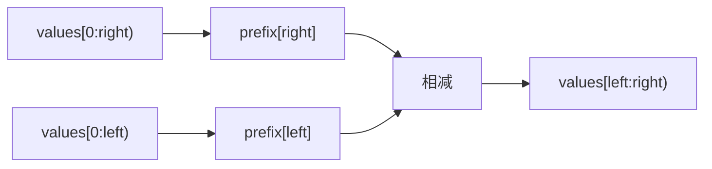

<div class="be-tutor-mount" data-tutor-lesson="algorithm-deepening-03" aria-hidden="true"></div>

<section id="overview-range-transform" class="be-page-hero be-lesson-hero" data-learning-context="overview-range-transform" data-context-type="overview" markdown="1">

<span class="be-page-eyebrow">算法深化 · 第 3 / 10 课 · 可追踪约束模式实验 v0.3</span>

# 前缀和、差分与区间批处理

## 把重复区间工作搬到一次预处理或一次还原

```text
values=2,-1,3,5,0
prefix=0,2,1,4,9,9
sum[0:3)=4
sum[1:5)=7
sum[3:3)=0
updates=[0:3)+2,[2:5)-1,[1:4)+3
difference=2,3,-1,-2,-3,1
restored=2,5,4,2,-1
invariant=half-open-boundaries-cancel
```

前缀和把一次 `O(n)` 预处理换成每次 `O(1)` 区间查询；差分把每次区间逐点修改换成两个边界标记，最后 `O(n)` 还原。

</section>

<div class="be-lesson-overview">
  <div><span>课程位置</span><strong>算法深化 · 3 / 10</strong></div>
  <div><span>前置</span><strong>数组、半开区间、累计状态</strong></div>
  <div><span>实现</span><strong>Python 3.11 + C++20 固定报告</strong></div>
  <div><span>完成后留下</span><strong>区间查询、批量更新与边界抵消证据</strong></div>
</div>

## 学习目标

- 用长度 `n+1` 的前缀数组表达空前缀。
- 用 `prefix[right]-prefix[left]` 查询半开区间。
- 用差分的左右边界标记表达区间增量。
- 正确处理空区间、负数、重叠更新与越界。
- 根据查询／更新模式选择数据结构，而不是混用。

<section id="concept-prefix-invariant" data-learning-context="concept-prefix-invariant" data-context-type="concept" markdown="1">

## `prefix[i]` 表示前 i 个元素

定义：

```text
prefix[0] = 0
prefix[i+1] = prefix[i] + values[i]
```

于是 `[left,right)` 的左侧累计在相减时抵消，只留下目标区间。空区间 `[i,i)` 自然为 0，不需要特判。



</section>

<section id="example-difference-boundaries" data-learning-context="example-difference-boundaries" data-context-type="example" markdown="1">

## 差分只记录“从这里开始”和“到这里停止”

对 `[left,right)` 增加 `delta`：

```text
difference[left] += delta
difference[right] -= delta
```

从左到右累计 difference 时，增量从 left 生效，在 right 被相反标记抵消。三个重叠更新叠加后还原为 `2,5,4,2,-1`；更新顺序不影响加法结果。

</section>

<section id="reproduce-range-v03" data-learning-context="reproduce-range-v03" data-context-type="reproduce" markdown="1">

## 运行区间变换实验

```bash
cd site-src/examples/algorithm-deepening/pattern-lab-v03
../../../../.venv/bin/python -m unittest -v test_range_transform_trace.py
```

6 项测试覆盖前缀查询、空区间、非法边界、重叠差分更新、空更新和 Python/C++20 报告一致。

</section>

<section id="concept-cost-choice" data-learning-context="concept-cost-choice" data-context-type="concept" markdown="1">

## 选择取决于操作序列

| 操作模型 | 预处理 | 单次操作 | 最终还原 |
| --- | ---: | ---: | ---: |
| 原数组逐点区间求和 | 0 | O(n) | 0 |
| 静态前缀和查询 | O(n) | O(1) | 0 |
| 差分批量区间加 | O(n) 初始化 | O(1) | O(n) |

前缀和不适合频繁修改后立即查询；基础差分不适合每次更新后立即读取任意位置。混合在线操作需要树状数组或线段树等后续结构。

</section>

<section id="modify-range-transform" data-learning-context="modify-range-transform" data-context-type="modify" markdown="1">

## 主动扩展到二维或在线边界

1. 增加区间平均值查询，明确空区间不能做除法。
2. 给初始数组应用差分更新，而非从全零数组开始。
3. 实现二维前缀和的矩形查询，统一左闭右开坐标。
4. 在每次更新后立即查询，记录基础差分为什么不再满足复杂度目标。

所有接口继续拒绝负下标、反向区间和超出 `n` 的右边界。

</section>

<section id="troubleshoot-range-transform" data-learning-context="troubleshoot-range-transform" data-context-type="troubleshoot" markdown="1">

## 区间错误先统一边界语义

| 现象 | 优先检查 | 恢复 |
| --- | --- | --- |
| 查询少算或多算一个 | 是否混用闭区间 | 全部改成 `[left,right)` |
| 首元素需要特判 | prefix 是否缺少开头 0 | 使用长度 n+1 |
| 更新影响到 right | 是否忘记在 right 抵消 | difference[right]-=delta |
| 空更新改变结果 | left==right 的两标记是否抵消 | 保持同位置加减 |
| 重叠更新丢失 | 是否覆盖而非累加差分 | 使用 `+=` 与 `-=` |
| Python/C++ 大数不同 | 累计类型范围不同 | 明确输入范围并用安全整数类型 |

</section>

<section id="project-pattern-lab-v03" data-learning-context="project-pattern-lab-v03" data-context-type="project" markdown="1">

## 可追踪约束模式实验 v0.3

- v0.1–v0.2：单向边界处理两数和与动态窗口。
- v0.3：同一半开区间协议连接静态查询和离线批量更新。
- 固定报告展示 prefix、difference、restored 与三组查询。
- 下一版本用单调栈／队列删除永远不可能成为答案的候选。

</section>

## 四类学习者入口

- 零基础兴趣：手算 prefix，再用两次相减验证区间和。
- 有基础兴趣：实现二维前缀和与矩形半开区间。
- 零基础求职：解释为什么空区间自然为零。
- 有基础求职：比较前缀、差分、树状数组与线段树的操作模型。

<section id="career-range-choice" data-learning-context="career-range-choice" data-context-type="career" markdown="1">

## 求职加练：先问操作序列

原创追问：有一百万个数和十万次操作。版本 A 只有区间求和，版本 B 只有区间加且最后一次输出，版本 C 更新与查询交错。分别选什么结构？如何用复杂度、边界和最小反例说明基础前缀／差分在版本 C 中不够？

回答至少包含半开区间、预处理、单次成本、最终还原和在线／离线区别。

</section>

## 完成检查

- 6 项测试通过，Python/C++20 固定报告一致。
- `prefix` 长度为 n+1，空区间查询为 0。
- 差分在 left 生效、right 抵消，重叠更新可累加。
- 越界与反向区间明确拒绝。
- 能按操作序列选择前缀、差分或更强在线结构。

## 来源与版本

- Python 3.11、C++20；核查日期 2026-07-23。
- [USACO Guide: Prefix Sums](https://usaco.guide/silver/prefix-sums)：前缀和与二维扩展。
- [CP-Algorithms: Prefix Sum](https://cp-algorithms.com/data_structures/prefix_sum.html)：区间累计思想。

## 下一步

进入第 4 课《单调栈、单调队列与支配关系》，用可证明的淘汰规则维护下一更大值和窗口极值。
