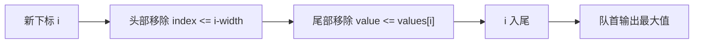

<div class="be-tutor-mount" data-tutor-lesson="algorithm-deepening-04" aria-hidden="true"></div>

<section id="overview-monotonic-structures" class="be-page-hero be-lesson-hero" data-learning-context="overview-monotonic-structures" data-context-type="overview" markdown="1">

<span class="be-page-eyebrow">算法深化 · 第 4 / 10 课 · 可追踪约束模式实验 v0.4</span>

# 单调栈、单调队列与支配关系

## 被更晚且不小的候选压住后，旧候选不再可能成为答案

```text
values=2,1,2,4,3
next_strictly_greater=4,2,4,none,none
stack_resolved=3 unresolved=2
window_width=3
window_maxima=2,4,4
deque_back_pruned=3 expired=0
invariant=dominated-candidates-never-return
```

单调结构保存的不是全部历史，而是仍可能影响未来答案的候选下标。

</section>

<div class="be-lesson-overview">
  <div><span>课程位置</span><strong>算法深化 · 4 / 10</strong></div>
  <div><span>前置</span><strong>栈、队列、窗口边界与摊还分析</strong></div>
  <div><span>实现</span><strong>Python 3.11 + C++20 双结构报告</strong></div>
  <div><span>完成后留下</span><strong>严格更大值、窗口最大值与淘汰证明</strong></div>
</div>

## 学习目标

- 用单调栈解决右侧第一个严格更大值。
- 用单调队列维护固定窗口最大值。
- 区分尾部支配淘汰和头部过期淘汰。
- 正确处理相等值、无答案与非法窗口。
- 用“每个下标至多进出一次”证明线性复杂度。

<section id="concept-stack-resolution" data-learning-context="concept-stack-resolution" data-context-type="concept" markdown="1">

## 当前值为栈顶候选结算答案

栈保存尚未遇到右侧严格更大值的下标，并保持对应值非递增。当前值大于栈顶时，它就是栈顶右侧遇到的第一个更大值；持续弹出直到不再严格更大。

相等值不能结算“严格更大”，所以条件必须是 `<` 而不是 `<=`。扫描结束仍在栈内的下标答案为 `none`。

</section>

<section id="example-deque-dominance" data-learning-context="example-deque-dominance" data-context-type="example" markdown="1">

## 更晚且不小的值支配更早候选

单调队列存下标，值从队首到队尾严格递减。加入新值前：

1. 从头部移除已离开窗口的下标。
2. 从尾部移除值小于等于新值的候选。
3. 新下标入尾，队首就是窗口最大值。

旧候选若不大于新值，会更早过期且数值不占优，因此以后永远不可能重新成为最大值。



</section>

<section id="reproduce-monotonic-v04" data-learning-context="reproduce-monotonic-v04" data-context-type="reproduce" markdown="1">

## 运行双结构实验

```bash
cd site-src/examples/algorithm-deepening/pattern-lab-v04
../../../../.venv/bin/python -m unittest -v test_monotonic_structures_trace.py
```

6 项测试覆盖严格更大、递减无解、窗口最大、过期淘汰、非法宽度和 Python/C++20 报告一致。

</section>

<section id="concept-amortized-linear" data-learning-context="concept-amortized-linear" data-context-type="concept" markdown="1">

## while 嵌套不等于平方复杂度

一个下标只会入栈一次、弹栈一次；在队列中也只会入尾一次，并从头部过期或从尾部被支配一次。所有 while 循环累计弹出不超过 n 个下标，因此时间 `O(n)`，辅助空间最坏 `O(n)` 或窗口宽度 `O(k)`。

</section>

<section id="modify-monotonic-contract" data-learning-context="modify-monotonic-contract" data-context-type="modify" markdown="1">

## 改变“严格”或“最大”的契约

1. 将下一严格更大改为下一大于等于，解释比较符为何改变。
2. 将窗口最大改成窗口最小，反转队列单调方向。
3. 同时返回最大值下标，验证重复最大值选最新还是最早。
4. 删除过期检查，用 `[9,1,2,3]`、宽度 2 构造旧最大值污染。

</section>

<section id="troubleshoot-monotonic" data-learning-context="troubleshoot-monotonic" data-context-type="troubleshoot" markdown="1">

## 单调结构错误先检查比较符与下标

| 现象 | 原因 | 恢复 |
| --- | --- | --- |
| 相等值被当成严格更大 | 使用了 `<=` 弹栈 | 严格更大只用 `<` |
| 窗口输出过期最大值 | 队列只存值或未过期 | 存下标并先清队首 |
| 重复最大值顺序不符 | 尾部平局策略未定义 | 明确保留早值或新值 |
| 输出少一个窗口 | 开始输出条件错误 | `index+1>=width` |
| 误判 O(n²) | 只看嵌套 while | 对每个下标计入栈出栈 |
| 宽度 0 死循环 | 未校验参数 | 明确拒绝非正宽度 |

</section>

<section id="project-pattern-lab-v04" data-learning-context="project-pattern-lab-v04" data-context-type="project" markdown="1">

## 可追踪约束模式实验 v0.4

- v0.1–v0.3 用边界移动和累计变换减少重复工作。
- v0.4 用支配关系主动删除未来不再有用的候选。
- 同一输入同时产出下一严格更大值和窗口最大值。
- 下一版本进入回溯选择树，用撤销状态枚举不能单调排除的候选。

</section>

## 四类学习者入口

- 零基础兴趣：手工维护下标栈，标出三个被 4 结算的候选。
- 有基础兴趣：实现窗口最小值和最大值下标。
- 零基础求职：解释为什么相等值不能结算严格更大。
- 有基础求职：用摊还分析证明嵌套 while 仍为 O(n)。

<section id="career-monotonic-dominance" data-learning-context="career-monotonic-dominance" data-context-type="career" markdown="1">

## 求职加练：先说候选为什么永远回不来

原创追问：窗口最大值实现保存了所有元素并每次扫描，如何改成单调队列？若重复最大值要求返回最早下标，尾部比较应如何调整？请同时证明正确性、过期边界和 O(n) 摊还成本。

</section>

## 完成检查

- 6 项测试通过，双语言固定报告一致。
- 下一严格更大值正确保留相等候选。
- 单调队列先过期头部，再淘汰被支配尾部。
- 窗口最大值为 `2,4,4`。
- 每个下标至多进出一次，时间 O(n)。

## 来源与版本

- Python 3.11、C++20；核查日期 2026-07-23。
- [CP-Algorithms: Stack Queue Modification](https://cp-algorithms.com/data_structures/stack_queue_modification.html)：单调队列与窗口最值。
- [USACO Guide: Monotonic Stack](https://usaco.guide/gold/monotonic-stack)：候选淘汰与摊还分析。

## 下一步

进入第 5 课《回溯、选择树与剪枝》，用选择—递归—撤销维护路径状态。
