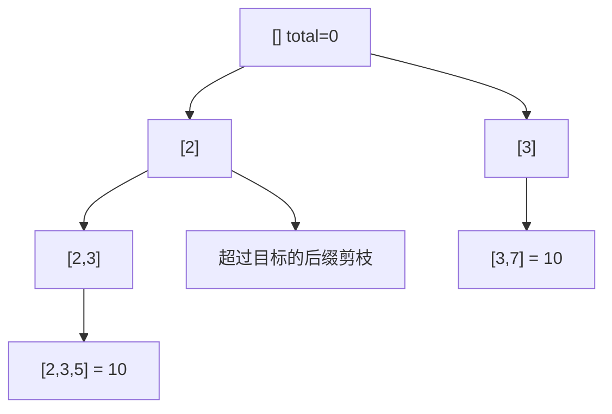

<div class="be-tutor-mount" data-tutor-lesson="algorithm-deepening-05" aria-hidden="true"></div>

<section id="overview-backtracking" class="be-page-hero be-lesson-hero" data-learning-context="overview-backtracking" data-context-type="overview" markdown="1">

<span class="be-page-eyebrow">算法深化 · 第 5 / 10 课 · 可追踪约束模式实验 v0.5</span>

# 回溯、选择树与剪枝

## 每次递归只拥有当前路径，返回前必须撤销选择

```text
values=2,3,5,6,7 target=10
solution=2,3,5
solution=3,7
solutions=2
nodes=14 pruned_candidates=11
path_after_search=empty
invariant=choose-search-undo
```

本课枚举每个位置至多使用一次的目标和组合。排序让同层去重与“超过目标后剪掉整个后缀”都可证明。

</section>

<div class="be-lesson-overview">
  <div><span>课程位置</span><strong>算法深化 · 5 / 10</strong></div>
  <div><span>前置</span><strong>递归帧、排序与状态不变量</strong></div>
  <div><span>实现</span><strong>Python 3.11 + C++20 选择树</strong></div>
  <div><span>完成后留下</span><strong>两组解、节点/剪枝计数与路径恢复</strong></div>
</div>

## 学习目标

- 把候选空间画成选择树。
- 在递归调用前选择、返回后撤销。
- 区分同层重复与不同层重复。
- 用正数有序前提证明越界后缀剪枝。
- 解释输出规模决定的指数级下界。

<section id="concept-choice-tree" data-learning-context="concept-choice-tree" data-context-type="concept" markdown="1">

## start 决定后续只能选择更右位置

递归状态为 `(start,total,path)`。从 index 选择后递归 `index+1`，因此每个位置最多使用一次，路径天然按值非递减。



</section>

<section id="example-choose-undo" data-learning-context="example-choose-undo" data-context-type="example" markdown="1">

## 共享 path 必须在同一递归帧恢复

```python
path.append(candidate)
search(index + 1, total + candidate)
path.pop()
```

若漏掉 pop，兄弟分支会看到前一分支遗留选择，产生不合法组合。固定输出 `path_after_search=empty` 验证根调用结束时共享状态恢复。

</section>

<section id="reproduce-backtracking-v05" data-learning-context="reproduce-backtracking-v05" data-context-type="reproduce" markdown="1">

## 运行选择树实验

```bash
cd site-src/examples/algorithm-deepening/pattern-lab-v05
../../../../.venv/bin/python -m unittest -v test_backtracking_trace.py
```

6 项测试覆盖固定两解、重复输入去重、无解、零目标空组合、状态恢复／非法值和双语言报告一致。

</section>

<section id="concept-pruning-proof" data-learning-context="concept-pruning-proof" data-context-type="concept" markdown="1">

## 剪枝需要单调前提

所有候选均为正数且已排序。若 `total+values[index]>target`，当前候选和其右侧更大候选都不可能成功，因此可以一次剪掉整个后缀。

同层遇到与前一个相等的值时跳过，避免相同组合重复；不同层仍可选相同数值，因为它们来自不同位置并可能是合法组合的一部分。

</section>

<section id="modify-backtracking" data-learning-context="modify-backtracking" data-context-type="modify" markdown="1">

## 改变复用和输出契约

1. 允许同一候选重复使用，把下一层 start 改为当前 index。
2. 删除同层去重，用 `[1,1,2]` 观察重复 `(1,2)`。
3. 允许负数后保留“超过目标就 break”，构造错误剪枝反例。
4. 增加最大解数，达到边界后受控停止，避免输出爆炸。

</section>

<section id="troubleshoot-backtracking" data-learning-context="troubleshoot-backtracking" data-context-type="troubleshoot" markdown="1">

## 回溯错误按状态、层级和剪枝定位

| 现象 | 原因 | 恢复 |
| --- | --- | --- |
| 组合混入前一分支 | 漏掉撤销 | append/search/pop 成对 |
| 相同组合重复 | 同层未跳重复 | `index>start` 时比较前值 |
| 合法重复值组合消失 | 所有层都跳相等 | 只在同一层去重 |
| 负数输入漏解 | 使用了正数单调剪枝 | 拒绝负数或重设边界 |
| 递归无限 | 允许复用却不推进状态 | 保证 total 或 index 取得进度 |
| 节点减少却答案错误 | 剪枝没有必要条件证明 | 用反例撤销错误剪枝 |

</section>

<section id="project-pattern-lab-v05" data-learning-context="project-pattern-lab-v05" data-context-type="project" markdown="1">

## 可追踪约束模式实验 v0.5

- 前四版用单调关系删除候选；v0.5 枚举无法直接单调决定的选择树。
- 固定报告保留解、访问节点、剪枝候选和根路径恢复事实。
- 下一版本对区间调度建立贪心局部选择与交换论证。

</section>

## 四类学习者入口

- 零基础兴趣：画出包含两组解的选择树并模拟撤销。
- 有基础兴趣：加入最大解数和受控停止。
- 零基础求职：用 `[1,1,2]` 解释同层去重。
- 有基础求职：给出允许负数后原剪枝失效的最小反例。

<section id="career-backtracking-pruning" data-learning-context="career-backtracking-pruning" data-context-type="career" markdown="1">

## 求职加练：剪得多不代表剪得对

原创追问：实现加入负数后仍用 `total+candidate>target` 直接 break，测试更快却漏解。请指出被破坏的单调前提，给出最小反例，并重新设计状态、去重、停止边界和回归测试。

</section>

## 完成检查

- 6 项测试通过，双语言报告一致。
- 固定解为 `2,3,5` 和 `3,7`。
- 同层去重不删除合法的跨层重复值。
- 路径在每个分支返回后恢复，根结束为空。
- 正数排序前提支撑后缀剪枝；最坏复杂度仍受解空间影响。

## 来源与版本

- Python 3.11、C++20；核查日期 2026-07-23。
- [CP-Algorithms: Generating Combinations](https://cp-algorithms.com/combinatorics/generating_combinations.html)：组合生成边界。
- [Python tutorial: Data Structures](https://docs.python.org/3.11/tutorial/datastructures.html)：列表栈操作。

## 下一步

进入第 6 课《贪心选择、交换论证与反例》，从枚举选择树转向可证明的局部最优决策。
