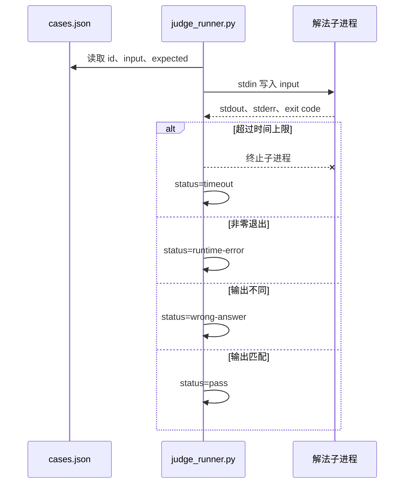

<div class="be-tutor-mount" data-tutor-lesson="career-algorithm-01" aria-hidden="true"></div>

<section id="overview-fixed-io-judge" class="be-page-hero be-lesson-hero" data-learning-context="overview-fixed-io-judge" data-context-type="overview" markdown="1">

<span class="be-page-eyebrow">算法求职加练 · 第 1 / 3 课 · 演练运行器 v0.1</span>

# 固定输入输出与本机判题契约

## “我的思路没错”不能替代可重复判定

本课用三个原创小用例启动真实 Python 子进程，把输入送到标准输入，再区分四种结果：

```text
case=ordered-duplicates status=pass reason=output-matched
case=negative-and-single status=pass reason=output-matched
case=empty-sequence status=pass reason=output-matched
summary passed=3 total=3
timing=excluded-from-fixed-output
```

运行器不联网，不下载题目，也不模拟任何企业平台。你要掌握的是可迁移的机考边界：输入由谁提供、输出如何比较、退出码说明什么，以及超时为什么不能和答案错误混在一起。

</section>

<div class="be-lesson-overview">
  <div><span>课程位置</span><strong>算法求职加练 · 1 / 3</strong></div>
  <div><span>前置</span><strong>共同算法基础；建议完成算法核心</strong></div>
  <div><span>环境</span><strong>Python 3.11+ 标准库</strong></div>
  <div><span>完成后留下</span><strong>判题器、3 个固定用例与 4 类结果证据</strong></div>
</div>

## 开始前

- 你能从标准输入读取文本，并把答案写到标准输出。
- 你已经为至少一个算法实现写过边界测试。
- 本课只对求职画像默认叠加；兴趣学习者可按需要选修。
- 示例任务是原创的“整数序列去重并排序”，只用于解释判题契约。

## 学习目标

- 把题意、输入格式、输出格式和判定规则拆成四份契约。
- 用真实子进程复现标准输入、标准输出、标准错误和退出码。
- 区分通过、答案错误、运行错误、超时与运行器自身错误。
- 解释哪些空白会被规范化、哪些差异仍会判错。
- 保存一条成功路径和三条受控失败证据。

<section id="concept-four-judge-boundaries" data-learning-context="concept-four-judge-boundaries" data-context-type="concept" markdown="1">

## 判题链不是只调用一次函数

一次本机判题至少跨过五个边界：



| 契约 | 本课固定规则 | 常见误判 |
| --- | --- | --- |
| 输入 | 第一项是数量，随后恰好有对应数量的整数 | 只测正常数量，不测 0 或数量不符 |
| 输出 | 第一行是去重数量，第二行是升序整数 | 混入调试文本，或依赖集合遍历顺序 |
| 进程 | `stdout` 交答案，`stderr` 留诊断，0 表示正常结束 | 把异常退出当成答案错误 |
| 判定 | 统一换行与行尾空白，保留行内空格差异 | 用随意 `strip()` 掩盖格式错误 |
| 时间 | 每个用例有独立上限 | 把本机某次耗时写进固定快照 |

算法正确只是其中一层。读取错一个数量、打印一句调试信息、死循环或用非确定顺序输出，都可能让正确思路无法通过契约。

</section>

<section id="example-deduplicate-contract" data-learning-context="example-deduplicate-contract" data-context-type="example" markdown="1">

## 用一个小任务把契约写完整

示例解法读取：

```text
7
4 2 4 1 2 9 1
```

并输出：

```text
4
1 2 4 9
```

核心函数先验证数量，再生成稳定结果：

```python
count = int(tokens[0])
values = [int(token) for token in tokens[1:]]
if len(values) != count:
    raise ValueError(f"expected {count} values, got {len(values)}")

unique = sorted(set(values))
```

`set` 用于去重，但不承担输出顺序；`sorted` 才把输出变成可重复契约。空序列仍必须输出数量 0 和空的第二行。输入数量不符时，解法向 `stderr` 输出 `input_error=...`，并以 2 退出。

这道任务很小，正适合看清基础设施。若一开始就使用复杂图算法，输入、算法和运行器错误容易缠在一起。

</section>

<section id="reproduce-local-judge-v01" data-learning-context="reproduce-local-judge-v01" data-context-type="reproduce" markdown="1">

## 运行真实子进程判题

从仓库根目录执行：

```bash
cd site-src/examples/career-algorithm/algorithm-rehearsal-v01
../../../../.venv/bin/python -m unittest -v test_judge_runner.py
../../../../.venv/bin/python judge_runner.py
```

7 项测试覆盖：

1. 参考解法在三个用例上全部通过。
2. 输出不匹配得到 `wrong-answer`。
3. 非零退出得到 `runtime-error`。
4. 忙循环超过 0.05 秒得到确定性 `timeout`。
5. 解法路径不能逃出项目目录。
6. 用例 ID 不能重复。
7. 规范化只忽略换行和行尾空白，不忽略行内差异。

运行器使用参数列表 `[sys.executable, solution]`，没有 `shell=True`。每个用例用 `subprocess.run(..., timeout=...)` 启动真实子进程；这不是 Mock，也不访问外网。

</section>

<section id="concept-result-state-machine" data-learning-context="concept-result-state-machine" data-context-type="concept" markdown="1">

## 先判运行状态，再比较答案

判定顺序不能颠倒：

```text
启动失败或用例文件非法 -> judge_error，退出 2
超过时间上限           -> timeout
子进程非零退出         -> runtime-error
stdout 不匹配          -> wrong-answer
stdout 匹配            -> pass
```

如果进程已经异常退出，即使它在崩溃前碰巧打印了正确答案，也不能判通过。反过来，`stderr` 有诊断但退出码为 0 时，本课不直接判错，因为答案通道是 `stdout`；真实平台可能有不同规则，应以明确契约为准。

运行器自己的配置错误使用退出码 2，解法有用例未通过使用退出码 1，全部通过使用退出码 0。这样 CI 能区分“提交没通过”和“判题基础设施坏了”。

</section>

<section id="modify-create-controlled-failures" data-learning-context="modify-create-controlled-failures" data-context-type="modify" markdown="1">

## 主动制造三种失败

先复制 `solution.py` 为 `solution.local.py`，每次只做一个修改：

1. 删除 `sorted`，直接输出集合，观察结果是否稳定以及哪个用例失败。
2. 在 `stdout` 第一行打印 `debug`，确认得到 `wrong-answer`。
3. 在入口处加入无限循环，并以 `--timeout 0.05` 运行，确认得到 `timeout`。

```bash
../../../../.venv/bin/python judge_runner.py \
  --solution solution.local.py \
  --timeout 0.05
```

再创建一个只执行 `raise SystemExit(7)` 的本地解法，确认它是 `runtime-error reason=exit-7`，不是 `wrong-answer`。

每次实验保存四项：修改内容、预期状态、实际固定输出、恢复动作。不要用真实面试题或未授权题面替换公开示例。

</section>

<section id="troubleshoot-local-judge" data-learning-context="troubleshoot-local-judge" data-context-type="troubleshoot" markdown="1">

## 状态相同，根因未必相同

| 现象 | 优先检查 | 恢复 |
| --- | --- | --- |
| `judge_error=solution escapes workspace` | 是否使用绝对路径或 `..` | 把本地解法放在项目目录内 |
| 所有用例都是 `wrong-answer` | 是否输出提示语、括号或多余标签 | 只向 `stdout` 写契约答案 |
| 只有空序列失败 | 是否假设第二行一定有整数 | 明确处理数量 0 |
| `runtime-error exit-2` | 输入数量、整数转换或参数 | 单独运行解法并查看 `stderr` |
| `timeout` | 死循环、复杂度或上限过小 | 先用最小输入定位，再检查复杂度 |
| 本机偶发快慢 | 把耗时混入固定断言 | 固定状态，耗时只做单独观察 |
| 明明一样却输出不匹配 | 行内有多个空格或隐藏文本 | 打印 `repr(stdout)` 并核对规范化规则 |

超时只能说明在给定环境和上限内未完成，不能直接证明复杂度类别。一次快速通过也不能证明大输入一定安全；后续限时模拟会把输入规模、决策时点和剩余时间分开记录。

</section>

<section id="project-algorithm-rehearsal-v01" data-learning-context="project-algorithm-rehearsal-v01" data-context-type="project" markdown="1">

## 算法演练运行器 v0.1

- 输入资产：`cases.json`，包含版本、唯一用例 ID、输入和期望输出。
- 解法资产：`solution.py`，只通过标准输入输出通信。
- 运行资产：`judge_runner.py`，真实启动子进程并限制每例时间。
- 回归资产：`test_judge_runner.py`，覆盖 7 个状态与边界测试。
- 固定证据：逐例状态、原因、汇总和 `timing=excluded-from-fixed-output`。

下一版会在不改变判题状态语义的前提下，增加一次限时模拟的题目选择、检查点和放弃策略记录。它不会伪造精确性能排名，也不会采集键盘、屏幕或个人账号数据。

</section>

## 四类学习者入口

- 零基础兴趣：这不是默认必修；若想体验机考，先完整复现三个用例与一次答案错误。
- 有基础兴趣：直接审查输入和输出规范化，判断它是否会掩盖真实格式错误。
- 零基础求职：按顺序复现 pass、wrong-answer、runtime-error 和 timeout，并能口头解释区别。
- 有基础求职：替换一份自己的原创小任务，补齐空输入、边界值和无序输出用例。

<section id="career-judge-contract-review" data-learning-context="career-judge-contract-review" data-context-type="career" markdown="1">

## 求职加练：样例通过，提交仍失败

原创追问：一个解法在手工样例上输出正确，交给本机运行器后分别出现答案错误、异常退出和超时。你如何用最少的实验判断问题属于输入契约、输出格式、边界处理还是复杂度，并留下别人能复现的证据？

回答至少包含一个最小输入、一个明确状态、一次只改一个变量的实验和一个未验证风险。公开能力信号仅提示“边界、解释和可复现证据”值得检查，不代表任何企业的真实题目、出现频率或录用标准。

</section>

## 完成检查

- 7 项运行器测试全部通过，三个原创用例得到固定成功输出。
- 能按顺序解释 judge error、timeout、runtime error、wrong answer 与 pass。
- 主动制造并恢复答案错误、运行错误和超时。
- 解法与用例路径都留在项目目录，运行命令没有 `shell=True`。
- 能解释行尾空白规范化为什么不应吞掉行内差异。
- 固定快照不包含机器相关耗时。
- 公开练习没有复制外部题面、答案或真实招聘材料。

## 来源与版本

- 适用 Python 3.11+，只使用标准库；核查日期 2026-07-23。
- [Python `subprocess`](https://docs.python.org/3.11/library/subprocess.html)：参数列表、标准流、退出码和超时。
- [Python `json`](https://docs.python.org/3.11/library/json.html)：固定用例文件的读取与错误边界。
- [Python `unittest`](https://docs.python.org/3.11/library/unittest.html)：真实子进程状态回归。
- 外部机考资料只提供能力方向信号；本课题目、用例、追问和答案结构均为原创。

## 下一步

进入第 2 课《限时模拟、策略选择与过程记录》：保留 v0.1 判题契约，新增时间盒、检查点和可解释的换题记录。在课程正式开放前，不创建占位页面。
