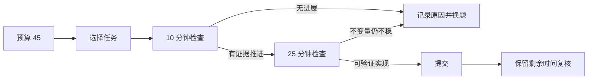

<div class="be-tutor-mount" data-tutor-lesson="career-algorithm-02" aria-hidden="true"></div>

<section id="overview-timed-rehearsal" class="be-page-hero be-lesson-hero" data-learning-context="overview-timed-rehearsal" data-context-type="overview" markdown="1">

<span class="be-page-eyebrow">算法求职加练 · 第 2 / 3 课 · 演练运行器 v0.2</span>

# 限时模拟、策略选择与过程记录

## 目标不是“全做完”，而是在时间内持续做出可解释决策

v0.2 回放一场 45 分钟模拟：

```text
session=rehearsal-001 budget=45 source=declared-logical-minutes
checkpoints=10,25,40
task=io-warmup status=completed minutes=8 evidence=passed-local-cases
task=boundary-search status=switched minutes=15 evidence=no-progress-after-checkpoint
task=graph-shortest status=completed minutes=18 evidence=passed-local-cases
summary completed=2 switched=1 remaining=2
wall_clock=excluded-from-fixed-output
```

第二项没有完成，却不是无证据的放弃：20 分钟检查点确认不变量仍不稳定，24 分钟记录换题原因。固定时间线让你能复盘“何时知道自己卡住”，而不只留下最后分数。

</section>

<div class="be-lesson-overview">
  <div><span>课程位置</span><strong>算法求职加练 · 2 / 3</strong></div>
  <div><span>前置</span><strong>第 1 课固定判题契约</strong></div>
  <div><span>环境</span><strong>Python 3.11+ 标准库</strong></div>
  <div><span>完成后留下</span><strong>时间预算、检查点、事件日志与换题证据</strong></div>
</div>

## 开始前

- v0.1 的 `pass`、`wrong-answer`、`runtime-error` 和 `timeout` 已经能稳定复现。
- 你愿意按实际发生的分钟记录，不事后美化时间线。
- 本课记录的是策略，不评估打字速度，也不建立跨人的速度排名。

## 学习目标

- 把总时长分成读题、实现、验证和止损检查点。
- 用单调事件记录开始、检查、提交和换题。
- 区分“解法进程超时”和“模拟策略主动止损”。
- 从时间线判断卡点出现在哪个阶段。
- 设计一次只有一个变量变化的下一轮模拟。

<section id="concept-budget-checkpoints" data-learning-context="concept-budget-checkpoints" data-context-type="concept" markdown="1">

## 总预算必须先于任务选择

本课先固定 45 分钟，再登记三个任务和检查点：

| 元素 | 示例 | 约束 |
| --- | --- | --- |
| 总预算 | 45 分钟 | 1–240 的整数 |
| 检查点 | 10、25、40 | 递增、唯一、必须在预算内 |
| 任务优先级 | 1、2、3 | 连续，不能临场重写历史 |
| 事件分钟 | 0–45 | 单调不下降 |
| 决策说明 | `invariant-not-stable` | 非空、可被后来者理解 |

检查点不是“到点必须换题”。它强迫你回答：输入契约理解了吗？核心不变量写出来了吗？至少有一个边界用例通过吗？如果没有，继续投入的依据是什么？



</section>

<section id="example-rehearsal-events" data-learning-context="example-rehearsal-events" data-context-type="example" markdown="1">

## 事件日志只记录发生过的事实

每条事件恰好包含四个字段：

```json
{"minute": 20, "type": "checkpoint", "task_id": "boundary-search", "note": "invariant-not-stable"}
```

四种事件的含义：

- `start`：开始一个任务，此时不能已有活跃任务。
- `checkpoint`：保存当前证据，不结束任务。
- `submit`：完成本地验证并结束正在进行的任务。
- `switch`：明确止损并结束正在进行的任务。

`submit` 只表示本地提交动作，不虚构线上平台得分。v0.1 的运行器负责判断具体用例是否通过；v0.2 负责记录何时做了什么决策。两个版本职责不同，不应把 `switch` 写成进程 `timeout`。

</section>

<section id="reproduce-timed-rehearsal-v02" data-learning-context="reproduce-timed-rehearsal-v02" data-context-type="reproduce" markdown="1">

## 回放时间线

从仓库根目录执行：

```bash
cd site-src/examples/career-algorithm/algorithm-rehearsal-v02
../../../../.venv/bin/python -m unittest -v test_timed_rehearsal.py
../../../../.venv/bin/python timed_rehearsal.py
```

7 项测试覆盖：

- 示例时间线生成稳定汇总。
- 分钟倒退被拒绝。
- 事件超过预算被拒绝。
- 一个任务活跃时不能开始另一个。
- 结束事件必须指向正在进行的任务。
- 每次决策必须有证据说明。
- 检查点必须位于预算内部。

程序不调用 `time.time()` 或 `perf_counter()` 生成固定结果。现实练习时，你可以看钟并手工登记整数分钟；回放只校验你提交的记录是否自洽。

</section>

<section id="concept-timeout-versus-switch" data-learning-context="concept-timeout-versus-switch" data-context-type="concept" markdown="1">

## 超时是执行状态，换题是策略动作

| 维度 | `timeout` | `switch` |
| --- | --- | --- |
| 所属版本 | v0.1 判题器 | v0.2 模拟日志 |
| 触发者 | 运行器超过单例上限 | 学习者在总预算内主动决策 |
| 说明 | 解法未在指定时间结束 | 当前投入缺少继续依据 |
| 下一步 | 检查死循环、复杂度和上限 | 记录卡点，转向更高价值任务 |

“换题”不等于失败；没有证据地频繁切换才是问题。相反，在一个没有不变量、没有最小样例、也没有进展的任务上耗尽全部预算，不会因为坚持时间更长而变成更好策略。

本课不定义通用的“几分钟必须换题”。任务难度、总时长与个人熟练度不同。可迁移原则是预先设置检查点，并用证据决定继续或停止。

</section>

<section id="modify-own-timed-session" data-learning-context="modify-own-timed-session" data-context-type="modify" markdown="1">

## 做一场只改变一个变量的模拟

复制两份 JSON 为 `plan.local.json` 和 `events.local.json`：

1. 保留 45 分钟总预算和三个检查点。
2. 把任务换成你已经完成过的三个原创小练习。
3. 开始前写优先级，不在结束后改成“我本来就打算这样”。
4. 每到检查点，记录当前可见证据。
5. 若换题，说明缺少的具体进展，而不是写“太难”。

```bash
../../../../.venv/bin/python timed_rehearsal.py \
  --plan plan.local.json \
  --events events.local.json
```

第二轮只改变一个策略变量，例如把首次检查点从 10 分钟改为 8 分钟；任务、总预算和输入规模保持不变。比较完成数、止损时点和剩余复核时间，而不是只比较主观感受。

</section>

<section id="troubleshoot-rehearsal-log" data-learning-context="troubleshoot-rehearsal-log" data-context-type="troubleshoot" markdown="1">

## 日志能通过，不代表策略合理

| 现象 | 结构问题或策略问题 | 恢复 |
| --- | --- | --- |
| `event minutes must be non-decreasing` | 事后补记打乱时间 | 按原始记录重排，不猜精确秒数 |
| `cannot start while another task is active` | 没有结束上一个任务 | 先写 `submit` 或 `switch` |
| `event exceeds time budget` | 把赛后复盘混进模拟 | 复盘另存，不改模拟时间线 |
| note 只有 `hard` | 说明不可操作 | 写出缺少不变量、用例或复杂度判断 |
| 三题都在最后一分钟完成 | 时间可能事后美化 | 保留原始草稿或终端时间证据 |
| 每次都在同一点换题 | 检查点没有带来新实验 | 缩小任务并准备最小输入 |
| 全部做完但没有复核 | 预算分配过满 | 提前保留一次整体检查窗口 |

固定日志只能守住结构一致性，不能证明内容真实。求职训练的价值来自诚实保留失败和决策依据，而不是生成看起来完美的时间线。

</section>

<section id="project-algorithm-rehearsal-v02" data-learning-context="project-algorithm-rehearsal-v02" data-context-type="project" markdown="1">

## 算法演练运行器 v0.2

- 保留 v0.1：真实解法子进程与四类判题状态。
- 本课新增：`plan.json`、`events.json`、`timed_rehearsal.py` 和 7 项时间线测试。
- 输入边界：预算、检查点、任务优先级与显式事件。
- 固定输出：任务状态、逻辑分钟、证据说明与剩余时间。
- 排除项：墙钟耗时、跨设备速度排名、屏幕监控和真实平台账号。

v0.3 会读取判题证据与策略日志，把失败分类为契约、边界、实现、复杂度或策略问题，并要求每个修复留下最小反例与回归测试。

</section>

## 四类学习者入口

- 零基础兴趣：可选修；先用做过的简单题理解检查点，不要直接追求高难度。
- 有基础兴趣：审查时间线状态机，并增加一条重复开始或越界事件测试。
- 零基础求职：完整做一场 45 分钟模拟，重点练习诚实记录换题原因。
- 有基础求职：连续做两场只改变一个策略变量的对照模拟，比较证据而非只看完成数。

<section id="career-timed-strategy-review" data-learning-context="career-timed-strategy-review" data-context-type="career" markdown="1">

## 求职加练：坚持做一题，还是切换到下一题

原创追问：模拟进行到第 20 分钟，你能复述题意，但仍写不出循环不变量，两个边界用例都失败。总预算还剩 25 分钟，另有一题你已经识别出 BFS 模板。你会继续还是换题？请给出决策门槛、接下来 5 分钟的实验和事后如何验证这个策略。

回答不能只说“看情况”，也不能把公开能力信号描述成企业真实评分标准。至少写出继续条件、停止条件、一个最小证据和下一轮只改变的变量。

</section>

## 完成检查

- 7 项时间线测试和示例固定输出通过。
- 总预算、检查点、任务优先级在模拟前写入计划。
- 事件分钟单调，任务不重叠，每个结束动作有证据说明。
- 能解释 `timeout` 与 `switch` 属于不同层次。
- 完成一场个人模拟，并保留一次真实的卡点或换题。
- 第二轮只改变一个策略变量，不同时更换题目、预算和检查点。
- 不把逻辑分钟解释为机器性能测量或跨人排名。

## 来源与版本

- 适用 Python 3.11+，只使用标准库；核查日期 2026-07-23。
- [Python `json`](https://docs.python.org/3.11/library/json.html)：计划与事件日志。
- [Python `argparse`](https://docs.python.org/3.11/library/argparse.html)：本地回放入口。
- [Python `unittest`](https://docs.python.org/3.11/library/unittest.html)：状态机与边界回归。
- 招聘参考仅提供算法边界、解释与复现能力信号；时间线、场景和追问均为原创。

## 下一步

进入第 3 课《错因分类、最小反例与回归复盘》：把 v0.1 判题结果与 v0.2 决策时间线关联起来，让每个失败都产生可执行的修复证据。
