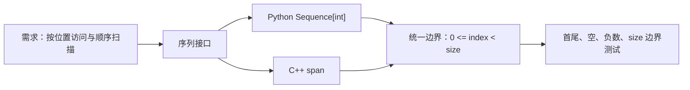

# 序列接口、数组表示与安全边界

<div class="be-tutor-mount" data-tutor-lesson="cs-core-01" aria-hidden="true"></div>

> **任务先行：** 用同一组整数在 Python 与 C++ 中完成检查式访问、首次匹配和复制修改；先看到完全一致的输出，再解释序列接口、具体表示与边界契约。

## 任务路线

<div class="be-task-route" role="list" aria-label="本课六步任务"><span role="listitem">1 固定基线</span><span role="listitem">2 序列接口</span><span role="listitem">3 Python 边界</span><span role="listitem">4 C++ 连续容器</span><span role="listitem">5 越界实验</span><span role="listitem">6 复制迁移</span></div>

<section id="step-1" class="be-task-step" data-step-id="step-1" markdown="1">

## 第一步：运行固定数组基线

安装 Python 实验并构建 C++ 实验。**当前任务：**确认两边都显示数据 `7, 3, 9, 3`、`index=2` 的值 9，以及目标 3 的首次位置 1。**成功证据：**两个程序退出码为 0，标准输出逐字一致。

</section>

<section id="step-2" class="be-task-step" data-step-id="step-2" markdown="1">

## 第二步：把需求写成序列接口

把“保存一组整数”拆成可观察操作：取得长度、按位置读取、按顺序扫描、复制后替换。**主动修改：**换一组包含重复值的数据，仍返回第一个匹配位置。**成功证据：**测试描述操作与结果，不依赖 Python 或 C++ 的私有实现细节。

</section>

<section id="step-3" class="be-task-step" data-step-id="step-3" markdown="1">

## 第三步：实现 Python 检查式访问

Python 序列原生允许负索引，但本实验采用跨语言统一边界：只有 `0 <= index < len(values)` 合法。**主动修改：**分别读取首、尾位置。**成功证据：**空序列、`-1` 和 `index == len(values)` 都稳定抛出 `IndexError`。

</section>

<section id="step-4" class="be-task-step" data-step-id="step-4" markdown="1">

## 第四步：迁移到 C++ 连续容器

使用 `std::vector<int>` 持有数据，用 `std::span<const int>` 表达只读连续视图。先显式检查有符号索引，再读取元素；复制修改在新 `vector` 上使用 `at()`。**成功证据：**编译器严格警告为零，原容器不变，输出与 Python 一致。

</section>

<section id="step-5" class="be-task-step" data-step-id="step-5" markdown="1">

## 第五步：安全观察负索引和越界

只通过单元测试调用 `checked_at(values, -1)`、`checked_at(values, size)` 和空序列访问。**恢复标准：**Python 捕获 `IndexError`，C++ 捕获 `std::out_of_range`；不执行未检查的 `operator[]` 越界，不把崩溃或未定义行为当证据。

</section>

<section id="step-6" class="be-task-step" data-step-id="step-6" markdown="1">

## 第六步：完成复制修改迁移验收

实现 `replace_at_copy(values, index, value)`，返回替换后的新序列。**约束：**沿用相同边界规则，不修改调用者输入，不提供完整迁移答案。**成功证据：**覆盖首尾、重复值、负索引、`index == size`，并在调用后再次断言原输入。

</section>

## 课程信息

| 项目 | 内容 |
| --- | --- |
| 前置 | Python/C++ 核心语言、测试、`vector`、只读参数 |
| 环境 | Python 3.11+；C++20、CMake 3.20+；只用标准库 |
| 阶段作品 | [可追踪数组实验](../../exercises/cs-core/traceable-array-lab/README.md) |
| 可观察产出 | 双语言一致报告、检查式访问、首次匹配、复制修改与边界测试 |
| 事实核查 | Python 3.11.15、C++ 工作草案与 MIT 6.006，2026-07-16 |

## 先区分接口与表示

“序列”回答可以做什么：按位置取值、遍历、求长度。“数据结构实现”回答怎样存储这些值并支持操作。Python `list` 是可变序列，不应直接描述成 C/C++ 的同类型裸数组；`std::vector<int>` 则是拥有元素的连续容器，`std::span<const int>` 是不拥有元素的连续视图。



同一个接口可以有多种表示。后续选择数组、链表或其他结构时，要比较具体操作成本，而不是只比较名称。

## 运行阶段作品

```bash
cd exercises/cs-core/traceable-array-lab/python
python -m pip install -e ".[dev]"
python -m traceable_array_lab
python -m unittest discover -s tests -v
```

```bash
cd exercises/cs-core/traceable-array-lab/cpp
cmake -S . -B build -DCMAKE_BUILD_TYPE=Debug
cmake --build build --config Debug
ctest --test-dir build --build-config Debug --output-on-failure
./build/traceable_array_lab
```

先保存输出，再改代码。课程迁移的目标是改变实现和测试，不是让可观察契约悄悄漂移。

## 检查式访问为什么主动拒绝负索引

Python 的 `values[-1]` 合法且表示最后一个元素。这个语义本身没有错误，但 C++ 序列接口没有相同约定。当前实验显式收窄契约：

```python
def checked_at(values: Sequence[int], index: int) -> int:
    if index < 0 or index >= len(values):
        raise IndexError(...)
    return values[index]
```

收窄后的好处是调用者能在两种语言中使用同一条件推理。课程不是说 Python 负索引“不安全”，而是说明跨语言接口需要主动选择一致语义。

C++20 的 `span` 没有本实验所需的 `at()` 成员，因此读取前先验证索引，再使用 `operator[]`；复制修改后的拥有容器使用 `vector::at()`。未经验证的越界不能进入实验。

## 复制边界

`replace_at_copy` 把“修改谁”写进函数名和返回值。Python 先 `list(values)`，C++ 从 `span` 构造新 `vector`，随后只修改副本。测试必须同时检查结果和原输入：

```text
输入：  [7, 3, 9]
替换：  index=1, value=8
返回：  [7, 8, 9]
原输入：[7, 3, 9]
```

如果只断言返回值，函数偷偷原地修改输入仍可能通过测试。

## AI 协作任务

可以让 AI 枚举边界用例或比较接口候选，但学习者必须检查：

- 是否把 Python `list` 误写成传统同类型连续数组。
- 是否因为 Python 支持负索引而破坏跨语言契约。
- C++ 是否在验证前把负数转换成无符号下标。
- 是否用崩溃、悬空视图或越界读取演示错误。
- 复制函数是否真的保持原输入不变。

## 常见错误与排查

| 现象 | 原因 | 检查与恢复 |
| --- | --- | --- |
| Python `-1` 返回最后一项 | 直接使用原生索引 | 在访问前显式检查负数 |
| C++ 负索引变成巨大数字 | 过早转换为 `size_t` | 先检查有符号值，再转换 |
| 输出正确但输入被改了 | 返回同一可变对象 | 复制后修改，并断言原输入 |
| 越界测试偶尔崩溃 | 使用未检查访问 | 改为显式检查与异常断言 |
| 把接口当实现 | 只讨论容器名字 | 先列需要支持的操作与契约 |

## 完成证据

- Python 负索引、空序列和 `index == len` 均抛出 `IndexError`。
- C++ 对应路径均抛出 `std::out_of_range`，严格警告构建通过。
- `replace_at_copy` 返回新值且原输入保持不变。
- 两种语言的固定报告标准输出逐字一致。

## 来源与版本

| 来源 | 用途 | 核查日期 |
| --- | --- | --- |
| [MIT 6.006：数据结构与动态数组](https://ocw.mit.edu/courses/6-006-introduction-to-algorithms-spring-2020/resources/lecture-2-data-structures-and-dynamic-arrays/) | 接口与数据结构实现的区别 | 2026-07-16 |
| [Open Data Structures](https://opendatastructures.org/) | 序列、数组与线性结构课程边界 | 2026-07-16 |
| [Python 序列类型](https://docs.python.org/3.11/library/stdtypes.html#sequence-types-list-tuple-range) | 索引、包含、切片和可变序列语义 | 2026-07-16 |
| [C++ 容器要求草案](https://eel.is/c++draft/container.reqmts) | 容器、迭代器与连续容器要求 | 2026-07-16 |

本地 JavaGuide 线性数据结构页只用于整理名词、操作候选和误区。正文独立重写，并为插入、访问和边界结论补充前置条件；未复用原图和大段示例。

## 下一步

进入[操作计数、增长率与渐近复杂度](02-operation-count-growth-asymptotic-complexity.md)，把“访问快、扫描慢”从直觉升级为可测试的操作次数与增长关系。
