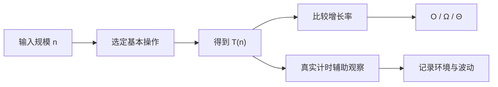

# 操作计数、增长率与渐近复杂度

<div class="be-tutor-mount" data-tutor-lesson="cs-core-02" aria-hidden="true"></div>

> **任务先行：** 给数组实验增加常量访问、线性扫描和两两比较增长表；用可复现操作次数解释 `Θ(1)`、`Θ(n)` 与 `Θ(n²)`，再把真实计时放回辅助证据的位置。

## 任务路线

<div class="be-task-route" role="list" aria-label="本课六步任务"><span role="listitem">1 输出基线</span><span role="listitem">2 基本操作</span><span role="listitem">3 查找计数</span><span role="listitem">4 增长表</span><span role="listitem">5 计时噪声</span><span role="listitem">6 迁移验收</span></div>

<section id="step-1" class="be-task-step" data-step-id="step-1" markdown="1">

## 第一步：锁定双语言输出基线

运行 Python 与 C++ 全部测试，并保存上一课报告。**当前任务：**确认数据、索引值和首次匹配位置没有变化。**成功证据：**加入增长表前后，既有四行输出完全保持。

</section>

<section id="step-2" class="be-task-step" data-step-id="step-2" markdown="1">

## 第二步：定义输入规模和基本操作

把 `n` 固定为序列元素数量；分别选择一次合法下标读取、一次元素与目标相等比较、一次元素对比较作为基本操作。**主动修改：**给 `n=0` 单独定义边界结果。**成功证据：**代码和说明使用同一计数口径。

</section>

<section id="step-3" class="be-task-step" data-step-id="step-3" markdown="1">

## 第三步：追踪线性查找比较次数

让 `linear_search` 返回首个匹配位置和比较次数。**主动修改：**比较目标位于开头、末尾和缺失三种输入。**成功证据：**缺失目标恰好比较 `n` 次，空序列比较 0 次。

</section>

<section id="step-4" class="be-task-step" data-step-id="step-4" markdown="1">

## 第四步：生成三类确定性增长表

对 `n=4, 8, 16, 32` 生成常量访问 1、线性扫描 `n`、两两比较 `n(n-1)/2`。**当前任务：**观察输入翻倍时三列怎样变化。**成功证据：**两种语言输出相同四行，测试断言精确整数。

</section>

<section id="step-5" class="be-task-step" data-step-id="step-5" markdown="1">

## 第五步：用计时实验观察噪声

使用 Python `timeit.repeat()` 对合法下标访问和缺失目标扫描做多轮观察。**安全失败实验：**交换测试顺序、缩小规模或重复运行，观察结果波动。**恢复标准：**不删除操作计数测试，不写“某语言永远更快”，不增加机器相关阈值。

</section>

<section id="step-6" class="be-task-step" data-step-id="step-6" markdown="1">

## 第六步：完成相邻增长计数迁移验收

实现 `count_adjacent_increases`，返回增长次数和比较次数。**约束：**不提供完整答案；空序列和单元素比较 0 次，长度为 `n` 时最多比较 `n-1` 次。**成功证据：**递增、下降、重复值和双语言对照测试通过，并解释为何属于 `Θ(n)`。

</section>

## 课程信息

| 项目 | 内容 |
| --- | --- |
| 前置 | 第 1 课的序列接口、边界与双语言实验 |
| 环境 | Python 3.11+、C++20；标准库 `timeit` 只作辅助观察 |
| 阶段作品 | [可追踪数组实验](../../exercises/cs-core/traceable-array-lab/README.md) |
| 可观察产出 | 精确比较次数、增长表、渐近分类、计时复盘与迁移证明 |
| 事实核查 | MIT 6.006、Python 3.11.15，2026-07-16 |

## 为什么先数操作

真实时间同时受到处理器、解释器、编译优化、缓存、后台任务和测量方式影响。操作计数先固定一个模型：输入规模是什么，哪一种操作被计数，最坏输入如何构造。模型不等于全部现实，但可以重复推导和测试。



本实验的 `T(n)` 不是 CPU 指令总数，而是选定的数组访问或相等比较次数。改变基本操作，必须重新说明计数口径。

## 三条增长曲线

| 输入规模 `n` | 检查式访问 | 缺失目标线性扫描 | 两两比较 |
| ---: | ---: | ---: | ---: |
| 4 | 1 | 4 | 6 |
| 8 | 1 | 8 | 28 |
| 16 | 1 | 16 | 120 |
| 32 | 1 | 32 | 496 |

- 合法位置已经给出时，读取次数不随 `n` 增长，是 `Θ(1)`。
- 缺失目标必须检查全部元素，是 `Θ(n)`。
- 无序元素两两比较的次数为 `n(n-1)/2`，主导项与 `n²` 同阶，是 `Θ(n²)`。

这些结论描述当前操作模型，不代表“所有数组操作都是 O(1)”或“所有双层循环都是 O(n²)”。

## O、Ω 与 Θ

- `O(g(n))` 给出渐近上界：增长最终不会超过某个常数倍的 `g(n)`。
- `Ω(g(n))` 给出渐近下界：增长最终至少达到某个常数倍的 `g(n)`。
- `Θ(g(n))` 同时有上界和下界，表示同阶增长。

线性扫描最坏情况精确比较 `n` 次，因此可写 `Θ(n)`；写 `O(n)` 没错，但信息更弱。最好、最坏和平均情况还必须说明输入条件，不能只报一个符号。

## 查找追踪

```python
@dataclass(frozen=True)
class SearchTrace:
    index: int | None
    comparisons: int
```

对 `[7, 3, 9, 3]`：

- 查找 7：位置 0，比较 1 次。
- 查找 3：位置 1，比较 2 次，而不是继续找第二个 3。
- 查找 4：未找到，比较 4 次。

正确性和成本使用两个字段表达，避免只看到“找到了”却无法解释执行路径。

## 计时实验

```python
from timeit import repeat

samples = list(range(10_000))
times = repeat("linear_search(samples, -1)", globals=globals(), number=200, repeat=5)
print(min(times), times)
```

`timeit` 会多次执行小段代码，官方文档建议关注多次结果中的较好值，同时调查明显较高的波动。实验记录 Python 版本、输入规模、重复次数和机器环境，但自动测试只检查结果与操作次数。

不要从这段实验推出：

- 单次更快就代表渐近复杂度更低。
- 小规模 `Θ(n)` 必然比另一实现的 `Θ(1)` 慢。
- Python 与 C++ 的一次结果可以代表所有机器、编译选项和数据。

## 迁移验收：相邻增长

长度为 `n` 的序列只有 `n-1` 对相邻元素。实现应一次从左到右扫描，返回增长数量与比较次数。测试矩阵：

| 输入 | 增长数 | 比较数 |
| --- | ---: | ---: |
| `[]` | 0 | 0 |
| `[4]` | 0 | 0 |
| `[1, 2, 3]` | 2 | 2 |
| `[1, 1, 2]` | 1 | 2 |

学习者必须解释循环变量怎样覆盖每一对且不重复，不能只写 `Θ(n)` 结论。

## AI 协作任务

AI 可以生成增长表候选或复杂度解释，学习者必须检查：

- `n` 是否真的代表输入元素数。
- 比较次数是否在匹配后停止。
- 是否把 Big O 当成精确运行时间。
- 是否把两层语法循环机械判成平方增长。
- 是否用不稳定计时阈值替代确定性测试。
- 是否说明最好、最坏或当前固定输入。

## 常见错误与排查

| 现象 | 原因 | 检查与恢复 |
| --- | --- | --- |
| 查找 3 计数为 4 | 找到后仍继续遍历 | 在首次匹配处返回 |
| `n=0` 出现一次访问 | 没定义空输入 | 单独记录常量操作为 0 |
| 两两比较写成 `n²` 次 | 把同一对和自比较算入 | 列出 `i < j`，推导 `n(n-1)/2` |
| 计时测试偶尔失败 | 把耗时设为断言 | 删除速度阈值，保留结果和计数断言 |
| `O(n)` 被说成精确等式 | 混淆界与函数 | 写清 T(n) 和使用 O/Ω/Θ 的理由 |

## 完成证据

- 两种语言的固定报告与四行增长表逐字一致。
- 查找开头、重复值首次位置、末尾和缺失路径均有精确计数。
- `n=0`、`n=1` 和增长表公式有自动测试。
- 相邻增长的比较次数为 `max(n-1, 0)`，输入保持不变。
- 计时记录不进入正确性断言，也不声称语言性能结论。

## 来源与版本

| 来源 | 用途 | 核查日期 |
| --- | --- | --- |
| [MIT 6.006：课程说明](https://ocw.mit.edu/courses/6-006-introduction-to-algorithms-spring-2020/) | 算法、数据结构与性能分析关系 | 2026-07-16 |
| [MIT 6.006：数据结构与动态数组](https://ocw.mit.edu/courses/6-006-introduction-to-algorithms-spring-2020/resources/lecture-2-data-structures-and-dynamic-arrays/) | 操作成本与动态数组接口 | 2026-07-16 |
| [Python `timeit`](https://docs.python.org/3.11/library/timeit.html) | 小段代码计时、重复与结果解释 | 2026-07-16 |
| [Open Data Structures](https://opendatastructures.org/) | 数据结构实现与可证明运行时间 | 2026-07-16 |

本地 JavaGuide 复杂度页用于建立常见量级和错误候选；正文重新定义操作模型，避免直接采用输入规模经验阈值、面试话术或未说明前提的复杂度表。

## 下一步

下一批 CS 课程继续处理字符串、二维数组与动态数组容量，再进入链表、栈和队列。本轮不提前加入排序、机考题或摊还分析。
