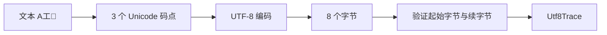

# 字符串、UTF-8 字节与码点边界

<div class="be-tutor-mount" data-tutor-lesson="cs-core-03" aria-hidden="true"></div>

> **任务先行：** 让 Python 与 C++ 对同一段 UTF-8 数据给出相同的字节数、Unicode 码点数和 ASCII／多字节分类；再用受控失败证明“字符串长度”必须说明计数单位。

## 任务路线

<div class="be-task-route" role="list" aria-label="本课六步任务"><span role="listitem">1 锁定旧报告</span><span role="listitem">2 三种计数单位</span><span role="listitem">3 严格扫描</span><span role="listitem">4 双语言视图</span><span role="listitem">5 非法序列</span><span role="listitem">6 迁移验收</span></div>

<section id="step-1" class="be-task-step" data-step-id="step-1" markdown="1">

## 第一步：锁定旧报告并运行文本模式

先运行无参数模式，确认 V2.1 数组报告逐字不变；再运行 `text` 模式。**当前任务：**观察 `A工🧪` 的 `bytes=8` 与 `code_points=3`。**成功证据：**Python 与 C++ 两种模式都退出 0，且对应输出逐字一致。

</section>

<section id="step-2" class="be-task-step" data-step-id="step-2" markdown="1">

## 第二步：区分文本、字节和码点

Python `str` 是 Unicode 码点序列，编码后得到 `bytes`；C++20 `std::string_view` 在本实验中只借用 UTF-8 字节。**主动修改：**分别输入纯 ASCII、一个中文码点和一个四字节码点。**成功证据：**解释每个输入的字节数和码点数为什么相同或不同。

</section>

<section id="step-3" class="be-task-step" data-step-id="step-3" markdown="1">

## 第三步：实现严格 UTF-8 扫描

Python 用严格 `decode("utf-8")` 验证；C++ 根据起始字节确定 1–4 字节宽度，再验证续字节、最小码点、代理项和上限。**当前任务：**返回 `Utf8Trace`，不修改输入。**成功证据：**空输入、ASCII、中文和补充平面码点测试通过。

</section>

<section id="step-4" class="be-task-step" data-step-id="step-4" markdown="1">

## 第四步：对照 Python 与 C++ 字符串视图

Python `bytes` 拥有不可变字节；C++ `string_view` 不拥有数据，调用期间源存储必须仍然有效。**主动修改：**把输入放入调用者变量，再把只读视图传给分析函数。**成功证据：**函数只读输入，返回值不包含悬空视图，报告保持一致。

</section>

<section id="step-5" class="be-task-step" data-step-id="step-5" markdown="1">

## 第五步：触发非法与截断序列

依次测试孤立续字节、错误续字节、过长编码、代理项、超过 `U+10FFFF` 和缺少尾字节。**安全失败实验：**只把固定字节交给验证函数，不读取数组边界之外的数据。**恢复标准：**Python 捕获 `UnicodeDecodeError`，C++ 捕获 `std::invalid_argument`，随后合法输入仍通过。

</section>

<section id="step-6" class="be-task-step" data-step-id="step-6" markdown="1">

## 第六步：完成扫描分类迁移验收

增加一个不提供完整答案的迁移：统计 ASCII 码点与多字节码点，但不把组合字符或 emoji 序列称为“一个用户字符”。**约束：**只在验证成功后计数。**成功证据：**满足 `ascii_count + multibyte_count == code_point_count`，并补混合输入和空输入测试。

</section>

## 课程信息

| 项目 | 内容 |
| --- | --- |
| 前置 | 序列边界、线性扫描、操作计数 |
| 环境 | Python 3.11+、C++20，标准库 |
| 阶段作品 | [可追踪数组实验](../../exercises/cs-core/traceable-array-lab/README.md) |
| 可观察产出 | 四字段 UTF-8 追踪、严格失败矩阵、双语言文本报告 |
| 事实核查 | Python 3.11.15、Unicode 17.0、C++ 工作草案，2026-07-16 |

## 为什么长度必须带单位



读图顺序是“抽象文本 → 码点 → 编码字节 → 验证与计数”。UTF-8 是变宽编码：ASCII 码点占 1 字节，`工` 占 3 字节，`🧪` 占 4 字节。码点也不等于用户看到的字形簇；本课不处理组合字符、区域旗帜或 emoji 连接序列。

## 运行与输出

```bash
cd exercises/cs-core/traceable-array-lab/python
python -m traceable_array_lab text

cd ../cpp
cmake -S . -B build -DCMAKE_BUILD_TYPE=Release
cmake --build build
./build/traceable_array_lab text
```

```text
UTF-8 扫描
text：A工🧪
bytes=8，code_points=3
ascii=1，multibyte=2
```

## 验证边界

合法 UTF-8 不只是“续字节看起来像 `10xxxxxx`”。还要拒绝用更多字节表示本可更短的码点、代理项范围和超过 Unicode 最大值的序列。C++ 扫描每次先确认剩余长度，再读取续字节，因此失败实验不会越界。

`std::string_view` 描述连续 `char` 序列而不拥有存储。它适合只读参数，但不能从临时字符串返回并长期保存。本实验只在函数调用期间借用输入，返回纯计数值。

## AI 协作任务

可以让 AI 列出 UTF-8 失败候选或审阅状态机，但学习者必须核查：

- 是否混淆字节、码点、字形簇和屏幕宽度。
- 是否接受 `C0 AF` 这类过长编码。
- 是否在确认剩余长度前读取续字节。
- 是否让返回值保存指向临时字符串的 `string_view`。
- 是否用“忽略错误”代替严格失败测试。

## 常见错误与排查

| 现象 | 原因 | 检查与恢复 |
| --- | --- | --- |
| 中文长度被写成字节数 | 混淆编码前后单位 | 同时打印 bytes 与 code_points |
| 截断输入导致越界 | 先读后检查 | 先比较剩余长度与序列宽度 |
| 非法输入被静默接受 | 使用忽略/替换错误策略 | 使用严格解码或显式抛错 |
| C++ 结果偶发变化 | 视图指向已销毁存储 | 保证源对象覆盖调用期，不返回视图 |
| emoji 被称为一个字符 | 未说明计数层级 | 本课只写 Unicode 码点数 |

## 完成证据

- 默认报告保持不变，`text` 输出双语言逐字一致。
- 合法 1、2、3、4 字节序列和空输入均有测试。
- 六类非法序列全部受控失败，没有越界读取。
- 能解释 `A工🧪` 为什么是 8 字节、3 码点。
- 返回值只包含计数，不延长或隐藏输入生命周期。

## 来源与版本

| 来源 | 用途 | 核查日期 |
| --- | --- | --- |
| [Python 文本序列 `str`](https://docs.python.org/3.11/library/stdtypes.html#text-sequence-type-str) | Unicode 码点序列、不可变性和 UTF-8 编码 | 2026-07-16 |
| [Unicode 17：编码形式与 UTF-8](https://www.unicode.org/versions/Unicode17.0.0/core-spec/chapter-2/) | 变宽字节形式、码点与编码边界 | 2026-07-16 |
| [C++ `string_view`](https://eel.is/c++draft/string.view) | 连续只读字符视图与非拥有边界 | 2026-07-16 |

本地 JavaGuide 字符串算法页只用于整理扫描、计数和边界误区；正文未复用题面、答案或原图，也不引入正式机考训练。

## 下一步

进入[二维网格、行优先布局与坐标边界](04-two-dimensional-grid-row-major-layout.md)，把一维位置扩展为二维坐标，同时继续保留连续存储与受控边界。
