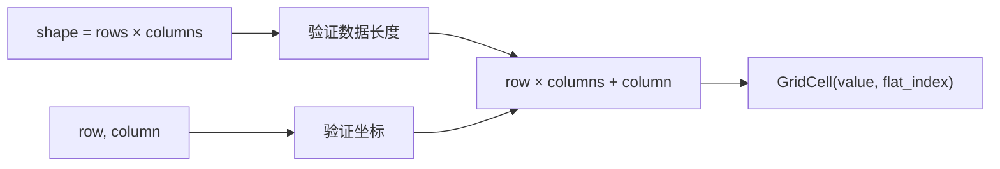

# 二维网格、行优先布局与坐标边界

<div class="be-tutor-mount" data-tutor-lesson="cs-core-04" aria-hidden="true"></div>

> **任务先行：** 用一维连续数据表达 `2 × 3` 网格，让 Python 与 C++ 对坐标 `(1, 2)` 返回相同的值和扁平下标；再证明形状和坐标都属于公开契约。

## 任务路线

<div class="be-task-route" role="list" aria-label="本课六步任务"><span role="listitem">1 文本基线</span><span role="listitem">2 网格形状</span><span role="listitem">3 行优先映射</span><span role="listitem">4 重复行失败</span><span role="listitem">5 C++ 连续视图</span><span role="listitem">6 行扫描迁移</span></div>

<section id="step-1" class="be-task-step" data-step-id="step-1" markdown="1">

## 第一步：运行文本基线与网格模式

先确认 `text` 模式仍是 8 字节、3 码点，再运行 `grid`。**当前任务：**看到 `shape=2x3`、坐标 `(1,2)` 的值 6 和扁平下标 5。**成功证据：**两种语言对应输出逐字一致。

</section>

<section id="step-2" class="be-task-step" data-step-id="step-2" markdown="1">

## 第二步：把形状写进接口

一维数据不能自行说明行列数，因此接口同时接收 `rows` 与 `columns`，并要求 `rows * columns == len(values)`。**主动修改：**用相同六个值改成 `3 × 2`，观察坐标含义改变。**成功证据：**形状不匹配时在访问前失败。

</section>

<section id="step-3" class="be-task-step" data-step-id="step-3" markdown="1">

## 第三步：实现行优先坐标映射

使用 `flat_index = row * columns + column`。**当前任务：**先验证行列坐标，再计算下标。**主动修改：**验证 `(0,0)`、每行首尾和全局末尾。**成功证据：**`checked_grid_at` 同时返回值与扁平下标。

</section>

<section id="step-4" class="be-task-step" data-step-id="step-4" markdown="1">

## 第四步：复现 Python 重复行引用

执行 `grid = [[0] * 2] * 3`，修改 `grid[0][0]`。**安全失败实验：**观察三行同时变化，但不把错误对象传入正式扁平接口。**恢复标准：**能解释 `*` 复制了行引用；需要嵌套列表时改为列表推导，阶段作品继续使用扁平数据。

</section>

<section id="step-5" class="be-task-step" data-step-id="step-5" markdown="1">

## 第五步：完成 C++20 连续视图

C++ 使用 `std::span<const int>` 借用连续数据，不引入 C++23 `mdspan`。**当前任务：**在相乘前检查 `rows * columns` 是否溢出。**成功证据：**形状溢出抛 `std::invalid_argument`，负坐标不会先转换成巨大无符号数。

</section>

<section id="step-6" class="be-task-step" data-step-id="step-6" markdown="1">

## 第六步：完成整行扫描迁移验收

实现 `sum_grid_row`，返回总和和访问次数。**约束：**不提供完整答案；每个元素只访问一次，空网格不能选择第 0 行。**成功证据：**列数为 `c` 时合法行恰好访问 `c` 次，原数据保持不变。

</section>

## 课程信息

| 项目 | 内容 |
| --- | --- |
| 前置 | 一维序列边界、操作计数、只读视图 |
| 环境 | Python 3.11+、C++20，不使用第三方矩阵库 |
| 阶段作品 | [可追踪数组实验](../../exercises/cs-core/traceable-array-lab/README.md) |
| 可观察产出 | 行优先坐标映射、形状校验、行扫描追踪 |
| 事实核查 | Python 3.11.15、C++ 工作草案，2026-07-16 |

## 从二维坐标到一维位置



行优先表示先放完第 0 行，再放第 1 行。对 `2 × 3` 网格，坐标 `(1,2)` 前面有一整行 3 个元素，再向右移动 2 个位置，所以扁平下标是 `1 * 3 + 2 = 5`。

## 运行与输出

```bash
python -m traceable_array_lab grid
./build/traceable_array_lab grid
```

```text
二维网格
shape=2x3
data：1, 2, 3 / 4, 5, 6
row=1，col=2：value=6，flat_index=5
row=0：sum=6，visits=3
```

## 为什么不用嵌套容器冒充连续矩阵

Python 嵌套列表表达“行的列表”，每行是独立对象，既可能长度不同，也可能因重复引用共享同一行。C++ 的 `vector<vector<int>>` 同样是多个独立拥有者，不保证所有行元素组成一块连续区域。当前阶段作品要证明坐标映射，因此选择扁平连续序列并把形状显式传入。

C++20 标准库没有本课需要的 `std::mdspan`。课程可以提到后续标准提供多维视图，但当前实现只使用 `span`、形状和显式映射，保证最低版本契约真实可构建。

## AI 协作任务

让 AI 审阅边界矩阵时，学习者必须检查：

- 是否先验证形状再读取元素。
- 是否把负数提前转换成 `size_t`。
- C++ 的行列乘法是否可能溢出。
- Python 是否使用 `[[value] * columns] * rows` 创建可变行。
- 行扫描是否重复或遗漏元素。

## 常见错误与排查

| 现象 | 原因 | 检查与恢复 |
| --- | --- | --- |
| 修改一格影响多行 | 多行引用同一列表 | 使用列表推导或扁平数据 |
| 同一数据换形状后值错位 | 忘记形状属于解释契约 | 同时传递并验证 rows、columns |
| 负坐标变成巨大下标 | 过早转无符号 | 先检查有符号坐标 |
| 极大形状通过校验 | 乘法先溢出 | 相乘前用除法边界检查 |
| 空网格还能扫描第 0 行 | 只校验数据长度 | 单独校验所选行 |

## 完成证据

- `grid` 输出双语言逐字一致。
- 首尾坐标、负坐标、行列越界和形状不匹配均有测试。
- C++ 极大形状在乘法前受控失败。
- Python 重复行引用实验可复现并能解释。
- 合法行扫描访问次数精确等于列数。

## 来源与版本

| 来源 | 用途 | 核查日期 |
| --- | --- | --- |
| [Python FAQ：创建多维列表](https://docs.python.org/3.11/faq/programming.html#how-do-i-create-a-multidimensional-list) | 重复行引用与独立行创建 | 2026-07-16 |
| [C++ 容器与视图工作草案](https://eel.is/c++draft/containers) | 连续容器、`span` 与版本边界 | 2026-07-16 |
| [C++ `layout_right`](https://eel.is/c++draft/mdspan.layout.right) | 行优先映射概念；不作为 C++20 实现依赖 | 2026-07-16 |

本地 JavaGuide 线性数据结构页只用于审计数组与嵌套结构的名词和复杂度前提；正文、实验和边界矩阵均独立设计。

## 下一步

进入[动态数组容量、扩容成本与摊还分析](05-dynamic-array-capacity-amortized-cost.md)，解释连续序列如何在保持快速索引的同时增长。
