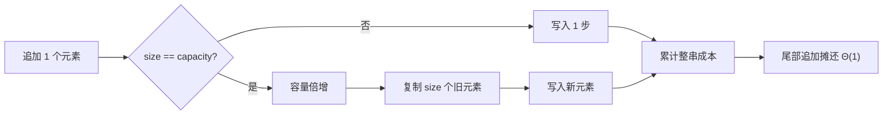

# 动态数组容量、扩容成本与摊还分析

<div class="be-tutor-mount" data-tutor-lesson="cs-core-05" aria-hidden="true"></div>

> **任务先行：** 对五次尾部追加生成确定性容量事件，区分大小、容量、复制次数和总步骤；再用一串操作证明“摊还常量”不等于“每次最坏常量”。

## 任务路线

<div class="be-task-route" role="list" aria-label="本课六步任务"><span role="listitem">1 网格基线</span><span role="listitem">2 大小与容量</span><span role="listitem">3 追加成本</span><span role="listitem">4 倍增扩容</span><span role="listitem">5 reserve 边界</span><span role="listitem">6 初始容量迁移</span></div>

<section id="step-1" class="be-task-step" data-step-id="step-1" markdown="1">

## 第一步：运行网格基线与容量模式

先确认 `grid` 的坐标和值不变，再运行 `capacity`。**当前任务：**观察五次追加中只有容量耗尽时发生复制。**成功证据：**Python 与 C++ 事件表和 `total_steps=12` 逐字一致。

</section>

<section id="step-2" class="be-task-step" data-step-id="step-2" markdown="1">

## 第二步：区分大小与容量

`size` 是已经保存的元素数，`capacity` 是本模拟器无需再次扩容即可容纳的元素数。**主动修改：**为空输入和初始容量 5 生成事件。**成功证据：**始终满足 `0 <= size <= capacity`，空输入没有事件。

</section>

<section id="step-3" class="be-task-step" data-step-id="step-3" markdown="1">

## 第三步：记录每次追加成本

每次追加固定计一次写入；扩容时再计复制旧元素的次数，所以 `steps = copies + 1`。**当前任务：**返回 `CapacityEvent`。**成功证据：**未扩容事件 `copies=0, steps=1`，扩容事件复制次数等于旧大小。

</section>

<section id="step-4" class="be-task-step" data-step-id="step-4" markdown="1">

## 第四步：观察确定性倍增扩容

容量不足时使用课程公开规则 `max(1, capacity * 2)`。**主动修改：**追加到第 8、9 个元素，预测下一次昂贵操作。**成功证据：**能从事件表解释容量 1、2、4、8 的变化，而不声称标准库必须采用该倍数。

</section>

<section id="step-5" class="be-task-step" data-step-id="step-5" markdown="1">

## 第五步：对照 `reserve` 与标准边界

C++ `vector::reserve` 可以减少已知规模追加时的重分配，但标准不固定一般增长因子；Python `list` 也不公开可移植容量接口。**安全失败实验：**尝试把一次昂贵扩容写成“所有 append 都是 O(n)”，再用完整事件序列反证。**恢复标准：**分别写单次最坏与序列摊还结论。

</section>

<section id="step-6" class="be-task-step" data-step-id="step-6" markdown="1">

## 第六步：完成不同初始容量迁移验收

让 `simulate_growth` 接受 `initial_capacity`。**约束：**不提供完整答案；负容量在 Python 中失败，C++ 使用无符号容量并检查倍增溢出。**成功证据：**初始容量至少为元素数时总复制为 0，结果元素顺序和追加次数不变。

</section>

## 课程信息

| 项目 | 内容 |
| --- | --- |
| 前置 | 数组访问、操作计数、渐近符号、连续网格 |
| 环境 | Python 3.11+、C++20；确定性模拟只用标准库 |
| 阶段作品 | [可追踪数组实验](../../exercises/cs-core/traceable-array-lab/README.md) |
| 可观察产出 | 容量事件表、复制总数、摊还成本证明与预留实验 |
| 事实核查 | MIT 6.006、C++ 工作草案，2026-07-16 |

## 单次成本与一串操作



昂贵扩容之间会出现越来越多便宜追加。前 `n` 次追加中，复制量形成 `1 + 2 + 4 + ...`，总量仍与 `n` 同阶；把总成本分摊到 `n` 次操作，每次是摊还常量。某一次触发扩容时仍可能复制 `Θ(n)` 个元素。

## 运行与输出

```bash
python -m traceable_array_lab capacity
./build/traceable_array_lab capacity
```

```text
动态数组扩容
append | size | capacity | copies | steps
7 | 1 | 1 | 0 | 1
3 | 2 | 2 | 1 | 2
9 | 3 | 4 | 2 | 3
3 | 4 | 4 | 0 | 1
5 | 5 | 8 | 4 | 5
total_steps=12
```

## 为什么不直接断言标准库容量序列

C++ 标准规定 `capacity()`、`reserve()` 和发生重分配时的失效边界，但没有要求每个实现使用固定的 2 倍增长。Python 语言也没有公开 `list` 容量或增长因子的可移植接口。因此自动测试验证课程模拟器的公开规则，而不是观察某台机器后把实现细节写成通用事实。

预留不是“让算法永远不扩容”。它只保证在大小不超过已预留容量时避免重分配；输入超过预估仍需要增长。预留过大也会占用不必要空间。

## AI 协作任务

让 AI 解释摊还分析时，学习者必须检查：

- 是否区分 `size` 与 `capacity`。
- 是否把本模拟器的 2 倍规则误写成标准强制要求。
- 是否把摊还成本说成单次最坏成本。
- 是否只看第五次扩容而忽略整串事件。
- 是否用机器计时替代复制次数和累计步骤。

## 常见错误与排查

| 现象 | 原因 | 检查与恢复 |
| --- | --- | --- |
| 每次追加都计复制 | 没有检查容量是否已满 | 只在 `size == capacity` 时复制 |
| 第一次容量仍为 0 | 零容量直接乘 2 | 使用 `max(1, capacity * 2)` |
| 宣称 append 最坏 O(1) | 混淆摊还与最坏情况 | 分别写单次和操作序列结论 |
| 测试依赖本机 vector 倍数 | 把实现细节当标准 | 测模拟器事件与标准承诺 |
| reserve 后认为永不失效 | 忽略超过预留容量 | 测试刚好等于和超过容量 |

## 完成证据

- `capacity` 输出双语言逐字一致且总步骤为 12。
- 固定五次追加事件逐项测试，容量不变量始终成立。
- 空输入、负初始容量、充足预留和 C++ 倍增溢出边界受控。
- 能解释单次扩容 `Θ(n)` 与尾部追加摊还 `Θ(1)` 同时成立。
- 未对 Python `list` 或 C++ `vector` 的增长因子作未承诺断言。

## 来源与版本

| 来源 | 用途 | 核查日期 |
| --- | --- | --- |
| [MIT 6.006：数据结构与动态数组](https://ocw.mit.edu/courses/6-006-introduction-to-algorithms-spring-2020/resources/lecture-2-data-structures-and-dynamic-arrays/) | 动态数组、扩容与摊还分析 | 2026-07-16 |
| [C++ 序列容器要求](https://eel.is/c++draft/sequences) | `vector` 容量、`reserve` 与复杂度边界 | 2026-07-16 |
| [C++ `vector` 修改操作](https://eel.is/c++draft/vector.modifiers) | 重分配条件和引用、指针、迭代器失效 | 2026-07-16 |

本地 JavaGuide 复杂度和线性数据结构页只用于审计“数组操作都是 O(1)”与“append 永远 O(1)”等过度概括；公式、事件表和测试均独立构造。

## 下一步

进入[单链表、节点链接与所有权](06-singly-linked-list-nodes-ownership.md)，比较连续存储与节点链接在访问、头部修改和所有权上的差异。
