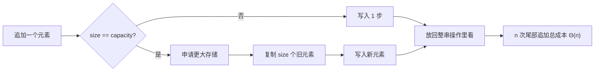

<div class="be-tutor-mount" data-tutor-lesson="cs-core-05" aria-hidden="true"></div>

<section id="overview-capacity-output" class="be-page-hero be-lesson-hero" data-learning-context="overview-capacity-output" data-context-type="overview" markdown="1">

<span class="be-lesson-kicker">共同算法基础 · 第 1 课 · 可追踪数组实验</span>

# 动态数组容量、扩容成本与摊还分析

## 五次追加，为什么一共是 12 步

```text
append | size | capacity | copies | steps
7      | 1    | 1        | 0      | 1
3      | 2    | 2        | 1      | 2
9      | 3    | 4        | 2      | 3
3      | 4    | 4        | 0      | 1
5      | 5    | 8        | 4      | 5
total_steps=12
```

第 5 次追加很贵：先搬 4 个旧元素，再写 1 个新元素。但前 4 次里有两次只花 1 步。动态数组的关键不是“追加究竟是常量还是线性”二选一，而是把一次操作和一整串操作分开看。

[看懂大小和容量](#concept-size-capacity){ .md-button .md-button--primary }
[直接运行小例子](#reproduce-growth-micro){ .md-button }

<div class="be-lesson-facts" markdown="1">
<span>课程位置<strong>共同算法基础 · 1 / 16</strong></span>
<span>前置<strong>数组下标、操作计数与渐近符号</strong></span>
<span>完成后留下<strong>容量事件、成本解释和双语言回归</strong></span>
</div>

</section>

## 开始前

- 能解释顺序数据的 `size` 和合法下标范围 `[0, size)`。
- 知道 `Θ(n)` 描述增长趋势，不是某台机器上的固定毫秒数。
- 本课使用一个公开的倍增模拟器来数操作，不猜测 Python `list` 或 C++ `vector` 的内部增长公式。

<section id="concept-size-capacity" data-learning-context="concept-size-capacity" data-context-type="concept" markdown="1">

## `size` 是内容，`capacity` 是存储余量

- `size`：已经保存了多少个元素。
- `capacity`：不重新分配时，当前存储最多能容纳多少个元素。

任何时刻都应满足：

```text
0 <= size <= capacity
```

`capacity` 增大不等于元素自动出现。预留 8 个位置以后，`size` 仍然可以是 0；只有真正追加元素，`size` 才会变化。

</section>

<section id="example-capacity-strip" data-learning-context="example-capacity-strip" data-context-type="example" markdown="1">

## 容量只在装不下时增长

<div class="be-capacity-trace" role="img" aria-label="依次追加 7、3、9、3、5 时，容量按 1、2、4、4、8 变化，复制次数为 0、1、2、0、4">
  <div><strong>追加 7</strong><span>size 1 / cap 1</span><code>复制 0</code></div>
  <div><strong>追加 3</strong><span>size 2 / cap 2</span><code>复制 1</code></div>
  <div><strong>追加 9</strong><span>size 3 / cap 4</span><code>复制 2</code></div>
  <div><strong>追加 3</strong><span>size 4 / cap 4</span><code>复制 0</code></div>
  <div><strong>追加 5</strong><span>size 5 / cap 8</span><code>复制 4</code></div>
</div>

容量足够时，追加只写入新元素。容量耗尽时，模拟器申请更大存储、复制已有元素，再写入新值。事件表把偶发搬移和每次都有的新写入分开记录。

</section>

<section id="concept-append-cost" data-learning-context="concept-append-cost" data-context-type="concept" markdown="1">

## 每次追加怎样数步骤

课程使用一个很朴素的成本模型：

```text
steps = copies + 1
```

`copies` 是扩容时搬走的旧元素数，`1` 是写入新元素。容量没满时 `copies=0`；容量刚好满时，要复制当前 `size` 个元素。

这个模型故意不使用机器计时。计时会混入解释器、编译器、缓存和系统负载，而我们当前只想回答：输入越来越大时，算法本身做了多少次关键操作。

</section>

<section id="concept-doubling-model" data-learning-context="concept-doubling-model" data-context-type="concept" markdown="1">

## 课程模拟器采用确定性倍增

```python
if size == capacity:
    copies = size
    capacity = 1 if capacity == 0 else capacity * 2
```

从空存储开始，容量会经过 `1、2、4、8……`。Python 和 C++ 使用同一规则，所以事件表可以逐字对照。

请把“课程模拟器采用 2 倍增长”和“标准库必须 2 倍增长”分开。前者是我们的公开实验契约；后者并不是 Python 或 C++ 向所有实现做出的保证。

</section>

<section id="concept-amortized" data-learning-context="concept-amortized" data-context-type="concept" markdown="1">

## 单次最坏 `Θ(n)`，尾部追加摊还 `Θ(1)`



某次扩容要搬当前全部元素，因此单次最坏是 `Θ(n)`。但倍增以后，下一次昂贵扩容要等更多便宜追加发生。前 `n` 次尾部追加的总工作仍与 `n` 同阶，把总成本分到这 `n` 次操作上，得到摊还 `Θ(1)`。

“摊还”不是概率，也不是运行多次取平均；它分析的是一串确定操作的总成本怎样分摊。

</section>

<section id="example-geometric-cost" data-learning-context="example-geometric-cost" data-context-type="example" markdown="1">

## 搬移量为什么不会变成平方级

倍增扩容时，旧元素复制量大致是：

```text
1 + 2 + 4 + 8 + ...
```

直到最后一项不超过当前元素数。几何级数的前面所有项加起来，小于最后一项的 2 倍，所以总复制量仍是 `Θ(n)`，再加上每个新元素各写一次，整串追加仍是 `Θ(n)`。

五次小实验的复制量是 `0 + 1 + 2 + 0 + 4 = 7`，写入量是 5，总步骤正好 12。

</section>

<section id="reproduce-growth-micro" data-learning-context="reproduce-growth-micro" data-context-type="reproduce" markdown="1">

## 先运行一份能完整读懂的小程序

```bash
.venv/bin/python site-src/examples/algorithm-foundation/dynamic_array_growth.py
```

源码里的 `CapacityEvent` 只保存五个字段：追加值、追加后大小、追加后容量、旧元素复制数和本次步骤数。先预测第 4、5 行，再运行对照；如果结果不同，逐次写下追加前的 `size` 和 `capacity`。

小程序不调用 Python `list` 的内部容量，也不依赖某个解释器版本。它只是把我们公开的算法模型照着执行一遍。

</section>

<section id="reproduce-bilingual-lab" data-learning-context="reproduce-bilingual-lab" data-context-type="reproduce" markdown="1">

## 在可追踪数组实验里对照 Python 和 C++

Python：

```bash
cd exercises/cs-core/traceable-array-lab/python
PYTHONPATH=src ../../../../.venv/bin/python -m traceable_array_lab capacity
PYTHONPATH=src ../../../../.venv/bin/python -m unittest discover -s tests -v
PYTHONPATH=src ../../../../.venv/bin/python -m mypy --strict src tests
```

C++：

```bash
cd exercises/cs-core/traceable-array-lab/cpp
cmake -S . -B build -DCMAKE_BUILD_TYPE=Debug
cmake --build build --config Debug
ctest --test-dir build --build-config Debug --output-on-failure
./build/traceable_array_lab capacity
```

两边的 `capacity` 输出应逐字一致。原有 `baseline`、`text` 和 `grid` 模式也要继续通过，这证明新实验没有改坏前四节冻结的接口。

</section>

<section id="modify-initial-capacity" data-learning-context="modify-initial-capacity" data-context-type="modify" markdown="1">

## 换三个初始容量再算一次

固定追加 `[7, 3, 9, 3, 5]`，分别从容量 `0、2、5` 开始：

1. 先在纸上预测每次 `copies`。
2. 调用 `simulate_growth(values, initial_capacity)`。
3. 检查事件数和最终 `size` 都没有变化。
4. 比较三种情况的总复制数和最终容量。

初始容量 5 时不会复制旧元素，`total_steps=5`。这不表示“预留越大越好”：容量 5000 也能避免扩容，却会为五个元素保留大量暂时不用的空间。

</section>

<section id="concept-library-boundary" data-learning-context="concept-library-boundary" data-context-type="concept" markdown="1">

## `reserve` 能减少扩容，但不承诺永远不再扩容

C++ `vector::reserve(n)` 会把容量提高到至少 `n`，不会创建逻辑元素，也不会缩小已有 `size`。当大小没有超过预留容量时，后续追加可以避免重分配；超过预估以后仍可能增长。

标准规定了 `capacity()`、`reserve()` 的行为和发生重分配时的位置失效边界，但没有要求所有实现按固定 2 倍增长。Python `list` 也没有公开可移植的容量接口。因此：

- 精确测试课程模拟器的 `1、2、4、8`。
- 对真实容器只依赖语言和标准承诺。
- 不把本机观察到的一次数列写进跨平台程序契约。

</section>

<section id="troubleshoot-amortized-claim" data-learning-context="troubleshoot-amortized-claim" data-context-type="troubleshoot" markdown="1">

## 听到“append 就是 O(1)”时，先补齐限定词

| 说法 | 问题在哪里 | 更准确的表达 |
| --- | --- | --- |
| 每次 append 都是 `O(1)` | 忽略触发扩容的单次操作 | 尾部追加摊还 `Θ(1)`，单次最坏 `Θ(n)` |
| append 都是 `O(n)` | 只盯着昂贵扩容 | 一串 `n` 次追加总成本 `Θ(n)` |
| 测一次很快，所以是常量 | 用计时替代操作模型 | 改变输入规模并数关键步骤 |
| vector 一定每次翻倍 | 把实现策略当标准 | 精确倍增只属于课程模拟器 |

</section>

<section id="troubleshoot-overflow" data-learning-context="troubleshoot-overflow" data-context-type="troubleshoot" markdown="1">

## 容量倍增也有整数上限

Python 版本先拒绝负初始容量。C++ 使用无符号 `size_t`，但 `capacity * 2` 仍可能超过可表示范围并回绕。

```cpp
if (capacity > std::numeric_limits<std::size_t>::max() / 2U) {
    throw std::overflow_error("simulated capacity overflow");
}
capacity *= 2U;
```

先比较再乘，失败时抛出明确异常。不要让回绕后的“小容量”继续进入写入逻辑，那会同时破坏 `size <= capacity` 和内存安全假设。

</section>

<section id="project-array-capacity" data-learning-context="project-array-capacity" data-context-type="project" markdown="1">

## 可追踪数组实验开始记录存储变化

前四节已经让项目能观察下标、线性查找、UTF-8 和二维网格。这节增加 `capacity` 模式：

```text
输入值序列
  → simulate_growth
  → 每次追加的 CapacityEvent
  → 总复制数与 total_steps
  → Python / C++ 同一份报告
```

项目没有假装实现一个生产级容器。它把动态数组最关键的隐藏变化转成可以回放的事件，为下一课比较连续存储和链式节点打基础。

[查看可追踪数组实验](../../exercises/cs-core/traceable-array-lab/README.md){ .md-button .md-button--primary }

</section>

<section id="deepen-space-time" data-learning-context="deepen-space-time" data-context-type="deepen" markdown="1">

## 少复制一些，往往要多留一点空间

较大的增长因子通常减少重分配次数，却可能留下更多未使用容量；较小因子节省空间，却更频繁搬移元素。真正的容器实现还要考虑分配器、元素移动成本、缓存局部性和异常保证。

课程先固定 2 倍，是为了让操作轨迹可重复，不是宣布它对所有工作负载最好。以后做性能判断时，需要同时记录数据规模、元素类型、分配次数、峰值空间和实际基准。

</section>

<section id="career-amortized-evidence" data-learning-context="career-amortized-evidence" data-context-type="career" markdown="1">

## 面试里不要只背“摊还 O(1)”

可以从五行事件表开始解释：哪几次触发复制，为什么第 5 次是 5 步，复制量怎样形成几何级数，最后再给出“单次最坏 `Θ(n)`、一串尾部追加摊还 `Θ(1)`”。

如果继续被问 `reserve`，说明它用额外容量换更少重分配，但不会创建元素，也不能保证超过预留值后永不失效。能把模型、标准边界和工程权衡分开，答案才完整。

</section>

## 完成检查

- [ ] 能区分 `size`、`capacity`、`copies` 和 `steps`。
- [ ] 能手算五次追加并得到 `total_steps=12`。
- [ ] 能同时解释单次扩容 `Θ(n)` 和尾部追加摊还 `Θ(1)`。
- [ ] 能比较初始容量 `0、2、5` 的复制成本，并说明空间代价。
- [ ] Python 与 C++ 四种模式、类型检查和测试全部通过。
- [ ] 没有把模拟器的倍增规则冒充成 Python 或 C++ 标准保证。

## 来源与版本

| 来源 | 用于核查 | 版本或日期 |
| --- | --- | --- |
| [MIT 6.006：数据结构与动态数组](https://ocw.mit.edu/courses/6-006-introduction-to-algorithms-spring-2020/resources/lecture-2-data-structures-and-dynamic-arrays/) | 动态数组、增长策略和摊还分析 | 2020 课程，2026-07-17 核查 |
| [C++ 序列容器要求](https://eel.is/c++draft/sequences) | `vector` 容量与 `reserve` 接口 | C++20 教学基线，2026-07-17 核查 |
| [C++ `vector` 修改操作](https://eel.is/c++draft/vector.modifiers) | 重分配与引用、指针、迭代器失效 | 2026-07-17 核查 |

本地 JavaGuide 复杂度与线性结构页只用于检查“数组操作都是 O(1)”和“append 永远 O(1)”等常见过度概括；公式、事件、代码和测试均由本项目独立编写。

## 下一步

进入[单链表、节点链接与所有权](06-singly-linked-list-nodes-ownership.md)，把连续存储与分散节点放在同一组操作上比较：随机访问、头部修改、尾部追加和所有权分别付出什么代价。
