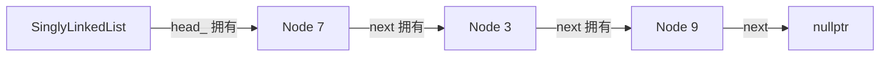

<div class="be-tutor-mount" data-tutor-lesson="cs-core-06" aria-hidden="true"></div>

<section id="overview-linked-output" class="be-page-hero be-lesson-hero" data-learning-context="overview-linked-output" data-context-type="overview" markdown="1">

<span class="be-lesson-kicker">共同算法基础 · 第 2 课 · 可追踪线性结构实验</span>

# 单链表、节点链接与所有权

## 删掉第一个节点，后面的数据为什么还在

```text
linked=7 -> 3 -> 9
find=3 index=1 visits=2
pop_front=7
remaining=3 -> 9
size=2
```

数组把值排在连续的位置里；单链表换了一种办法：每个节点保存自己的值，再指向下一个节点。删掉开头的 `7`，并不需要把 `3` 和 `9` 搬家，只要让表头改为指向 `3`。

[先看节点怎样连起来](#example-node-chain){ .md-button .md-button--primary }
[直接运行小例子](#reproduce-linked-micro){ .md-button }

<div class="be-lesson-facts" markdown="1">
<span>课程位置<strong>共同算法基础 · 2 / 16</strong></span>
<span>前置<strong>数组、线性查找和动态数组成本</strong></span>
<span>完成后留下<strong>节点轨迹、所有权解释和双语言回归</strong></span>
</div>

</section>

## 开始前

- 能用下标读取数组，并知道线性查找要逐项比较。
- 能区分一次操作的成本和一串操作的总成本。
- C++ 部分会用到上一阶段学过的 `std::unique_ptr`；Python 学习者可以先看共同结构，再对照语言差异。

<section id="concept-array-vs-links" data-learning-context="concept-array-vs-links" data-context-type="concept" markdown="1">

## 数组靠位置，链表靠链接

把 `[7, 3, 9]` 想成两种摆放方式：

| 表示 | 值怎样相邻 | 直接擅长什么 | 需要付出的代价 |
| --- | --- | --- | --- |
| 动态数组 | 值按连续逻辑位置排列 | 按下标读取 | 头部插入、删除通常要搬移后续值 |
| 单链表 | 每个节点指向下一个节点 | 已知节点处的局部重连 | 找第几个值必须从头沿链接走 |

链表里的“下一个”是逻辑关系，不保证两个节点在物理内存中挨着。正因为如此，它也不能像数组那样根据下标直接跳到第 `i` 个位置。

</section>

<section id="example-node-chain" data-learning-context="example-node-chain" data-context-type="example" markdown="1">

## 一条链里有四种角色

<div class="be-linked-chain" role="img" aria-label="head 指向值为 7 的节点，7 指向 3，3 指向 9，9 的下一链接为空">
  <div class="be-linked-chain__head"><strong>head</strong><span>入口</span></div>
  <i aria-hidden="true">→</i>
  <div><strong>7</strong><span>next</span></div>
  <i aria-hidden="true">→</i>
  <div><strong>3</strong><span>next</span></div>
  <i aria-hidden="true">→</i>
  <div><strong>9</strong><span>next = 空</span></div>
</div>

- `head`：找到第一节点的入口；空表时它本身就是空链接。
- `value`：当前节点保存的数据。
- `next`：通往下一节点的链接。
- `size`：链表公开保存的节点数量。

这里先别把节点地址当成序号。地址只说明对象放在哪里，`next` 才说明遍历顺序。

</section>

<section id="concept-list-invariants" data-learning-context="concept-list-invariants" data-context-type="concept" markdown="1">

## 三条规则让链表不散架

每次修改之后都检查：

1. 从 `head` 出发，沿 `next` 能按顺序访问所有节点。
2. 最后一个节点的 `next` 为空，没有意外形成环。
3. `size` 等于实际能走到的节点数；空表同时满足 `head` 为空、`size == 0`。

只看输出值往往发现不了断链。例如链上还能看到 `7 -> 3`，但 `size` 错写成 3，后面的边界判断迟早会出错。结构和计数要一起测。

</section>

<section id="example-head-operations" data-learning-context="example-head-operations" data-context-type="example" markdown="1">

## 表头修改只碰一个入口

`push_front(5)`：

```text
原来：head -> 7 -> 3 -> 9
新节点：5 -> 7
完成：head -> 5 -> 7 -> 3 -> 9
```

`pop_front()`：

```text
原来：head -> 7 -> 3 -> 9
读出：7
完成：head ------> 3 -> 9
```

两种操作都不需要走完整条链，只改固定数量的链接，所以是 `Θ(1)`。删除唯一节点以后，新的 `head` 为空，`size` 必须回到 0。

</section>

<section id="concept-position-cost" data-learning-context="concept-position-cost" data-context-type="concept" markdown="1">

## “链表插入是常量时间”少了一个条件

如果已经拿到前驱节点或需要重连的链接，插入本身只改几个指向，确实是 `Θ(1)`。但如果题目只给一个下标或一个值，还要先从 `head` 找到位置，这一步通常是 `Θ(n)`。

同样，本课的 `append` 没有保存尾节点：为了找到最后一个节点，每次都要从头走到尾，因此尾部追加是 `Θ(n)`。下一课和队列课会看到，额外维护入口可以改变某个操作的成本，也会带来新的结构规则。

</section>

<section id="example-find-visits" data-learning-context="example-find-visits" data-context-type="example" markdown="1">

## 访问次数把“走过多少节点”说清楚

在 `7 -> 3 -> 9 -> 3` 中查找：

| 目标 | 依次访问 | 结果 |
| --- | --- | --- |
| `3` | `7, 3` | `index=1, visits=2` |
| `8` | `7, 3, 9, 3` | `index=None, visits=4` |

查找返回第一个匹配。命中后立即停止；找不到时，访问次数等于链表长度。这个小小的 `visits` 字段比“链表查找慢”更有用，因为它能被测试，也能随着输入变化重新计算。

</section>

<section id="concept-python-cpp-ownership" data-learning-context="concept-python-cpp-ownership" data-context-type="concept" markdown="1">

## Python 引用和 C++ 所有权链不是一回事

两种实现都把节点藏在容器内部，但资源语义不同：

| 关注点 | Python 3.11 | C++20 |
| --- | --- | --- |
| 下一节点 | `_Node | None` 对象引用 | `std::unique_ptr<Node>` |
| 生命周期 | 由 Python 运行时管理可达对象 | 所有权沿 `head_ -> next` 明确传递 |
| 空表删除 | 抛出 `IndexError` | 抛出 `std::out_of_range` |
| 容器复制 | 本课不公开复制接口 | 显式禁用复制、允许移动 |

Python 的引用告诉程序“还能访问哪个对象”，不需要在本课把它硬说成 C++ 式所有权。C++ 则用 `unique_ptr` 明确规定每个节点只有一个拥有者；表头被销毁时，拥有链会依次释放。

</section>

<section id="example-unique-ptr-chain" data-learning-context="example-unique-ptr-chain" data-context-type="example" markdown="1">

## `unique_ptr` 让拥有关系画得出来



容器禁止复制，是因为复制一串 `unique_ptr` 没有默认的合理含义：究竟共享节点，还是深拷贝全部节点？本项目不偷偷替学习者选择，而是允许移动，把整条拥有链交给新容器；移动后的源容器恢复为空。

</section>

<section id="reproduce-linked-micro" data-learning-context="reproduce-linked-micro" data-context-type="reproduce" markdown="1">

## 先跑一份可以从头读到尾的小程序

```bash
.venv/bin/python site-src/examples/algorithm-foundation/singly_linked_trace.py
```

运行前先预测 `find(3)` 要访问几个节点，以及 `pop_front()` 后谁会成为新的表头。输出应与页首五行完全一致。

小程序只实现 `append`、`find`、`pop_front`、遍历和 `size`，适合第一次拆解节点变化。它不会替代下面的正式双语言项目。

</section>

<section id="reproduce-bilingual-linear-lab" data-learning-context="reproduce-bilingual-linear-lab" data-context-type="reproduce" markdown="1">

## 再用 Python 和 C++ 跑同一份链表报告

Python：

```bash
cd exercises/cs-core/traceable-linear-structures-lab/python
PYTHONPATH=src ../../../../.venv/bin/python -m unittest discover -s tests -v
PYTHONPATH=src ../../../../.venv/bin/python -m mypy --strict src tests
PYTHONPATH=src ../../../../.venv/bin/python -m traceable_linear_structures_lab linked
```

C++：

```bash
cd exercises/cs-core/traceable-linear-structures-lab/cpp
cmake -S . -B build -DCMAKE_BUILD_TYPE=Debug
cmake --build build --config Debug
ctest --test-dir build --build-config Debug --output-on-failure
./build/traceable_linear_structures_lab linked
```

两端的 `linked` 报告应逐字一致。`stack` 和 `queue` 模式也继续回归，因为三种结构共用项目入口；这一课不能提前改坏后两课已经冻结的契约。

</section>

<section id="modify-remove-first" data-learning-context="modify-remove-first" data-context-type="modify" markdown="1">

## 把 `remove_first` 改成你自己的数据

从 `7 -> 3 -> 9 -> 3` 开始，只删除第一个匹配值：

1. 先预测删除 `7、9、3、8` 后的链和 `size`。
2. 分别覆盖头部、中间、重复值和缺失值。
3. 命中后立即返回，不能把两个 `3` 一起删掉。
4. 每次都同时检查 `to_list()`、`size()` 和返回布尔值。

再换成至少五个你自己的值，重复一次。真正需要想清楚的是：删除头节点时没有前驱；删除其他节点时，应该让前驱越过当前节点，指向它的下一节点。

</section>

<section id="troubleshoot-empty-list" data-learning-context="troubleshoot-empty-list" data-context-type="troubleshoot" markdown="1">

## 空表不是拿空链接硬试

对空表调用 `pop_front()` 时，程序应在读取节点前拒绝操作：Python 抛 `IndexError`，C++ 抛 `std::out_of_range`。异常后仍然满足 `empty()` 为真、`size()` 为 0。

不要为了“看看会发生什么”去解引用 `None` 或 `nullptr`。那不能证明容器的错误处理，只会把可解释的边界变成崩溃或未定义行为。

</section>

<section id="troubleshoot-broken-links" data-learning-context="troubleshoot-broken-links" data-context-type="troubleshoot" markdown="1">

## 输出看起来差不多，链也可能已经坏了

| 现象 | 常见原因 | 从哪里查起 |
| --- | --- | --- |
| 删除后少了一整段 | 前驱链接接错，跳过了多个节点 | 画出 `previous/current/current.next` 三者 |
| 两个重复值都消失 | 命中后没有立刻返回 | 检查成功分支是否结束遍历 |
| `size` 与遍历数量不同 | 某条修改路径漏加或漏减 | 每种操作后同时断言两者 |
| 删除头以后还访问旧节点 | 把旧引用或裸指针继续当有效对象 | 先完成重连，此后只从新 `head` 遍历 |
| C++ 移动后源对象仍报旧大小 | 移动构造或赋值没有清空计数 | 同时转移 `head_` 并重置 `size_` |

</section>

<section id="project-linear-v01" data-learning-context="project-linear-v01" data-context-type="project" markdown="1">

## 可追踪线性结构实验从一条链开始

```text
固定值 7, 3, 9
  → SinglyLinkedList
  → find 返回 index 与 visits
  → pop_front 改变 head
  → remove_first 验证重连
  → Python / C++ 同一份报告
```

这个项目不会把单链表包装成“万能容器”。它保留访问次数、错误类型和节点顺序，让后面的栈、队列能复用同一套节点基础，又能清楚比较各自的接口约束。

[查看可追踪线性结构实验](../../exercises/cs-core/traceable-linear-structures-lab/README.md){ .md-button .md-button--primary }

</section>

<section id="deepen-tail-pointer" data-learning-context="deepen-tail-pointer" data-context-type="deepen" markdown="1">

## 保存尾节点，能让追加更快吗

可以。若容器始终维护一个指向最后节点的尾入口，追加时就不必从头查找，能降为 `Θ(1)`。但这会新增不变量：

- 空表时头、尾必须同时为空。
- 插入第一个节点时，头和尾要指向同一节点。
- 删除最后一个节点后，两者要同时清空。

速度来自额外状态，不是免费得到的。队列课会正式实现这项权衡，并区分 C++ 中拥有节点的 `head_` 与只负责观察位置的非拥有 `tail_`。

</section>

<section id="career-linked-evidence" data-learning-context="career-linked-evidence" data-context-type="career" markdown="1">

## 面试里先问“位置已经找到了吗”

如果问题是“链表插入复杂度多少”，我更建议先补一句条件：已经拿到前驱节点时，重连是 `Θ(1)`；只给下标或目标值时，还要算定位的 `Θ(n)`。

随后可以用本项目解释两个工程点：Python 和 C++ 如何表达链接，C++ 为什么选择 `unique_ptr` 并禁用复制；再展示空表、重复值、移动后源对象和双语言输出测试。这样回答的不只是复杂度口诀，而是一份能运行、能失败、也能复核的实现。

</section>

## 完成检查

- [ ] 能画出 `head -> 7 -> 3 -> 9 -> 空`，并说清 `value`、`next` 和 `size`。
- [ ] 能解释为什么按下标访问和本实现的尾部追加都是 `Θ(n)`。
- [ ] 能给“已知前驱时插入 `Θ(1)`”补上完整条件。
- [ ] 能区分 Python 对象引用与 C++ `unique_ptr` 所有权链。
- [ ] `remove_first` 覆盖头、中、尾、重复值、缺失值和空表，并保持结构不变量。
- [ ] Python 类型检查、单元测试，C++ 严格构建与 CTest，以及三种双语言报告全部通过。

## 来源与版本

| 来源 | 用于核查 | 版本或日期 |
| --- | --- | --- |
| [MIT 6.006：数据结构与动态数组](https://ocw.mit.edu/courses/6-006-introduction-to-algorithms-spring-2020/resources/lecture-2-data-structures-and-dynamic-arrays/) | 链式结构、局部修改与访问成本 | 2020 课程，2026-07-17 核查 |
| [Open Data Structures：Linked Lists](https://opendatastructures.org/ods-python/3_Linked_Lists.html) | 单链表表示、遍历与更新 | 2026-07-17 核查 |
| [C++ `forward_list`](https://eel.is/c++draft/forward.list.overview) | 单向链表接口和复杂度条件 | C++20 教学基线，2026-07-17 核查 |
| [C++ `unique_ptr`](https://eel.is/c++draft/unique.ptr) | 单一所有权、移动与销毁语义 | C++20 教学基线，2026-07-17 核查 |

本地 JavaGuide 线性结构页只用于检查“链表插入永远 O(1)”等省略前提的说法；节点模型、代码、报告和测试均由本项目独立编写。

## 下一步

进入[栈、LIFO 接口与空栈边界](07-stack-lifo-interface-underflow.md)，把链表头部的常量修改收束成一个更窄、更可靠的栈顶接口。
