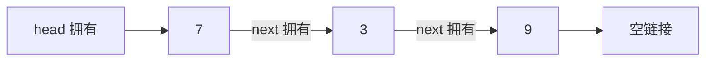

# 单链表、节点链接与所有权

<div class="be-tutor-mount" data-tutor-lesson="cs-core-06" aria-hidden="true"></div>

> **任务先行：** 运行一条可追踪单链表，观察查找访问次数与头部删除；再用单一所有权实现 `remove_first`，证明复杂度结论必须说明位置是否已知。

## 任务路线

<div class="be-task-route" role="list" aria-label="本课六步任务"><span role="listitem">1 链表基线</span><span role="listitem">2 节点不变量</span><span role="listitem">3 头部修改</span><span role="listitem">4 查找追踪</span><span role="listitem">5 所有权失败</span><span role="listitem">6 删除迁移</span></div>

<section id="step-1" class="be-task-step" data-step-id="step-1" markdown="1">

## 第一步：锁定链表模式基线

先分别运行 Python 和 C++ 的 `linked` 模式。**当前任务：**确认 `7 -> 3 -> 9`、首次匹配位置、两次访问和头部删除结果一致。**成功证据：**两端标准输出逐字一致，标准错误为空。

</section>

<section id="step-2" class="be-task-step" data-step-id="step-2" markdown="1">

## 第二步：定义节点和链表不变量

一个节点保存值和下一节点链接；头链接为空表示空表。链表的 `size` 必须等于从头能访问到的节点数。**主动修改：**从空表依次 `append(7)`、`push_front(3)`。**成功证据：**结果为 `3 -> 7`，大小为 2，没有公开节点指针。

</section>

<section id="step-3" class="be-task-step" data-step-id="step-3" markdown="1">

## 第三步：实现头部插入与删除

`push_front` 让新节点指向旧头，`pop_front` 把头移动到下一节点，只修改常量个链接。**当前任务：**覆盖空表、单节点和多节点。**成功证据：**头部操作为 `Θ(1)`，删除单节点后 `empty()` 为真且 `size()` 为 0。

</section>

<section id="step-4" class="be-task-step" data-step-id="step-4" markdown="1">

## 第四步：追踪线性查找访问次数

随机下标不能直接跳到目标节点，必须从头沿链接移动。**主动修改：**在 `7, 3, 9, 3` 中查找 `3` 和 `8`。**成功证据：**前者返回 `index=1, visits=2`，后者返回缺失且 `visits=4`。

</section>

<section id="step-5" class="be-task-step" data-step-id="step-5" markdown="1">

## 第五步：验证所有权与安全失败

C++ 的 `unique_ptr` 形成唯一拥有链，节点销毁会沿链释放；公开容器禁止复制但允许移动。**安全失败实验：**对空表调用 `pop_front`。Python 应抛出 `IndexError`，C++ 应抛出 `std::out_of_range`。**恢复标准：**异常后链表仍为空，禁止用空指针解引用演示错误。

</section>

<section id="step-6" class="be-task-step" data-step-id="step-6" markdown="1">

## 第六步：完成 `remove_first` 迁移验收

实现删除首个匹配值并返回是否删除成功。**约束：**不提供完整答案；必须正确重连头部或前驱链接，缺失值不得改变状态。**成功证据：**覆盖头、中、尾、重复值、缺失值和空表，`size` 与遍历结果始终一致。

</section>

## 课程信息

| 项目 | 内容 |
| --- | --- |
| 前置 | 数组表示、操作计数、动态数组容量、C++ RAII |
| 环境 | Python 3.11+、C++20、CMake 3.20+；纯标准库 |
| 阶段作品 | [可追踪线性结构实验](../../exercises/cs-core/traceable-linear-structures-lab/README.md) |
| 可观察产出 | 节点链、访问次数、受控空表失败和首个匹配删除 |
| 事实核查 | MIT 6.006、Open Data Structures、C++ 工作草案，2026-07-16 |

## 节点链接与所有权



“序列接口”只规定保存顺序和操作；链表的具体表示是节点之间的链接。与连续数组不同，逻辑相邻节点不要求内存地址相邻。`find`、尾部追加和按位置访问需要沿链移动，因此没有尾指针时尾部追加为 `Θ(n)`。

链表插入是否为常量时间取决于插入位置是否已经由节点或前驱链接定位。若先按值或下标寻找位置，定位本身仍是 `Θ(n)`；不能把局部重连成本推广成整个操作永远为常量。

## 运行与输出

```bash
python -m traceable_linear_structures_lab linked
./build/traceable_linear_structures_lab linked
```

```text
可追踪线性结构实验
链表：7 -> 3 -> 9
find=3：index=1，visits=2
pop_front=7
remaining：3 -> 9
```

## Python 与 C++ 的表示差异

| 关注点 | Python 实验 | C++ 实验 |
| --- | --- | --- |
| 节点可见性 | 私有 `_Node` | 私有嵌套 `Node` |
| 链接 | 对象引用或 `None` | `std::unique_ptr<Node>` |
| 空表删除 | `IndexError` | `std::out_of_range` |
| 复制 | 本课不公开复制接口 | 显式禁用复制，允许移动 |

## AI 协作任务

可让 AI 画出一次删除的链接变化或提出边界测试，但学习者必须检查它是否说明“位置已知”这一条件、是否把裸指针误当所有者、是否在失败后验证状态，以及是否只删除首个匹配值。

## 常见错误与排查

| 现象 | 原因 | 检查与恢复 |
| --- | --- | --- |
| 删除头节点后仍访问旧头 | 先释放再读取链接 | 先转移下一节点所有权，再替换头 |
| 大小与遍历数量不同 | 某条成功路径漏更新 `size` | 对每次修改同时断言列表和大小 |
| 删除重复值时全删 | 命中后仍继续遍历 | 首次重连后立即返回 |
| 尾部追加被写成 O(1) | 忽略本实现没有尾指针 | 从头数实际访问节点 |
| 空表实验崩溃 | 解引用空链接 | 在读取节点前抛受控异常 |

## 完成证据

- 双语言 `linked` 输出逐字一致。
- 查找成功返回首个位置，查找失败的访问次数等于长度。
- 空表、单节点和多节点头部修改通过测试。
- C++ 类型不可复制、可移动，移动后源对象为空。
- `remove_first` 覆盖头中尾、重复和缺失且保持不变量。

## 来源与版本

| 来源 | 用途 | 核查日期 |
| --- | --- | --- |
| [MIT 6.006：数据结构与动态数组](https://ocw.mit.edu/courses/6-006-introduction-to-algorithms-spring-2020/resources/lecture-2-data-structures-and-dynamic-arrays/) | 链表操作与访问成本条件 | 2026-07-16 |
| [Open Data Structures：Linked Lists](https://opendatastructures.org/ods-python/3_Linked_Lists.html) | 单链表表示与操作 | 2026-07-16 |
| [C++ `forward_list`](https://eel.is/c++draft/forward.list.overview) | 单向链表接口和复杂度边界 | 2026-07-16 |
| [C++ `unique_ptr`](https://eel.is/c++draft/unique.ptr) | 单一所有权语义 | 2026-07-16 |

本地 JavaGuide 线性数据结构页只用于审计“链表插入永远 O(1)”等缺少条件的表述；正文、代码和测试均独立构造。

## 下一步

进入[栈、LIFO 接口与空栈边界](07-stack-lifo-interface-underflow.md)，把链表头部常量修改收束为栈顶操作。
