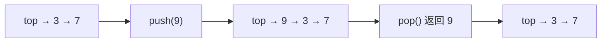

<div class="be-tutor-mount" data-tutor-lesson="cs-core-07" aria-hidden="true"></div>

<section id="overview-stack-output" class="be-page-hero be-lesson-hero" data-learning-context="overview-stack-output" data-context-type="overview" markdown="1">

<span class="be-lesson-kicker">共同算法基础 · 第 3 课 · 可追踪线性结构实验</span>

# 栈、LIFO 接口与空栈边界

## 最后放进去的 9，为什么先出来

```text
栈实验
push：7, 3, 9
top=9，size=3
pop=9
remaining(top->bottom)：3, 7
```

栈只开放一端。`7` 先进去，`9` 最后进去；下一次弹出时，能拿到的却是最靠近出口的 `9`。这就是 LIFO：Last In, First Out，后进先出。

[先看四次状态变化](#example-stack-trace){ .md-button .md-button--primary }
[直接运行小例子](#reproduce-stack-micro){ .md-button }

<div class="be-lesson-facts" markdown="1">
<span>课程位置<strong>共同算法基础 · 3 / 16</strong></span>
<span>前置<strong>单链表头部修改与节点所有权</strong></span>
<span>完成后留下<strong>LIFO 轨迹、下溢契约和双语言回归</strong></span>
</div>

</section>

## 开始前

- 能画出 `head -> 7 -> 3 -> 空`，并知道链表头部插入、删除是 `Θ(1)`。
- 知道空节点必须先检查再读取。
- 本课不要求先学递归或表达式求值；先把栈最小接口和状态顺序弄准。

<section id="concept-lifo-contract" data-learning-context="concept-lifo-contract" data-context-type="concept" markdown="1">

## 栈规定顺序，不规定材料

栈的核心接口只有三个：

| 操作 | 做什么 | 是否改变栈 |
| --- | --- | --- |
| `push(value)` | 把值放到栈顶 | 是，`size + 1` |
| `pop()` | 移除并返回栈顶 | 是，`size - 1` |
| `peek()` | 只查看栈顶 | 否 |

它可以用链表、动态数组，或其他满足契约的结构实现。Python `list` 的尾部操作、C++ `std::stack` 和本课的链式栈都能提供 LIFO，但“栈”说的是可用操作和顺序，不是某一种底层容器。

</section>

<section id="example-stack-trace" data-learning-context="example-stack-trace" data-context-type="example" markdown="1">

## 每一步都把栈顶写在最前面

<div class="be-stack-trace" role="img" aria-label="依次 push 7、push 3、pop、push 9，栈顶到栈底从 7 变成 3 7，再回到 7，最后变成 9 7">
  <div><strong>push 7</strong><code>[7]</code><span>size 1</span></div>
  <div><strong>push 3</strong><code>[3, 7]</code><span>size 2</span></div>
  <div><strong>pop → 3</strong><code>[7]</code><span>size 1</span></div>
  <div><strong>push 9</strong><code>[9, 7]</code><span>size 2</span></div>
</div>

这里所有序列都按 `top -> bottom` 写。若你习惯把最早进入的值写在左边，也可以画竖直栈，但一页里必须固定一种方向，否则很容易把 LIFO 看成 FIFO。

</section>

<section id="concept-head-as-top" data-learning-context="concept-head-as-top" data-context-type="concept" markdown="1">

## 让链表头直接充当栈顶

上一课已经证明链表头部操作只改固定数量的链接。这一课把两组接口对齐：

```text
stack.push(value)  <->  linked_list.push_front(value)
stack.pop()        <->  linked_list.pop_front()
stack.peek()       <->  读取 head.value
```

这样 `push`、`pop`、`peek` 都不需要遍历链表，成本为 `Θ(1)`。如果把栈顶放在没有尾入口的链表末端，每次压栈或弹栈都要先走到尾部，反而把简单接口做成 `Θ(n)`。

</section>

<section id="example-push-pop-links" data-learning-context="example-push-pop-links" data-context-type="example" markdown="1">

## `push` 和 `pop` 只是表头重连



`push(9)` 让新节点指向旧栈顶，再把 `top` 改到新节点。`pop()` 先保存旧栈顶值，再把 `top` 改到下一节点。后面的节点不移动，栈顶以外也没有公开的插入、删除入口。

</section>

<section id="concept-peek-observer" data-learning-context="concept-peek-observer" data-context-type="concept" markdown="1">

## `peek` 是观察，不是试着弹一下再放回去

`peek()` 只读取栈顶值。调用前后的 `top`、`size` 和元素顺序必须完全一样。

先 `pop()` 再 `push()` 看似能得到同一个值，却会执行两次修改，还可能改变对象身份、异常行为或并发语义。接口已经提供只读观察时，就直接实现只读操作。

</section>

<section id="concept-size-invariant" data-learning-context="concept-size-invariant" data-context-type="concept" markdown="1">

## 栈也要同时守住链接和计数

链式栈的规则比完整链表更窄：

1. `top` 为空当且仅当 `size == 0`。
2. 从 `top` 沿链接走到空节点，节点数等于 `size`。
3. `push` 只加一个节点，`pop` 只减一个节点，`peek` 不改变任何状态。

不要只测返回值。`pop()` 返回正确的 9，但忘记把 `size` 从 3 改成 2，下一次边界判断仍会出错。

</section>

<section id="reproduce-stack-micro" data-learning-context="reproduce-stack-micro" data-context-type="reproduce" markdown="1">

## 运行五行栈轨迹

```bash
.venv/bin/python site-src/examples/algorithm-foundation/linked_stack_trace.py
```

运行前先在纸上写出 `push 7、push 3、pop、push 9、peek` 后的序列和大小。程序输出应与上面的四张状态卡一致，最后一行是：

```text
peek -> 9 size=2
```

`peek` 后大小仍为 2，正好能抓住“查看时意外删除”的错误。

</section>

<section id="reproduce-bilingual-stack" data-learning-context="reproduce-bilingual-stack" data-context-type="reproduce" markdown="1">

## 在正式项目里对照 Python 和 C++

Python：

```bash
cd exercises/cs-core/traceable-linear-structures-lab/python
PYTHONPATH=src ../../../../.venv/bin/python -m unittest discover -s tests -v
PYTHONPATH=src ../../../../.venv/bin/python -m mypy --strict src tests
PYTHONPATH=src ../../../../.venv/bin/python -m traceable_linear_structures_lab stack
```

C++：

```bash
cd exercises/cs-core/traceable-linear-structures-lab/cpp
cmake -S . -B build -DCMAKE_BUILD_TYPE=Debug
cmake --build build --config Debug
ctest --test-dir build --build-config Debug --output-on-failure
./build/traceable_linear_structures_lab stack
```

`linked`、`stack`、`queue` 三种模式都要继续通过，Python 与 C++ 的报告逐字一致。C++ 还用编译期断言证明栈不可复制但可移动。

</section>

<section id="modify-stack-trace" data-learning-context="modify-stack-trace" data-context-type="modify" markdown="1">

## 换一串操作，再自己画一次

把小程序改成：

```text
push(4), push(4), push(8), pop(), peek(), push(2)
```

先预测每一步的返回值、`top -> bottom` 序列和 `size`，再运行。重复值不能合并：两个 `4` 是两次独立压栈；弹出 `8` 后，`peek()` 应看到后放进去的那个 `4`，但不改变大小。

</section>

<section id="modify-drain-stack" data-learning-context="modify-drain-stack" data-context-type="modify" markdown="1">

## 用 `drain_stack` 完整排空一份副本

`drain_stack(values)` 按输入顺序逐个压栈，再不断弹出直到为空：

```text
输入 [7, 3, 9]
压栈后 top -> bottom 为 [9, 3, 7]
返回 [9, 3, 7]
原输入仍是 [7, 3, 9]
```

请覆盖空输入、单元素、重复值和一般序列。函数应操作自己建立的栈，不能对调用方传来的列表或向量原地删改。

</section>

<section id="troubleshoot-underflow" data-learning-context="troubleshoot-underflow" data-context-type="troubleshoot" markdown="1">

## 空栈没有“默认栈顶”

对空栈调用 `pop()` 或 `peek()` 时，Python 抛 `IndexError`，C++ 抛 `std::out_of_range`。返回 `0` 并不安全，因为 `0` 完全可能是合法数据；静默忽略则会把上游状态错误藏起来。

异常发生在读取或重连之前。失败以后，栈仍然为空，随后 `push(7)`、`pop()` 应能正常返回 7。

</section>

<section id="troubleshoot-order" data-learning-context="troubleshoot-order" data-context-type="troubleshoot" markdown="1">

## 弹出 7 而不是 9，先查两件事

| 现象 | 常见原因 | 改法 |
| --- | --- | --- |
| 第一次 `pop` 返回 7 | 把栈顶放在链表尾，或按输入顺序输出 | 固定 `top == head`，输出按 top-to-bottom |
| `peek` 后少一个元素 | 复用了 `pop` | 只读 `top.value` |
| `drain_stack` 修改源列表 | 直接在输入上做删除 | 建立独立栈，再排空它 |
| 空栈时崩溃 | 读取空节点后才判断 | 在任何读取前检查 `top` |
| C++ 移动后源计数不为 0 | 只转移节点，未重置 `size_` | 同时转移入口和计数 |

</section>

<section id="project-linear-v02" data-learning-context="project-linear-v02" data-context-type="project" markdown="1">

## 线性结构实验增加一个受限接口

```text
上一版：公开单链表的 append、find、pop_front、remove_first
这一版：只公开 push、pop、peek、size、empty
共同底层：链表头部节点与单一所有权
共同报告：Python / C++ 固定输出
```

项目不是又写了一遍链表，而是展示“同一种表示怎样承载不同接口”。栈故意不开放按位置查找和中间删除，让调用方只能写出符合 LIFO 的程序。

[查看可追踪线性结构实验](../../exercises/cs-core/traceable-linear-structures-lab/README.md){ .md-button .md-button--primary }

</section>

<section id="deepen-stack-uses" data-learning-context="deepen-stack-uses" data-context-type="deepen" markdown="1">

## 后面哪些地方会再次看到栈

- 函数调用需要保存“返回以后从哪里继续”的上下文。
- 深度优先遍历可以用显式栈替代递归调用。
- 括号匹配和表达式求值会暂存尚未完成的符号或操作。
- 撤销操作会把最近一次变化放在最先恢复的位置。

这些场景都不是“看到序列就上栈”。先确认问题是否需要只从一端访问，以及最后进入的状态是否应该最先处理。

</section>

<section id="career-stack-evidence" data-learning-context="career-stack-evidence" data-context-type="career" markdown="1">

## 讲栈时，把接口和实现分开

可以先用 `push 7、3、9` 说明 LIFO，再说本项目为什么把链表头当栈顶，从而让三项核心操作都是 `Θ(1)`。接着补充栈也可以由动态数组实现，复杂度和失效特征取决于底层选择。

最后展示下溢异常、失败后状态、移动语义和 `drain_stack` 不修改输入的测试。这比只说“栈是后进先出”更能说明你知道怎样把抽象接口落成可靠实现。

</section>

## 完成检查

- [ ] 能根据一串 `push/pop/peek` 写出每一步 top-to-bottom 序列和大小。
- [ ] 能解释栈是接口，链表只是本课的实现选择。
- [ ] 能说明为什么把链表头作为栈顶后，三项核心操作都是 `Θ(1)`。
- [ ] `peek` 前后入口、大小和顺序完全不变。
- [ ] 空栈 `pop/peek` 明确失败，且失败后仍能继续使用。
- [ ] `drain_stack` 覆盖空、单元素、重复值和一般输入，并保持输入不变。
- [ ] Python 类型检查与单元测试、C++ 构建与 CTest、三种双语言报告全部通过。

## 来源与版本

| 来源 | 用于核查 | 版本或日期 |
| --- | --- | --- |
| [C++ 容器适配器](https://eel.is/c++draft/container.adaptors.general) | 受限接口与底层容器关系 | C++20 教学基线，2026-07-17 核查 |
| [C++ `stack`](https://eel.is/c++draft/stack) | LIFO 操作与接口边界 | C++20 教学基线，2026-07-17 核查 |
| [Python `list` 文档](https://docs.python.org/3.11/tutorial/datastructures.html#using-lists-as-stacks) | Python 中的栈式用法与操作方向 | Python 3.11，2026-07-17 核查 |

本地线性数据结构材料只用于检查 LIFO、栈顶和下溢的常见说法；状态轨迹、链式实现、报告和测试均由本项目独立编写。

## 下一步

进入[队列、FIFO 与首尾不变量](08-queue-fifo-head-tail-invariants.md)，在拥有链之外增加一个不拥有节点的尾入口，让入队和出队分别从两端完成。
