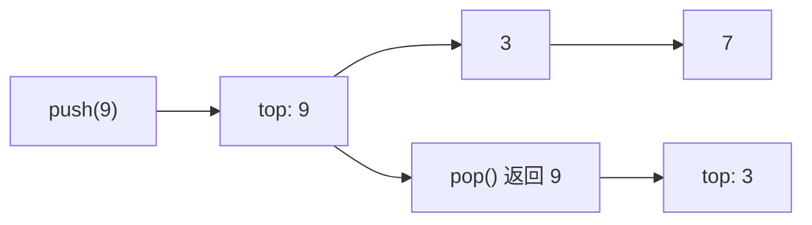

# 栈、LIFO 接口与空栈边界

<div class="be-tutor-mount" data-tutor-lesson="cs-core-07" aria-hidden="true"></div>

> **任务先行：** 用链表头实现后进先出的栈，观察三次压栈后的栈顶和弹出顺序；再迁移出一个不修改输入的完整排空函数。

## 任务路线

<div class="be-task-route" role="list" aria-label="本课六步任务"><span role="listitem">1 链表基线</span><span role="listitem">2 LIFO 契约</span><span role="listitem">3 链式栈</span><span role="listitem">4 状态追踪</span><span role="listitem">5 空栈失败</span><span role="listitem">6 排空迁移</span></div>

<section id="step-1" class="be-task-step" data-step-id="step-1" markdown="1">

## 第一步：运行链表基线与栈模式

先确认 `linked` 报告没有变化，再运行 `stack`。**当前任务：**观察压入 `7, 3, 9` 后栈顶为 9。**成功证据：**弹出 9 后从栈顶到栈底为 `3, 7`，双语言输出一致。

</section>

<section id="step-2" class="be-task-step" data-step-id="step-2" markdown="1">

## 第二步：定义 LIFO 接口契约

栈只承诺从同一端 `push`、`pop` 和 `peek`，不承诺随机访问。**主动修改：**写出每次操作后的栈顶到栈底序列。**成功证据：**最后压入的元素总是最先弹出，`peek` 不修改大小。

</section>

<section id="step-3" class="be-task-step" data-step-id="step-3" markdown="1">

## 第三步：用链表头实现栈

把栈顶映射为链表头，`push` 新建头节点，`pop` 移走头节点，`peek` 只读取头值。**当前任务：**验证三者不遍历链表。**成功证据：**`push`、`pop`、`peek` 都只触碰常量个节点，为 `Θ(1)`。

</section>

<section id="step-4" class="be-task-step" data-step-id="step-4" markdown="1">

## 第四步：追踪嵌套压栈和弹栈

依次执行 `push(7), push(3), pop(), push(9)`。**主动修改：**先预测每一步的栈顶和大小，再运行测试。**成功证据：**状态依次为 `[7]`、`[3,7]`、`[7]`、`[9,7]`，弹出值为 3。

</section>

<section id="step-5" class="be-task-step" data-step-id="step-5" markdown="1">

## 第五步：验证空栈安全失败

**安全失败实验：**分别对空栈调用 `pop` 和 `peek`。Python 抛 `IndexError`，C++ 抛 `std::out_of_range`。**恢复标准：**两次失败后大小仍为 0，随后 `push(7)` 可正常工作；禁止读取空节点。

</section>

<section id="step-6" class="be-task-step" data-step-id="step-6" markdown="1">

## 第六步：完成 `drain_stack` 迁移验收

接收一组值，按输入顺序压栈，再返回完整弹出序列。**约束：**不提供完整答案；不得修改调用方输入。**成功证据：**空输入返回空，`[7,3,9]` 返回 `[9,3,7]`，重复值和单元素也通过。

</section>

## 课程信息

| 项目 | 内容 |
| --- | --- |
| 前置 | [单链表、节点链接与所有权](06-singly-linked-list-nodes-ownership.md) |
| 环境 | Python 3.11+、C++20、CMake 3.20+；纯标准库 |
| 阶段作品 | [可追踪线性结构实验](../../exercises/cs-core/traceable-linear-structures-lab/README.md) |
| 可观察产出 | 栈顶、大小、LIFO 弹出序列和受控下溢 |
| 事实核查 | Python 与 C++ 标准资料，2026-07-16 |

## 接口和表示不是一回事



栈是操作受限的接口，可以由链表、动态数组或其他满足契约的结构实现。本实验选择链表头，是为了复用上一课已经证明的头部常量修改。Python `list.append/pop` 和 C++ `std::stack` 可以提供栈行为，但并不意味着“栈就是数组”或“栈就是链表”。

## 运行与输出

```bash
python -m traceable_linear_structures_lab stack
./build/traceable_linear_structures_lab stack
```

```text
栈实验
push：7, 3, 9
top=9，size=3
pop=9
remaining(top->bottom)：3, 7
```

## 为什么下溢必须是公开契约

空栈没有可返回的栈顶。使用哨兵值会与合法数据冲突，静默忽略又会隐藏状态错误，因此本实验使用异常。异常类型、标准输出不被污染、失败后状态不变，都是调用方可以依赖的执行契约。

## AI 协作任务

可让 AI 生成状态表或补测试，但学习者必须确认序列方向是“栈顶到栈底”、`peek` 不删除元素、空栈失败不返回伪造值，并检查 AI 是否把某种底层容器误写成栈的定义。

## 常见错误与排查

| 现象 | 原因 | 检查与恢复 |
| --- | --- | --- |
| 弹出 7 而不是 9 | 把栈顶放在链表尾 | 固定栈顶等于链表头 |
| `peek` 后大小减少 | 复用了删除逻辑 | 只读取头值，不移动链接 |
| 空栈返回 0 | 用哨兵掩盖下溢 | 改为公开异常并测状态 |
| `to_list` 顺序反了 | 按入栈顺序解释 | 明确结果按 top-to-bottom |
| 排空修改源列表 | 直接在输入上操作 | 先把值压入独立栈 |

## 完成证据

- `stack` 输出双语言逐字一致。
- `push`、`pop`、`peek` 为头部常量操作。
- 空栈两种操作均受控失败且状态不变。
- C++ 栈不可复制、可移动，不暴露节点指针。
- `drain_stack` 覆盖空、单元素、重复值并保持输入不变。

## 来源与版本

| 来源 | 用途 | 核查日期 |
| --- | --- | --- |
| [C++ 容器适配器](https://eel.is/c++draft/container.adaptors.general) | 适配器与底层容器关系 | 2026-07-16 |
| [C++ `stack`](https://eel.is/c++draft/stack) | LIFO 公开操作 | 2026-07-16 |
| [Python 内置序列](https://docs.python.org/3.11/library/stdtypes.html#sequence-types-list-tuple-range) | `list` 的可变序列边界 | 2026-07-16 |

本地线性数据结构材料只用于整理 LIFO、栈顶和下溢等概念候选；课程没有引入括号匹配、表达式求值或外部面试题。

## 下一步

进入[队列、FIFO 与首尾不变量](08-queue-fifo-head-tail-invariants.md)，在拥有链之外增加一个不拥有节点的尾部观察指针。
