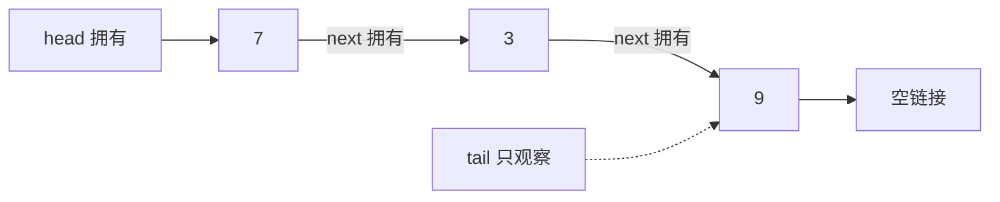

# 队列、FIFO 与首尾不变量

<div class="be-tutor-mount" data-tutor-lesson="cs-core-08" aria-hidden="true"></div>

> **任务先行：** 用拥有头节点和非拥有尾指针实现常量时间 FIFO 队列，完整验证空、单元素、多元素再回到空的状态转换。

## 任务路线

<div class="be-task-route" role="list" aria-label="本课六步任务"><span role="listitem">1 栈基线</span><span role="listitem">2 FIFO 契约</span><span role="listitem">3 首尾实现</span><span role="listitem">4 状态转换</span><span role="listitem">5 标准边界</span><span role="listitem">6 服务迁移</span></div>

<section id="step-1" class="be-task-step" data-step-id="step-1" markdown="1">

## 第一步：运行栈基线与队列模式

先确认 `stack` 输出没有变化，再运行 `queue`。**当前任务：**观察入队 `7, 3, 9` 后队首为 7、队尾为 9。**成功证据：**出队返回 7，剩余顺序为 `3, 9`，双语言输出一致。

</section>

<section id="step-2" class="be-task-step" data-step-id="step-2" markdown="1">

## 第二步：定义 FIFO 和首尾不变量

队列从尾部 `enqueue`、从头部 `dequeue`。空队列必须同时满足 `head` 与 `tail` 为空；非空时尾指针必须指向最后节点。**主动修改：**画出两次入队后的链接。**成功证据：**遍历顺序等于服务顺序，大小等于节点数。

</section>

<section id="step-3" class="be-task-step" data-step-id="step-3" markdown="1">

## 第三步：实现常量时间入队与出队

头节点拥有整条链，尾指针只用于快速定位最后节点。`enqueue` 接到尾后，`dequeue` 移走头。**当前任务：**确认操作不遍历链表。**成功证据：**入队、出队、读取首尾都只触碰常量个节点，为 `Θ(1)`。

</section>

<section id="step-4" class="be-task-step" data-step-id="step-4" markdown="1">

## 第四步：验证完整状态转换

执行空→入队 7→入队 3→出队 7→出队 3→再次入队 9。**主动修改：**每一步同时记录头、尾、大小。**成功证据：**删除最后一个元素后头尾都为空，再入队时头尾重新指向同一新节点。

</section>

<section id="step-5" class="be-task-step" data-step-id="step-5" markdown="1">

## 第五步：对照标准容器并安全失败

Python `collections.deque` 支持两端近似常量追加和弹出；C++ `std::queue` 是容器适配器。**安全失败实验：**对空队列调用 `dequeue`、`front`、`back`。**恢复标准：**Python 抛 `IndexError`，C++ 抛 `std::out_of_range`，三次失败后仍可正常入队。

</section>

<section id="step-6" class="be-task-step" data-step-id="step-6" markdown="1">

## 第六步：完成 `serve_until_empty` 迁移验收

接收一组值，依次入队并返回完整出队序列。**约束：**不提供完整答案；不得修改输入，禁止用 Python `list.pop(0)` 代替队列实现。**成功证据：**空、单元素、重复值和 `[7,3,9]` 均保持输入顺序。

</section>

## 课程信息

| 项目 | 内容 |
| --- | --- |
| 前置 | [栈、LIFO 接口与空栈边界](07-stack-lifo-interface-underflow.md) |
| 环境 | Python 3.11+、C++20、CMake 3.20+；纯标准库 |
| 阶段作品 | [可追踪线性结构实验](../../exercises/cs-core/traceable-linear-structures-lab/README.md) |
| 可观察产出 | FIFO 输出、首尾状态表、尾指针重置和受控下溢 |
| 事实核查 | Python 与 C++ 标准资料，2026-07-16 |

## 拥有头与观察尾



C++ 的 `tail` 不释放节点，也不形成第二条所有权链；它的有效期完全依赖 `head` 链。移动队列时要把头所有权、尾观察位置和大小一起转移，并把源对象重置为空。删除最后一个节点时若忘记清空 `tail`，它会变成悬空观察指针。

## 运行与输出

```bash
python -m traceable_linear_structures_lab queue
./build/traceable_linear_structures_lab queue
```

```text
队列实验
enqueue：7, 3, 9
front=7，back=9，size=3
dequeue=7
remaining(front->back)：3, 9
```

## 为什么不使用列表头部删除

Python `list` 是可变序列，删除第一个元素后通常需要移动后续元素，因此 `pop(0)` 为线性成本。`collections.deque` 才公开适合两端追加与弹出的接口。C++ `std::queue` 默认可适配 `deque`，但队列接口本身仍不等于某种具体容器。

## AI 协作任务

可让 AI 检查状态转换或生成表格，但学习者必须确认尾指针不拥有节点、最后一次出队会清空尾指针、移动后源对象仍满足空队列不变量，并拒绝把 `list.pop(0)` 写成常量操作。

## 常见错误与排查

| 现象 | 原因 | 检查与恢复 |
| --- | --- | --- |
| 第一次入队后头仍为空 | 只更新了尾 | 空队列入队同时设置头尾 |
| 清空后 `back()` 读取旧值 | 最后出队未清空尾 | 头变空时同步重置尾 |
| 入队需要遍历 | 没有维护尾指针 | 尾只观察最后节点 |
| 顺序变成后进先出 | 在同一端入队出队 | 固定尾入、头出 |
| Python 队列越来越慢 | 使用 `list.pop(0)` | 改用链式实现或 `deque` |

## 完成证据

- `queue` 输出双语言逐字一致。
- 空、单元素、多元素和重新入队状态全部通过。
- 删除最后一个元素后头尾同时为空。
- 空队列三种操作受控失败且不改变状态。
- `serve_until_empty` 保持 FIFO 和原输入不变。

## 来源与版本

| 来源 | 用途 | 核查日期 |
| --- | --- | --- |
| [Python `collections.deque`](https://docs.python.org/3.11/library/collections.html#collections.deque) | 两端操作与列表头部操作成本 | 2026-07-16 |
| [C++ 容器适配器](https://eel.is/c++draft/container.adaptors.general) | 队列接口和底层容器边界 | 2026-07-16 |
| [C++ `queue`](https://eel.is/c++draft/queue) | FIFO 公开操作与默认容器 | 2026-07-16 |
| [C++ `unique_ptr`](https://eel.is/c++draft/unique.ptr) | 头节点拥有链 | 2026-07-16 |

本地线性数据结构材料只用于审计队列定义和复杂度条件；没有读取或改写 recruiting raw 链表、栈队列题面。

## 下一步

线性结构基础闭环完成。下一课进入[哈希函数、键相等与冲突](09-hash-function-key-equality-collisions.md)；环形缓冲区、优先队列、排序和正式机考训练继续留在后续课程。
