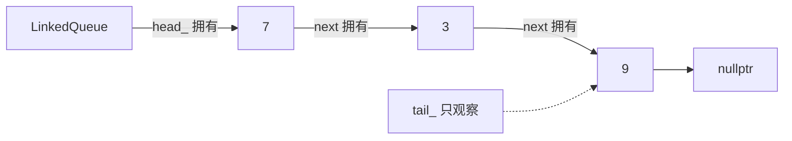

<div class="be-tutor-mount" data-tutor-lesson="cs-core-08" aria-hidden="true"></div>

<section id="overview-queue-output" class="be-page-hero be-lesson-hero" data-learning-context="overview-queue-output" data-context-type="overview" markdown="1">

<span class="be-lesson-kicker">共同算法基础 · 第 4 课 · 可追踪线性结构实验</span>

# 队列、FIFO 与首尾不变量

## 7 最早排队，所以 7 先离开

```text
队列实验
enqueue：7, 3, 9
front=7，back=9，size=3
dequeue=7
remaining(front->back)：3, 9
```

栈只用一端；队列把入口和出口分开。新值从队尾加入，旧值从队首离开。最早入队的 7 先被服务，这就是 FIFO：First In, First Out，先进先出。

[看懂首尾怎样变化](#example-queue-trace){ .md-button .md-button--primary }
[直接运行小例子](#reproduce-queue-micro){ .md-button }

<div class="be-lesson-facts" markdown="1">
<span>课程位置<strong>共同算法基础 · 4 / 16</strong></span>
<span>前置<strong>单链表所有权与栈的受限接口</strong></span>
<span>完成后留下<strong>FIFO 轨迹、首尾不变量和双语言回归</strong></span>
</div>

</section>

## 开始前

- 能解释栈为什么后进先出，并把链表头映射为栈顶。
- 知道 C++ `unique_ptr` 可以形成单一拥有链，裸指针可以只观察对象。
- 本课先做通用队列；环形缓冲区、线程安全队列和优先队列留到后面。

<section id="concept-fifo-contract" data-learning-context="concept-fifo-contract" data-context-type="concept" markdown="1">

## 队尾进，队首出

| 操作 | 位置 | 是否修改 |
| --- | --- | --- |
| `enqueue(value)` | 队尾 `back` | 加一个元素 |
| `dequeue()` | 队首 `front` | 移除并返回一个元素 |
| `front()` | 队首 | 只读 |
| `back()` | 队尾 | 只读 |

最早进入、还没有离开的元素，总由下一次 `dequeue()` 返回。队列规定服务顺序，不规定必须使用链表或 `deque`。

</section>

<section id="example-queue-trace" data-learning-context="example-queue-trace" data-context-type="example" markdown="1">

## 从空到单元素，再回到空

<div class="be-queue-trace" role="img" aria-label="队列从空开始，入队 7 时首尾都是 7，入队 3 后首为 7 尾为 3，出队两次后首尾重新为空">
  <div><strong>empty</strong><code>front — / back —</code><span>size 0</span></div>
  <div><strong>enqueue 7</strong><code>front 7 / back 7</code><span>size 1</span></div>
  <div><strong>enqueue 3</strong><code>front 7 / back 3</code><span>size 2</span></div>
  <div><strong>dequeue 两次</strong><code>front — / back —</code><span>size 0</span></div>
</div>

单元素状态最容易漏：`head` 和 `tail` 指向同一个节点。删除它以后，两者必须一起回到空；之后再次入队，新节点又同时成为首和尾。

</section>

<section id="concept-endpoint-invariants" data-learning-context="concept-endpoint-invariants" data-context-type="concept" markdown="1">

## 首尾必须一起讲

链式队列每次操作后都要满足：

1. 空队列：`head`、`tail` 都为空，`size == 0`。
2. 单元素：`head` 和 `tail` 指向同一节点，`size == 1`。
3. 多元素：`head` 指向最早值，`tail` 指向最后值，`tail.next` 为空。
4. 从 `head` 沿链接走到尾，节点数量等于 `size`。

只检查 `empty()` 不够。旧 `tail` 若没有清空，队列表面为空，下一次 `back()` 或入队仍可能访问已经失效的对象。

</section>

<section id="concept-owning-head-observing-tail" data-learning-context="concept-owning-head-observing-tail" data-context-type="concept" markdown="1">

## C++ 中，头拥有，尾只负责定位



`head_` 的 `unique_ptr` 链负责节点生命周期。`tail_` 是非拥有指针，只让程序快速找到最后节点；它不 `delete`，也不能形成第二条 `unique_ptr` 链。

移动队列时，头所有权、尾位置和 `size` 要一起交给目标；源队列恢复为空。

</section>

<section id="concept-constant-operations" data-learning-context="concept-constant-operations" data-context-type="concept" markdown="1">

## 多保存一个尾入口，换来常量入队

没有 `tail` 时，追加节点要从 `head` 走到链尾，是 `Θ(n)`。维护 `tail` 后：

- `enqueue`：把 `tail.next` 接到新节点，再移动 `tail`。
- `dequeue`：把 `head` 移到 `head.next`。
- `front/back`：直接读取两个入口。

四项操作都只触碰常量个节点，为 `Θ(1)`。代价是必须维护上一节没有的首尾同步规则。

</section>

<section id="example-last-dequeue" data-learning-context="example-last-dequeue" data-context-type="example" markdown="1">

## 最后一次出队要多做一件事

```text
出队前：head -> 7 <- tail
取出值：7
移动 head：head = 空
同步 tail：tail = 空
结果：size = 0
```

旧节点由拥有链释放以后，`tail` 若还保留它的地址，就成了悬空观察指针。判断 `head` 已为空后立即清空 `tail`，再返回取出的值。

</section>

<section id="reproduce-queue-micro" data-learning-context="reproduce-queue-micro" data-context-type="reproduce" markdown="1">

## 跑一遍完整首尾转换

```bash
.venv/bin/python site-src/examples/algorithm-foundation/linked_queue_trace.py
```

程序从空队列开始，依次入队 7、3，再出队到空，最后重新入队 9。重点看三行：单元素时首尾同为 7；清空时首尾同为 `None`；复用时首尾同为 9。

</section>

<section id="reproduce-bilingual-queue" data-learning-context="reproduce-bilingual-queue" data-context-type="reproduce" markdown="1">

## 在正式项目里核对三种模式

```bash
cd exercises/cs-core/traceable-linear-structures-lab/python
PYTHONPATH=src ../../../../.venv/bin/python -m unittest discover -s tests -v
PYTHONPATH=src ../../../../.venv/bin/python -m mypy --strict src tests
PYTHONPATH=src ../../../../.venv/bin/python -m traceable_linear_structures_lab queue
```

```bash
cd exercises/cs-core/traceable-linear-structures-lab/cpp
cmake -S . -B build -DCMAKE_BUILD_TYPE=Debug
cmake --build build --config Debug
ctest --test-dir build --build-config Debug --output-on-failure
./build/traceable_linear_structures_lab queue
```

Python 与 C++ 的 `linked`、`stack`、`queue` 报告都应逐字一致。C++ 测试还要证明移动后的源队列为空。

</section>

<section id="modify-queue-state" data-learning-context="modify-queue-state" data-context-type="modify" markdown="1">

## 换一串值，把首尾都记下来

执行 `enqueue(4)、enqueue(4)、dequeue()、enqueue(8)、dequeue()、dequeue()`。每一步先写出 `front`、`back`、`size`，再运行。

重复值不合并；第一次出队只移走先进入的那个 4。最后一次出队以后，首尾同时为空。

</section>

<section id="modify-serve-until-empty" data-learning-context="modify-serve-until-empty" data-context-type="modify" markdown="1">

## `serve_until_empty` 保持输入顺序

函数把输入逐项入队，再从头服务到空：

```text
输入 [7, 3, 9]
返回 [7, 3, 9]
原输入仍是 [7, 3, 9]
```

请覆盖空输入、单元素、重复值和一般序列。函数操作自己建立的队列，不删除调用方输入，也不使用 `list.pop(0)` 冒充队列。

</section>

<section id="troubleshoot-underflow" data-learning-context="troubleshoot-underflow" data-context-type="troubleshoot" markdown="1">

## 空队列的三种读取都要拒绝

空队列没有可返回的队首或队尾。`dequeue()`、`front()`、`back()` 在 Python 中抛 `IndexError`，在 C++ 中抛 `std::out_of_range`。

三次失败都发生在读取节点前，状态保持为空；随后入队 7，四项正常操作仍应可用。

</section>

<section id="troubleshoot-endpoints" data-learning-context="troubleshoot-endpoints" data-context-type="troubleshoot" markdown="1">

## 队列顺序或首尾不对时

| 现象 | 常见原因 | 改法 |
| --- | --- | --- |
| 第一次入队后 `head` 仍为空 | 只更新了 `tail` | 空队列入队同时设置首尾 |
| 清空后 `back()` 读到旧值 | 最后出队没清 `tail` | `head` 变空时同步清尾 |
| 入队越来越慢 | 没有维护尾入口 | 用 `tail` 直接定位链尾 |
| 顺序变成后进先出 | 同一端入队、出队 | 固定尾入、头出 |
| Python 数据越多越慢 | 使用 `list.pop(0)` | 改用链式队列或 `collections.deque` |

</section>

<section id="project-linear-v03" data-learning-context="project-linear-v03" data-context-type="project" markdown="1">

## 线性结构实验完成第一个小闭环

```text
单链表：节点链接、查找 visits、局部重连
栈：同一端 push / pop，LIFO
队列：尾入头出，FIFO，head 拥有 + tail 观察
共同保证：双语言固定输出、下溢、移动与输入不变
```

三节课没有把所有接口揉成一个“大容器”。它们共用节点知识，却各自保留清晰的操作边界，便于后续选择结构而不是只背名字。

[查看可追踪线性结构实验](../../exercises/cs-core/traceable-linear-structures-lab/README.md){ .md-button .md-button--primary }

</section>

<section id="deepen-standard-queues" data-learning-context="deepen-standard-queues" data-context-type="deepen" markdown="1">

## 标准库已经有队列，为什么还要写一遍

Python `collections.deque` 适合两端追加和弹出；C++ `std::queue` 用底层容器适配出 FIFO 接口。正式业务通常优先使用这些经过验证的实现。

本课手写链式队列，是为了看清尾入口如何改变复杂度、非拥有指针何时失效，以及空—单元素—多元素状态怎样转换。理解实现后，使用标准库时也更知道自己依赖了什么。

</section>

<section id="career-queue-evidence" data-learning-context="career-queue-evidence" data-context-type="career" markdown="1">

## 讲队列时，别漏掉最后一次出队

先用 7、3、9 说明 FIFO，再解释为何头出尾入、维护 `tail` 后两端操作都是 `Θ(1)`。C++ 实现里，`head_` 的 `unique_ptr` 链拥有节点，`tail_` 只观察最后位置。

最值得讲的边界是删除唯一节点：必须同时清空首尾。再补上三种下溢、清空后复用、移动后源对象和输入不变测试，整个实现才闭合。

</section>

## 完成检查

- [ ] 能根据一串入队、出队写出每一步 `front`、`back` 和 `size`。
- [ ] 能说明队列是 FIFO 接口，不等于某一种底层容器。
- [ ] 能解释 `head_` 拥有节点、`tail_` 只观察节点。
- [ ] 能说明为什么维护尾入口后，入队和出队都是 `Θ(1)`。
- [ ] 删除最后节点后首尾同时为空，清空后还能重新入队。
- [ ] 三种空队列操作明确失败，`serve_until_empty` 保持输入与输出顺序。
- [ ] Python 类型检查与单元测试、C++ 构建与 CTest、三种双语言报告全部通过。

## 来源与版本

| 来源 | 用于核查 | 版本或日期 |
| --- | --- | --- |
| [Python `collections.deque`](https://docs.python.org/3.11/library/collections.html#collections.deque) | 两端操作与 `list.pop(0)` 的选择边界 | Python 3.11，2026-07-17 核查 |
| [C++ 容器适配器](https://eel.is/c++draft/container.adaptors.general) | 队列接口与底层容器关系 | C++20 教学基线，2026-07-17 核查 |
| [C++ `queue`](https://eel.is/c++draft/queue) | FIFO 公开操作 | C++20 教学基线，2026-07-17 核查 |
| [C++ `unique_ptr`](https://eel.is/c++draft/unique.ptr) | 头节点单一拥有链 | C++20 教学基线，2026-07-17 核查 |

本地线性结构材料只用于检查队列定义和复杂度条件；状态轨迹、首尾模型、报告和测试均由本项目独立编写。

## 下一步

线性结构的第一轮闭环完成。下一课进入[哈希函数、键相等与冲突](09-hash-function-key-equality-collisions.md)，从“沿链接逐个找”转向“先用键计算桶位置”。
