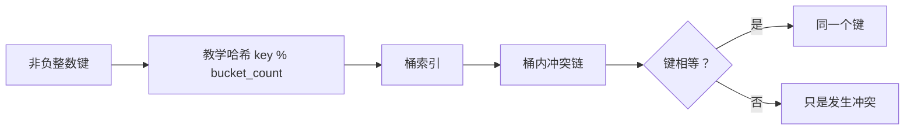

# 哈希函数、键相等与冲突

<div class="be-tutor-mount" data-tutor-lesson="cs-core-09" aria-hidden="true"></div>

> **任务先行：** 用公开的取模教学哈希把非负整数键映射到桶，并把“同桶”与“相等”分开验证。

## 任务路线

<div class="be-task-route" role="list" aria-label="本课六步任务"><span role="listitem">1 双基线</span><span role="listitem">2 哈希契约</span><span role="listitem">3 桶索引</span><span role="listitem">4 冲突追踪</span><span role="listitem">5 安全失败</span><span role="listitem">6 首冲突迁移</span></div>

<section id="step-1" class="be-task-step" data-step-id="step-1" markdown="1">

## 第一步：锁定队列与哈希基线

先运行上一课 `queue`，再运行新实验 `hash`。**当前任务：**保存两份标准输出。**成功证据：**旧队列报告不变，新报告把 `1,5,9` 映射到桶 1，并显示第二次插入开始发生冲突。

</section>

<section id="step-2" class="be-task-step" data-step-id="step-2" markdown="1">

## 第二步：定义哈希与键相等契约

本实验固定 `hash(key) = key % bucket_count`。相等键必须得到相同哈希；相同哈希只说明候选桶相同，仍须比较键。**主动修改：**列出键 1、5、9、2 在 4 个桶中的结果。**成功证据：**能解释 1 与 5 不相等但发生冲突。

</section>

<section id="step-3" class="be-task-step" data-step-id="step-3" markdown="1">

## 第三步：实现 `bucket_index`

检查桶数为正、键非负，再返回余数。**当前任务：**为首桶、末桶和大键补测试。**成功证据：**返回值始终满足 `0 <= bucket < bucket_count`，不靠数组越界发现输入错误。

</section>

<section id="step-4" class="be-task-step" data-step-id="step-4" markdown="1">

## 第四步：追踪冲突链

`BucketEvent` 保存键、桶号、插入前链长和是否冲突。**主动修改：**把输入改为 `[0,4,8]`。**成功证据：**三项都进入桶 0，`chain_before` 依次为 0、1、2；原输入顺序保持不变。

</section>

<section id="step-5" class="be-task-step" data-step-id="step-5" markdown="1">

## 第五步：执行安全失败实验

分别传入 0、负桶数和负键；Python 再尝试把列表放入原生 `set`。**恢复标准：**教学接口抛 `ValueError`／`std::invalid_argument`，Python 不可哈希列表抛 `TypeError`；失败发生在状态修改前。

</section>

<section id="step-6" class="be-task-step" data-step-id="step-6" markdown="1">

## 第六步：完成 `first_collision` 迁移验收

按输入顺序返回第一个 `collision=True` 的事件，没有冲突则返回空值。**约束：**不提供完整答案；必须复用追踪契约。**成功证据：**覆盖空输入、无冲突、首个冲突和多重冲突。

</section>

## 课程信息

| 项目 | 内容 |
| --- | --- |
| 前置 | [队列、FIFO 与首尾不变量](08-queue-fifo-head-tail-invariants.md) |
| 环境 | Python 3.11+、C++20、CMake 3.20+；纯标准库 |
| 阶段作品 | [可追踪哈希实验](../../exercises/cs-core/traceable-hash-lab/README.md) |
| 可观察产出 | 桶号、冲突前链长、确定性桶链和受控失败 |
| 事实核查 | 本地误区审计与官方资料，2026-07-16 |

## 键如何进入桶



## 运行与输出

```bash
python -m traceable_hash_lab hash
./build/traceable_hash_lab hash
```

```text
可追踪哈希实验
bucket_count=4
key | bucket | chain_before | collision
1 | 1 | 0 | no
5 | 1 | 1 | yes
9 | 1 | 2 | yes
2 | 2 | 0 | no
buckets：0=[] 1=[1, 5, 9] 2=[2] 3=[]
```

这个取模函数是课程公开模型，不是 Python 或 C++ 标准容器的实现声明。真实容器还会组合键类型的哈希、桶策略和实现细节；课程只用固定模型建立可复现的冲突证据。

## AI 协作任务

可让 AI 生成边界测试或解释冲突，但学习者必须逐项确认：桶数检查先于取模、负键被主动拒绝、同桶不等于相等、事件中的链长发生在插入之前。

## 常见错误与排查

| 现象 | 原因 | 检查与恢复 |
| --- | --- | --- |
| 除零或索引异常 | 未先验证桶数 | 在取模前拒绝非正桶数 |
| 把冲突键覆盖 | 把同桶误当相等 | 桶内继续比较完整键 |
| 负键跨语言结果混乱 | 直接依赖余数差异 | 教学接口统一拒绝负键 |
| 链长晚一位 | 先插入再记录 | 先记录 `chain_before` |
| 声称标准库也用取模 | 混淆模型与实现 | 只把它称为确定性教学哈希 |

## 完成证据

- Python 与 C++ `hash` 输出逐字一致。
- 非正桶数与负键均受控失败。
- 桶索引范围、链长和首个冲突有精确测试。
- 能解释“相等推出同哈希，反向不成立”。
- `first_collision` 完成空值和顺序验收。

## 来源与版本

| 来源 | 用途 | 核查日期 |
| --- | --- | --- |
| [MIT 6.006 哈希讲义](https://ocw.mit.edu/courses/6-006-introduction-to-algorithms-spring-2020/resources/mit6_006s20_lec4/) | 哈希、冲突和期望性能条件 | 2026-07-16 |
| [Open Data Structures](https://www.opendatastructures.org/ods-python.pdf) | 哈希表表示与冲突处理 | 2026-07-16 |
| [Python 数据模型](https://docs.python.org/3.11/reference/datamodel.html) | 可哈希对象与相等契约 | 2026-07-16 |
| [C++ 无序关联容器要求](https://eel.is/c++draft/unord.req.general) | 等价键、哈希与桶接口边界 | 2026-07-16 |

本地 JavaGuide 哈希页只用于检查冲突、负载与扩容的概念候选和过度概括；课程没有复制正文、图片、题目，也没有把 Java `HashMap` 的阈值或树化规则写成通用事实。

## 下一步

进入[分离链接、负载因子与扩容](10-separate-chaining-load-factor-rehash.md)，把静态桶链升级为可插入、更新、查询和删除的表。
