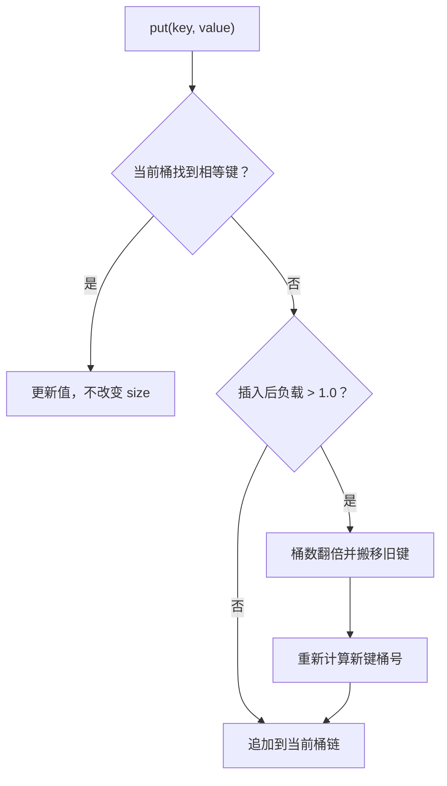

# 分离链接、负载因子与扩容

<div class="be-tutor-mount" data-tutor-lesson="cs-core-10" aria-hidden="true"></div>

> **任务先行：** 实现可追踪分离链接哈希表，用键比较次数、负载因子和搬移数证明每次操作发生了什么。

## 任务路线

<div class="be-task-route" role="list" aria-label="本课六步任务"><span role="listitem">1 哈希基线</span><span role="listitem">2 桶链结构</span><span role="listitem">3 插入更新</span><span role="listitem">4 查询计数</span><span role="listitem">5 负载扩容</span><span role="listitem">6 删除迁移</span></div>

<section id="step-1" class="be-task-step" data-step-id="step-1" markdown="1">

## 第一步：运行哈希基线与表模式

先保存 `hash` 报告，再运行 `table`。**当前任务：**确认前四个键填满 4 个桶容量边界，第五个新键触发 4→8。**成功证据：**搬移数为 4，所有旧键扩容后仍可查询。

</section>

<section id="step-2" class="be-task-step" data-step-id="step-2" markdown="1">

## 第二步：建立桶链结构

每个桶保存按插入顺序排列的键值对。**主动修改：**把 1、5、9 放入 4 桶表。**成功证据：**它们在桶 1 的顺序为 1→5→9，大小只统计键值对而不是桶。

</section>

<section id="step-3" class="be-task-step" data-step-id="step-3" markdown="1">

## 第三步：实现插入与更新

`put` 先在当前桶比较键；命中则更新值，不增加大小、不预先扩容。**当前任务：**连续写入 `5=50`、`5=55`。**成功证据：**第二次返回 `inserted=no`，大小不变，查询得到 55。

</section>

<section id="step-4" class="be-task-step" data-step-id="step-4" markdown="1">

## 第四步：追踪查询比较次数

从桶链头部逐项比较，命中即停止；缺失则比较完整条链。**主动修改：**分别查询 1、9、13。**成功证据：**报告能区分桶索引成本和键相等比较次数，不把整个操作简写为固定一步。

</section>

<section id="step-5" class="be-task-step" data-step-id="step-5" markdown="1">

## 第五步：观察负载因子与扩容

本实验最大负载因子固定为 1.0。新键使 `(size+1)/bucket_count > 1.0` 时桶数翻倍并重新映射旧键。**安全边界：**更新已有键不能触发扩容。**成功证据：**单次搬移为 `Θ(n)`，但扩容后每个键可查询且大小不变。

</section>

<section id="step-6" class="be-task-step" data-step-id="step-6" markdown="1">

## 第六步：完成 `erase` 迁移验收

在目标桶按顺序比较并删除首个相等键。**约束：**不提供完整答案；返回删除结果、桶号和比较次数。**成功证据：**头中尾删除、缺失删除、全冲突桶和失败不变性全部通过。

</section>

## 课程信息

| 项目 | 内容 |
| --- | --- |
| 前置 | [哈希函数、键相等与冲突](09-hash-function-key-equality-collisions.md) |
| 阶段作品 | [可追踪哈希实验](../../exercises/cs-core/traceable-hash-lab/README.md) |
| 核心契约 | `TraceableHashMap` 的插入、更新、查询、删除、负载和排序快照 |
| 复杂度边界 | 期望常量成本需要分布与负载假设；最坏仍为 `Θ(n)` |
| 事实核查 | 算法讲义与标准容器要求，2026-07-16 |

## 插入与扩容链路



## 运行与输出

```bash
python -m traceable_hash_lab table
./build/traceable_hash_lab table
```

```text
分离链接哈希表
put 1=10：inserted=yes，bucket=1，comparisons=0
put 5=50：inserted=yes，bucket=1，comparisons=1
put 9=90：inserted=yes，bucket=1，comparisons=2
put 2=20：inserted=yes，bucket=2，comparisons=0
put 13=130：inserted=yes，bucket=5，comparisons=1，rehash=4->8，moved=4
get 9：value=90，bucket=1，comparisons=2
size=5，buckets=8，load_factor=0.625
```

负载因子是 `size / bucket_count`，不是“已使用桶数量”的比例。较低负载也不能保证没有冲突；如果键集中到同一桶，查询仍可能扫描整条链。因此只能在哈希分布和负载受控的假设下讨论期望常量成本。

## AI 协作任务

可让 AI 列出扩容前后桶表，但学习者必须复算每个桶号、键比较次数和搬移数，并确认更新路径在负载检查之前结束。

## 常见错误与排查

| 现象 | 原因 | 检查与恢复 |
| --- | --- | --- |
| 更新后大小加一 | 未先比较完整键 | 命中时只替换值 |
| 恰好负载 1.0 就扩容 | 使用了 `>=` | 仅在插入后 `> 1.0` 扩容 |
| 扩容后查不到旧键 | 只复制桶号未重算 | 用新桶数重新映射每个键 |
| 比较次数不稳定 | 桶链顺序不固定 | 保持插入和搬移顺序 |
| 声称所有操作最坏 O(1) | 忽略全冲突链 | 明确最坏 `Θ(n)` |

## 完成证据

- 插入、更新、成功与缺失查询的比较次数精确。
- 负载边界、4→8 扩容和搬移 4 项可复现。
- 扩容后所有键值和大小正确。
- `erase` 成功、缺失和状态不变性通过。
- Python 与 C++ `table` 输出逐字一致。

## 来源与版本

| 来源 | 用途 | 核查日期 |
| --- | --- | --- |
| [MIT 6.006 哈希讲义](https://ocw.mit.edu/courses/6-006-introduction-to-algorithms-spring-2020/resources/mit6_006s20_lec4/) | 分离链接、负载与性能假设 | 2026-07-16 |
| [Open Data Structures](https://www.opendatastructures.org/ods-python.pdf) | 桶链与扩容分析 | 2026-07-16 |
| [C++ 无序关联容器要求](https://eel.is/c++draft/unord.req.general) | 平均/最坏复杂度与桶接口 | 2026-07-16 |
| [C++ 容器要求](https://eel.is/c++draft/container.requirements) | 容器操作契约与失效边界 | 2026-07-16 |

本课的 1.0 阈值和倍增规则只属于阶段作品；没有把 Java、Python 或 C++ 某一实现的默认阈值、树化或增长策略当作标准保证。

## 下一步

进入[集合去重、频次映射与稳定输出](11-set-frequency-map-deterministic-output.md)，把哈希结构用于可验证的数据处理任务。
