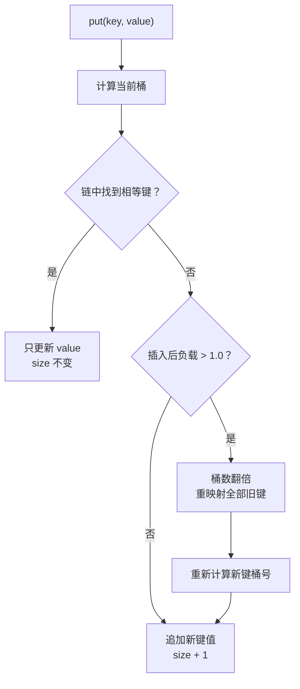

<div class="be-tutor-mount" data-tutor-lesson="cs-core-10" aria-hidden="true"></div>

<section id="overview-table-output" class="be-page-hero be-lesson-hero" data-learning-context="overview-table-output" data-context-type="overview" markdown="1">

<span class="be-lesson-kicker">共同算法基础 · 第 6 课 · 可追踪哈希实验</span>

# 分离链接、负载因子与扩容

## 前四个键没有扩容，第五个 13 为什么搬了四项

```text
put 1  bucket=1 comparisons=0 rehash=-
put 5  bucket=1 comparisons=1 rehash=-
put 9  bucket=1 comparisons=2 rehash=-
put 2  bucket=2 comparisons=0 rehash=-
put 13 bucket=5 comparisons=1 rehash=4->8 moved=4
size=5 buckets=8 load=0.625
```

表里有 4 个键、4 个桶时，负载正好是 1.0，还没有超过本项目的阈值。第 5 个新键准备加入时，表先把桶数翻到 8，并用新桶数重新计算四个旧键的位置；这就是 rehash。

[看懂插入和扩容分支](#example-put-flow){ .md-button .md-button--primary }
[直接运行小例子](#reproduce-table-micro){ .md-button }

<div class="be-lesson-facts" markdown="1"><span>课程位置<strong>共同算法基础 · 6 / 16</strong></span><span>前置<strong>桶路由、键相等与冲突事件</strong></span><span>完成后留下<strong>比较次数、扩容轨迹和删除回归</strong></span></div>

</section>

## 开始前

- 能解释同桶不等于键相等，并读懂 `chain_before`。
- 知道 `size` 是元素数，`bucket_count` 是桶数。
- 本项目固定最大负载 1.0、桶数翻倍；它们是公开实验规则，不是标准库默认值。

<section id="concept-separate-chaining" data-learning-context="concept-separate-chaining" data-context-type="concept" markdown="1">

## 每个桶保存一条键值对链

上一课桶里只有键；现在每项变成 `(key, value)`。1、5、9 在四桶表中仍进入桶 1：

```text
bucket 1: (1,10) -> (5,50) -> (9,90)
```

查找先算桶号，再沿链比较完整键。键相同就命中对应值；键不同即使同桶也继续向后。

</section>

<section id="concept-size-buckets-load" data-learning-context="concept-size-buckets-load" data-context-type="concept" markdown="1">

## 三个数字不要混在一起

- `size`：不同键的数量。
- `bucket_count`：桶的数量，包括空桶。
- `load_factor = size / bucket_count`。

4 个桶保存 3 个键时，`size=3`、`bucket_count=4`、`load_factor=0.75`。负载不是“非空桶占比”；三个键即使都挤在一个桶，负载仍是 0.75。

</section>

<section id="example-put-flow" data-learning-context="example-put-flow" data-context-type="example" markdown="1">

## `put` 先找旧键，再决定是否扩容



更新路径必须在负载检查前结束，否则改写已有值也可能无端触发扩容。

</section>

<section id="concept-update-vs-insert" data-learning-context="concept-update-vs-insert" data-context-type="concept" markdown="1">

## 更新不等于再插入一个键

连续执行 `put(5, 50)`、`put(5, 55)`：第二次在桶链中找到键 5，只替换值，返回 `inserted=false`。`size` 不增加，也不检查“再放一个键会不会超负载”。

测试同时核对 `get(5)==55`、大小不变和桶数量不变，避免只看返回标记。

</section>

<section id="example-comparisons" data-learning-context="example-comparisons" data-context-type="example" markdown="1">

## 比较次数只数桶内键比较

在桶链 `(1,10) -> (5,50) -> (9,90)` 中：

| 操作 | 比较过程 | comparisons |
| --- | --- | ---: |
| `get(1)` | 1 命中 | 1 |
| `get(9)` | 1、5、9 命中 | 3 |
| `get(13)` | 1、5、9 都不等 | 3 |

桶索引计算和键相等比较是两类成本。本项目把后者单独记录，便于看见冲突链变长后的影响。

</section>

<section id="concept-load-boundary" data-learning-context="concept-load-boundary" data-context-type="concept" markdown="1">

## 恰好 1.0 不扩容，严格超过才扩容

判断的是新键插入后的负载：

```python
if size + 1 > bucket_count * 1.0:
    rehash(bucket_count * 2)
```

四桶表的第 4 个不同键使负载等于 1.0，不扩容；第 5 个不同键会变成 1.25，因此先扩到 8 桶。已有键更新不进入这段判断。

</section>

<section id="example-rehash-movement" data-learning-context="example-rehash-movement" data-context-type="example" markdown="1">

## 桶数变化以后，旧桶号不能照搬

<div class="be-rehash-trace" role="img" aria-label="四桶扩展到八桶后，键1仍在桶1，键5移到桶5，键9在桶1，键2在桶2，然后键13进入桶5">
  <div><strong>key 1</strong><span>1 → 1</span></div>
  <div><strong>key 5</strong><span>1 → 5</span></div>
  <div><strong>key 9</strong><span>1 → 1</span></div>
  <div><strong>key 2</strong><span>2 → 2</span></div>
  <div data-new="true"><strong>key 13</strong><span>new → 5</span></div>
</div>

`5 % 4 == 1`，但 `5 % 8 == 5`。扩容必须遍历全部旧键，用新桶数重新路由；`moved=4` 记录这次线性搬移。

</section>

<section id="reproduce-table-micro" data-learning-context="reproduce-table-micro" data-context-type="reproduce" markdown="1">

## 运行五次插入轨迹

```bash
.venv/bin/python site-src/examples/algorithm-foundation/hash_table_growth.py
```

运行前预测每次比较次数和第 5 次的目标桶。最后应得到 `size=5 buckets=8 load=0.625`。若 moved 不是 4，先检查扩容发生在新键真正插入之前还是之后。

</section>

<section id="reproduce-bilingual-table" data-learning-context="reproduce-bilingual-table" data-context-type="reproduce" markdown="1">

## 回到双语言阶段作品

```bash
cd exercises/cs-core/traceable-hash-lab/python
PYTHONPATH=src ../../../../.venv/bin/python -m unittest discover -s tests -v
PYTHONPATH=src ../../../../.venv/bin/python -m mypy --strict src tests
PYTHONPATH=src ../../../../.venv/bin/python -m traceable_hash_lab table
```

```bash
cd exercises/cs-core/traceable-hash-lab/cpp
cmake -S . -B build -DCMAKE_BUILD_TYPE=Debug
cmake --build build --config Debug
ctest --test-dir build --build-config Debug --output-on-failure
./build/traceable_hash_lab table
```

三种模式全部回归，Python 与 C++ 输出逐字一致。扩容后还要逐个查询 1、5、9、2、13，不能只检查桶数变成 8。

</section>

<section id="modify-update-boundary" data-learning-context="modify-update-boundary" data-context-type="modify" markdown="1">

## 在负载边界上更新已有键

建立 2 桶表，依次放入 `0=0`、`2=20`，此时负载正好 1.0。再执行 `put(2, 22)`：

- 应返回 `inserted=false`。
- `size` 仍为 2。
- 桶数仍为 2。
- `get(2)` 返回 22。

这组数据专门检查更新路径是否错误地落入扩容分支。

</section>

<section id="modify-erase" data-learning-context="modify-erase" data-context-type="modify" markdown="1">

## 删除时也要记录比较了几次

`erase(key)` 只访问目标桶，按顺序比较并删除相等键，返回 `removed、bucket、comparisons`。

请覆盖桶链头、中、尾和缺失键。删除成功只让 `size` 减 1；缺失删除必须保持桶链、大小和值快照不变。

</section>

<section id="troubleshoot-rehash" data-learning-context="troubleshoot-rehash" data-context-type="troubleshoot" markdown="1">

## 扩容后查不到旧键

| 现象 | 常见原因 | 改法 |
| --- | --- | --- |
| 键 5 仍留在桶 1 | 复制了旧桶号 | 对每个旧键重新 `% new_bucket_count` |
| 恰好负载 1.0 就扩容 | 使用 `>=` | 项目规则是严格 `>` |
| 更新 5 导致扩容 | 先做负载判断 | 先查找并更新，命中立即返回 |
| `moved` 多一项 | 把新键也算成旧项 | 搬移数等于扩容前 `size` |
| 比较次数忽高忽低 | 搬移时改变链顺序 | 保持确定性遍历与追加顺序 |

</section>

<section id="project-hash-v02" data-learning-context="project-hash-v02" data-context-type="project" markdown="1">

## 哈希实验开始保存键值并改变容量

```text
上一版：键 → 桶事件 → 冲突链
这一版：键值链 → put/get/erase → 比较次数
                     ↘ load_factor → rehash → moved
```

表实现没有冒充标准库容器。它把插入、更新、缺失、负载和搬移写成可回放事件，为下一课的集合、频次和稳定输出提供底层理解。

[查看可追踪哈希实验](../../exercises/cs-core/traceable-hash-lab/README.md){ .md-button .md-button--primary }

</section>

<section id="deepen-complexity" data-learning-context="deepen-complexity" data-context-type="deepen" markdown="1">

## 受控负载仍不等于没有长链

负载因子限制平均每桶元素数，却不能单独保证分布均匀。若许多键都落到一个桶，查询仍可能比较 `n` 次；rehash 单次也要搬移 `n` 个旧键。

因此插入、查询、删除的期望常量成本依赖哈希分布和负载假设，最坏仍可达 `Θ(n)`。讨论性能时要把分析口径说清楚。

</section>

<section id="career-table-evidence" data-learning-context="career-table-evidence" data-context-type="career" markdown="1">

## 用第 5 个键讲清 rehash

可以从四桶已有四键说起：负载等于 1.0，不扩容；插入第 5 个不同键会超过阈值，于是扩成 8 桶并重新计算四个旧键的位置。键 5 从桶 1 移到桶 5，是最直观的证据。

再补充已有键更新不会增大 `size`，缺失删除不改状态，以及长冲突链和单次搬移的最坏线性成本。这样既说明算法，也说明接口边界。

</section>

## 完成检查

- [ ] 能区分 `size`、`bucket_count`、非空桶数和 `load_factor`。
- [ ] 更新已有键只改值，不增大表、不触发扩容。
- [ ] 能按桶链顺序计算成功与缺失查询的比较次数。
- [ ] 能解释为什么第 4 个键不扩容、第 5 个新键触发 4→8。
- [ ] rehash 对全部旧键重新计算桶号，并保持所有值可查询。
- [ ] `erase` 覆盖头中尾与缺失，失败不改变状态。
- [ ] Python 类型检查与单元测试、C++ 构建与 CTest、三种双语言报告全部通过。

## 来源与版本

| 来源 | 用于核查 | 版本或日期 |
| --- | --- | --- |
| [MIT 6.006 哈希讲义](https://ocw.mit.edu/courses/6-006-introduction-to-algorithms-spring-2020/resources/mit6_006s20_lec4/) | 分离链接、负载与性能假设 | 2020 课程，2026-07-17 核查 |
| [Open Data Structures](https://www.opendatastructures.org/ods-python.pdf) | 桶链与扩容分析 | 2026-07-17 核查 |
| [C++ 无序关联容器要求](https://eel.is/c++draft/unord.req.general) | 平均、最坏复杂度与桶接口 | C++20 教学基线，2026-07-17 核查 |

本课的 1.0 阈值和倍增规则只属于阶段作品；没有把 Java、Python 或 C++ 某个实现的默认阈值和增长策略当成标准保证。

## 下一步

进入[集合去重、频次映射与稳定输出](11-set-frequency-map-deterministic-output.md)，把哈希能力用于首个重复、保序去重和频次统计。
