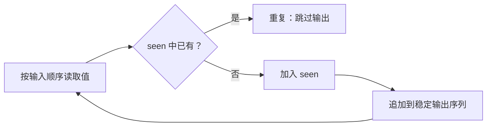

# 集合去重、频次映射与稳定输出

<div class="be-tutor-mount" data-tutor-lesson="cs-core-11" aria-hidden="true"></div>

> **任务先行：** 用集合回答“是否见过”，用映射记录频次，并主动建立不依赖无序容器遍历顺序的输出契约。

## 任务路线

<div class="be-task-route" role="list" aria-label="本课六步任务"><span role="listitem">1 哈希表基线</span><span role="listitem">2 集合与映射</span><span role="listitem">3 首重复值</span><span role="listitem">4 频次映射</span><span role="listitem">5 无序边界</span><span role="listitem">6 保序去重</span></div>

<section id="step-1" class="be-task-step" data-step-id="step-1" markdown="1">

## 第一步：运行哈希表与应用基线

先运行 `table`，再运行 `applications`。**当前任务：**确认输入 `[7,3,7,9,3]` 的首个重复值为 7。**成功证据：**访问 3 项时命中，保序唯一序列为 7、3、9。

</section>

<section id="step-2" class="be-task-step" data-step-id="step-2" markdown="1">

## 第二步：区分集合与映射

集合只回答成员关系，映射为键关联值。**主动修改：**分别写出“是否见过 7”和“7 出现几次”所需状态。**成功证据：**不会为了计数只用集合，也不会把映射的值误当重复键。

</section>

<section id="step-3" class="be-task-step" data-step-id="step-3" markdown="1">

## 第三步：查找首个重复值

从左到右扫描：先查集合，若已存在则返回值和访问次数，否则加入集合。**当前任务：**测试无重复、第二项重复和末项重复。**成功证据：**访问次数按输入位置确定，空输入返回空值和 0。

</section>

<section id="step-4" class="be-task-step" data-step-id="step-4" markdown="1">

## 第四步：构建频次映射

每遇到一个值就把映射计数加一，最后按键排序为 `FrequencyRow`。**主动修改：**加入负数和重复零。**成功证据：**计数正确、键顺序稳定，原输入未被排序或修改。

</section>

<section id="step-5" class="be-task-step" data-step-id="step-5" markdown="1">

## 第五步：复现无序输出与不可哈希失败

分别直接打印 Python `set`／`dict` 和 C++ `unordered_set`／`unordered_map` 的遍历结果，观察它们不构成跨语言顺序契约；Python 再尝试把列表作为键。**恢复标准：**报告改为显式排序或保序，`TypeError` 后不产生半成品结果。

</section>

<section id="step-6" class="be-task-step" data-step-id="step-6" markdown="1">

## 第六步：完成保序去重迁移验收

使用哈希集合判重，同时把首次出现值追加到输出序列。**约束：**不提供完整答案；不能通过排序伪造稳定顺序。**成功证据：**空、重复、负数和 `[7,3,7,9,3]` 都保留首次出现顺序且输入不变。

</section>

## 课程信息

| 项目 | 内容 |
| --- | --- |
| 前置 | [分离链接、负载因子与扩容](10-separate-chaining-load-factor-rehash.md) |
| 阶段作品 | [可追踪哈希实验](../../exercises/cs-core/traceable-hash-lab/README.md) |
| 标准库对照 | Python `set`／`dict`；C++ `unordered_set`／`unordered_map` |
| 可观察产出 | 首个重复值、访问次数、稳定唯一序列、排序频次 |
| 事实核查 | Python 与 C++ 标准资料，2026-07-16 |

## 判重状态与输出状态



集合本身只维护成员关系；`unique_in_order` 的顺序来自额外输出序列，而不是集合遍历。频次报告同理：映射负责计数，排序步骤负责跨运行、跨语言的展示顺序。

## 运行与输出

```bash
python -m traceable_hash_lab applications
./build/traceable_hash_lab applications
```

```text
集合与频次映射
data：7, 3, 7, 9, 3
first_duplicate=7，visits=3
unique_in_order：7, 3, 9
frequencies：3=2, 7=2, 9=1
```

“无序”表示接口没有承诺所需的排序语义，不等于每次都随机。即使某次输出看起来稳定，也不能据此建立跨语言报告或测试契约。

## AI 协作任务

可让 AI 生成频次用例，但学习者必须确认空值语义、访问次数、按键排序和输入不变性，并拒绝依赖一次观察到的集合遍历顺序。

## 常见错误与排查

| 现象 | 原因 | 检查与恢复 |
| --- | --- | --- |
| 唯一值顺序变化 | 直接遍历集合输出 | 用独立列表记录首次出现 |
| 频次跨语言顺序不同 | 直接遍历无序映射 | 转成行并按键排序 |
| 首重复访问次数少一 | 在检查前错误计数 | 每读取一项先增加访问数 |
| 原输入被改变 | 原地排序输入 | 只排序频次结果的键 |
| 列表作为 Python 键失败 | 可变对象不可哈希 | 使用满足哈希契约的不可变键 |

## 完成证据

- 首个重复值覆盖空、无重复、早期和末尾重复。
- 频次行按键排序并覆盖负数。
- 保序去重显式保留首次出现顺序。
- 所有函数保持输入不变。
- Python 与 C++ `applications` 输出逐字一致。

## 来源与版本

| 来源 | 用途 | 核查日期 |
| --- | --- | --- |
| [Python 数据模型](https://docs.python.org/3.11/reference/datamodel.html) | 可哈希性、相等与键约束 | 2026-07-16 |
| [Python 集合与字典](https://docs.python.org/3.11/library/stdtypes.html) | 成员关系、映射和集合接口 | 2026-07-16 |
| [C++ 无序关联容器要求](https://eel.is/c++draft/unord.req.general) | 无序集合、映射与等价键 | 2026-07-16 |
| [Open Data Structures](https://www.opendatastructures.org/ods-python.pdf) | 哈希集合与映射应用背景 | 2026-07-16 |

本课只从本地素材提取“去重、频次、顺序误区”等审计候选，正文与示例独立重写；没有读取推荐题、面试题或 recruiting 导出。

## 下一步

下一课进入[有序查找、半开区间与左右边界](12-ordered-search-half-open-boundaries.md)，先建立可验证的有序输入，再追踪线性与二分边界。
