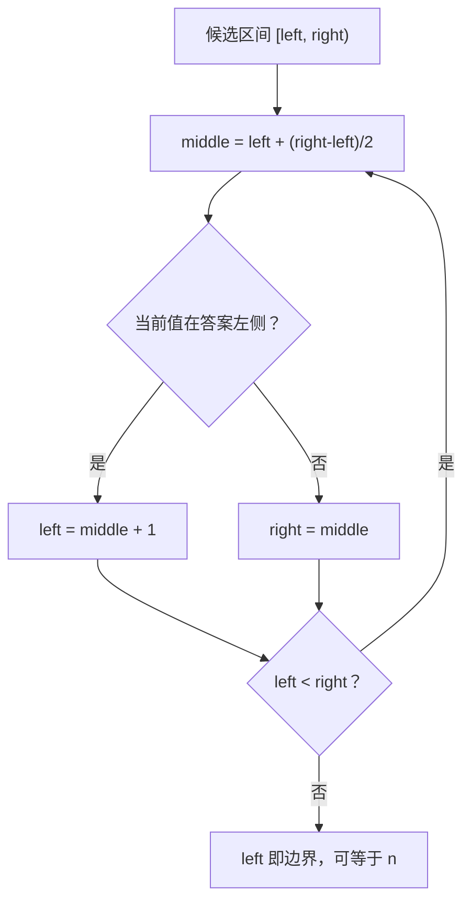

# 有序查找、半开区间与左右边界

<div class="be-tutor-mount" data-tutor-lesson="cs-core-12" aria-hidden="true"></div>

> **任务先行：** 把“找到一个 3”升级为“找到所有 3 的左右边界”，并用 `[left, right)` 不变量证明空序列、重复值和缺失目标都安全。

## 任务路线

<div class="be-task-route" role="list" aria-label="本课六步任务"><span role="listitem">1 锁定基线</span><span role="listitem">2 有序验证</span><span role="listitem">3 线性追踪</span><span role="listitem">4 二分边界</span><span role="listitem">5 失败实验</span><span role="listitem">6 相等区间</span></div>

<section id="step-1" class="be-task-step" data-step-id="step-1" markdown="1">

## 第一步：锁定哈希与查找基线

回归上一课 `applications`，再运行新实验 `search`。**当前任务：**记录目标 3 的线性命中、左右边界和比较次数。**成功证据：**旧报告不变，新报告得到 `linear=1`、`lower=1`、`upper=4`。

</section>

<section id="step-2" class="be-task-step" data-step-id="step-2" markdown="1">

## 第二步：建立一次性有序输入验证

`SortedValues` 构造时复制输入并验证非递减顺序，查找只接收这个类型。**主动修改：**构造后改写原列表或向量。**成功证据：**内部副本不变，后续比较次数不包含这次验证成本。

</section>

<section id="step-3" class="be-task-step" data-step-id="step-3" markdown="1">

## 第三步：追踪线性查找

从左到右逐项比较，命中即返回第一个位置。**当前任务：**覆盖空序列、首项、重复值首项和缺失目标。**成功证据：**缺失目标比较 `n` 次，重复值返回首次出现位置。

</section>

<section id="step-4" class="be-task-step" data-step-id="step-4" markdown="1">

## 第四步：实现半开区间二分边界

维护候选区间 `[left, right)`：`lower_bound` 寻找首个 `>= target`，`upper_bound` 寻找首个 `> target`。**主动修改：**逐轮打印三个下标。**成功证据：**区间严格缩小，返回位置允许等于长度。

</section>

<section id="step-5" class="be-task-step" data-step-id="step-5" markdown="1">

## 第五步：触发无序输入与空区间失败实验

尝试构造 `[1,4,2]`，确认 Python 抛出 `ValueError`、C++ 抛出 `std::invalid_argument`；再对空序列执行左右边界。**恢复标准：**无序输入在查找前受控失败，空区间直接返回 0，不访问元素。

</section>

<section id="step-6" class="be-task-step" data-step-id="step-6" markdown="1">

## 第六步：完成 `equal_range` 迁移验收

组合左右边界得到 `[first,last)`。**约束：**不提供完整答案；不能在函数内重新排序或重复验证输入。**成功证据：**存在目标得到完整重复区间，缺失目标得到空区间，比较数等于两次边界查找之和。

</section>

## 课程信息

| 项目 | 内容 |
| --- | --- |
| 前置 | [集合去重、频次映射与稳定输出](11-set-frequency-map-deterministic-output.md) |
| 阶段作品 | [可追踪查找与排序实验](../../exercises/cs-core/traceable-search-sort-lab/README.md) |
| 核心不变量 | 候选答案始终位于 `[left,right)` |
| 可观察产出 | 位置、左右边界、相等区间、键比较次数 |
| 事实核查 | Python、C++ 与 MIT 资料，2026-07-16 |

## 半开区间为什么不丢答案



半开区间长度就是 `right - left`。循环每轮都缩短这个长度；当左右相等，候选区间为空，但这个插入位置仍是合法答案。二分的前提不是“数据类型像数组”而是搜索区间满足所需的有序划分。

## 固定输出

```text
有序查找实验
data：1, 3, 3, 3, 7, 9
target=3
linear：index=1，comparisons=2
lower_bound：index=1，comparisons=3
upper_bound：index=4，comparisons=3
equal_range：[1, 4)
```

Python `bisect_left`／`bisect_right` 和 C++ `lower_bound`／`upper_bound` 用于标准库对照；阶段作品保留独立实现，才能观察区间和比较次数。若要把结果插回顺序序列，定位可以是对数级，但移动元素仍可能是线性成本。

## 常见错误与排查

| 现象 | 原因 | 检查与恢复 |
| --- | --- | --- |
| 重复值只得到任意一个位置 | 把相等当作立即返回 | 分别寻找左右边界 |
| 末尾插入位置越界误报 | 认为返回值必须小于 `n` | 接受合法哨兵位置 `n` |
| 空序列访问下标 0 | 闭区间初始化混乱 | 初始化 `[0,0)`，循环不进入 |
| 比较次数混入排序成本 | 查找前偷偷排序 | 构造时验证，查找只读 |
| 无序数据给出偶然结果 | 忽略二分前置条件 | 用类型构造受控拒绝 |

## 完成证据

- 无序输入受控失败，构造后原输入修改不影响副本。
- 空、单元素、重复值、缺失目标和返回长度均有测试。
- 固定样例左右边界各比较 3 次。
- `equal_range` 不重新排序或重新验证。
- Python 与 C++ `search` 输出逐字一致。

## 来源与版本

| 来源 | 用途 | 核查日期 |
| --- | --- | --- |
| [Python `bisect`](https://docs.python.org/3.11/library/bisect.html) | 左右插入点语义与插入移动成本 | 2026-07-16 |
| [C++ 二分与排序算法](https://eel.is/c++draft/alg.sorting) | 分区前置条件和边界算法契约 | 2026-07-16 |
| [MIT 6.006 Sorting](https://ocw.mit.edu/courses/6-006-introduction-to-algorithms-spring-2020/6d1ae5278d02bbecb5c4428928b24194_MIT6_006S20_lec3.pdf) | 查找与排序成本背景 | 2026-07-16 |

本地 JavaGuide 二分页面只用于审计区间含义和常见误区；正文、图示与测试独立重写，没有复制 Java 模板、图片或面试题。

## 下一步

下一课进入[插入排序、选择排序与稳定性](13-insertion-selection-sort-stability.md)，用带标签重复键把“排好序”和“稳定”分开验证。
