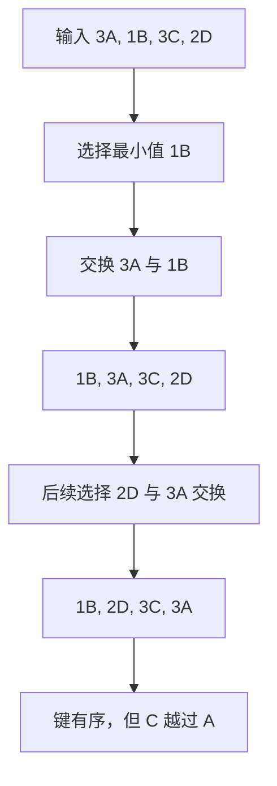

# 插入排序、选择排序与稳定性

<div class="be-tutor-mount" data-tutor-lesson="cs-core-13" aria-hidden="true"></div>

> **任务先行：** 对同一组带标签重复键追踪两种基础排序，证明比较、移动和交换是不同成本，并亲手复现稳定性差异。

## 任务路线

<div class="be-task-route" role="list" aria-label="本课六步任务"><span role="listitem">1 查找基线</span><span role="listitem">2 排序契约</span><span role="listitem">3 插入追踪</span><span role="listitem">4 选择追踪</span><span role="listitem">5 稳定失败</span><span role="listitem">6 稳定降序</span></div>

<section id="step-1" class="be-task-step" data-step-id="step-1" markdown="1">

## 第一步：运行查找与排序基线

先运行 `search`，再运行 `elementary`。**当前任务：**确认两种算法都按键升序，但键为 3 的 A、C 标签顺序不同。**成功证据：**插入结果是 `3A,3C`，选择结果是 `3C,3A`。

</section>

<section id="step-2" class="be-task-step" data-step-id="step-2" markdown="1">

## 第二步：定义排序与稳定性契约

排序要求键按目标方向排列；稳定性额外要求相等键保持原相对顺序。**主动修改：**只看键，再看标签。**成功证据：**能解释“输出有序但不稳定”并不矛盾。

</section>

<section id="step-3" class="be-task-step" data-step-id="step-3" markdown="1">

## 第三步：追踪插入排序

把当前位置元素保存为 `current`，只在它严格越过前项时右移前项。**当前任务：**分别统计键比较和右移。**成功证据：**固定样例为 5 次比较、3 次右移，相等键没有被跨越。

</section>

<section id="step-4" class="be-task-step" data-step-id="step-4" markdown="1">

## 第四步：追踪选择排序

每轮扫描未排序区找最小键，再与起点交换。**主动修改：**跳过“自己和自己”的交换计数。**成功证据：**四项固定产生 6 次键比较、2 次真实交换。

</section>

<section id="step-5" class="be-task-step" data-step-id="step-5" markdown="1">

## 第五步：用重复键复现稳定性失败

观察第一轮把 `1B` 与 `3A` 交换后，原来在 A 后面的 `3C` 被移到 A 前。再临时把插入排序的严格比较改为含等号。**恢复标准：**稳定性测试应先失败；恢复严格比较后，输入和标签顺序均通过。

</section>

<section id="step-6" class="be-task-step" data-step-id="step-6" markdown="1">

## 第六步：完成稳定降序迁移验收

为插入排序增加降序方向。**约束：**不提供完整答案；不能通过反转升序结果实现，因为反转会颠倒相等标签。**成功证据：**键降序、相等标签仍按原顺序，空、负数、重复键和输入不变性通过。

</section>

## 课程信息

| 项目 | 内容 |
| --- | --- |
| 前置 | [有序查找、半开区间与左右边界](12-ordered-search-half-open-boundaries.md) |
| 阶段作品 | [可追踪查找与排序实验](../../exercises/cs-core/traceable-search-sort-lab/README.md) |
| 稳定证据 | `TaggedValue(key, tag)` 的相等键标签顺序 |
| 操作计数 | 键比较、右移、真实交换分别统计 |
| 事实核查 | Python、C++ 与 MIT 资料，2026-07-16 |

## 稳定性反例



稳定性是算法与实现共同保证的契约，不由“比较排序”这个类别自动决定。标准选择排序的长距离交换会让未被直接比较的相等元素改变相对位置。

## 固定输出

```text
基础比较排序
data：3A, 1B, 3C, 2D
insertion：1B, 2D, 3A, 3C
comparisons=5，shifts=3，stable=yes
selection：1B, 2D, 3C, 3A
comparisons=6，swaps=2，stable=no
```

插入排序即使借助二分找到插入点，顺序数组的右移成本仍可能是线性的；不能把整个插入步骤概括为 `O(log n)`。本课用确定性计数比较算法行为，不用机器时间判断语言或算法胜负。

## 常见错误与排查

| 现象 | 原因 | 检查与恢复 |
| --- | --- | --- |
| 相等标签倒序 | 插入条件使用 `<=` 或 `>=` | 相等时停止移动 |
| `swaps` 比预期多 | 把自交换也计入 | 仅 `selected != start` 时交换 |
| 降序重复键反转 | 先升序再整体反转 | 在比较方向中实现降序 |
| 原输入变化 | 直接在调用方序列上排序 | 先复制，再返回结果 |
| 只看键判断稳定 | 丢失元素身份 | 使用 `key + tag` 测试 |

## 完成证据

- 空、单元素、已排序、逆序、负数和重复键均有测试。
- 固定插入排序为 5 次比较、3 次右移。
- 固定选择排序为 6 次比较、2 次交换并复现不稳定。
- 稳定降序不靠反转，输入保持不变。
- Python 与 C++ `elementary` 输出逐字一致。

## 来源与版本

| 来源 | 用途 | 核查日期 |
| --- | --- | --- |
| [Python Sorting HOWTO](https://docs.python.org/3.11/howto/sorting.html) | 排序副本、键函数与稳定性 | 2026-07-16 |
| [C++ 稳定算法要求](https://eel.is/c++draft/algorithm.stable) | 标准稳定算法语义对照 | 2026-07-16 |
| [MIT 6.006 Sorting](https://ocw.mit.edu/courses/6-006-introduction-to-algorithms-spring-2020/6d1ae5278d02bbecb5c4428928b24194_MIT6_006S20_lec3.pdf) | 插入排序与比较模型 | 2026-07-16 |

本地经典排序页面只用于审计稳定性与复杂度条件；没有复制“十大算法”表格、Java 模板、图片或面试题。

## 下一步

下一课进入[自底向上归并排序与稳定复杂度](14-bottom-up-merge-sort-stable-complexity.md)，把稳定合并扩展为 `Theta(n log n)` 的完整排序。
