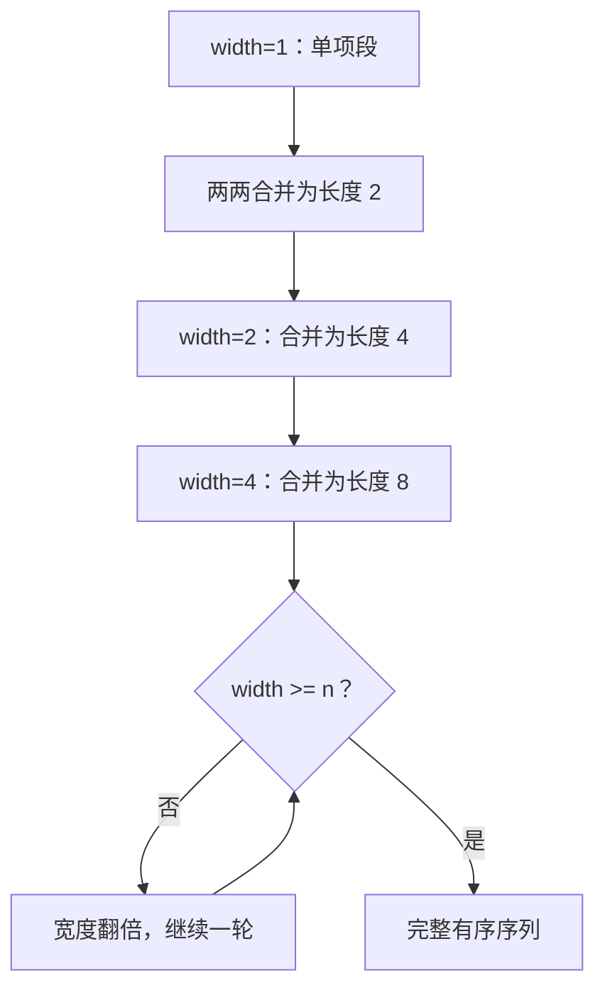

# 自底向上归并排序与稳定复杂度

<div class="be-tutor-mount" data-tutor-lesson="cs-core-14" aria-hidden="true"></div>

> **任务先行：** 先可靠合并两个有序段，再让段宽从 1、2、4 逐轮翻倍，在不使用递归的情况下得到稳定的 `Theta(n log n)` 排序。

## 任务路线

<div class="be-task-route" role="list" aria-label="本课六步任务"><span role="listitem">1 基础基线</span><span role="listitem">2 有序段合并</span><span role="listitem">3 左侧优先</span><span role="listitem">4 宽度翻倍</span><span role="listitem">5 稳定失败</span><span role="listitem">6 稳定降序</span></div>

<section id="step-1" class="be-task-step" data-step-id="step-1" markdown="1">

## 第一步：运行基础排序基线

先运行 `elementary`，再运行 `merge`。**当前任务：**锁定输入、副本不变性与最终标签顺序。**成功证据：**两轮归并得到 `1B,2D,3A,3C`，固定比较 5 次、写入 8 次。

</section>

<section id="step-2" class="be-task-step" data-step-id="step-2" markdown="1">

## 第二步：定义两个有序段的合并

为左右段各维护一个游标，每次写入顺序更靠前的元素，一侧耗尽后复制另一侧。**主动修改：**覆盖左空、右空、单项和奇数总长度。**成功证据：**每个输入元素恰好写入结果一次。

</section>

<section id="step-3" class="be-task-step" data-step-id="step-3" markdown="1">

## 第三步：实现左侧优先的稳定归并

当左右键相等时取左侧。**当前任务：**合并 `3L` 与 `3R`。**成功证据：**输出保持 L、R；比较一次、写入两次，稳定性来自明确分支而非偶然。

</section>

<section id="step-4" class="be-task-step" data-step-id="step-4" markdown="1">

## 第四步：按宽度 1、2、4 迭代合并

把单项视为已排序段，每轮合并相邻等宽段并记录完整快照，随后宽度翻倍。**主动修改：**加入 5 项输入。**成功证据：**尾部不足一整对时仍被安全复制，循环在 `width >= n` 时结束。

</section>

<section id="step-5" class="be-task-step" data-step-id="step-5" markdown="1">

## 第五步：复现相等键右侧优先的失败

临时把相等分支改为先取右段，运行 `3L + 3R` 和完整稳定性测试。**恢复标准：**测试先显示 R 越过 L；恢复左侧优先后，升序结果、比较数和输入副本再次通过。

</section>

<section id="step-6" class="be-task-step" data-step-id="step-6" markdown="1">

## 第六步：完成稳定降序迁移验收

把合并与完整排序迁移为降序。**约束：**不提供完整答案；不得反转升序结果、不得改用递归或标准排序。**成功证据：**相等键仍左侧优先，每轮快照方向正确，空、奇数长度和输入不变性通过。

</section>

## 课程信息

| 项目 | 内容 |
| --- | --- |
| 前置 | [插入排序、选择排序与稳定性](13-insertion-selection-sort-stability.md) |
| 阶段作品 | [可追踪查找与排序实验](../../exercises/cs-core/traceable-search-sort-lab/README.md) |
| 时间复杂度 | 完整排序 `Theta(n log n)` |
| 额外空间 | 教学实现使用 `Theta(n)` 辅助序列 |
| 事实核查 | Python、C++ 与 MIT 资料，2026-07-16 |

## 宽度如何覆盖全序列



每一轮读取和写入总量都是线性级，宽度最多翻倍约 `log n` 轮，因此完整排序是 `Theta(n log n)`。这个结论不依赖递归；递归只是另一种组织“先排序子段再合并”的控制流。

## 固定输出

```text
迭代归并排序
data：3A, 1B, 3C, 2D
width=1：1B, 3A | 2D, 3C
width=2：1B, 2D, 3A, 3C
comparisons=5，writes=8，passes=2
stable=yes，input_unchanged=yes
```

`writes` 统计每轮写入目标序列的元素数，不把内部容器实现的复制或分配细节混入教学计数。Python 和 C++ 的标准稳定排序仅用于对照，不作为本实验操作计数来源。

## 常见错误与排查

| 现象 | 原因 | 检查与恢复 |
| --- | --- | --- |
| 相等标签反转 | 相等时选择右段 | 相等固定先取左段 |
| 奇数长度丢尾项 | 假设每轮都有完整左右段 | 用 `min` 截断段末尾 |
| 写入数少于预期 | 未计一侧剩余复制 | 每个输出元素都计一次 |
| 循环不结束 | 宽度没有翻倍或溢出 | 每轮验证宽度增长与终止条件 |
| 输入被覆盖 | 直接复用调用方序列 | 先复制并在轮间切换缓冲 |

## 完成证据

- 空段、单侧为空、单元素、奇数长度均安全。
- 相等键左侧优先，稳定性失败实验可复现和恢复。
- 固定样例记录宽度 1、2 两轮，比较 5 次、写入 8 次。
- 稳定降序不使用反转、递归或标准排序。
- Python 与 C++ `merge` 输出逐字一致。

## 来源与版本

| 来源 | 用途 | 核查日期 |
| --- | --- | --- |
| [MIT 6.006 Sorting](https://ocw.mit.edu/courses/6-006-introduction-to-algorithms-spring-2020/6d1ae5278d02bbecb5c4428928b24194_MIT6_006S20_lec3.pdf) | 合并排序与渐近成本 | 2026-07-16 |
| [Python Sorting HOWTO](https://docs.python.org/3.11/howto/sorting.html) | 稳定排序语义对照 | 2026-07-16 |
| [C++ 稳定算法要求](https://eel.is/c++draft/algorithm.stable) | 稳定算法契约对照 | 2026-07-16 |

本地排序素材只用于核查“归并只能递归”等过度概括；正文、Mermaid、示例和测试均独立重写。

## 下一步

查找与排序基础闭环完成。下一批按[CS 核心说明](README.md)进入树与递归；快速排序、堆排序、非比较排序与正式机考仍留在后续深化。
