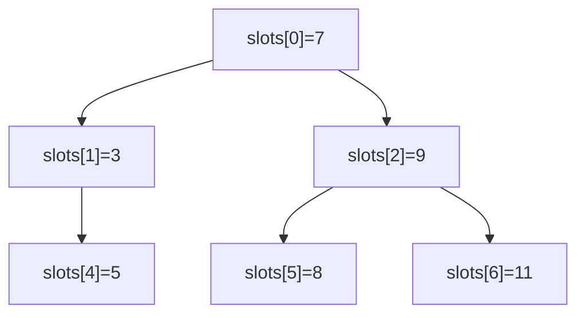

# 二叉树形状、链接所有权与槽位表示

<div class="be-tutor-mount" data-tutor-lesson="cs-core-15" aria-hidden="true"></div>

> **任务先行：** 把同一棵树同时表示为可复现的零基槽位和安全链接节点，先锁定形状报告，再迁移出检查式根到槽位路径。

## 任务路线

<div class="be-task-route" role="list" aria-label="本课六步任务"><span role="listitem">1 树形基线</span><span role="listitem">2 术语约定</span><span role="listitem">3 槽位校验</span><span role="listitem">4 链接所有权</span><span role="listitem">5 失败边界</span><span role="listitem">6 路径迁移</span></div>

<section id="step-1" class="be-task-step" data-step-id="step-1" markdown="1">

## 第一步：锁定归并与树形基线

先回归上一课 `merge`，再运行新实验 `shape`。**当前任务：**确认旧项目未被改写，并记录槽位、大小、高度、叶子数和根的两个孩子。**成功证据：**固定树得到 `size=6，height=2，leaves=3`。

</section>

<section id="step-2" class="be-task-step" data-step-id="step-2" markdown="1">

## 第二步：固定根、深度、叶子与高度约定

本实验按边数计高度：空树为 `-1`，根深度为 `0`，叶子高度为 `0`。**主动修改：**分别构造空树和单节点树。**成功证据：**结果为 `(0,-1,0)` 与 `(1,0,1)`，解释中不混用“节点层数”和“边数高度”。

</section>

<section id="step-3" class="be-task-step" data-step-id="step-3" markdown="1">

## 第三步：校验并规范化零基槽位

槽位 `i` 的孩子位于 `2i+1` 和 `2i+2`。构造器先复制输入，再裁掉末尾 `null`；非空输入必须有根，任何非空子槽都必须有非空父槽。**主动修改：**给固定输入追加三个末尾空槽。**成功证据：**规范化结果不变，原输入后续修改不影响树。

</section>

<section id="step-4" class="be-task-step" data-step-id="step-4" markdown="1">

## 第四步：把槽位链接成私有节点

槽位适合确定性输入，节点链接适合遍历。Python `_Node` 只在包内使用；C++ `Node` 由父节点的 `unique_ptr` 单一拥有，树可移动但不可复制。



**成功证据：**调用方只能看到树的公开值和轨迹，不能取得可悬空的节点指针。

</section>

<section id="step-5" class="be-task-step" data-step-id="step-5" markdown="1">

## 第五步：执行根、孤儿和空槽失败实验

依次尝试 `[null]`、`[7,null,9,4]` 和读取固定树的槽位 3。前两种构造失败，第三种检查式访问失败；不要用 C++ 未检查下标或空指针解引用演示错误。**恢复标准：**改回合法父子关系后报告重新生成，失败前的输入没有被覆盖。

</section>

<section id="step-6" class="be-task-step" data-step-id="step-6" markdown="1">

## 第六步：完成 `path_to_slot` 迁移验收

根据槽位下标反推到根的父下标，再逆序得到 `L/R` 路径。**约束：**不提供完整实现；不得通过遍历所有节点查找值，因为值允许重复。**成功证据：**根路径为空，槽位 4 返回 `value=5, directions=(L,R)`，负下标、空槽和越界均受控失败。

</section>

## 课程信息

| 项目 | 内容 |
| --- | --- |
| 前置 | [自底向上归并排序与稳定复杂度](14-bottom-up-merge-sort-stable-complexity.md) |
| 阶段作品 | [可追踪树与遍历实验](../../exercises/cs-core/traceable-tree-traversal-lab/README.md) |
| 构造成本 | 规范化槽位长度为 `m` 时 `Theta(m)` |
| 事实核查 | MIT、Open Data Structures 与 C++ 标准草案，2026-07-16 |

## 固定输出

```text
可追踪二叉树实验
slots：7, 3, 9, null, 5, 8, 11
size=6，height=2，leaves=3
root=7，left=3，right=9
```

实验同时保留规范化槽位和链接节点是教学取舍，不代表所有生产二叉树都应保存两份表示。稀疏树的槽位表示还可能包含较多空位。

## 常见错误与排查

| 现象 | 原因 | 恢复 |
| --- | --- | --- |
| 单节点高度写成 1 | 混入节点层数约定 | 回到边数高度约定 |
| 空槽下面出现值 | 只检查数组边界 | 同时验证父槽存在 |
| 修改原列表后树变化 | 未复制构造输入 | 构造时保存独立副本 |
| C++ 树被浅复制 | 节点所有权不唯一 | 删除复制，保留移动语义 |

## 完成证据

- 空树、单节点、稀疏树、重复值和负值均有测试。
- 空根、孤儿、空槽、负下标和越界均为受控失败。
- C++ 静态断言证明树可移动不可复制。
- Python 与 C++ `shape` 输出逐字一致。

## 来源与版本

| 来源 | 用途 | 核查日期 |
| --- | --- | --- |
| [MIT 6.006 Binary Trees](https://ocw.mit.edu/courses/6-006-introduction-to-algorithms-spring-2020/376714cc85c6c784d90eec9c575ec027_MIT6_006S20_lec6.pdf) | 二叉树术语、深度与高度 | 2026-07-16 |
| [Open Data Structures BinaryTree](https://opendatastructures.org/ods-python/6_1_BinaryTree_Basic_Binary.html) | 基本树操作与空树高度 | 2026-07-16 |
| [C++ `unique_ptr`](https://eel.is/c++draft/unique.ptr.single) | 单一所有权边界 | 2026-07-16 |

本地树素材只用于审计术语混用和“平衡树等同搜索树”等过度概括；正文、图和代码均独立重写。

## 下一步

进入[递归深度优先遍历、基线条件与调用深度](16-recursive-dfs-traversal-call-frames.md)，用同一链接结构观察前中后序和递归空间。
