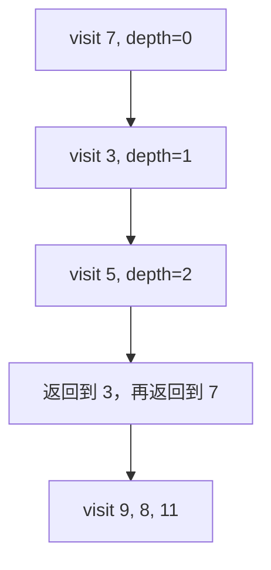

# 递归深度优先遍历、基线条件与调用深度

<div class="be-tutor-mount" data-tutor-lesson="cs-core-16" aria-hidden="true"></div>

> **任务先行：** 用“空节点返回、孩子规模更小”的递归契约得到三种 DFS 顺序，并用显式深度保护安全观察递归边界。

## 任务路线

<div class="be-task-route" role="list" aria-label="本课六步任务"><span role="listitem">1 形状基线</span><span role="listitem">2 递归契约</span><span role="listitem">3 前序轨迹</span><span role="listitem">4 中后序</span><span role="listitem">5 深度失败</span><span role="listitem">6 层计数迁移</span></div>

<section id="step-1" class="be-task-step" data-step-id="step-1" markdown="1">

## 第一步：运行树形状基线

先运行 `shape`，再运行 `recursive`。**当前任务：**锁定树仍为 6 个节点、高度 2，并记录三种遍历序列。**成功证据：**每种遍历都访问恰好 6 个节点，最深访问深度为 2。

</section>

<section id="step-2" class="be-task-step" data-step-id="step-2" markdown="1">

## 第二步：建立基线条件、递归情况与进展

空节点立即返回；非空节点处理当前值并递归到孩子。孩子子树严格小于当前树，因此每条路径最终到达空节点。**主动修改：**加入空树和单节点测试。**成功证据：**空树轨迹为 `visits=0,max_depth=-1`，单节点三种顺序相同。

</section>

<section id="step-3" class="be-task-step" data-step-id="step-3" markdown="1">

## 第三步：追踪前序遍历的调用帧

前序在进入节点时记录值，再处理左、右子树。每个未返回的调用帧保存当前节点和下一步位置。



**成功证据：**前序为 `7,3,5,9,8,11`；时间 `Theta(n)`，活动调用帧最多与树高同阶。

</section>

<section id="step-4" class="be-task-step" data-step-id="step-4" markdown="1">

## 第四步：移动访问位置得到中序和后序

递归结构不变，只改变记录当前值的位置：中序在左子树返回后记录，后序在两个孩子返回后记录。**主动修改：**给重复值附加槽位说明，确认顺序证据来自节点位置而非值的唯一性。**成功证据：**固定中序和后序分别与报告一致。

</section>

<section id="step-5" class="be-task-step" data-step-id="step-5" markdown="1">

## 第五步：执行显式深度保护失败实验

对高度 2 的树设置 `max_depth=1`。遍历准备进入深度 2 节点时立即失败，不返回局部轨迹。Python 可读取 `sys.getrecursionlimit()` 作为运行时背景，但不得修改它；C++ 不制造无限递归或真实栈溢出。**恢复标准：**改为 2 后完整轨迹恢复。

</section>

<section id="step-6" class="be-task-step" data-step-id="step-6" markdown="1">

## 第六步：完成 `count_at_depth` 迁移验收

统计目标深度节点，并记录实际检查的非空节点数。**约束：**到达目标层后不得继续进入更深子树；不先生成完整遍历再筛选。**成功证据：**固定树深度 0、1、2 分别计数 1、2、3，访问数为 1、3、6；负深度受控失败。

</section>

## 课程信息

| 项目 | 内容 |
| --- | --- |
| 前置 | [二叉树形状、链接所有权与槽位表示](15-binary-tree-shape-linked-ownership.md) |
| 阶段作品 | [可追踪树与遍历实验](../../exercises/cs-core/traceable-tree-traversal-lab/README.md) |
| 完整遍历 | 时间 `Theta(n)`，递归辅助空间 `Theta(h)` |
| 事实核查 | MIT、Open Data Structures 与 Python 3.11，2026-07-16 |

## 固定输出

```text
递归深度优先遍历
preorder：7, 3, 5, 9, 8, 11
inorder：3, 5, 7, 8, 9, 11
postorder：5, 3, 8, 11, 9, 7
visits=6，max_depth=2
```

## 常见错误与排查

| 现象 | 原因 | 恢复 |
| --- | --- | --- |
| 递归不终止 | 缺少空节点基线或没有进入更小子树 | 先验证基线与规模缩小 |
| 三种顺序相同 | 当前值总在同一位置记录 | 对照左递归、记录、右递归的位置 |
| 空树最大深度为 0 | 把根深度套到空树 | 固定空树为 `-1` |
| 超限仍返回部分值 | 失败状态被当作结果 | 让异常中止且不构造公开轨迹 |

## 完成证据

- 空树、单节点、稀疏树和三种固定顺序通过。
- 访问数和最大深度由节点轨迹确定，不含空指针调用。
- 深度保护在进入超限节点前失败，恢复后无状态残留。
- Python 与 C++ `recursive` 输出逐字一致。

## 来源与版本

| 来源 | 用途 | 核查日期 |
| --- | --- | --- |
| [MIT 6.006 Binary Trees](https://ocw.mit.edu/courses/6-006-introduction-to-algorithms-spring-2020/376714cc85c6c784d90eec9c575ec027_MIT6_006S20_lec6.pdf) | 树遍历与高度成本 | 2026-07-16 |
| [Open Data Structures BinaryTree](https://opendatastructures.org/ods-python/6_1_BinaryTree_Basic_Binary.html) | 递归 size、height 与遍历 | 2026-07-16 |
| [Python `sys.getrecursionlimit`](https://docs.python.org/3.11/library/sys.html#sys.getrecursionlimit) | 解释器递归限制背景 | 2026-07-16 |

本地 DFS/BFS 素材只用于检查“递归空间恒为常量”等误区，不复制 Java 模板或题目。

## 下一步

进入[迭代 DFS、BFS 与层级前沿](17-iterative-dfs-bfs-frontier-levels.md)，把隐式调用栈改成可观察的显式容器。
