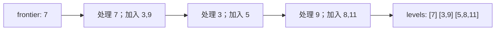

# 迭代 DFS、BFS 与层级前沿

<div class="be-tutor-mount" data-tutor-lesson="cs-core-17" aria-hidden="true"></div>

> **任务先行：** 用显式栈复现递归前序，用队列形成层序遍历，并把容器峰值变成可测试的空间证据。

## 任务路线

<div class="be-task-route" role="list" aria-label="本课六步任务"><span role="listitem">1 递归基线</span><span role="listitem">2 前沿契约</span><span role="listitem">3 迭代 DFS</span><span role="listitem">4 BFS 层级</span><span role="listitem">5 顺序失败</span><span role="listitem">6 最宽层迁移</span></div>

<section id="step-1" class="be-task-step" data-step-id="step-1" markdown="1">

## 第一步：运行递归与显式前沿基线

依次运行 `recursive` 和 `frontier`。**当前任务：**确认迭代 DFS 与递归前序一致，BFS 按深度输出。**成功证据：**DFS、BFS 都访问 6 个节点，最大前沿分别为 2 和 3。

</section>

<section id="step-2" class="be-task-step" data-step-id="step-2" markdown="1">

## 第二步：定义前沿和峰值统计契约

前沿是已经发现但尚未处理的节点。初始根进入容器后立即计数，每次压入或入队后更新峰值；空树峰值为 0。**主动修改：**运行空树、单节点和三节点满树。**成功证据：**计数不依赖容器分配容量。

</section>

<section id="step-3" class="be-task-step" data-step-id="step-3" markdown="1">

## 第三步：用栈实现迭代前序

栈后进先出。为了让左孩子先处理，必须先压右、再压左；弹出时记录当前值。**成功证据：**固定结果为 `7,3,5,9,8,11`，与递归前序逐项一致。

</section>

<section id="step-4" class="be-task-step" data-step-id="step-4" markdown="1">

## 第四步：用队列生成 BFS 和层级行

队列先进先出，固定先左后右入队，并让每个队列项携带深度。



**主动修改：**加入只有右孩子的合法树。**成功证据：**层深度连续、同层保持从左到右，缺失孩子不产生占位访问。

</section>

<section id="step-5" class="be-task-step" data-step-id="step-5" markdown="1">

## 第五步：复现压栈顺序反转失败

临时改为先压左、再压右，观察右子树先被弹出；不要改节点链接或报告期望值掩盖问题。**诊断边界：**已验证的树没有环，因此不需要 `visited`；一般图必须另行处理重复访问。**恢复标准：**恢复先右后左后，迭代结果重新等于递归前序。

</section>

<section id="step-6" class="be-task-step" data-step-id="step-6" markdown="1">

## 第六步：完成 `widest_level` 迁移验收

在构造层级行的同时找出最宽层。**约束：**并列时保留最早出现的较浅层；不依赖值排序；空树深度为空、宽度与访问数为 0。**成功证据：**固定树返回 `depth=2,width=3,visits=6`，单节点和并列宽度通过。

</section>

## 课程信息

| 项目 | 内容 |
| --- | --- |
| 前置 | [递归深度优先遍历、基线条件与调用深度](16-recursive-dfs-traversal-call-frames.md) |
| 阶段作品 | [可追踪树与遍历实验](../../exercises/cs-core/traceable-tree-traversal-lab/README.md) |
| 完整遍历 | 时间 `Theta(n)`；DFS/BFS 最坏显式空间均可到 `Theta(n)` |
| 事实核查 | Open Data Structures、Python 与 C++ 标准草案，2026-07-16 |

## 固定输出

```text
显式前沿遍历
dfs_preorder：7, 3, 5, 9, 8, 11
dfs_visits=6，max_frontier=2
bfs_level_order：7, 3, 9, 5, 8, 11
bfs_visits=6，max_frontier=3
levels：0=[7] 1=[3, 9] 2=[5, 8, 11]
```

DFS 的典型空间与树高相关，但在一般树形和实现下最坏可积累线性前沿；BFS 由最大宽度 `w` 主导，也可能达到 `Theta(n)`。

## 常见错误与排查

| 现象 | 原因 | 恢复 |
| --- | --- | --- |
| DFS 先访问右子树 | 压栈顺序与弹出顺序混淆 | 先压右、后压左 |
| BFS 变成深度优先 | 队列被当成栈使用 | 头部取出、尾部加入 |
| 峰值少算一个 | 只在弹出时计数 | 初始和每次加入后更新 |
| 树遍历无故维护 visited | 把图的环条件提前套用 | 先证明输入是无环树 |

## 完成证据

- 迭代 DFS 与递归前序逐项一致。
- BFS、层级行、访问数和最大前沿均有固定测试。
- 压栈顺序失败可复现并恢复，不执行未定义行为。
- Python 与 C++ `frontier` 输出逐字一致。

## 来源与版本

| 来源 | 用途 | 核查日期 |
| --- | --- | --- |
| [Open Data Structures BinaryTree](https://opendatastructures.org/ods-python/6_1_BinaryTree_Basic_Binary.html) | 树的 BFS 与队列前沿 | 2026-07-16 |
| [Open Data Structures Graph Traversal](https://opendatastructures.org/ods-python/12_3_Graph_Traversal.html) | DFS/BFS 容器差异与图边界 | 2026-07-16 |
| [Python `deque`](https://docs.python.org/3.11/library/collections.html#collections.deque) | 双端队列接口 | 2026-07-16 |
| [C++ 容器适配器](https://eel.is/c++draft/container.adaptors.general) | `stack` 与 `queue` 接口边界 | 2026-07-16 |

本地 DFS/BFS 素材只用于概念和误区审计；“BFS 给出最短路”必须附带无权或等权边条件，本课尚不进入最短路。

## 下一步

树的表示、递归与显式遍历基础闭环完成。下一课进入 [简单无向图、邻接表示与输入边界](18-undirected-graph-adjacency-representations.md)；搜索树、堆和带权最短路仍未开放。
