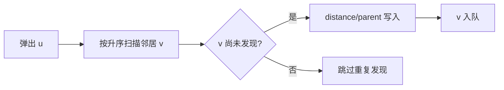

# BFS、无权距离与最短路径

<div class="be-tutor-mount" data-tutor-lesson="cs-core-19" aria-hidden="true"></div>

> **任务先行：** 在发现顶点时立即锁定距离和父节点，用可追踪 BFS 恢复无权图最短路径。

## 任务路线

<div class="be-task-route" role="list" aria-label="本课六步任务"><span role="listitem">1 图基线</span><span role="listitem">2 入队标记</span><span role="listitem">3 距离父链</span><span role="listitem">4 恢复路径</span><span role="listitem">5 重复入队</span><span role="listitem">6 距离迁移</span></div>

<section id="step-1" class="be-task-step" data-step-id="step-1" markdown="1">

## 第一步：运行图表示与 BFS 基线

依次运行 `graph` 和 `bfs`。**当前任务：**确认邻接顺序固定后再解释遍历轨迹。**成功证据：**从 0 只访问 `0,1,2,3,4`，顶点 5、6 明确标为不可达。

</section>

<section id="step-2" class="be-task-step" data-step-id="step-2" markdown="1">

## 第二步：建立队列与入队标记契约

起点距离设为 0 并入队；发现未访问邻居时，**先**写距离和父节点，**再**入队。这个时刻即代表该顶点已发现，可阻止另一条边重复加入同一顶点。



</section>

<section id="step-3" class="be-task-step" data-step-id="step-3" markdown="1">

## 第三步：追踪距离、父节点与操作次数

首次发现 `v` 时令 `distance[v]=distance[u]+1`、`parent[v]=u`。起点和不可达顶点父节点都为空，但含义不同，要结合距离判断。`edge_checks` 统计已访问顶点邻接表中的每个条目，因此样例为 10。

**主动修改：**把起点改为 5。**成功证据：**只访问 5、6，距离分别为 0、1，其余不可达。

</section>

<section id="step-4" class="be-task-step" data-step-id="step-4" markdown="1">

## 第四步：沿父链恢复最短路径

目标可达时，从目标反复跟随父节点到起点，再反转序列。因为 BFS 按边数分层首次发现顶点，在无权或每条边等权图中得到最少边数路径；这不是任意带权图结论。

**成功证据：**`0→4` 恢复为 `0,1,3,4`、距离 3；`0→6` 返回空路径和不可达距离，而不是伪造父链。

</section>

<section id="step-5" class="be-task-step" data-step-id="step-5" markdown="1">

## 第五步：复现出队才标记的重复入队

临时把“已发现”推迟到出队：顶点 1 和 2 都会尝试把 3 入队，前沿和操作次数失去契约。**安全边界：**只用小固定图观察重复项，不构造无限运行。**恢复标准：**恢复入队时标记，顺序、计数和峰值全部回归。

</section>

<section id="step-6" class="be-task-step" data-step-id="step-6" markdown="1">

## 第六步：完成 `reachable_within` 迁移验收

返回距离不超过 `max_distance` 的可达顶点，并保持 BFS 发现顺序。拒绝负距离，不包含不可达顶点，不修改图。**成功证据：**固定图从 0、最大距离 2 返回 `0,1,2,3`。

</section>

## 课程信息

| 项目 | 内容 |
| --- | --- |
| 前置 | [简单无向图、邻接表示与输入边界](18-undirected-graph-adjacency-representations.md) |
| 阶段作品 | [可追踪图遍历实验](../../exercises/cs-core/traceable-graph-traversal-lab/README.md) |
| 成立条件 | 无权或所有边等权；邻接表完整扫描为 `Theta(V+E)` |
| 事实核查 | MIT 6.006、ODS、Python/C++ 文档，2026-07-16 |

## 固定输出

```text
无权图 BFS
start=0
order：0, 1, 2, 3, 4
distances：0, 1, 1, 2, 3, unreachable, unreachable
parents：none, 0, 0, 1, 3, none, none
visits=5，edge_checks=10，max_frontier=2
path 0->4：0, 1, 3, 4，distance=3
```

## 常见错误与排查

| 现象 | 原因 | 恢复 |
| --- | --- | --- |
| 同一顶点重复入队 | 出队时才标记 | 首次入队前写入距离 |
| 不可达顶点距离为 0 | 初始化与起点混淆 | 未发现保持 `None/optional` |
| 父链不是确定结果 | 邻接顺序不固定 | 邻接点升序扫描 |
| 带权图仍直接用 BFS | 忽略等权条件 | 本课只断言最少边数路径 |

## 来源与版本

| 来源 | 用途 | 核查日期 |
| --- | --- | --- |
| [MIT 6.006 Lecture 9](https://ocw.mit.edu/courses/6-006-introduction-to-algorithms-spring-2020/196a95604877d326c6586e60477b59d4_MIT6_006S20_lec9.pdf) | BFS 距离、父节点与复杂度 | 2026-07-16 |
| [Open Data Structures Graph Traversal](https://opendatastructures.org/ods-python/12_3_Graph_Traversal.html) | 队列式图遍历 | 2026-07-16 |
| [Python `deque`](https://docs.python.org/3.11/library/collections.html#collections.deque) | FIFO 操作接口 | 2026-07-16 |
| [C++ `queue`](https://eel.is/c++draft/queue) | 标准队列适配器边界 | 2026-07-16 |

本地材料中的“BFS 最短路”已补足无权或等权前提；本课不进入 Dijkstra 或负权边。

## 下一步

继续进入 [DFS、连通分量与无向环检测](20-dfs-connected-components-undirected-cycles.md)。
