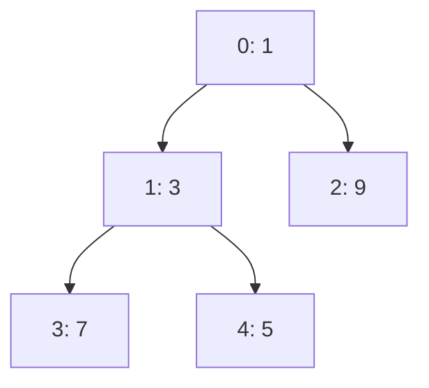

# 二叉最小堆、隐式树与堆不变量

<div class="be-tutor-mount" data-tutor-lesson="cs-core-21" aria-hidden="true"></div>

> **任务先行：** 把整数逐个放进隐式完全二叉树，记录上浮和下沉的真实比较、交换，并证明“堆有序”不等于“数组已排序”。

## 任务路线

<div class="be-task-route" role="list" aria-label="本课六步任务"><span role="listitem">1 锁定基线</span><span role="listitem">2 隐式树</span><span role="listitem">3 插入上浮</span><span role="listitem">4 删除下沉</span><span role="listitem">5 安全失败</span><span role="listitem">6 线性建堆</span></div>

<section id="step-1" class="be-task-step" data-step-id="step-1" markdown="1">

## 第一步：锁定图实验与最小堆基线

先回归上一课 `dfs` 输出，再运行新实验的 `heap` 模式。**当前任务：**确认新成果线没有改变旧图实验，并记录 `heap=1,3,9,7,5`。**成功证据：**五次插入共 5 次值比较、3 次交换，删除 1 后为 `3,5,9,7`。

</section>

<section id="step-2" class="be-task-step" data-step-id="step-2" markdown="1">

## 第二步：建立零基隐式完全二叉树

数组下标 `i` 的左孩子为 `2i+1`、右孩子为 `2i+2`；非根节点的父节点为 `(i-1)//2`。结构是完全二叉树，因此不需要节点指针或空槽。



**主动修改：**为每个非根位置打印父节点下标。**成功证据：**位置 1、2 的父节点为 0，位置 3、4 的父节点为 1。

</section>

<section id="step-3" class="be-task-step" data-step-id="step-3" markdown="1">

## 第三步：实现插入与上浮

新值先追加到末尾，再与父节点比较；只有严格更小时才交换并继续上浮。相等值无需交换。计数只包含元素值比较，边界判断不算比较。

**成功证据：**插入 1 时依次越过 7 和 3，发生 2 次比较、2 次交换；最终根节点是当前最小值。

</section>

<section id="step-4" class="be-task-step" data-step-id="step-4" markdown="1">

## 第四步：删除堆顶并下沉

删除根后把末尾值移到根位置。每轮先在存在的孩子中选较小者，再与当前节点比较；只有孩子更小时交换。查看根为 `Theta(1)`，插入和删除沿树高移动，为 `Theta(log n)`。

**成功证据：**样例删除 1 后执行 3 次比较、1 次交换，剩余数组仍满足父节点不大于孩子。

</section>

<section id="step-5" class="be-task-step" data-step-id="step-5" markdown="1">

## 第五步：执行空堆与不变量失败实验

在空堆上调用 `peek_min` 和 `pop_min`。**预期失败：**Python 抛出 `IndexError`，C++ 抛出 `std::out_of_range`，空堆状态不变。再把合法堆 `(1,3,9)` 改成 `(3,1,9)`，`is_min_heap` 必须返回 false，而不是继续运行错误结构。

</section>

<section id="step-6" class="be-task-step" data-step-id="step-6" markdown="1">

## 第六步：完成 `build_min_heap` 迁移验收

复制输入，从最后一个非叶节点向根依次下沉。不要用“逐个插入”替代本任务。**验收：**覆盖空序列、重复值、负数和已成堆输入；结果满足不变量，原输入不变，并能解释为什么所有节点的下沉高度总和为 `Theta(n)`。

</section>

## 固定输出

```text
可追踪最小堆
push：7, 3, 9, 1, 5
heap：1, 3, 9, 7, 5
comparisons=5，swaps=3
pop_min=1
remaining：3, 5, 9, 7
pop_comparisons=3，pop_swaps=1
```

## 常见错误与排查

| 现象 | 原因 | 恢复 |
| --- | --- | --- |
| 堆数组不是升序 | 把局部父子不变量当成全排序 | 只检查每个父节点与孩子 |
| 下沉后仍违规 | 总选择左孩子 | 先比较存在的左右孩子 |
| 重复值产生无意义交换 | 使用小于等于判断 | 只有严格更小时交换 |
| 空堆状态损坏 | 先修改再检查下溢 | 在任何写操作前拒绝 |

## 来源与版本

| 来源 | 用途 | 核查日期 |
| --- | --- | --- |
| [MIT 6.006 Binary Heaps](https://ocw.mit.edu/courses/6-006-introduction-to-algorithms-spring-2020/40d4851e550507ca14dc778b9b2266cc_MIT6_006S20_lec8.pdf) | 堆接口、建堆和复杂度 | 2026-07-16 |
| [Open Data Structures BinaryHeap](https://opendatastructures.org/ods-python/10_1_BinaryHeap_Implicit_Bi.html) | 隐式树索引与上浮下沉 | 2026-07-16 |
| [Python 3.11 `heapq`](https://docs.python.org/3.11/library/heapq.html) | 零基最小堆对照 | 2026-07-16 |

本地材料只用于审计堆、优先队列与堆排序术语；本课不复制图片，也不进入最大堆、堆排序或 Top-K。

## 下一步

下一课把最小堆封装为[稳定优先队列](22-stable-priority-queue-tie-order-underflow.md)，并处理相同优先级的确定性顺序。
