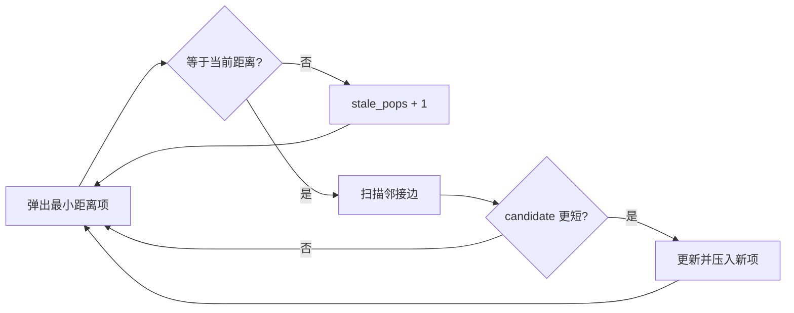

# 带权图松弛、Dijkstra 与过期队列项

<div class="be-tutor-mount" data-tutor-lesson="cs-core-23" aria-hidden="true"></div>

> **任务先行：** 在非负权简单无向图上维护暂定距离，用稳定最小队列按距离取点，并安全跳过被更短路线替代的旧队列项。

## 任务路线

<div class="be-task-route" role="list" aria-label="本课六步任务"><span role="listitem">1 加权基线</span><span role="listitem">2 验证图</span><span role="listitem">3 严格松弛</span><span role="listitem">4 Dijkstra</span><span role="listitem">5 负权与过期项</span><span role="listitem">6 距离范围迁移</span></div>

<section id="step-1" class="be-task-step" data-step-id="step-1" markdown="1">

## 第一步：运行优先队列与带权图基线

先运行 `queue` 再运行 `dijkstra`。**当前任务：**记录从 0 出发的确定顺序、距离、父节点和队列计数。**成功证据：**顶点 6 保持不可达，0 到 5 的路径为 `0,2,1,3,4,5`，总代价 8。

</section>

<section id="step-2" class="be-task-step" data-step-id="step-2" markdown="1">

## 第二步：验证非负权简单无向图

构造函数复制并规范化端点，邻接表按邻居编号排序。允许零权边；拒绝负权、自环、重复无向边和越界端点。距离范围固定到有符号 64 位，不能用溢出后的值继续比较。

**主动修改：**交换边输入顺序。**成功证据：**规范化邻接顺序和最终轨迹保持不变。

</section>

<section id="step-3" class="be-task-step" data-step-id="step-3" markdown="1">

## 第三步：实现严格松弛

对边 `u—v(w)` 计算 `candidate=distance[u]+w`。只有目标未知或候选严格更小时才更新距离、父节点并压入新项；相等候选不覆盖第一次父节点。

**成功证据：**样例中顶点 1 先得到 4，随后经 2 改进为 3；顶点 3 从 6 改进为 4，共产生 8 次成功松弛。

</section>

<section id="step-4" class="be-task-step" data-step-id="step-4" markdown="1">

## 第四步：用稳定最小队列执行 Dijkstra

队列项为 `(distance, sequence, vertex)`。每次弹出当前最小暂定距离；若与距离表一致，就固定本次顶点并扫描邻接表。非负权保证未处理路线不能再从后方产生更短的已弹出距离。



本课懒惰重复项实现至多保留 `O(E)` 个队列项，时间写作 `O((V+E) log E)`、额外空间 `O(V+E)`；不要套用带原地 `decrease-key` 堆的界限。

</section>

<section id="step-5" class="be-task-step" data-step-id="step-5" markdown="1">

## 第五步：触发负权和遗漏过期检查实验

加入权重 -1 的边。**预期失败：**图构造立即拒绝，不运行 Dijkstra。恢复非负权后，临时删除“弹出距离等于当前距离”检查；旧的 4、6、10 会再次扫描邻接表，使边检查和处理状态重复。恢复检查后固定样例为 3 个 `stale_pops`、16 次边检查。

</section>

<section id="step-6" class="be-task-step" data-step-id="step-6" markdown="1">

## 第六步：完成 `vertices_within_distance` 迁移验收

返回按 Dijkstra 固定顺序、距离不超过上限的顶点。**验收：**样例起点 0、上限 4 返回 `0,2,1,3`；覆盖上限 0、零权边、不可达点和负上限。负上限受控失败，输入图与边序列保持不变。

</section>

## 固定输出

```text
非负权最短路
start=0
settled：0, 2, 1, 3, 4, 5
distances：0, 3, 1, 4, 7, 8, unreachable
parents：none, 2, 0, 1, 3, 4, none
edge_checks=16，relaxations=8
queue_pushes=9，stale_pops=3，max_frontier=4
path 0->5：0, 2, 1, 3, 4, 5，distance=8
```

## 常见错误与排查

| 现象 | 原因 | 恢复 |
| --- | --- | --- |
| 负权图仍运行 | 遗漏算法前置条件 | 构造时拒绝负权 |
| 边检查数过大 | 过期项仍扫描邻接表 | 先比较弹出距离与当前距离 |
| 等距路径反复变化 | 使用小于等于松弛 | 只接受严格更短候选 |
| 不可达点显示巨大整数 | 使用哨兵冒充距离 | 使用 `None` / `optional` |
| C++ 距离变负 | 有符号加法溢出 | 相加前检查剩余范围 |

## 来源与版本

| 来源 | 用途 | 核查日期 |
| --- | --- | --- |
| [MIT 6.006 Dijkstra](https://ocw.mit.edu/courses/6-006-introduction-to-algorithms-spring-2020/d819e7f4568aced8d5b59e03db6c7b67_MIT6_006S20_lec13.pdf) | 非负权条件、松弛顺序与复杂度对照 | 2026-07-16 |
| [Python 3.11 `heapq`](https://docs.python.org/3.11/library/heapq.html) | 重复压入与过期项模式 | 2026-07-16 |
| [C++ `priority_queue`](https://eel.is/c++draft/priority.queue) | 无直接降权接口的容器适配器 | 2026-07-16 |

本地材料只用于检查带权最短路、Dijkstra 与普通 BFS 的适用条件；不复制题面，也不进入 Bellman-Ford、Floyd-Warshall 或正式面试训练。

## 下一步

堆、优先队列与非负权最短路闭环完成。下一批可进入最小生成树与并查集；负权最短路和有向图算法仍未开放。
