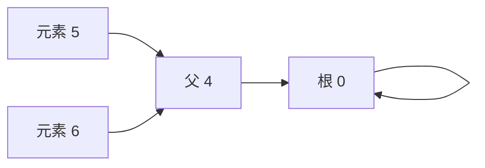

# 并查集、按大小合并与路径压缩

<div class="be-tutor-mount" data-tutor-lesson="cs-core-24" aria-hidden="true"></div>

> **任务先行：** 把 7 个元素维护成一片父节点森林，用按大小合并控制树高，再用完整路径压缩缩短后续查询路径。

## 任务路线

<div class="be-task-route" role="list" aria-label="本课六步任务"><span role="listitem">1 锁定基线</span><span role="listitem">2 父森林</span><span role="listitem">3 追踪 find</span><span role="listitem">4 按大小 union</span><span role="listitem">5 错误挂接</span><span role="listitem">6 分组迁移</span></div>

<section id="step-1" class="be-task-step" data-step-id="step-1" markdown="1">

## 第一步：锁定 Dijkstra 与 DSU 基线

先回归上一课 `dijkstra`，再运行 `dsu`。记录 `parents_before_find`、`find(5)` 的三次访问和一次真实压缩。**成功证据：**六次合并后只剩一个分量，Python 与 C++ 输出逐字一致。

</section>

<section id="step-2" class="be-task-step" data-step-id="step-2" markdown="1">

## 第二步：建立父节点森林

初始化 `parent[i]=i`、`size[i]=1`。根用“父节点就是自己”表示；父数组是集合维护结构，不是原图边，也不能还原图中的具体路径。



**主动修改：**把元素数改为 0 和 1。空集合有 0 个分量；单元素的 `find(0)` 访问起点兼根一次。

</section>

<section id="step-3" class="be-task-step" data-step-id="step-3" markdown="1">

## 第三步：追踪 `find` 路径

迭代向上收集从起点到根的完整路径，再把根之前的槽位直接指向根。`visits` 包含起点和根；`compressions` 只统计父值实际变化的槽位。样例路径 `5→4→0` 因 `4` 已指向 `0`，所以只修改 `5`。

</section>

<section id="step-4" class="be-task-step" data-step-id="step-4" markdown="1">

## 第四步：实现按大小合并

先分别 `find` 两端。不同根时把小树根挂到大树根；大小相同时由编号较小的根保留代表身份。重复合并不改变父数组、大小或分量数。多次 `find/union` 的摊还复杂度为 `O(α(n))`，不是每次最坏严格常量。

</section>

<section id="step-5" class="be-task-step" data-step-id="step-5" markdown="1">

## 第五步：执行越界与错误挂接实验

查询 `-1` 或 `element_count`。**预期失败：**Python 抛 `IndexError`，C++ 的范围检查抛 `out_of_range`，状态不变。再临时把任意元素而不是根挂到另一元素，观察大小只对根有效、路径可能异常增长；恢复“只挂根”不变量。

</section>

<section id="step-6" class="be-task-step" data-step-id="step-6" markdown="1">

## 第六步：完成 `groups` 迁移验收

对每个元素运行 `find`，按代表编号排序分组，组内成员按编号排序。覆盖零元素、单元素、多个分量、重复合并和压缩后分组。**验收：**分组不依赖原始 union 输入顺序，所有成员恰好出现一次。

</section>

## 固定输出

```text
可追踪并查集
elements=7
unions：0-1, 2-3, 0-2, 4-5, 5-6, 3-6
merged=6，components=1
parents_before_find：0, 0, 0, 0, 0, 4, 4
find(5)：root=0，visits=3，compressed=1
parents_after_find：0, 0, 0, 0, 0, 0, 4
connected(3,6)=yes
```

## 常见错误与排查

| 现象 | 原因 | 恢复 |
| --- | --- | --- |
| 父数组被当作图路径 | 混淆集合结构与原图 | 只把它解释为代表关系 |
| 平局时结果跨语言不同 | 没有稳定合并规则 | 同大小保留较小根 |
| 压缩计数偏大 | 把所有路径槽位都算写入 | 只计父值真实变化 |
| 重复合并减少分量数 | 未先比较两端根 | 同根立即返回未合并 |

## 来源与版本

| 来源 | 用途 | 核查日期 |
| --- | --- | --- |
| [Princeton Union-Find](https://algs4.cs.princeton.edu/15uf/) | 父森林、加权合并与路径压缩 | 2026-07-16 |
| [MIT 6.046 MST](https://ocw.mit.edu/courses/6-046j-design-and-analysis-of-algorithms-spring-2015/4a7fdddff3bc419c70bb470106a1663a_MIT6_046JS15_lec12.pdf) | DSU 在 Kruskal 中的角色 | 2026-07-16 |

本地 JavaGuide 材料只用于审计术语和误区，不复制 Java 模板、图片、推荐题或面试题。

## 下一步

进入 [Kruskal、环检测与最小生成森林](25-kruskal-minimum-spanning-forest.md)，用 DSU 判断一条候选边是否连接了两个不同分量。
