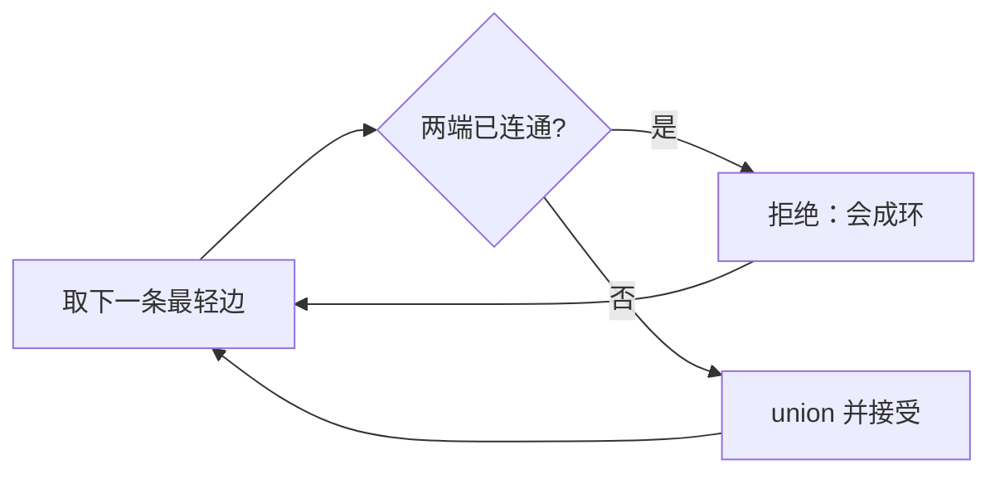

# Kruskal、环检测与最小生成森林

<div class="be-tutor-mount" data-tutor-lesson="cs-core-25" aria-hidden="true"></div>

> **任务先行：** 按确定顺序检查无向带权边，用并查集接受跨分量边、拒绝成环边，并让断开图得到最小生成森林。

## 任务路线

<div class="be-task-route" role="list" aria-label="本课六步任务"><span role="listitem">1 森林基线</span><span role="listitem">2 区分目标</span><span role="listitem">3 排序边</span><span role="listitem">4 DSU 判环</span><span role="listitem">5 断开与溢出</span><span role="listitem">6 拒绝边迁移</span></div>

<section id="step-1" class="be-task-step" data-step-id="step-1" markdown="1">

## 第一步：运行 DSU 与带权森林基线

先运行 `dsu`，再运行 `kruskal`。**成功证据：**7 个顶点分成 2 个连通分量，接受 5 条边，总权重 7，拒绝 3 条成环边。

</section>

<section id="step-2" class="be-task-step" data-step-id="step-2" markdown="1">

## 第二步：区分最短路径、生成树与生成森林

最短路径优化两个顶点间的路线；最小生成树优化连接整个连通图的总边权；断开图没有单棵生成树，但每个分量可组成最小生成森林。MST 允许负权，因为目标不是逐点固定距离。

**主动修改：**加入一个孤立顶点。森林分量数增加，边数仍满足 `V-C`；要求单树的接口必须失败。

</section>

<section id="step-3" class="be-task-step" data-step-id="step-3" markdown="1">

## 第三步：按 `(weight,u,v)` 排序

图构造规范化 `u<v`，允许负权、零权和相同权重，拒绝越界、自环与重复无向边。Kruskal 再按 `(weight,u,v)` 排序。这个平局规则只保证跨语言确定性，不证明最优森林唯一。

</section>

<section id="step-4" class="be-task-step" data-step-id="step-4" markdown="1">

## 第四步：用 DSU 接受无环边



接受边前执行安全权重加法。排序为 `O(E log E)`；近常量摊还的 DSU 不改变排序主导项。

</section>

<section id="step-5" class="be-task-step" data-step-id="step-5" markdown="1">

## 第五步：触发断开图与权重溢出实验

对样例调用 `minimum_spanning_tree`。**预期失败：**分量数为 2，不返回半成品。再用接近 `2^63-1` 的两条必选正权边触发总和溢出；Python 与 C++ 都在加法前/后受控拒绝。

</section>

<section id="step-6" class="be-task-step" data-step-id="step-6" markdown="1">

## 第六步：完成 `rejected_cycle_edges` 迁移验收

按检查顺序返回所有因两端已连通而拒绝的边。覆盖空图、树、单环、多分量、相同权重和输入排列变化。**验收：**原始边不变，接受数始终为 `V-C`，拒绝数为 `E-(V-C)`。

</section>

## 固定输出

```text
Kruskal 最小生成森林
edges_sorted：5-6@-1, 0-2@1, 1-2@2, 3-4@2, 2-3@3, 0-1@4, 1-3@5, 2-4@6
accepted：5-6@-1, 0-2@1, 1-2@2, 3-4@2, 2-3@3
rejected_cycles=3，components=2
total_weight=7，edge_count=5
```

## 常见错误与排查

| 现象 | 原因 | 恢复 |
| --- | --- | --- |
| 把结果当最短路径树 | 优化目标混淆 | 比较总连接权重而非单源距离 |
| 拒绝负权 | 套用 Dijkstra 前置 | MST 允许负权 |
| 断开图强行返回树 | 忽略分量 | 返回森林或由单树接口失败 |
| 同权时宣称唯一 | 确定排序被误当数学唯一性 | 只承诺确定输出 |

## 来源与版本

| 来源 | 用途 | 核查日期 |
| --- | --- | --- |
| [Princeton MST](https://algs4.cs.princeton.edu/43mst/index.php) | 割性质、Kruskal 与森林边界 | 2026-07-16 |
| [MIT 6.046 MST](https://ocw.mit.edu/courses/6-046j-design-and-analysis-of-algorithms-spring-2015/4a7fdddff3bc419c70bb470106a1663a_MIT6_046JS15_lec12.pdf) | 正确性与复杂度对照 | 2026-07-16 |

## 下一步

进入 [Lazy Prim、割边前沿与过期边](26-lazy-prim-cut-frontier-stale-edges.md)，换成从已访问集合向外扩张的局部最小前沿。
