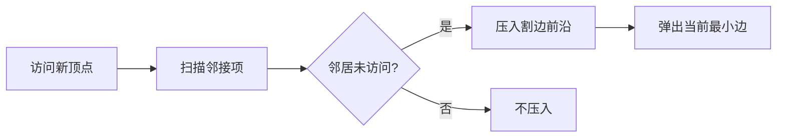

# Lazy Prim、割边前沿与过期边

<div class="be-tutor-mount" data-tutor-lesson="cs-core-26" aria-hidden="true"></div>

> **任务先行：** 从每个分量的最小顶点开始维护跨割边最小堆，跳过已经失效的内部边，并与 Kruskal 对照森林不变量。

## 任务路线

<div class="be-task-route" role="list" aria-label="本课六步任务"><span role="listitem">1 Kruskal 基线</span><span role="listitem">2 定义割边</span><span role="listitem">3 最小前沿</span><span role="listitem">4 重启分量</span><span role="listitem">5 过期边实验</span><span role="listitem">6 双算法迁移</span></div>

<section id="step-1" class="be-task-step" data-step-id="step-1" markdown="1">

## 第一步：运行 Kruskal 与 Prim 基线

依次运行 `kruskal`、`prim`。**成功证据：**Prim 从 0 和 5 启动两个分量，接受 5 条边、总权重 7；边集顺序可不同，但比较结果为 `yes`。

</section>

<section id="step-2" class="be-task-step" data-step-id="step-2" markdown="1">

## 第二步：定义已访问集合与割边

割把已访问顶点和未访问顶点分开。只有跨越这道割的边能安全扩张当前树。Prim 每次选择**当前割上**的最小边，不是每次取全图尚未使用的最小边。

</section>

<section id="step-3" class="be-task-step" data-step-id="step-3" markdown="1">

## 第三步：维护最小边前沿

访问新顶点时扫描全部邻接项，只把通向未访问顶点的边按 `(weight,u,v)` 压入队列。`edge_scans` 统计邻接项，`queue_pushes` 统计真实压入，`max_frontier` 在每次压入后更新。



</section>

<section id="step-4" class="be-task-step" data-step-id="step-4" markdown="1">

## 第四步：从最小未访问顶点重启森林

一个队列耗尽后，从编号最小的未访问顶点开始新分量；孤立顶点也记为分量起点，但不会产生边。**主动修改：**打乱输入边并新增孤立顶点，起点顺序仍由顶点编号决定。

</section>

<section id="step-5" class="be-task-step" data-step-id="step-5" markdown="1">

## 第五步：复现遗漏过期边检查

某条边压入时可能跨割，弹出时两端却已被其他边连接进树。若两端均访问，计一次 `stale_pop` 并跳过。临时删除检查会接受成环边并破坏 `V-C`；恢复后样例固定为 3 次过期弹出。

</section>

<section id="step-6" class="be-task-step" data-step-id="step-6" markdown="1">

## 第六步：完成双算法对照迁移验收

`compare_spanning_forests` 比较 Kruskal 与 Prim 的总权重、分量数以及两边数是否都为 `V-C`，不要求相同边集。覆盖空图、孤立点、负权、同权、多分量和输入不变性。Lazy Prim 时间为 `O(E log E)`，队列额外空间 `O(E)`。

</section>

## 固定输出

```text
Lazy Prim 最小生成森林
component_starts：0, 5
accepted：0-2@1, 1-2@2, 2-3@3, 3-4@2, 5-6@-1
edge_scans=16，queue_pushes=8，stale_pops=3，max_frontier=4
components=2，total_weight=7
matches_kruskal=yes
```

## 常见错误与排查

| 现象 | 原因 | 恢复 |
| --- | --- | --- |
| 每次选全图最小边 | 混淆 Kruskal 与 Prim | 只维护当前割边 |
| 接受边超过 `V-C` | 没跳过过期内部边 | 弹出时检查两端访问状态 |
| 断开图漏顶点 | 只从顶点 0 启动一次 | 从最小未访问顶点重启 |
| 要求两算法边集一致 | 忽略同权多解 | 比较权重、分量与边数 |

## 来源与版本

| 来源 | 用途 | 核查日期 |
| --- | --- | --- |
| [Princeton MST](https://algs4.cs.princeton.edu/43mst/index.php) | Lazy Prim、割性质与复杂度 | 2026-07-16 |
| [Princeton PrimMST](https://algs4.cs.princeton.edu/code/javadoc/edu/princeton/cs/algs4/PrimMST.html) | Prim 接口与前沿对照 | 2026-07-16 |
| [Python 3.11 `heapq`](https://docs.python.org/3.11/library/heapq.html) | 最小堆前沿 | 2026-07-16 |
| [C++ `priority_queue`](https://eel.is/c++draft/priority.queue) | 容器适配器与比较键 | 2026-07-16 |

## 下一步

并查集与最小生成森林闭环完成。下一阶段进入计算机运行基础；有向图、负权最短路与网络流仍未开放。
