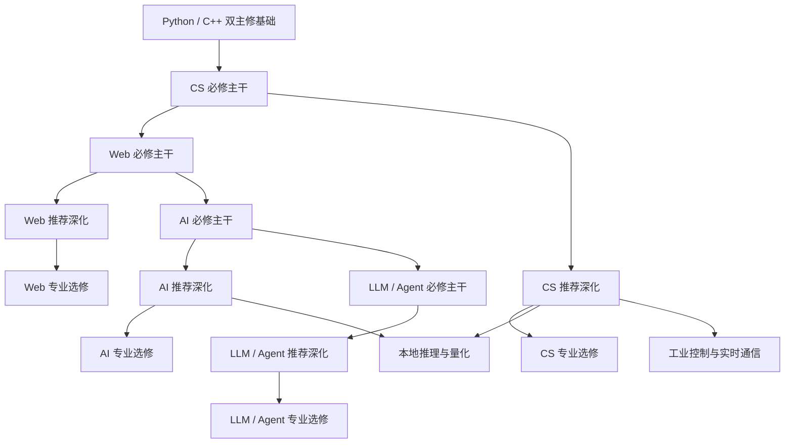

# 完整课程地图

这张地图展示 Become Engineer 从共同基础到深入方向的完整结构。第一次学习时，请先使用[开始学习](beginner-roadmap.md)中的默认路线；当你想加强工程熟练度、准备机考或进入专业方向时，再回到这里选择已经满足前置条件的模块。

## 三层课程结构

| 层级 | 作用 | 是否阻塞默认路线 | 完成依据 |
| --- | --- | --- | --- |
| 必修主干 | 建立所有后续方向共同需要的能力 | 是，达到验收后才能进入下一主线 | 课程练习、阶段产出和客观验收 |
| 推荐深化 | 提升工程熟练度、原理理解和机考能力 | 否，但可能是专业选修的前置 | 专题实验、题集、限时测试和复盘 |
| 专业选修 | 面向具体职业、系统或研究方向 | 否，只影响该方向及其后续模块 | 专项实验、跨模块项目和领域验收 |

“推荐深化”不是不重要，而是不要求所有学习者在同一时间完成。跳过选修不会阻塞默认路线，但可能无法进入依赖它的更深方向。

## 默认必修路线

```text
工程基础
  -> Python 起步
    -> Python / C++ 双主修基础
      -> CS 必修主干
        -> Web 必修主干 + CS 持续深化
          -> AI 必修主干
            -> LLM / Agent 必修主干
```

工程基础和语言路线已经单独定义。本页重点说明语言之后如何从必修主干进入推荐深化和专业选修。

## 解锁关系



## CS

### 必修主干

- 数据结构与复杂度：数组、二维数组、字符串、链表、栈、队列、哈希表、树和基础图。
- 基础算法：查找、排序、递归、迭代、BFS、DFS和复杂度分析。
- 计算机基础：进程、线程、内存、文件、系统调用和计算机运行模型。
- 网络与数据库最小核心：IP、TCP、DNS、HTTP、关系模型、SQL、索引和事务。

### 推荐深化

- 算法与机考：双指针、滑动窗口、前缀和、二分、堆、并查集、回溯、贪心、动态规划、图算法、区间和栈/队列模拟。
- 系统编程：进程线程、同步、内存、文件系统、系统调用、调试和性能观察。
- 网络深化：TCP行为、连接管理、协议设计、缓存、代理和故障分析。
- 数据库原理：事务、隔离、索引、查询计划、并发、备份和恢复。
- 系统设计与安全：缓存、队列、一致性、可用性、扩展、认证、授权和最小权限。

### 专业选修

- 工业控制与实时通信。
- 分布式系统与高性能计算。
- 编译原理与程序语言。
- 网络与系统安全。

详细前置、实践和验收见[CS 核心](cs-core/README.md)。

## Web

### 必修主干

- 浏览器、HTML、CSS、JavaScript和TypeScript。
- 组件化、状态、表单和网络请求。
- Python后端、FastAPI、API契约和错误处理。
- PostgreSQL、psql、数据建模、迁移和MySQL对照。
- 认证、权限、测试、日志、安全和部署闭环。

### 推荐深化

- 前端工程、后端并发、数据库工程、API设计与安全。
- 性能、可观测性、发布、回滚和故障排查。

### 专业选修

- 前端工程、后端工程、实时通信、Java后端、DevOps/SRE。

详细前置、实践和验收见[Web 全栈](web-fullstack/README.md)。

## AI

### 必修主干

- 数学、数据处理、实验设计和评估。
- 机器学习、深度学习、NLP/Transformer基础。
- 训练、验证、误差分析和可复现实验。

### 推荐深化

- 优化与统计、经典机器学习扩展、深度网络与NLP深化。
- 实验工程、MLOps、可解释性、鲁棒性和风险分析。

### 专业选修

- 强化学习、计算机视觉、NLP与信息抽取、多模态与生成模型、时序与推荐。

详细前置、实践和验收见[AI 基础](ai-foundation/README.md)。

## LLM / Agent

### 必修主干

- 模型基础、结构化输出、检索基线、RAG和引用。
- 固定评估集、Tool Calling、有界工作流、安全和部署。

### 推荐深化

- 检索工程、评估系统、Agent状态与记忆、上下文工程。
- 成本、延迟、可观测性、提示注入防护和失败恢复。

### 专业选修

- 微调与对齐、本地推理与量化、Text2SQL、多模态Agent、Coding/Research Agent。

详细前置、实践和验收见[LLM/Agent](llm-agent/README.md)。

## 选修规则

1. 先完成模块明确列出的前置，不按兴趣直接跳进高级内容。
2. 推荐深化不会阻塞默认路线，但专业选修可以依赖一个或多个推荐深化模块。
3. 每个选修必须有可检查的产出；只阅读资料不算完成。
4. 算法题、框架实验和工具教程优先进入练习或项目里程碑，不自动成为独立项目。
5. 需要真实设备、付费服务或高算力的内容，必须提供无设备或低成本的前置验证路径。

## 素材状态

| 主线 | 已登记来源 | 本页状态 |
| --- | --- | --- |
| CS | CS DIY及其课程候选 | 来源已登记，按模块取用，未编写正文 |
| Web | CS DIY、FastAPI官方文档 | 来源已登记，按模块取用，未编写正文 |
| AI | 大模型笔记素材池、CS DIY课程候选 | 来源已审计或登记，未按本架构重组正文 |
| LLM/Agent | 大模型笔记素材池、官方技术文档 | 来源已审计或登记，未按本架构重组正文 |

来源充足不等于课程完成。后续建设每个模块时，仍需按需取材、去重、纠错、核查版本并独立重写。
