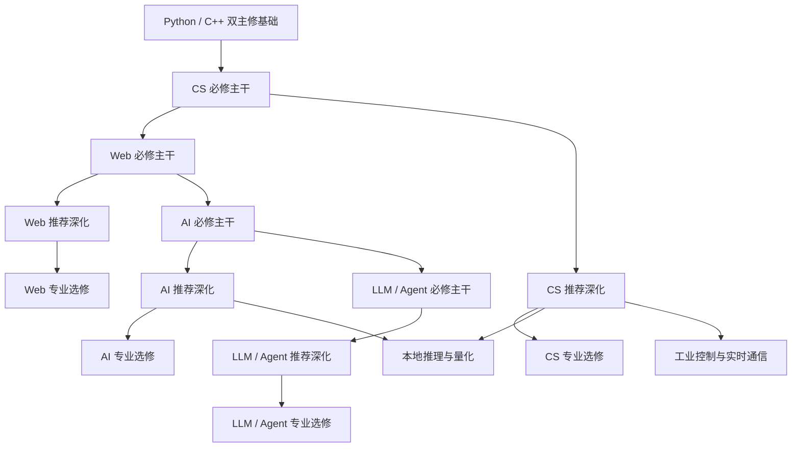

<div class="be-page-hero be-map-hero" markdown>

<span class="be-page-eyebrow">看清主干、深化与专业方向</span>

# 完整课程地图

这张地图展示 Become Engineer 从共同基础到深入方向的完整结构。它是唯一课程总表，不会为四类学习者复制四套正文。你可以先让小码根据目标与能力编排推荐路线，也可以直接沿默认路线学习；当你想加强工程熟练度、准备求职或进入专业方向时，再回到这里选择已经满足前置条件的模块。

<div class="be-page-actions" markdown>

[按默认路线开始](beginner-roadmap.md){ .md-button .md-button--primary }
[让小码规划路线](../README.md#learning-assessment){ .md-button }
[进入第一课](engineering-foundation/stage-0/01-learning-method.md){ .md-button }

</div>

</div>

## 三层课程结构

<div class="be-layer-grid">
  <div class="be-layer-card" data-layer="required">
    <span>01 · 默认路线</span>
    <strong>必修主干</strong>
    <p>建立后续方向共同需要的能力。达到课程练习、阶段产出和客观验收后，才能进入下一主线。</p>
  </div>
  <div class="be-layer-card" data-layer="deepen">
    <span>02 · 按需加强</span>
    <strong>推荐深化</strong>
    <p>提升工程熟练度、原理理解和机考能力。不阻塞默认路线，但可能是专业选修的前置。</p>
  </div>
  <div class="be-layer-card" data-layer="elective">
    <span>03 · 方向选择</span>
    <strong>专业选修</strong>
    <p>面向具体职业、系统或研究方向，只影响该方向及其后续模块，以专项实验和领域项目验收。</p>
  </div>
</div>

“推荐深化”不是不重要，而是不要求所有学习者在同一时间完成。跳过选修不会阻塞默认路线，但可能无法进入依赖它的更深方向。

## 四类画像如何使用同一课程表

<div class="be-profile-route-table" markdown>

| 学习画像 | 推荐起点 | 主干编排 | 深化与项目 | 求职训练 |
| --- | --- | --- | --- | --- |
| 从零起步 · 兴趣学习 | 工程基础第 1 课 | 完整工程基础、语言基础、核心知识 | 按兴趣选择深化挑战和项目 | 默认不加入 |
| 已有基础 · 兴趣学习 | 第一个未证明掌握的能力缺口；无明显缺口时进入语言核心 | 收起已掌握课程，保留具体补修 | 优先核心、深化挑战和兴趣项目 | 默认不加入 |
| 从零起步 · 求职准备 | 工程基础第 1 课 | 与从零兴趣共用完整主干 | 每个阶段验收后再增加项目表达 | 分阶段加入机考、证据问答与复盘，不在第一天堆题 |
| 已有基础 · 求职准备 | 具体缺口或当前第一节核心课 | 缺口补修与核心课程并行 | 深化挑战、可叙事项目和迁移验收 | 加入通用软件工程求职训练，岗位专项满足前置后再解锁 |

</div>

小码的四类画像只是入口，内部仍分别判断工程工具、编程基础、算法与 CS、项目工程。不会因为 Git 不熟就把有编程经验的人整体判定为“从零”，也不会因为会写语法就默认其具备测试、工程和算法能力。

## 可复用内容资产

同一课程 URL 可以组合四类资产，课程事实和核心任务只维护一份：

<div class="be-content-assets-table" markdown>

| 资产 | 解决的问题 | 默认使用者 | 验收方式 |
| --- | --- | --- | --- |
| 基础课程 | 可靠知识、核心任务、排错和迁移 | 四类学习者 | 运行结果、主动修改、失败实验和完成证据 |
| 新手操作包 | 软件在哪里、怎样安装、怎样打开、第一次看到什么 | 从零路线及工程工具补修者 | 完成首次打开、版本确认和最小操作 |
| 深化挑战包 | 原理、边界、性能、复杂度和工程权衡 | 已有基础者或完成主干者 | 对照实验、边界测试、设计说明和迁移题 |
| 求职训练包 | 原创机考、限时模拟、项目证据问答和失败复盘 | 求职路线 | 固定输入输出、测试、限时记录和基于证据的表达 |

</div>

求职内容不建立孤立“八股”手册。问题必须挂到课程或项目证据上，让学习者用代码、测试、图、日志或故障复盘回答。

## 总课程建设表

<div class="be-curriculum-plan-table" markdown>

| 阶段 | 基础课程主干 | 新手操作包 | 深化挑战 | 求职训练 | 连续成果或项目 | 当前状态 |
| --- | --- | --- | --- | --- | --- | --- |
| 工程基础 | 学习方法、文件、终端、VS Code、Markdown、本地 Git、GitHub、环境、Docker、验证习惯，共 10 课 | Windows/macOS 首次寻找、安装、打开和验证；Linux 简明补充 | Shell、Git 边界、环境隔离和可复现验证 | Git/GitHub 故障说明、提交证据与工程习惯问答 | 本地学习工作区 | 主干与新手操作包已开放 |
| Python 起步 | 变量、控制流、函数、容器、文件 JSON、模块环境、异常测试，共 7 课 | 运行 Python、路径、虚拟环境与报错定位 | 输入边界、数据建模、模块职责和测试设计 | 原创分级机考 6 题与 45 分钟模拟 | 学习进度报告器 | 主干和首组求职训练已开放 |
| C++ 核心 | 构建类型、函数组织、CMake、STL、对象资源，共 5 课 | 编译器、构建命令和诊断阅读 | 类型、容器、生命周期、RAII 与跨语言权衡 | 编译诊断、资源安全和项目证据题待补 | 双语言学习进度报告器 | 主干已开放；训练包待补 |
| Python 核心 | 类型接口、模块边界、迭代器、数据类资源、装饰器上下文，共 5 课 | mypy、包结构和多模块运行补充 | 协议、惰性计算、资源边界与类型安全包装 | 项目证据问答已开放；语言专项题待补 | 双语言学习进度报告器 | 主干已开放；继续工程化深化 |
| CS 必修 | 数据结构、算法、系统、网络、数据库最小核心 | 可视化执行过程和最小实验环境 | 机考算法、系统编程、网络、数据库和系统设计 | 分级算法题、限时模拟、错题与复杂度复盘 | 数据结构实现与系统实验 | 课程结构已公开；正文待建设 |
| Web 必修 | 浏览器、前端、API、数据库、认证、测试与部署 | 本地服务、浏览器开发者工具和数据库首次连接 | 前后端工程、性能、可观测性、安全和发布 | API 设计、SQL、调试与系统设计训练 | 可部署的完整 Web 应用 | 已规划，正文待建设 |
| AI 必修 | 数学、数据、机器学习、深度学习、NLP 与评估 | Python 科学计算环境和首次可复现实验 | 实验工程、MLOps、鲁棒性、解释与专项模型 | 实验讲解、误差分析和 AI 应用工程证据 | 结构化数据、文本分类和控制实验 | 已规划，正文待建设 |
| LLM / Agent | 模型、结构化输出、RAG、评估、工具调用和有界工作流 | API/本地模型首次调用与安全配置 | 检索、记忆、上下文、成本、延迟与防护 | AI 应用工程岗位训练 | 可评估的智能学习助手 | 已规划，正文待建设 |
| 岗位专项 | 复用共同课程，不复制主干 | 只补岗位工具缺口 | AI 应用、后端、C++ 等专项深化 | 岗位题型、项目表达和模拟面试 | 同一项目按岗位生成不同证据视角 | 通用软件工程样板已开放；专项待建设 |

</div>

当前正式课程共 27 节：工程基础 10 节、Python 起步 7 节、C++ 核心 5 节、Python 核心 5 节。CS、Web、AI、LLM/Agent 的结构说明不是已完成课程；个性化结果会明确标记“内容尚未建设”，不会把规划伪装成开放内容。

### 建设顺序

1. **共同基础收口**：持续根据小白反馈修订终端、编辑器、Git/GitHub 和首次运行，不另建重复课程。
2. **四路线纵向样板**：以工程基础、Python 起步和学习进度报告器验证四类画像、补修、深化与求职训练的组合效果。
3. **CS 共同主干**：先建设数据结构、算法与复杂度，再补系统、网络和数据库最小核心；同步形成通用软件工程求职层。
4. **Web 完整应用**：用一个可部署项目串起前后端、数据库、认证、测试和发布，避免只学框架页面。
5. **AI 与 LLM/Agent**：先建立可复现实验与评估，再进入模型、RAG、工具和 Agent；复用 Web/API、数据和工程基础。
6. **岗位专项**：只有共同能力和真实项目证据稳定后，才扩展 AI 应用、后端和 C++ 岗位训练，避免提前堆积题库。

## 默认必修路线

```text
工程基础
  -> Python 起步
    -> Python / C++ 双主修基础
      -> CS 必修主干
        -> Web 必修主干 + CS 持续深化
          -> AI 必修主干
            -> LLM / Agent 必修主干
```

工程基础和语言路线已经单独定义。本页重点说明语言之后如何从必修主干进入推荐深化和专业选修。

## 选择一个领域查看

<nav class="be-domain-grid" aria-label="课程领域">
  <a href="#cs"><strong>CS</strong><span>算法、系统、网络与数据库</span></a>
  <a href="#web"><strong>Web</strong><span>前后端、数据、部署与安全</span></a>
  <a href="#ai"><strong>AI</strong><span>数学、模型、训练与评估</span></a>
  <a href="#llm-agent"><strong>LLM / Agent</strong><span>检索、工具、工作流与评估</span></a>
</nav>

## 解锁关系



## CS

<div class="be-map-layer" data-layer="required" markdown>

### 必修主干

- 数据结构与复杂度：数组、二维数组、字符串、链表、栈、队列、哈希表、树和基础图。
- 基础算法：查找、排序、递归、迭代、BFS、DFS和复杂度分析。
- 计算机基础：进程、线程、内存、文件、系统调用和计算机运行模型。
- 网络与数据库最小核心：IP、TCP、DNS、HTTP、关系模型、SQL、索引和事务。

</div>

<div class="be-map-layer" data-layer="deepen" markdown>

### 推荐深化

- 算法与机考：双指针、滑动窗口、前缀和、二分、堆、并查集、回溯、贪心、动态规划、图算法、区间和栈/队列模拟。
- 系统编程：进程线程、同步、内存、文件系统、系统调用、调试和性能观察。
- 网络深化：TCP行为、连接管理、协议设计、缓存、代理和故障分析。
- 数据库原理：事务、隔离、索引、查询计划、并发、备份和恢复。
- 系统设计与安全：缓存、队列、一致性、可用性、扩展、认证、授权和最小权限。

</div>

<div class="be-map-layer" data-layer="elective" markdown>

### 专业选修

- 工业控制与实时通信。
- 分布式系统与高性能计算。
- 编译原理与程序语言。
- 网络与系统安全。

</div>

详细前置、实践和验收见[CS 核心](cs-core/README.md)。

## Web

<div class="be-map-layer" data-layer="required" markdown>

### 必修主干

- 浏览器、HTML、CSS、JavaScript和TypeScript。
- 组件化、状态、表单和网络请求。
- Python后端、FastAPI、API契约和错误处理。
- PostgreSQL、psql、数据建模、迁移和MySQL对照。
- 认证、权限、测试、日志、安全和部署闭环。

</div>

<div class="be-map-layer" data-layer="deepen" markdown>

### 推荐深化

- 前端工程、后端并发、数据库工程、API设计与安全。
- 性能、可观测性、发布、回滚和故障排查。

</div>

<div class="be-map-layer" data-layer="elective" markdown>

### 专业选修

- 前端工程、后端工程、实时通信、Java后端、DevOps/SRE。

</div>

详细前置、实践和验收见[Web 全栈](web-fullstack/README.md)。

## AI

<div class="be-map-layer" data-layer="required" markdown>

### 必修主干

- 数学、数据处理、实验设计和评估。
- 机器学习、深度学习、NLP/Transformer基础。
- 训练、验证、误差分析和可复现实验。

</div>

<div class="be-map-layer" data-layer="deepen" markdown>

### 推荐深化

- 优化与统计、经典机器学习扩展、深度网络与NLP深化。
- 实验工程、MLOps、可解释性、鲁棒性和风险分析。

</div>

<div class="be-map-layer" data-layer="elective" markdown>

### 专业选修

- 强化学习、计算机视觉、NLP与信息抽取、多模态与生成模型、时序与推荐。

</div>

详细前置、实践和验收见[AI 基础](ai-foundation/README.md)。

## LLM / Agent

<div class="be-map-layer" data-layer="required" markdown>

### 必修主干

- 模型基础、结构化输出、检索基线、RAG和引用。
- 固定评估集、Tool Calling、有界工作流、安全和部署。

</div>

<div class="be-map-layer" data-layer="deepen" markdown>

### 推荐深化

- 检索工程、评估系统、Agent状态与记忆、上下文工程。
- 成本、延迟、可观测性、提示注入防护和失败恢复。

</div>

<div class="be-map-layer" data-layer="elective" markdown>

### 专业选修

- 微调与对齐、本地推理与量化、Text2SQL、多模态Agent、Coding/Research Agent。

</div>

详细前置、实践和验收见[LLM/Agent](llm-agent/README.md)。

## 选修规则

1. 先完成模块明确列出的前置，不按兴趣直接跳进高级内容。
2. 推荐深化不会阻塞默认路线，但专业选修可以依赖一个或多个推荐深化模块。
3. 每个选修必须有可检查的产出；只阅读资料不算完成。
4. 算法题、框架实验和工具教程优先进入练习或项目里程碑，不自动成为独立项目。
5. 需要真实设备、付费服务或高算力的内容，必须提供无设备或低成本的前置验证路径。

## 素材状态

| 主线 | 已登记来源 | 本页状态 |
| --- | --- | --- |
| CS | CS DIY及其课程候选 | 来源已登记，按模块取用，未编写正文 |
| Web | CS DIY、FastAPI官方文档 | 来源已登记，按模块取用，未编写正文 |
| AI | 大模型笔记素材池、CS DIY课程候选 | 来源已审计或登记，未按本架构重组正文 |
| LLM/Agent | 大模型笔记素材池、官方技术文档 | 来源已审计或登记，未按本架构重组正文 |

来源充足不等于课程完成。后续建设每个模块时，仍需按需取材、去重、纠错、核查版本并独立重写。
