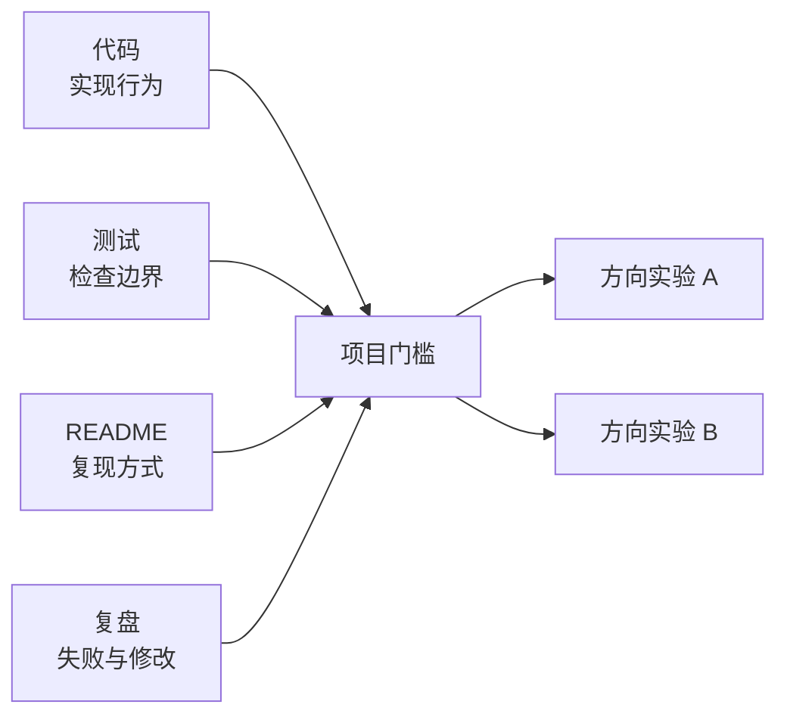

<div class="be-tutor-mount" data-tutor-lesson="direction-choice-01" aria-hidden="true"></div>

<section id="overview-first-verifiable-project" class="be-page-hero be-lesson-hero" data-learning-context="overview-first-verifiable-project" data-context-type="overview" markdown="1">

<span class="be-page-eyebrow">共同基座 · 方向选择 · 第一个项目门槛</span>

# 首个可验证项目：从代码证据到方向试学

## 不问“我适合什么”，先证明做完了一次

示例检查器读取一份项目清单，逐项确认代码、测试、说明和复盘文件真实存在，再给出两个为期两周的方向实验。

```text
project=study-summary-v01
evidence code=pass path=evidence/study_summary.py
evidence tests=pass path=evidence/test_study_summary.py
evidence readme=pass path=evidence/README.md
evidence reflection=pass path=evidence/retrospective.md
gate=pass
next_experiments=application-engineering,algorithm
decision=two-week-trial-not-career-conclusion
```

这不是职业测评。它只回答两个更可靠的问题：你的第一个项目是否有别人能复核的证据，以及下一步值得用真实练习比较哪两条路线。

</section>

<div class="be-lesson-overview">
  <div><span>课程位置</span><strong>共同基座 · 方向选择 · 1 / 1</strong></div>
  <div><span>前置</span><strong>Python 起步 7 课 + CS 起步 4 课</strong></div>
  <div><span>环境</span><strong>Python 3.11+ 标准库</strong></div>
  <div><span>完成后留下</span><strong>项目证据清单、检查输出和两周试学计划</strong></div>
</div>

## 开始前

- 你已经能运行 Python 文件和 unittest。
- 你已经做过至少一个包含输入、处理与输出的小程序。
- 如果还没有自己的项目，可以先完整复现本课的 `study-summary-v01`，再替换成自己的文件。
- 本课不要求先决定求职岗位，也不要求一次选定长期方向。

## 学习目标

- 区分“我写过代码”和“项目可以被复核”。
- 用结构化清单关联代码、测试、说明和复盘。
- 拒绝不存在、为空或逃出工作区的证据路径。
- 根据兴趣和实际信号选择两个短期实验，而不是制造不可撤销的职业结论。
- 能向别人演示一次成功路径和一次失败修复。

<section id="concept-four-evidence-kinds" data-learning-context="concept-four-evidence-kinds" data-context-type="concept" markdown="1">

## 四类文件共同回答“做完了吗”

| 证据 | 回答的问题 | 只有这一项时缺什么 |
| --- | --- | --- |
| 代码 | 你实现了什么行为 | 不知道是否正确、怎样运行 |
| 测试 | 哪些边界被自动检查 | 不知道项目目的与使用方式 |
| README | 环境、命令、输入输出是什么 | 不能证明失败路径真的处理过 |
| 复盘 | 哪个假设错了、怎样修改、还缺什么 | 不能替代可运行实现 |

四项不是文件数量游戏。`portfolio.json` 还要求每项写出一条具体 `claim`，例如“覆盖正常、空输入和负数拒绝”。“我学会了 Python”太宽，无法从一个文件中核对。



门槛通过只说明这个项目形成闭环，不说明代码已经达到生产质量，更不说明某条职业路线必然适合你。

</section>

<section id="example-study-summary-evidence" data-learning-context="example-study-summary-evidence" data-context-type="example" markdown="1">

## 小项目也可以有完整证据

示例项目汇总三段学习时长：

```python
def summarize(hours: list[float]) -> dict[str, float | int]:
    if any(hour < 0 for hour in hours):
        raise ValueError("hours must be non-negative")
    return {
        "sessions": len(hours),
        "total_hours": round(sum(hours), 2),
    }
```

它不复杂，但三项测试明确覆盖正常输入、空列表和负数拒绝。README 记录命令，复盘承认还没有处理单位转换、持久化和并发写入。

这比一个功能更多、却没有测试和说明的目录更适合作为第一份项目证据。第一份项目的重点是闭环，不是规模。

</section>

<section id="reproduce-portfolio-checker" data-learning-context="reproduce-portfolio-checker" data-context-type="reproduce" markdown="1">

## 运行项目和证据检查器

从仓库根目录执行：

```bash
cd site-src/examples/direction-choice/verification-portfolio-v01
../../../../.venv/bin/python -m unittest discover -s evidence -p 'test_study_summary.py' -v
../../../../.venv/bin/python evidence/study_summary.py
../../../../.venv/bin/python -m unittest -v test_portfolio_check.py
../../../../.venv/bin/python portfolio_check.py --manifest portfolio.json --workspace .
```

你会看到 3 项项目测试与 6 项检查器测试通过。项目输出为：

```text
{'sessions': 3, 'total_hours': 2.75}
```

检查器固定验证：

- 四类证据都存在且非空。
- 路径必须是工作区内的相对路径。
- 方向名称与信号来自公开白名单。
- 兴趣强度是 1–5 的整数。
- 建议按兴趣、匹配信号数和稳定名称排序。

它不会联网，不读取个人账号，不上传文件，也不保存长期画像。

</section>

<section id="concept-direction-trials" data-learning-context="concept-direction-trials" data-context-type="concept" markdown="1">

## 方向选择是一组实验，不是性格判决

示例登记三条试学观察：

| 路线 | 兴趣 | 已出现的信号 | 下一实验 |
| --- | ---: | --- | --- |
| 应用工程 | 4 | 接口、数据流 | 把汇总接成 API 或页面 |
| 算法 | 3 | 正确性、执行轨迹 | 为边界用例画出可回放轨迹 |
| 系统工程 | 2 | 运行时 | 做一次进程或资源生命周期实验 |

检查器选择前两项，是为了限制下一阶段投入，不是给所有路线排终身名次。两周后应根据实际记录更新：是否愿意继续、哪类困难仍有兴趣解决、你能否解释测试与失败。

| 路线 | 第一组公开入口 |
| --- | --- |
| 应用工程 | Python 核心、Web 起步 |
| 系统工程 | C++ 起步、CS 系统基础 |
| 算法 | 共同算法基础 |
| AI 模型 | 数学、数据与可复现实验（待建设） |
| LLM／Agent | 模型使用与结构化输出（待建设） |
| 设备系统 | C 语言起步（待建设） |

尚未建设的方向不创建空课程。你可以先保留选择，继续一条已开放路线，等正式正文和实验一起上线后再进入。

</section>

<section id="modify-own-portfolio" data-learning-context="modify-own-portfolio" data-context-type="modify" markdown="1">

## 把清单换成你自己的项目

复制 `portfolio.json` 为 `portfolio.local.json`，完成三处修改：

1. 把 `project_id` 改成你的项目名。
2. 把四条路径指向你自己的代码、测试、README 和复盘。
3. 只保留你愿意实际尝试的 2–3 条路线，并写下具体信号。

先故意删掉 `reflection` 条目，运行检查器，确认它返回：

```text
portfolio_error=missing evidence kinds: reflection
```

补回复盘后再运行。不要为了通过而创建空文件；空文件会被拒绝，模糊的 claim 也应该由你在人工检查时退回重写。

最后为两条候选路线各写一个两周实验：

- 明确产出，例如“一条本机 API + 5 项测试”，不要只写“学习 Web”。
- 明确投入上限，例如 6 小时，防止方向比较无限延长。
- 明确停止条件，例如三次复现仍无法解释且不愿继续。
- 明确比较记录：完成度、遇到的困难、愿不愿意再做一次。

</section>

<section id="troubleshoot-portfolio-evidence" data-learning-context="troubleshoot-portfolio-evidence" data-context-type="troubleshoot" markdown="1">

## 检查器通过，项目仍可能说不清

| 现象 | 原因 | 恢复 |
| --- | --- | --- |
| `artifact path escapes workspace` | 使用绝对路径或 `..` 越出目录 | 把文件放回项目内并使用相对路径 |
| `artifact is missing or empty` | 路径错误或占位空文件 | 修正路径，写出真实内容 |
| `missing evidence kinds` | 四类证据没有闭环 | 补缺失项，不复制同一文件冒充 |
| `unknown route` | 自造了检查器未登记的路线 | 选择稳定路线，细分方向写进 note |
| 输出通过但无法演示 | README 命令漂移或 claim 太宽 | 由另一人按 README 复现并收窄 claim |
| 两周后仍无法选择 | 实验产出不可比较 | 使用相同投入上限和记录维度重做 |

如果测试只证明函数返回，却没有覆盖你在 README 中承诺的关键行为，检查器不会替你发现语义漂移。自动检查守住文件和结构边界，人工复核仍要执行命令、阅读差异并追问剩余风险。

</section>

<section id="project-verification-portfolio-v01" data-learning-context="project-verification-portfolio-v01" data-context-type="project" markdown="1">

## 工程学习工作台：验证档案 v0.1

- 上一阶段：Python 起步留下可运行程序与测试，CS 起步留下表示、复杂度和边界解释。
- 这一版：用 `portfolio.json` 把代码、测试、说明和复盘关联成一个可检查档案。
- 关键文件：`portfolio_check.py`、`portfolio.json`、`evidence/` 与 `test_portfolio_check.py`。
- 保存内容：成功输出、一次缺失证据失败、修复记录和两条两周实验。
- 下一阶段：根据实际实验进入应用、系统、算法、AI、LLM/Agent 或设备方向。

这个档案不收集真实姓名、邮箱、公司、薪资或账号。求职时可以展示技术证据，但私人约束与未公开项目不应直接提交到公开仓库。

</section>

## 四类学习者入口

- 零基础兴趣：完整复现示例，再把四类文件换成自己的小项目。
- 有基础兴趣：直接运行检查器；若已具备四类证据，就把时间用于两个方向实验。
- 零基础求职：在共同项目闭环后，增加 3 分钟演示和一次失败修复说明。
- 有基础求职：用现有项目替换示例，重点审查 claim、回归测试和剩余风险是否可追问。

<section id="career-project-evidence-review" data-learning-context="career-project-evidence-review" data-context-type="career" markdown="1">

## 求职加练：项目能运行，但评审者不相信

原创追问：候选人展示了一个学习汇总项目，现场运行成功，却没有失败样本、测试报告或版本变化。你会要求补哪三类材料，怎样设计一次可重复故障，并用什么边界避免把一次成功演示夸大为生产可靠性？

回答至少关联测试、复现说明、失败复盘三个证据族，并明确一项尚未验证的风险。能力信号只用于设计项目解释与复现要求，不代表任何企业的真实题目或频率。

</section>

## 完成检查

- 四类证据文件都真实存在、非空，并能由另一人按 README 运行。
- 项目测试 3 项、检查器测试 6 项全部通过。
- 能解释为什么路径不能逃出工作区。
- 至少复现一次缺失证据失败，并保存修复前后输出。
- 两条方向实验都有产出、投入上限、停止条件和比较记录。
- 没有把检查器排序描述为职业结论。
- 公开档案不含个人账号、真实凭据或未授权项目内容。

## 来源与版本

- 适用 Python 3.11+，运行只使用标准库；核查日期 2026-07-23。
- [Python `argparse`](https://docs.python.org/3.11/library/argparse.html)：命令行参数与退出路径。
- [Python `json`](https://docs.python.org/3.11/library/json.html)：清单读取与 JSON 错误。
- [Python `pathlib`](https://docs.python.org/3.11/library/pathlib.html)：路径解析、文件与工作区检查。
- [Python `unittest`](https://docs.python.org/3.11/library/unittest.html)：正常与失败边界回归。

## 下一步

根据两周实验进入一条已开放路线：

- 应用工程：[Python 核心](../programming-languages/python-core/01-type-hints-interfaces-static-checking.md)或[Web 起步](../web-fullstack/web-start/01-browser-html-learning-card.md)。
- 系统工程：[C++ 起步](../programming-languages/cpp-core/01-build-types-io.md)与[CS 系统基础](../cs-systems-core/01-program-process-exit-status.md)。
- 算法：[共同算法基础](../cs-core/05-dynamic-array-capacity-amortized-cost.md)。
- 其余方向先查看[完整课程地图](../curriculum-map.md)，只在正式课程开放后进入。
