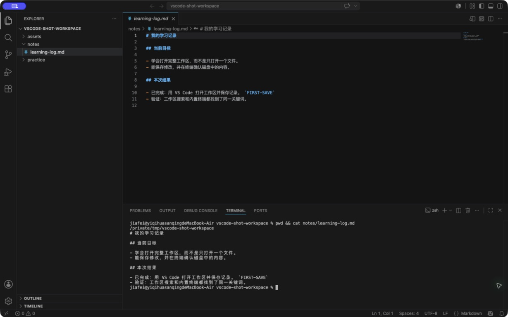

<div class="be-tutor-mount" data-tutor-lesson="engineering-foundation-04" aria-hidden="true"></div>

<section id="overview-editor-result" class="be-page-hero be-lesson-hero" data-learning-context="overview-editor-result" data-context-type="overview" markdown="1">

<span class="be-page-eyebrow">工程基础入门 · 第四课</span>

# VS Code 编辑器

## 同一份记录，从三个地方都能找到

今天结束时，`learning-log.md` 会在三个地方出现：编辑区显示你的修改，工作区搜索找到你加的关键词，内置终端读出保存后的同一行。

<div class="be-editor-results" role="list">
  <span role="listitem"><b>01</b> 文件保存后仍在</span>
  <span role="listitem"><b>02</b> 搜索命中正确位置</span>
  <span role="listitem"><b>03</b> 终端读到相同内容</span>
</div>

三个地方对得上，说明你不只是“把字打进窗口”，而是真的找到了项目、改对了文件，并把内容写进了磁盘。

<div class="be-page-actions" markdown="1">
[先认识界面](#concept-editor-layout){ .md-button .md-button--primary }
[返回终端与 Shell](03-terminal-shell.md){ .md-button }
</div>

</section>

<div class="be-lesson-overview">
  <div><span>课程位置</span><strong>工程基础入门 · 4 / 10</strong></div>
  <div><span>使用工具</span><strong>Visual Studio Code</strong></div>
  <div><span>完成后留下</span><strong>保存、搜索和终端复核结果</strong></div>
</div>

<section id="concept-editor-layout" data-learning-context="concept-editor-layout" data-context-type="concept" markdown="1">

## 先认清四个区域

<figure class="be-editor-figure">
  <div class="be-editor-shot">
    
    <span class="be-editor-shot__callout" data-callout="explorer">1 文件树</span>
    <span class="be-editor-shot__callout" data-callout="editor">2 编辑区</span>
    <span class="be-editor-shot__callout" data-callout="terminal">3 内置终端</span>
    <span class="be-editor-shot__callout" data-callout="saved">4 文件标签</span>
  </div>
  <figcaption>原创 VS Code macOS 界面截图，Stable 版，核查于 2026-07-17。Windows 的菜单位置略有差别，四个区域的作用相同。</figcaption>
</figure>

<div class="be-editor-layout" markdown="1">

<div markdown="1">
### ① 文件树

显示当前工作区中的真实目录和文件。这里改名、移动或删除，磁盘里的文件也会跟着变化。
</div>

<div markdown="1">
### ② 编辑区

文件内容在这里打开和修改。屏幕上的文字变了，不代表磁盘里的文件已经保存。
</div>

<div markdown="1">
### ③ 内置终端

它就是上一课用过的终端，只是放进了 VS Code。运行命令前仍要确认当前位置。
</div>

<div markdown="1">
### ④ 文件标签

标签帮助你在已打开的文件之间切换。出现圆点时，通常表示当前修改还没有保存。
</div>

</div>

**工作区是 VS Code 当前打开的一组文件夹。** 这条路线先使用最常见的单文件夹工作区：把 `learning-workspace` 整个打开，而不是只打开里面的一个文件。

</section>

<section id="reproduce-install-vscode" data-learning-context="reproduce-install-vscode" data-context-type="reproduce" markdown="1">

## 把 VS Code 找到并打开

这条路线统一推荐 VS Code，目的是让菜单、截图和排错步骤保持一致。以后换成 Cursor、Trae 或其他编辑器时，工作区、文件树、保存、搜索和终端这些概念仍然适用。

=== "Windows 11"

    1. 打开 [VS Code 官方 Windows 安装页](https://code.visualstudio.com/docs/setup/windows)。
    2. 大多数个人电脑选择 **User Setup**；它只为当前用户安装，通常不需要管理员权限。
    3. 双击 `VSCodeUserSetup-...exe`，按安装程序提示完成安装。
    4. 按 Windows 键，输入 `Visual Studio Code`，点击应用。
    5. 看到左侧活动栏和中间欢迎页，就说明已经打开。

=== "macOS"

    1. 打开 [VS Code 官方 macOS 安装页](https://code.visualstudio.com/docs/setup/mac)。
    2. 下载适合当前 Mac 的版本，打开下载文件，把 `Visual Studio Code.app` 拖进“应用程序”。
    3. 按 `Command + Space`，输入 `Visual Studio Code`，按 Return。
    4. 看到左侧活动栏和中间欢迎页，就说明已经打开。

=== "Linux 简要补充"

    按 [VS Code 官方 Linux 安装说明](https://code.visualstudio.com/docs/setup/linux)选择发行版对应的软件包或软件源。安装后从应用列表搜索 Visual Studio Code。

!!! warning "只从官方页面下载"
    现在只安装 VS Code 本体，不从网盘或第三方下载站获取安装包，也不用一次装很多扩展。扩展能运行代码，等实际需要时再从可信发布者中选择。

</section>

<section id="reproduce-open-workspace" data-learning-context="reproduce-open-workspace" data-context-type="reproduce" markdown="1">

## 打开整个 `learning-workspace`

前三课已经留下这棵目录树：

```text
learning-workspace/
├── notes/
│   └── learning-log.md
├── practice/
└── assets/
```

在 VS Code 选择 **File → Open Folder...**：

1. 找到 `learning-workspace`。
2. 选中这个目录本身，不要进入 `notes`，也不要只双击 `learning-log.md`。
3. Windows 点击“选择文件夹”；macOS 点击“Open”。
4. 看左侧文件树最上方的名字。

下面三项都出现，说明层级正确：

- 根目录名是 `learning-workspace`。
- 同时看见 `notes`、`practice` 和 `assets`。
- 展开 `notes` 后能打开 `learning-log.md`。

!!! note "出现 Restricted Mode 或工作区信任提示"
    这是 VS Code 防止陌生项目自动执行代码的保护。自己在前几课创建的 `learning-workspace` 可以确认信任；来源不明的目录先保持 Restricted Mode，查看内容和来源后再决定。

</section>

<section id="example-save-file" data-learning-context="example-save-file" data-context-type="example" markdown="1">

## 改一行，保存，再重新打开

打开 `notes/learning-log.md`，在末尾加入：

```markdown
## 编辑器检查

- 已完成：用 VS Code 打开工作区并保存记录。
```

先别急着保存，看看文件标签上是否出现圆点。然后按：

- Windows：`Ctrl + S`
- macOS：`Command + S`

圆点消失后，关闭这个文件标签，再从文件树重新打开。刚才那行还在，说明内容已经写进磁盘。

<div class="be-editor-check" role="status">
  <strong>你应该看到</strong>
  <span>未保存标记消失；重新打开后内容仍在。</span>
</div>

如果只是看见新文字，却没有保存和重新打开，你还不能确定终端或下一个程序会读到它。

</section>

<section id="modify-search-and-read" data-learning-context="modify-search-and-read" data-context-type="modify" markdown="1">

## 换成你的内容，再从两个地方找到它

把刚才那句话改成自己的记录，并加入一个不容易和别处重复的关键词，例如：

```text
FIRST-SAVE-你的昵称
```

然后完成两次检查。

### 在工作区搜索

1. 点击左侧放大镜，或者按 `Ctrl/Command + Shift + F`。
2. 输入你的独特关键词。
3. 确认结果来自 `notes/learning-log.md`，而不是另一个同名文件。

### 在内置终端读取

选择 **Terminal → New Terminal**，先确认位置，再读文件：

=== "macOS / Linux"

    ```bash
    pwd
    ls
    cat notes/learning-log.md
    ```

=== "Windows PowerShell"

    ```powershell
    Get-Location
    Get-ChildItem -Name
    Get-Content notes\learning-log.md
    ```

最后把三个地方对在一起：编辑区、搜索结果和终端输出都包含同一个关键词，而且文件路径一致。

</section>

<section id="troubleshoot-editor-workspace" data-learning-context="troubleshoot-editor-workspace" data-context-type="troubleshoot" markdown="1">

## 找不到内容，先别重复创建

| 看到的现象 | 常见原因 | 先看哪里 | 回到正确状态 |
| --- | --- | --- | --- |
| 左侧只有一个文件 | 只打开了文件，没有打开文件夹 | 窗口标题和文件树顶部 | 重新用 Open Folder 打开工作区 |
| 只看见 `learning-log.md` | 打开了 `notes`，层级太深 | 文件树根目录名 | 重新选择它的父目录 `learning-workspace` |
| 搜索不到新关键词 | 文件未保存，或只搜索了当前文件 | 标签圆点和左侧搜索入口 | 保存后使用工作区搜索 |
| 终端读不到最新内容 | 文件未保存，或终端位置不对 | 圆点、`pwd` / `Get-Location` | 保存，再回到项目根目录读取 |
| 不能打开内置终端 | 工作区仍受限，或终端面板被隐藏 | Restricted Mode 提示和 Terminal 菜单 | 只对可信目录启用信任，再新建终端 |

挑一个安全的问题故意试一次，例如只打开 `notes`。不要新建第二份记录；先根据根目录名发现问题，再重新打开正确目录。

在 `learning-log.md` 里记下：当时看见什么、先检查哪里、怎样确认已经恢复。以后遇到“代码明明改了，运行却没变化”，这套顺序仍然有用。

</section>

<section id="project-workspace-v04" data-learning-context="project-workspace-v04" data-context-type="project" markdown="1">

## 工程学习工作台 v0.4

现在，同一个工作区已经能从文件管理器、系统终端和编辑器三种入口找到：

| 原来会什么 | 这节课增加什么 | 保留什么 | 下一课怎样继续 |
| --- | --- | --- | --- |
| 用终端定位和读取文件 | 用 VS Code 打开、修改、保存、搜索并复核 | 更新后的学习记录、独特关键词和一次排错记录 | 用 Markdown 把记录整理成清楚的标题、列表、代码和链接 |

请保留整个 `learning-workspace`。后面的 Python 文件会进入 `practice`，截图或图解会进入 `assets`，学习与排错记录继续放在 `notes`。

</section>

??? info "找不到菜单"
    先确认 VS Code 窗口在最前面。macOS 的应用菜单位于屏幕顶部，Windows 菜单位于应用窗口顶部。`Ctrl/Command + Shift + P` 可以打开命令面板，但第一遍更建议沿菜单完成，先建立位置感。

??? note "编辑器没有替你管理文件"
    VS Code 文件树显示的是磁盘内容。重命名、移动和删除会改变真实文件；版本历史、撤回和团队协作要到后面的 Git 课程再解决。

??? success "求职时怎样展示"
    “我用过 VS Code”很难证明能力。更有用的是展示一个结构清楚的工作区，并说明你怎样找到文件、保存修改、运行命令，以及路径对不上时先检查什么。

## 完成检查

- [ ] 能解释工作区、文件树、编辑区、文件标签和内置终端的关系。
- [ ] 已从官方页面安装并打开 VS Code，没有依赖不明来源安装包。
- [ ] 能打开完整的 `learning-workspace`，而不是只打开单个文件或 `notes`。
- [ ] 能识别未保存状态，并通过重新打开确认内容已经写入磁盘。
- [ ] 工作区搜索和内置终端都能找到自己的独特关键词。
- [ ] 已故意打开错一层目录，并靠根目录名恢复。
- [ ] 学习记录保存了修改结果和一次排错过程。

## 来源与版本

- 适用环境：Visual Studio Code Stable 桌面版；Windows 11、当前受支持的 macOS，以及常见 Linux 桌面发行版。
- 安装：[VS Code on Windows](https://code.visualstudio.com/docs/setup/windows)、[VS Code on macOS](https://code.visualstudio.com/docs/setup/mac)、[VS Code on Linux](https://code.visualstudio.com/docs/setup/linux)。
- 工作区与打开目录：[What is a VS Code workspace?](https://code.visualstudio.com/docs/editing/workspaces/workspaces)。
- 工作区信任与 Restricted Mode：[Workspace Trust](https://code.visualstudio.com/docs/editing/workspaces/workspace-trust)。
- 界面与内置终端：[User interface](https://code.visualstudio.com/docs/editing/userinterface)。
- 验证方式：使用原创截图中的受控工作区，并在编辑区、搜索和终端中核对同一个独特关键词。
- 核查日期：2026-07-17。

## 下一步

进入 [Markdown](05-markdown.md)。下一节会把已经保存的纯文字记录整理成带标题、列表、代码块和链接的文档。

<div class="be-next-panel" markdown="1">

<span class="be-panel-label">完成本课后</span>

**保留更新后的 `learning-log.md`，下一课会直接整理它的结构。**

[进入下一课：Markdown](05-markdown.md){ .md-button .md-button--primary }

</div>
