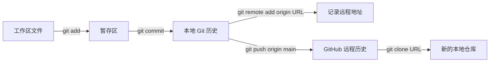

# GitHub 远程协作：remote、push 与 clone

<div class="be-tutor-mount" data-tutor-lesson="engineering-foundation-10" aria-hidden="true"></div>

本课继续使用上一课的 `git-practice` 本地仓库，把已经存在的本地提交连接到一个新的 GitHub 空仓库，完成第一次 `push`，再从另一个目录 `clone` 回来验证。你会亲眼确认：`git init` 只创建本地仓库，远程关系必须单独配置。

## 五步任务路线

<div class="be-task-route" role="list" aria-label="本课五步任务">
  <span role="listitem">1 创建空远程仓库</span><span role="listitem">2 连接并检查 origin</span><span role="listitem">3 首次 push</span><span role="listitem">4 修改后再次同步</span><span role="listitem">5 clone 独立验证</span>
</div>

<section id="step-1" class="be-task-step" data-step-id="step-1" markdown="1">

### 第一步：在 GitHub 创建一个空仓库

**任务：** 登录 GitHub，点击右上角加号 → **New repository**，创建 `git-practice` 仓库。为了连接上一课已有历史，不勾选 README、`.gitignore` 或 License 初始化选项。**成功证据：** 页面显示 Quick setup，并提供 HTTPS 远程地址。

??? tip "提示一"
    仓库名称可以换成没有冲突的名字；课程中的 `OWNER` 和 `REPOSITORY` 都必须替换成你页面上的真实值。
??? tip "提示二"
    远程仓库公开或私有都可以。不要上传账号、token、`.env`、真实密钥或私人学习记录。

</section>

<section id="step-2" class="be-task-step" data-step-id="step-2" markdown="1">

### 第二步：给本地仓库添加 origin

**任务：** 回到上一课的本地 `git-practice` 目录，复制 GitHub Quick setup 中的 HTTPS 地址，执行下面命令并检查。**成功证据：** `git remote -v` 同时显示 origin 的 fetch 和 push 地址，而且 URL 与自己的仓库一致。

```bash
git remote add origin https://github.com/OWNER/REPOSITORY.git
git remote -v
```

??? tip "提示一"
    `origin` 只是远程地址的本地简称，不是 GitHub 账号，也不是固定服务器。
??? tip "提示二"
    如果出现 `remote origin already exists`，先运行 `git remote -v` 查清现有地址；不要连续重复添加。

</section>

<section id="step-3" class="be-task-step" data-step-id="step-3" markdown="1">

### 第三步：把 main 分支第一次推送到 GitHub

**任务：** 先把当前分支名称统一为 `main`，再执行首次推送。按系统出现的浏览器或凭据管理器提示完成 GitHub 认证。**成功证据：** 命令成功，刷新 GitHub 页面能看到 README、`.gitignore` 和第一次提交。

```bash
git branch -M main
git push -u origin main
```

??? tip "提示一"
    `-u` 建立当前 `main` 与 `origin/main` 的跟踪关系，之后通常可以直接运行 `git push`。
??? tip "提示二"
    GitHub 不再接受账号密码作为 Git 命令行认证。优先完成浏览器/Git Credential Manager 或 GitHub CLI 提示；不要把 token 写进命令、课程文件、截图或聊天记录。

</section>

<section id="step-4" class="be-task-step" data-step-id="step-4" markdown="1">

### 第四步：主动修改并再次 push

**任务：** 在 README 追加一行“已经完成远程推送”，依次运行状态、暂存、提交和推送。**成功证据：** 本地 `git log --oneline` 的最新提交与 GitHub 页面最新提交说明一致。

```bash
git status
git add README.md
git commit -m "record first remote push"
git push
```

??? tip "提示一"
    `push` 只发送已经提交的历史；只修改文件或只 `git add` 都不会让 GitHub 页面更新。
??? tip "提示二"
    页面没有变化时先比较本地提交、当前分支和 `git remote -v`，不要盲目重复命令。

</section>

<section id="step-5" class="be-task-step" data-step-id="step-5" markdown="1">

### 第五步：在另一个目录 clone 并验证关系

**任务：** 回到 `git-practice` 的父目录，新建或选择一个不会与原目录重名的位置，使用 HTTPS URL 执行 `git clone`。进入克隆目录后检查文件、历史和远程地址。**成功证据：** 新目录包含 GitHub 上的最新 README；`git remote -v` 已自动存在 origin。

```bash
git clone https://github.com/OWNER/REPOSITORY.git git-practice-clone
cd git-practice-clone
git log --oneline
git remote -v
```

??? tip "提示一"
    `clone` 会新建目录、下载文件和历史，并自动添加 origin；不要先进入原仓库里克隆同名目录。
??? tip "提示二"
    用两个目录只是为了验证，不要同时随意修改两边。本课暂不处理多人并发、pull 冲突和分支协作。

</section>

## 前置知识

- 已完成[本地 Git 与 .gitignore](06-git.md)。
- 已经在临时仓库中创建至少一次提交，并能运行 `git status` 和 `git log --oneline`。
- 拥有可以登录的 GitHub 账号；开启双因素认证时准备好自己的验证方式。

## 学习目标

学完本节后，你应该能区分本地仓库与 GitHub 远程仓库，解释 `origin` 和远程 URL，完成 add remote、push、再次同步和 clone 验证，并能从错误信息判断问题发生在目录、远程、分支还是认证。

本节不讲 Pull Request、分支协作、合并冲突、fork、SSH 密钥或 GitHub Actions。它们都建立在“本地提交能够安全地进出远程仓库”这个闭环之上。

## 关系图：init 不会自动连接 GitHub



- `git init`：只在当前目录建立本地 `.git` 历史。
- `git remote add origin URL`：在本地记录“origin 指向哪里”。
- `git remote -v`：查看当前记录的远程地址，不会创建或登录 GitHub。
- `git push`：把本地已经提交的历史发送到远程。
- `git clone`：从远程创建一份新的本地仓库，同时自动配置 origin。

## 最小命令表

| 目标 | 命令 | 可观察结果 |
| --- | --- | --- |
| 查看当前远程 | `git remote -v` | 显示 fetch/push URL；无输出表示尚未配置 |
| 添加远程 | `git remote add origin URL` | 本地配置新增 origin |
| 修改远程地址 | `git remote set-url origin URL` | origin 指向新 URL |
| 查看当前分支 | `git branch --show-current` | 输出当前分支名 |
| 首次推送 | `git push -u origin main` | 发送提交并建立跟踪关系 |
| 后续推送 | `git push` | 发送当前分支的新提交 |
| 克隆仓库 | `git clone URL 目录名` | 新建带文件、历史和 origin 的本地目录 |

## 认证边界

HTTPS 和 SSH 是两种远程 URL 方式。本课使用 HTTPS，减少第一次连接时需要理解的密钥概念。

- 如果系统弹出浏览器登录或 Git Credential Manager 窗口，核对域名是 GitHub 后再完成认证。
- 如果终端要求输入 GitHub password，不要输入账号登录密码。阅读 [GitHub 官方认证说明](https://docs.github.com/en/authentication/keeping-your-account-and-data-secure/about-authentication-to-github)选择 Git Credential Manager、GitHub CLI、个人访问令牌或 SSH；本课不要求把令牌写进任何文件。
- 认证信息属于个人安全边界。截图和求助时遮住账号邮箱、仓库隐私信息、token 和密钥。

## 常见错误与排查

| 错误 | 先判断什么 | 处理方式 |
| --- | --- | --- |
| `not a git repository` | 当前目录是不是上一课仓库 | 用 `pwd`/`Get-Location` 和 `ls`/`dir` 找到正确目录 |
| `remote origin already exists` | origin 已经指向哪里 | 运行 `git remote -v`；地址错误时用 `git remote set-url origin URL` |
| `src refspec main does not match any` | 是否已有提交、当前分支叫什么 | 运行 `git log --oneline` 和 `git branch --show-current` |
| `Repository not found` | URL、仓库所有者、名称和登录权限 | 从 GitHub 页面重新复制 HTTPS URL，确认已登录正确账号 |
| 认证失败 | 系统使用浏览器、凭据管理器、token 还是 SSH | 不重复输入账号密码；按官方认证文档选择当前 URL 对应方式 |
| push 成功但网页没更新 | 推送的是哪个分支和仓库 | 检查命令输出、`git remote -v`、当前分支和网页分支 |
| non-fast-forward | 远程已有本地没有的提交 | 停止盲目 push；记录错误，后续学习 fetch、pull 与冲突处理 |

## 完成证据

- 一份不包含隐私或密钥的 `git remote -v` 输出记录。
- GitHub 页面能看到两次本地提交，以及 README 和 `.gitignore`。
- 克隆目录中的最新提交标识与原本地仓库一致。
- 能用自己的话解释为什么 `git init` 后 `git remote -v` 可能没有任何输出。
- 能说明 push 发送的是提交，不是未保存或未提交的文件变化。

## 来源

- [GitHub：关于远程仓库](https://docs.github.com/en/get-started/git-basics/about-remote-repositories)
- [GitHub：管理远程仓库](https://docs.github.com/en/get-started/git-basics/managing-remote-repositories)
- [GitHub：把本地代码添加到 GitHub](https://docs.github.com/en/migrations/importing-source-code/using-the-command-line-to-import-source-code/adding-locally-hosted-code-to-github)
- [GitHub：推送提交](https://docs.github.com/en/get-started/using-git/pushing-commits-to-a-remote-repository)
- [GitHub：从远程获取变更与 clone](https://docs.github.com/en/get-started/using-git/getting-changes-from-a-remote-repository)

以上来源于 2026-07-15 核查。本课程只保留完成本地到远程首次闭环所需内容。

## 下一步

进入[开发环境](07-development-environment.md)。下一节会区分代码、解释器/编译器、命令位置、PATH 和第三方依赖，继续建立可复现的电脑环境记录。
