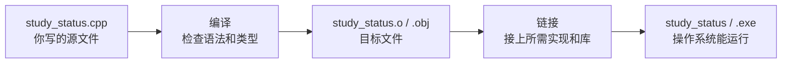

<section id="overview-cpp-output" class="be-page-hero be-lesson-hero" data-learning-context="overview-cpp-output" data-context-type="overview" markdown="1">

C++ 起步 · 第一课 · 学习进度报告器 C++ v0.1

# 从源文件到可执行程序：编译、类型与输入输出

## 先跑出一张状态卡

~~~text
学习状态卡
姓名：小林
课程：C++ 起步
本周计划：5 小时
是否完成：false
~~~

Python 脚本可以直接交给解释器；这份 C++ 源码还不能运行。它要先经过编译和链接，变成适合当前电脑的可执行程序。第一课就把这条路走完整。

[先看源码怎样变成程序](#concept-build-pipeline){ .md-button .md-button--primary }
[检查本机编译器](#reproduce-toolchain){ .md-button }

</section>

  
课程位置<strong>C++ 起步 · 1 / 2</strong>

  
前置<strong>终端、编辑器、Python 起步与 CS 起步</strong>

  
完成后留下<strong>一个 C++20 状态卡、构建产物和排错记录</strong>

## 开始前

- 能在终端进入练习目录并创建 `build/`。
- 知道变量可以保存文字、整数、小数和真假值。
- 本课不要求先懂类、指针、模板或 CMake。
- 示例以 C++20 为基线；macOS 使用 Clang，Linux 可用 GCC，Windows 可用 MSVC。

<section id="concept-build-pipeline" data-learning-context="concept-build-pipeline" data-context-type="concept" markdown="1">

## 源文件不会自己运行

先把两种失败分清：

- **编译错误**发生在某个源文件的语法或类型检查阶段，通常能看到文件名和行号。
- **链接错误**发生在组合目标文件时，例如程序声明了函数，却没有找到它的实现。

第一次构建可以用一条命令同时完成编译和链接。程序跑通后，我们再把两段拆开观察。

</section>

<section id="example-first-program" data-learning-context="example-first-program" data-context-type="example" markdown="1">

## 先读懂一个小程序

~~~cpp
#include <iostream>
#include <string>

int main() {
    const std::string course{"C++ 起步"};
    const int planned_hours{5};
    const bool finished{false};

    std::cout << "学习状态卡\n";
    std::cout << "课程：" << course << '\n';
    std::cout << "本周计划：" << planned_hours << " 小时\n";
    std::cout << "是否完成：" << std::boolalpha << finished << '\n';
    return 0;
}
~~~

现在不用背每个符号，先找到几件熟悉的事：

- `main()` 是这个命令行程序开始执行的位置。
- `std::string`、`int` 和 `bool` 分别保存文字、整数和真假值。
- `const` 表示初始化以后不再修改。
- `std::cout` 把正常结果写到标准输出。
- `return 0` 把“正常结束”交给操作系统。

课程统一写 `std::cout`，不使用 `using namespace std;`。多写几个字符，换来名称来源清楚，也避免以后遇到不必要的名字冲突。

</section>

<section id="concept-static-types" data-learning-context="concept-static-types" data-context-type="concept" markdown="1">

## 类型在编译时就要说清楚

Python 名称可以先后绑定不同类型的对象。C++ 对象一旦声明，类型就固定了：

~~~cpp
std::string learner{"小林"};
int planned_hours{5};
double completed_hours{2.5};
bool finished{false};
char level{'A'};
~~~

类型不是为了增加仪式感。编译器会据此检查赋值、计算和函数调用，也会决定对象需要怎样表示。

| 数据含义 | 起步时常用类型 | 例子 |
| --- | --- | --- |
| 一段文字 | `std::string` | 课程名、姓名 |
| 整数 | `int` | 练习次数 |
| 带小数的数 | `double` | 学习小时、进度 |
| 真或假 | `bool` | 是否完成 |
| 单个字符 | `char` | 等级标记 |

类型大小会受实现和平台影响。本课不背“某种类型永远多少字节”，需要时用 `sizeof` 和 `std::numeric_limits` 观察当前环境。

</section>

<section id="concept-initialize-assign" data-learning-context="concept-initialize-assign" data-context-type="concept" markdown="1">

## 初始化和赋值不是同一件事

~~~cpp
int planned_hours{5}; // 创建对象并给初值
planned_hours = 6;    // 对已有对象赋新值
~~~

花括号初始化能拦住一些会丢失信息的转换：

~~~cpp
int hours{2.5}; // 编译失败：小数不能悄悄丢掉
~~~

先问自己是否需要保留小数。需要就改成 `double`；确实要取整时，再明确舍入规则和转换位置。不要为了让错误消失而关闭诊断。

`auto` 也不是动态类型：

~~~cpp
const auto progress{0.75}; // 编译时推导为 double
~~~

它只是让编译器从初始化表达式推导类型，之后类型仍然固定。

</section>

<section id="concept-streams-exit" data-learning-context="concept-streams-exit" data-context-type="concept" markdown="1">

## 输入、正常结果和错误各走一条路

| 通道 | C++ 对象 | 这里放什么 |
| --- | --- | --- |
| 标准输入 | `std::cin` | 学习者输入的姓名和小时 |
| 标准输出 | `std::cout` | 正常状态卡 |
| 标准错误 | `std::cerr` | 无法继续时的说明 |
| 进程状态 | `main()` 返回值 | 0 成功，非 0 失败 |

完整示例先读姓名，再读计划小时：

~~~cpp
std::string learner{};
std::getline(std::cin, learner);

double planned_hours{};
if (!(std::cin >> planned_hours)) {
    std::cerr << "计划小时必须是数字\n";
    return 1;
}
~~~

姓名使用 `getline()`，因此 `Lin Yue` 不会只剩 `Lin`。输入流读取失败时，不继续拿无效数据计算，也不假装程序成功。

</section>

<section id="reproduce-toolchain" data-learning-context="reproduce-toolchain" data-context-type="reproduce" markdown="1">

## 先确认电脑里有编译器

=== "macOS"

    打开“终端”，运行：

    ~~~bash
    xcode-select --install
    clang++ --version
    ~~~

    如果安装命令提示工具已经存在，继续检查版本即可。

=== "Windows"

    安装 Visual Studio 2022 Build Tools，选择“使用 C++ 的桌面开发”。安装完成后，从开始菜单打开 **Developer PowerShell for VS 2022**：

    ~~~powershell
    cl
    ~~~

    普通 PowerShell 找不到 `cl` 时，先别重复安装，确认打开的是开发者终端。

=== "Linux"

    Ubuntu／Debian 可以安装 GCC 工具链：

    ~~~bash
    sudo apt update
    sudo apt install build-essential
    g++ --version
    ~~~

记录操作系统、编译器命令和版本。不要公开用户名、绝对私人路径或整份环境变量。

</section>

<section id="reproduce-build-run" data-learning-context="reproduce-build-run" data-context-type="reproduce" markdown="1">

## 编译并运行完整状态卡

下载或复制[课程完整示例](../../../examples/cpp-start/study_status.cpp)，放进自己的练习目录：

~~~text
cpp-learning/
├── build/
└── study_status.cpp
~~~

macOS／Linux：

~~~bash
mkdir -p build
clang++ -std=c++20 -Wall -Wextra -Wpedantic -Wconversion -Wshadow \
  study_status.cpp -o build/study_status
./build/study_status
~~~

Linux 使用 GCC 时，把 `clang++` 换成 `g++`。Windows 开发者终端：

~~~powershell
New-Item -ItemType Directory -Force build
cl /std:c++20 /W4 /EHsc /permissive- study_status.cpp /Fe:build\study_status.exe
.\build\study_status.exe
~~~

输入姓名和计划小时。你应该看到完整状态卡；随后检查退出码：

~~~bash
echo $?
~~~

PowerShell 使用 `$LASTEXITCODE`。正常输入应为 0，非法输入应为非 0。

</section>

<section id="example-build-flags" data-learning-context="example-build-flags" data-context-type="example" markdown="1">

## 这条命令每一段都在做事

| 参数 | 作用 |
| --- | --- |
| `-std=c++20` | 明确选择 C++20，不依赖编译器默认标准 |
| `-Wall -Wextra` | 打开一组常用诊断 |
| `-Wpedantic` | 提示不符合所选标准的扩展 |
| `-Wconversion` | 关注可能改变值的隐式转换 |
| `-Wshadow` | 提示内层名称遮蔽外层名称 |
| `-o build/study_status` | 指定输出文件，不把生成物散在源码旁边 |

这些警告不能证明程序正确，却能更早暴露可疑代码。先读懂诊断，再决定怎样修。

</section>

<section id="reproduce-split-build" data-learning-context="reproduce-split-build" data-context-type="reproduce" markdown="1">

## 把编译和链接拆开看一次

~~~bash
clang++ -std=c++20 -Wall -Wextra -Wpedantic -Wconversion -Wshadow \
  -c study_status.cpp -o build/study_status.o
clang++ build/study_status.o -o build/study_status
~~~

第一条命令带 `-c`，只生成目标文件；第二条才得到可执行程序。`.o` 或 `.obj` 是构建中间产物，不是这节课最终交付的程序。

MSVC 对应命令：

~~~powershell
cl /std:c++20 /W4 /EHsc /permissive- /c study_status.cpp /Fo:build\study_status.obj
link build\study_status.obj /OUT:build\study_status.exe
~~~

观察 `build/` 在两条命令之后分别多了什么，这比只记术语更容易形成判断。

</section>

<section id="modify-status-card" data-learning-context="modify-status-card" data-context-type="modify" markdown="1">

## 把状态卡改成自己的

完成三处修改：

1. 把课程名改成当前正在学的内容。
2. 增加 `completed_hours`，输出已完成小时。
3. 增加一个自选字段，例如“本周重点”或“是否复盘”。

改之前先写下预期输出。保存源码后重新编译，再运行。C++ 可执行文件不会因为源码保存了就自动更新；如果屏幕还是旧内容，先确认是否重新编译、是否运行了正确路径。

再换一组姓名和小时做一次，确认代码没有只适合第一组数据。

</section>

<section id="troubleshoot-narrowing" data-learning-context="troubleshoot-narrowing" data-context-type="troubleshoot" markdown="1">

## 故意让花括号拦下一次窄化

临时加入：

~~~cpp
const int planned_hours{2.5};
~~~

编译器应拒绝这段代码。先找到第一条指向自己源码的诊断，读文件名、行号、来源类型和目标类型。然后根据数据含义选择 `double` 或真正合适的整数值。

另一个容易漏掉的问题是整数除法：

~~~cpp
const int completed{3};
const int planned{4};
const double progress{completed / planned}; // 先算出整数 0
~~~

需要小数结果时，在除法发生前转换：

~~~cpp
const double progress{
    static_cast<double>(completed) / static_cast<double>(planned)
};
~~~

</section>

<section id="troubleshoot-link-input" data-learning-context="troubleshoot-link-input" data-context-type="troubleshoot" markdown="1">

## 链接失败和输入失败，不要混在一起修

下面的文件能通过编译，却会在链接时失败：

~~~cpp
int build_plan();

int main() {
    return build_plan();
}
~~~

~~~bash
clang++ -c link_error.cpp -o build/link_error.o
clang++ build/link_error.o -o build/link_error
~~~

链接器找不到 `build_plan()` 的定义。补上定义或链接包含定义的目标文件才是修复；改函数拼写只在声明和调用确实不一致时有用。

运行期再验证三种输入：空姓名、小时位置输入文字、计划小时为 0。它们不属于编译或链接失败，应该由程序检查，写入 `std::cerr` 并返回非零状态。

| 屏幕上看到什么 | 更可能在哪一段 | 先检查什么 |
| --- | --- | --- |
| `command not found` | 工具链尚未可用 | 安装是否完成、终端是否正确 |
| 文件名、行号和类型信息 | 编译 | 第一条指向自己源码的错误 |
| `undefined reference`／`unresolved external` | 链接 | 声明是否有对应定义并参与链接 |
| 输出仍是旧内容 | 构建或运行路径 | 是否重新编译、是否跑错文件 |
| 程序启动后拒绝数据 | 运行期输入检查 | stderr 和退出码 |

</section>

<section id="project-cpp-v01" data-learning-context="project-cpp-v01" data-context-type="project" markdown="1">

## C++ 报告器从这里起步

这节课只有一个源文件和一张状态卡。后面四节会继续演进同一条作品线：

| 课程 | 程序会增加什么 | 一直保持什么 |
| --- | --- | --- |
| 函数与程序组织 | 拆出计算、校验和输出函数 | 严格警告、明确输入输出 |
| 头文件、源文件与 CMake | 库、应用、测试分开构建 | 命令可重复、生成物隔离 |
| STL 容器与算法 | 处理多条记录、排序和筛选 | 数据契约与报告文字稳定 |
| 对象、生命周期与 RAII | 借用记录、安全写审计文件 | 主报告不被附加功能污染 |

最终版本位于[双语言学习进度报告器](../../../exercises/programming-languages/study-progress-reporters/README.md)。当前正式项目已经长到后面的形态，本课的单文件程序是便于起步和回放的早期快照，不会反过来删减最终项目。

</section>

<section id="deepen-types-build" data-learning-context="deepen-types-build" data-context-type="deepen" markdown="1">

## 再深入一点：编译器替你守住什么

静态类型和严格诊断能在程序运行前发现一部分问题，但它们不会替你判断业务含义：

- `double` 能保存负数，不代表负学习小时合理。
- 编译成功不代表输入处理、计算和输出正确。
- 没有警告不代表没有未覆盖的失败路径。
- `sizeof(int)` 的一次结果不能代表所有平台。

可靠的最小闭环是：明确类型和约束，编译无警告，运行正常与非法输入，再检查输出和退出码。

</section>

<section id="career-build-story" data-learning-context="career-build-story" data-context-type="career" markdown="1">

## 面试里别只说“我会 C++”

这节课可以留下四样很朴素、也很可信的材料：源码、完整编译命令、一次编译或链接失败的修复记录、正常与非法输入的退出码。

讲述时可以按这个顺序：程序最初要做什么，源码怎样构建，遇到哪一层失败，你依据什么诊断，修完以后怎样证明没有把失败伪装成成功。比罗列语法关键词更能说明你会使用工具解决问题。

</section>

## 完成检查

- [ ] 能在正确终端看到 C++ 编译器版本。
- [ ] 能解释源文件、目标文件、链接和可执行程序的顺序。
- [ ] 能用 C++20 和严格警告编译、运行状态卡。
- [ ] 能为文字、整数、小数和真假值选择基础类型。
- [ ] 能解释初始化、赋值、`const`、`auto` 和窄化的区别。
- [ ] 能分别使用标准输入、标准输出、标准错误和退出码。
- [ ] 能修改字段、重新编译，并用另一组数据验证。
- [ ] 能区分工具未找到、编译错误、链接错误和运行期输入失败。
- [ ] 能证明生成文件只在 `build/`，不会误入 Git。

## 来源与版本

| 来源 | 用于核查 | 核查日期 |
| --- | --- | --- |
| [Standard C++：Get Started](https://isocpp.org/get-started) | 主流平台工具链入口 | 2026-07-17 |
| [C++ working draft](https://github.com/cplusplus/draft) | 程序入口、初始化、类型和翻译边界 | 2026-07-17 |
| [Clang command line reference](https://clang.llvm.org/docs/ClangCommandLineReference.html) | 标准选择、编译与诊断参数 | 2026-07-17 |
| [GCC language standards](https://gcc.gnu.org/onlinedocs/gcc/Standards.html) | GCC 的 C++20 选择 | 2026-07-17 |
| [GCC warning options](https://gcc.gnu.org/onlinedocs/gcc/Warning-Options.html) | 常用警告口径 | 2026-07-17 |
| [Microsoft C++ build systems](https://learn.microsoft.com/en-us/cpp/build/projects-and-build-systems-cpp?view=msvc-170) | MSVC 编译、目标文件和链接 | 2026-07-17 |
| [MSVC `/std`](https://learn.microsoft.com/en-us/cpp/build/reference/std-specify-language-standard-version?view=msvc-170) | `/std:c++20` | 2026-07-17 |

## 下一步

下一节进入[函数、声明与程序组织](02-functions-declarations-program-organization.md)。状态卡会拆出校验、计算和输出函数；你会第一次清楚地区分声明、定义、参数、返回值和局部作用域。
