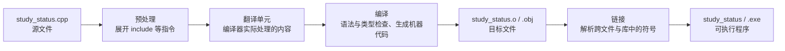

# 从源文件到可执行程序：编译、类型与输入输出

<div class="be-tutor-mount" data-tutor-lesson="cpp-core-01" aria-hidden="true"></div>

> **任务先行：** 本课把单文件“学习状态卡”从源代码构建成可执行程序。先获得一次可验证输出，再用类型、输入与诊断改善它；后面的说明用于解释你已经做过的操作。

## 任务路线

<div class="be-task-route" role="list" aria-label="本课五步任务">
  <span role="listitem">1 构建</span><span role="listitem">2 输出</span><span role="listitem">3 类型</span><span role="listitem">4 诊断</span><span role="listitem">5 迁移</span>
</div>

<section id="step-1" class="be-task-step" data-step-id="step-1" markdown="1">

## 第一步：得到第一个可执行状态卡

按“完整示例：学习状态卡”创建 `study_status.cpp` 和 `build/`，用 `clang++` 或 `g++` 的 C++20 命令构建后运行。**可观察结果：** `build/study_status`（Windows 为 `.exe`）存在并输出状态卡。保留终端中的编译命令和输出。

??? tip "提示"
    先执行 `clang++ --version` 或 `g++ --version`；使用 C++ 驱动程序而不是 `clang` 或 `gcc`。

</section>

<section id="step-2" class="be-task-step" data-step-id="step-2" markdown="1">

## 第二步：主动修改一项学习状态

修改状态卡的姓名、计划小时或完成小时，重新编译运行并确认输出改变。**最少知识：** 对象先声明并以花括号初始化；文本使用 `std::string`。不要只改源码，必须重新构建可执行文件。

??? tip "提示"
    完成计算后不应再变的局部结果可加 `const`，让编译器保护意图。

</section>

<section id="step-3" class="be-task-step" data-step-id="step-3" markdown="1">

## 第三步：让程序读取并检查输入

按完整示例输入姓名和学习小时，分别尝试合法数字与带空格的姓名。**成功标准：** 你能说出标准输入、标准输出、标准错误各自出现在哪里，并观察正常退出码为零。

??? tip "提示"
    混用 `>>` 和 `getline()` 时，先处理残留换行；具体做法在“标准输入、输出和错误”一节。

</section>

<section id="step-4" class="be-task-step" data-step-id="step-4" markdown="1">

## 第四步：故意制造一个编译诊断

把 `int hours{2.5};` 临时放入程序并构建，记录花括号窄化诊断；随后删除或改为有业务理由的显式转换。**验收：** 能区分这类编译错误与链接错误、运行期输入错误。

??? tip "提示"
    修复不是关闭警告；先读出错行、值的类型和想保留的信息。

</section>

<section id="step-5" class="be-task-step" data-step-id="step-5" markdown="1">

## 第五步：迁移验收与下一步

独立增加一个状态字段（例如本周目标），选择正确类型、输出它并在严格警告下重新构建。确认生成文件只在 `build/`。完成后进入下一课，把状态卡拆成职责清楚的函数。

</section>

## 课程信息

| 项目 | 内容 |
| --- | --- |
| 适合人群 | 已完成 Python 起步，第一次系统学习现代 C++ 的学习者 |
| 前置知识 | 终端、编辑器、Git、验证习惯，以及 Python 的变量、条件、输入输出和错误处理 |
| 学习结果 | 能说明 C++ 程序如何构建，使用静态类型编写单文件程序，并依据编译诊断修正问题 |
| 语言基线 | C++20 |
| 本地验证 | Apple Clang 21；Linux可使用GCC，Windows可使用MSVC |
| 实践产出 | 单文件“学习状态卡”、构建产物说明和一次诊断修复记录 |

## 为什么第一课先讲构建

Python 通常由解释器直接运行脚本：

```bash
python main.py
```

C++ 源文件不能直接交给操作系统运行。你需要先选择语言标准，让编译器检查和翻译代码，再由链接器组合成当前平台能够执行的程序。

如果只记住“按一下运行按钮”，后面遇到头文件、多个源文件、第三方库或链接失败时，就很难判断问题发生在哪一层。因此第一课不只写 `Hello World`，而是建立完整的构建和诊断模型。

## 前置检查

### macOS 或 Linux

先检查至少一个 C++ 编译器：

```bash
clang++ --version
```

或者：

```bash
g++ --version
```

只看到 `clang` 或 `gcc` 还不够。课程命令使用 C++ 驱动程序 `clang++` 或 `g++`，它会按 C++ 方式编译并在链接时加入对应标准库。

### Windows

安装包含“使用 C++ 的桌面开发”工作负载的 Visual Studio Build Tools 或 Visual Studio，然后打开 **Developer PowerShell for VS 2022**：

```powershell
cl
```

普通 PowerShell 找不到 `cl`，不一定表示没有安装；先确认是否在 Visual Studio 开发者终端中。

### 记录环境证据

学习记录至少保留：

```text
操作系统：
编译器命令：
编译器版本：
本节标准：C++20
```

不要公开个人绝对路径、账号名称或完整系统环境变量。

## 学习目标

完成本节后，你应该能够：

- 画出源文件、翻译单元、目标文件、链接器和可执行文件的关系。
- 解释一条编译命令中的标准、警告、输入和输出参数。
- 区分 `#include`、`main()`、语句、代码块和返回值。
- 使用基础类型、`std::string`、`const`和受约束的`auto`。
- 区分声明、初始化、赋值、隐式转换和显式转换。
- 用花括号初始化阻止常见窄化。
- 使用 `sizeof` 和 `std::numeric_limits` 观察当前实现，而不是背诵类型大小。
- 使用标准输入、标准输出和标准错误。
- 区分编译错误、链接错误、运行错误和错误结果。
- 编译运行学习状态卡，并验证正常与非法输入的退出码。

## 源文件怎样变成程序

下面的图回答一个问题：**编译错误和链接错误为什么不是同一类问题？**



现实中的 C++ 标准描述了更细的翻译阶段。起步时先掌握这条可操作主线：

- **预处理**处理 `#include` 等预处理指令。
- **编译**检查语法和类型，并把一个翻译单元生成目标代码。
- **链接**把目标文件和所需库组合起来，解析函数与对象的符号引用。
- **运行**由操作系统加载可执行文件；此时输入错误或业务错误才会出现。

### 分开执行编译和链接

建立练习目录：

```text
cpp-learning/
├── build/
└── study_status.cpp
```

在练习目录运行：

```bash
clang++ -std=c++20 -Wall -Wextra -Wpedantic -Wconversion -Wshadow \
  -c study_status.cpp -o build/study_status.o
clang++ build/study_status.o -o build/study_status
```

GCC 把 `clang++` 换成 `g++` 即可。

第一条命令中的 `-c` 表示只编译、不链接，所以得到目标文件。第二条命令只负责链接。平时也可以合并为一条：

```bash
clang++ -std=c++20 -Wall -Wextra -Wpedantic -Wconversion -Wshadow \
  study_status.cpp -o build/study_status
```

参数含义：

| 参数 | 作用 |
| --- | --- |
| `-std=c++20` | 明确使用 C++20，不依赖编译器默认标准 |
| `-Wall -Wextra` | 开启一组常用诊断 |
| `-Wpedantic` | 提示不符合所选 ISO C++ 标准的扩展 |
| `-Wconversion` | 关注可能改变值的隐式转换 |
| `-Wshadow` | 提示内层名称遮蔽外层名称 |
| `-c` | 只编译到目标文件，不执行链接 |
| `-o` | 指定输出文件位置和名称 |

警告集合并不等于形式化证明，但它们能更早暴露可疑代码。不要为“界面干净”直接关闭不理解的警告。

### Windows MSVC

在 Developer PowerShell 中先创建输出目录：

```powershell
New-Item -ItemType Directory -Force build
```

分开编译和链接：

```powershell
cl /std:c++20 /W4 /EHsc /permissive- /c study_status.cpp /Fo:build\study_status.obj
link build\study_status.obj /OUT:build\study_status.exe
```

合并构建：

```powershell
cl /std:c++20 /W4 /EHsc /permissive- study_status.cpp /Fe:build\study_status.exe
```

`/W4` 是 MSVC 的高常规警告级别；`/permissive-` 强化标准一致性；`/EHsc` 设置常用的 C++ 异常处理模型。本节没有主动抛异常，但固定该命令有利于后续课程保持一致。

## 最小程序不只是几行字符

```cpp title="minimal.cpp"
#include <iostream>

int main() {
    std::cout << "Hello, C++20!\n";
    return 0;
}
```

逐行理解：

- `#include <iostream>` 让当前翻译单元获得标准流相关声明。
- `int main()` 是程序入口，返回 `int` 形式的进程状态。
- `{}` 形成函数体代码块。
- 每条表达式语句以分号结束。
- `std::cout` 使用限定名，明确 `cout` 来自 `std` 命名空间。
- `\n` 输出换行；它不会像 `std::endl` 那样额外强制刷新缓冲区。
- `return 0` 表示程序正常完成。`main` 到达末尾也等价于返回零，但课程先显式写出意图。

起步阶段不要使用：

```cpp
using namespace std;
```

它会把整个 `std` 命名空间的名称引入当前作用域。小程序看似省字，代码变大后却可能制造名称冲突并隐藏来源。课程统一使用 `std::`。

## 静态类型：名称在使用前有明确类型

Python 变量名可以在不同时间绑定到不同类型的对象；C++ 对象的类型在声明后不会因为后续赋值而改变。

```cpp
int planned_hours{10};
double completed_hours{7.5};
bool completed{false};
char grade{'A'};
std::string learner{"Lin Yue"};
```

| 类型 | 当前用途 | 注意边界 |
| --- | --- | --- |
| `int` | 整数数量 | 可表示范围与实现相关，可能溢出 |
| `double` | 带小数的近似数值 | 不是十进制精确存储，不用于要求精确金额的设计 |
| `bool` | `true` 或 `false` | 输入输出时默认常表现为 `1` 或 `0` |
| `char` | 一个字符代码单元 | 不等于“任意一个中文字符” |
| `std::string` | 字符串对象 | 来自 `<string>`，不是基础内置类型 |

### 声明、初始化和赋值

```cpp
int planned_hours{10};     // 声明对象并初始化
planned_hours = 12;        // 给已经存在的对象赋新值
const int minimum_hours{1};
```

`const` 表示通过这个名称不能再修改对象：

```cpp
minimum_hours = 2;  // 编译错误
```

优先在“计算完成后不应再变化”的局部结果上使用 `const`，让编译器帮助守住意图。

### 花括号初始化与窄化

```cpp
int hours{2.5};
```

这段代码应被诊断为错误，因为 `2.5` 转成 `int` 会丢失小数部分，而花括号初始化禁止这种窄化。

下面的旧式写法可能只产生警告，甚至在较弱诊断下悄悄得到 `2`：

```cpp
int hours = 2.5;
```

本课程默认优先使用花括号初始化。需要转换时，先确认业务含义，再显式表达：

```cpp
const double measured_hours{2.5};
const int whole_hours{static_cast<int>(measured_hours)};
```

`static_cast<int>` 没有让信息丢失变安全，它只是让“我知道这里正在转换”进入代码和审查范围。

### `auto` 不是动态类型

```cpp
const auto progress{0.75};
```

编译器从初始化表达式推导出 `progress` 是 `const double`。它在运行时不会变成字符串。

起步阶段只在右侧能够清楚表达类型时使用 `auto`，不要用它隐藏尚未理解的复杂类型。基础类型练习中仍应主动写出类型并解释选择。

## 不要背诵当前机器的类型大小

C++ 规定了类型之间的一些最小关系和范围要求，但常见整数类型的精确字节数并非在所有实现上都相同。用程序观察当前编译器和目标平台：

```cpp title="inspect_types.cpp"
#include <iostream>
#include <limits>

int main() {
    std::cout << "sizeof(int): " << sizeof(int) << '\n';
    std::cout << "int min: " << std::numeric_limits<int>::min() << '\n';
    std::cout << "int max: " << std::numeric_limits<int>::max() << '\n';
    std::cout << "sizeof(double): " << sizeof(double) << '\n';
    return 0;
}
```

`sizeof` 的结果单位是 `sizeof(char)` 所定义的字节单位。把实际输出写入学习记录，但不要把当前机器结果写成所有平台的永恒结论。

## 标准输入、输出和错误

C++ 标准流中，本节使用：

- `std::cin`：标准输入。
- `std::cout`：正常结果。
- `std::cerr`：错误说明。

读取单个以空白分隔的数据：

```cpp
double planned_hours{};
std::cin >> planned_hours;
```

读取包含空格的一整行：

```cpp
std::string learner{};
std::getline(std::cin, learner);
```

### 为什么混用 `>>` 和 `getline()` 会读到空行

格式化读取通常把换行留在输入缓冲区。紧接着调用 `getline()` 时，它会把这个换行当作一行的结尾：

```cpp
double planned_hours{};
std::string learner{};

std::cin >> planned_hours;
std::getline(std::cin, learner);  // 可能立即得到空字符串
```

在确认前一次读取成功后，可以忽略到本行末尾：

```cpp
#include <limits>

std::cin.ignore(
    std::numeric_limits<std::streamsize>::max(),
    '\n'
);
std::getline(std::cin, learner);
```

完整示例先读取姓名整行，再读取数字，因此不需要这一步。选择更简单的输入顺序，也是一种设计。

## 完整示例：学习状态卡

### 环境与文件

- Python不是运行依赖。
- C++20编译器：本地使用 Apple Clang 21。
- 文件：`study_status.cpp`。
- 构建产物：`build/study_status`，Windows为`build\study_status.exe`。
- 第三方依赖：无。

### 完整代码

```cpp title="study_status.cpp"
#include <iomanip>
#include <iostream>
#include <string>

int main() {
    std::string learner{};
    double planned_hours{};
    double completed_hours{};

    std::cout << "请输入学习者姓名：";
    std::getline(std::cin, learner);

    std::cout << "请输入计划学习时间：";
    std::cin >> planned_hours;

    std::cout << "请输入已完成时间：";
    std::cin >> completed_hours;

    if (!std::cin) {
        std::cerr << "输入错误：学习时间必须是数字。\n";
        return 1;
    }
    if (learner.empty()) {
        std::cerr << "输入错误：姓名不能为空。\n";
        return 1;
    }
    if (planned_hours <= 0.0) {
        std::cerr << "输入错误：计划学习时间必须大于 0。\n";
        return 1;
    }
    if (completed_hours < 0.0) {
        std::cerr << "输入错误：已完成时间不能小于 0。\n";
        return 1;
    }

    const double raw_progress{completed_hours / planned_hours};
    const double displayed_progress{
        raw_progress > 1.0 ? 1.0 : raw_progress
    };
    const bool is_completed{completed_hours >= planned_hours};

    std::cout << std::fixed << std::setprecision(1);
    std::cout << "\n学习状态卡\n";
    std::cout << "姓名：" << learner << '\n';
    std::cout << "计划：" << planned_hours << " 小时\n";
    std::cout << "完成：" << completed_hours << " 小时\n";
    std::cout << "进度：" << displayed_progress * 100.0 << "%\n";
    std::cout << "状态：" << (is_completed ? "已完成" : "进行中") << '\n';
    return 0;
}
```

### 编译

macOS/Linux：

```bash
mkdir -p build
clang++ -std=c++20 -Wall -Wextra -Wpedantic -Wconversion -Wshadow \
  study_status.cpp -o build/study_status
```

如果使用 GCC：

```bash
mkdir -p build
g++ -std=c++20 -Wall -Wextra -Wpedantic -Wconversion -Wshadow \
  study_status.cpp -o build/study_status
```

Windows Developer PowerShell：

```powershell
New-Item -ItemType Directory -Force build
cl /std:c++20 /W4 /EHsc /permissive- study_status.cpp /Fe:build\study_status.exe
```

编译命令成功时不应出现警告。不同编译器的提示文字可以不同，判断依据是：命令退出码、警告或错误内容，以及目标文件是否按预期生成。

### 运行与预期输出

macOS/Linux：

```bash
./build/study_status
```

Windows：

```powershell
.\build\study_status.exe
```

输入：

```text
Lin Yue
10
7.5
```

预期关键输出：

```text
学习状态卡
姓名：Lin Yue
计划：10.0 小时
完成：7.5 小时
进度：75.0%
状态：进行中
```

提示文字和输入可能出现在同一行，这是终端交互的正常表现。验收时比较关键字段，不要求复制后的换行位置完全相同。

### 检查退出码

macOS/Linux在程序结束后运行：

```bash
echo $?
```

PowerShell：

```powershell
$LASTEXITCODE
```

正常输入应为 `0`，课程定义的非法输入应为 `1`。

## 五类失败不要混在一起

| 阶段 | 例子 | 典型证据 | 修复方向 |
| --- | --- | --- | --- |
| 编译错误 | 缺分号、类型不匹配、窄化 | 编译器文件、行列和诊断 | 修正语法或类型关系 |
| 链接错误 | 只有函数声明，没有定义 | undefined symbol / unresolved external | 提供定义或修正链接输入 |
| 运行错误 | 非法内存访问、未处理异常 | 非零退出、崩溃或运行时报告 | 构造最小输入并检查状态 |
| 输入错误 | 用户输入文字代替数字 | 流进入失败状态 | 检查输入并向标准错误说明 |
| 错误结果 | 整数除法得到零 | 程序正常结束但输出错误 | 写边界样例并检查中间类型 |

### 编译错误：窄化

```cpp title="narrowing_error.cpp"
int main() {
    int hours{2.5};
    return hours;
}
```

编译器应在生成目标文件前拒绝它。

### 链接错误：声明存在，定义缺失

```cpp title="link_error.cpp"
double calculate_progress(double planned, double completed);

int main() {
    const double progress{calculate_progress(10.0, 5.0)};
    return progress > 0.0 ? 0 : 1;
}
```

编译器能够理解调用形式，所以单独使用 `-c` 可以成功：

```bash
clang++ -std=c++20 -Wall -Wextra -Wpedantic -c link_error.cpp -o build/link_error.o
```

链接时找不到函数定义：

```bash
clang++ build/link_error.o -o build/link_error
```

不要把链接失败误判为 C++ 语法错误。

### 错误结果：整数除法先发生

```cpp
const int completed{3};
const int planned{4};
const double progress{completed / planned};
```

除法两侧都是 `int`，先得到整数 `0`，之后才转成 `double`。需要浮点结果时显式表达：

```cpp
const double progress{
    static_cast<double>(completed) / static_cast<double>(planned)
};
```

## AI 协作任务

### 可复用提示模板

```text
请使用C++20生成一个单文件学习状态卡程序。
使用std::限定名，不使用using namespace std；
使用花括号初始化和const表达不变结果；
检查文本为空、数字读取失败、计划时间不大于零和完成时间为负数；
错误写入std::cerr并返回非零退出码；
不要引入类、指针、容器、异常框架、CMake或第三方库。
同时给出Clang/GCC严格警告编译命令，并解释每个参数。
```

### 人工审阅清单

不能直接接受 AI 结果。逐项检查：

- 是否显式选择 C++20，而不是依赖编译器默认值。
- 是否开启警告，并真正阅读编译输出。
- 是否错误使用 `using namespace std;`。
- 每个变量的类型是否符合数据含义。
- 是否出现隐式窄化、整数除法或未检查的输入流。
- 是否把错误写到 `std::cerr` 并返回非零退出码。
- 是否引入了当前无法解释的类、模板或第三方依赖。

然后主动把“超额完成时进度显示100%”改成“同时额外显示超出小时数”，重新编译并验证正常、刚好完成和超额完成三种输入。

学习记录保留任务、约束、AI产出摘要、人工修改、实际命令和验证结果，不需要公开完整私人对话。

## 核心手动检查点

### 检查点 1：追踪构建产物

分别执行只编译和链接命令。记录每一步前后 `build/` 出现了什么文件，并解释 `.o` 或 `.obj` 为什么还不能直接作为最终程序交付。

### 检查点 2：预测窄化诊断

在运行编译器前，判断以下三行是否成立以及最终类型：

```cpp
double a{2};
int b{2.5};
const auto c{2.5};
```

再用实际诊断验证，不用 AI 的文字结论代替编译。

### 检查点 3：区分编译和链接错误

运行课程中的 `link_error.cpp`。确认 `-c` 成功、链接失败，并在诊断中找到缺失的符号名称。

### 检查点 4：观察而非背诵类型大小

运行 `inspect_types.cpp`，记录当前平台输出。说明为什么不能从一次输出推导所有操作系统与编译器。

### 检查点 5：修复残留换行

把学习状态卡改成先读数字、后读姓名，稳定复现空姓名问题；再使用 `ignore()` 修复，并解释每个参数。

### 检查点 6：验证退出码

依次输入正常数据、计划时间零、负完成时间和非数字。记录标准输出、标准错误和退出码，确认失败不是伪装成成功。

## 微练习

### 练习 1：完整构建链

分别生成目标文件和可执行文件，再使用合并命令构建。比较三条命令的输入和输出。

### 练习 2：阅读编译诊断

删除一处分号，保存完整诊断，指出文件、行列和错误消息；修复后重新编译且不留下警告。

### 练习 3：制造链接失败

运行 `link_error.cpp`，证明编译和链接具有不同成功状态，再写一句自己的判断规则。

### 练习 4：转换与整数除法

分别计算 `3 / 4` 和显式转换后的结果，输出中间类型和最终值。

### 练习 5：包含空格的姓名

输入 `Lin Yue`，比较 `std::cin >> learner` 与 `std::getline()` 的结果，说明哪一种符合需求。

### 练习 6：非法输入矩阵

至少验证姓名为空、数字位置输入文字、计划时间为零、负完成时间和超额完成。记录退出码与关键输出。

## 阶段作品线索

“学习状态卡”只是连续课程的起点，本节不创建独立练习或项目目录。后续配对课程会逐步加入：

- Python 类型提示与接口检查。
- C++ 函数、声明和程序组织。
- Python/C++ 对相同输入规则的行为对照。
- 自动化运行与测试证据。

连续3-6节形成有意义的可复现能力后，再决定沉淀为阶段作品。不会恢复“一课一个项目”。

## 常见错误与排查

| 现象 | 常见原因 | 检查方法 | 当前修复 |
| --- | --- | --- | --- |
| `command not found: clang++` | 未安装工具链或命令不在PATH | 记录命令和系统 | 按平台官方方式安装编译器 |
| Windows找不到`cl` | 未使用开发者终端 | 打开Developer PowerShell | 在已配置环境中重试 |
| 编译器不认识C++20参数 | 工具链过旧 | 查看版本和官方支持表 | 升级工具链，不改成预览语法 |
| 输出目录不存在 | 尚未创建`build/` | 查看目录 | 先创建专用构建目录 |
| `expected ';'` | 语句末尾漏分号 | 查看第一条相关诊断 | 修复最早错误后重新编译 |
| narrowing conversion | 花括号发现值可能丢失 | 比较源类型和目标类型 | 保留精度或显式转换并说明理由 |
| undefined symbol | 声明存在但定义未参与链接 | 找诊断中的符号名 | 增加定义或正确目标文件 |
| 姓名只读取第一个词 | 使用了格式化提取 | 输入含空格姓名 | 使用`getline()` |
| `getline()`立即得到空行 | 上次格式化读取留下换行 | 检查读取顺序 | 调整顺序或正确调用`ignore()` |
| 进度意外为0 | 发生整数除法 | 查看两侧操作数类型 | 在除法前转换为`double` |
| 非法输入仍返回0 | 只打印错误未改变返回值 | 检查退出码 | 错误路径返回非零 |
| `build/`出现在Git状态 | 构建产物未忽略 | 使用`git check-ignore` | 在练习目录忽略`build/` |

## 完成标准

- 能解释从源文件到可执行程序的主要步骤。
- 能分开执行编译与链接，并说明目标文件的作用。
- 能解释课程编译命令中每个关键参数。
- 能识别 `#include`、`main()`、语句、作用域和返回值。
- 能为整数、小数、布尔、字符和文本选择基本类型。
- 能区分初始化与赋值，使用 `const` 表达不变结果。
- 能预测一个花括号窄化错误，并说明显式转换的代价。
- 能解释 `auto` 仍是静态类型推导。
- 能使用 `sizeof` 和 `numeric_limits` 观察当前实现。
- 能正确读取包含空格的文本，并解释残留换行问题。
- 能区分编译、链接、运行、输入和结果错误。
- 能在严格警告下无警告编译学习状态卡。
- 能验证正常、空姓名、非数字、零计划、负完成和超额完成。
- 能确认正常退出码为0、非法输入退出码非零。
- 能审阅AI代码并主动修改一项行为后重新验证。
- 能证明生成文件只存在于专用构建目录且不会进入Git。

## 来源与版本

| 来源 | 用于核查 | 核查日期 | 状态 |
| --- | --- | --- | --- |
| [Standard C++：Get Started](https://isocpp.org/get-started) | 主流平台编译器入口 | 2026-07-14 | 已核查 |
| [C++工作草案仓库](https://github.com/cplusplus/draft) | 翻译、初始化、类型和程序入口的规范边界 | 2026-07-14 | 已核查 |
| [Clang命令行参考](https://clang.llvm.org/docs/ClangCommandLineReference.html) | Clang标准、编译和诊断参数 | 2026-07-14 | 已核查 |
| [GCC语言标准说明](https://gcc.gnu.org/onlinedocs/gcc/Standards.html) | GCC的C++20标准选择 | 2026-07-14 | 已核查 |
| [GCC警告选项](https://gcc.gnu.org/onlinedocs/gcc/Warning-Options.html) | 常用警告与pedantic诊断 | 2026-07-14 | 已核查 |
| [Microsoft C++构建系统](https://learn.microsoft.com/en-us/cpp/build/projects-and-build-systems-cpp?view=msvc-170) | MSVC编译、目标文件和链接流程 | 2026-07-14 | 已核查 |
| [MSVC `/std`](https://learn.microsoft.com/en-us/cpp/build/reference/std-specify-language-standard-version?view=msvc-170) | `/std:c++20` | 2026-07-14 | 已核查 |
| [MSVC警告级别](https://learn.microsoft.com/en-us/cpp/build/reference/compiler-option-warning-level?view=msvc-170) | `/W4`口径 | 2026-07-14 | 已核查 |

## 下一步

下一节进入与本课配对的 **Python 类型提示、接口与静态检查认知**。你会比较 Python 运行时类型与静态分析、为现有函数补充类型契约，并理解它与 C++ 静态类型的相同点和根本差异。

完成这组配对后，再回到 C++ 学习函数声明、定义、参数、返回值和程序组织。
