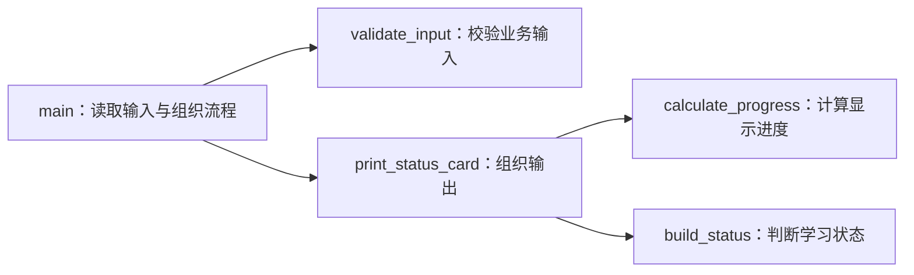

# 函数、声明与程序组织

## 课程信息

| 项目 | 内容 |
| --- | --- |
| 适合人群 | 已完成 C++ 构建与类型、Python 类型提示课程，希望把单文件程序组织清楚的学习者 |
| 前置知识 | C++20 编译、链接、基础类型、`std::string`、输入输出、条件判断和退出码 |
| 学习结果 | 能设计函数接口，区分声明与定义，选择基本参数传递方式，并把主流程拆成可验证的职责 |
| 语言基线 | C++20 |
| 本地验证 | Apple Clang 21；Linux 可使用 GCC，Windows 可使用 MSVC |
| 实践产出 | 函数化的单文件“学习状态卡”、四类诊断记录和一次 AI 重构审阅 |

## 为什么现在学习函数组织

上一课的学习状态卡能够正确编译和运行，但输入、校验、计算与输出都集中在 `main()` 中。程序继续增长时，这种结构会带来三个问题：

- 修改一条规则时，很难确认影响了哪些输出。
- 计算过程和终端输入输出混在一起，不容易单独验证。
- 以后拆成头文件和源文件时，没有稳定的函数接口可以迁移。

函数不是为了让代码“看起来高级”。函数要把一个清楚的职责变成可以命名、调用和检查的接口。本节先在单文件中把边界设计好，下一轮再学习多文件组织。

## 前置检查

检查编译器并记录版本：

```bash
clang++ --version
```

或者：

```bash
g++ --version
```

Windows 请在 Developer PowerShell for VS 2022 中运行：

```powershell
cl
```

你还应能解释上一课程序中的三个结果：

1. 为什么数字读取失败后要检查 `std::cin`。
2. 为什么计划时间为零要返回非零退出码。
3. 为什么超额完成时显示进度仍限制在 `100.0%`。

如果解释不清，先回看[从源文件到可执行程序](01-build-types-io.md)，不要直接让 AI 重写整份程序。

## 学习目标

完成本节后，你应该能够：

- 区分函数声明、函数定义和函数调用。
- 读懂函数名、参数列表、返回类型与函数签名表达的接口。
- 解释为什么调用点之前必须存在可见声明。
- 为小型值选择按值传递，为只读字符串选择 `const std::string&`。
- 区分通过 `return` 交付结果和通过 `void` 函数执行副作用。
- 解释局部作用域与生命周期，并避免使用可变全局状态传递数据。
- 把输入校验、计算、状态判断和输出拆成单一职责函数。
- 写出基础函数重载，并识别只改返回类型和调用二义性的问题。
- 在严格警告下编译重构后的学习状态卡，并回归全部输入场景。

## 从调用关系看程序职责

下面的图回答一个问题：**`main()` 应该做全部工作，还是只组织工作？**



箭头表示调用方向。`main()` 负责程序边界，计算函数不反向读取终端，也不依赖隐藏的全局变量。这样修改计算规则时，可以把注意力集中在对应函数和调用结果上。

## 声明、定义与调用

先观察三个角色：

```cpp
double calculate_progress(double planned_hours, double completed_hours); // 声明

int main() {
    const double progress{calculate_progress(10.0, 7.5)};                // 调用
    return progress > 0.0 ? 0 : 1;
}

double calculate_progress(double planned_hours, double completed_hours) { // 定义
    const double raw_progress{completed_hours / planned_hours};
    return raw_progress > 1.0 ? 1.0 : raw_progress;
}
```

| 角色 | 回答的问题 | 是否包含函数体 |
| --- | --- | --- |
| 声明 | 这个函数叫什么，接收什么，返回什么 | 否，以分号结束 |
| 定义 | 这个函数具体怎样执行 | 是，包含 `{}` 函数体 |
| 调用 | 当前代码要把哪些实参交给函数 | 不适用 |

编译器处理 `main()` 中的调用时，必须已经知道 `calculate_progress` 的接口。定义可以写在后面，但前面需要有匹配的声明。

### 函数接口和签名

这条声明包含：

```cpp
double calculate_progress(double planned_hours, double completed_hours);
```

- `calculate_progress`：函数名，表达它要完成的工作。
- 两个 `double`：参数类型，约束调用者提供的数据形状。
- `double`：返回类型，说明调用者会得到什么结果。
- 参数名：帮助读者理解顺序；声明中的参数名可以省略，但课程示例保留它们。

函数签名用于区分可调用接口时，主要依赖函数名和参数类型等信息。**不能只改变返回类型来构成重载**：

```cpp
double progress(double planned, double completed);
int progress(double planned, double completed); // 错误：参数列表相同
```

调用 `progress(10.0, 5.0)` 时，编译器不能根据“你准备把结果存到哪里”可靠选择这两个接口。

## 参数传递：复制还是只读访问

### 小型值按值传递

```cpp
double calculate_progress(double planned_hours, double completed_hours);
```

这里的两个形参是函数自己的局部对象，由实参的值初始化。函数内部修改形参，不会修改调用者的变量：

```cpp
void reset_copy(double hours) {
    hours = 0.0;
}
```

`double`、`bool`、`char` 等小型值通常直接按值传递，接口简单，也避免调用者数据被意外修改。

### 只读字符串使用 `const&`

```cpp
std::string validate_input(
    const std::string& learner,
    double planned_hours,
    double completed_hours
);
```

`learner` 是调用者字符串的只读别名：

- `&` 表示形参引用已有对象，不创建这一份字符串副本。
- `const` 表示函数不能通过这个形参修改字符串。
- 调用写法仍是 `validate_input(learner, planned, completed)`，不需要特殊符号。

本节只使用引用作为函数参数。返回引用、悬空引用、右值引用和移动语义需要对象生命周期知识，留到对象与资源课程。

### 三种数据流不要混淆

| 方式 | 示例 | 调用者能观察到什么 | 本节用途 |
| --- | --- | --- | --- |
| 按值参数 | `double hours` | 函数获得值的副本 | 小型数值、布尔值 |
| 只读引用参数 | `const std::string& name` | 函数读取原对象但不能修改 | 避免复制只读字符串 |
| 返回值 | `return progress;` | 调用者获得函数产生的结果 | 计算结果、状态、错误消息 |

不要为了“少一次复制”把所有参数都写成引用。接口首先要表达职责和修改权限；性能结论需要测量，不能靠符号数量猜测。

## 返回值、`void` 与副作用

纯计算函数根据参数产生返回值，不读取终端、不打印，也不修改全局状态：

```cpp
double calculate_progress(double planned_hours, double completed_hours) {
    const double raw_progress{completed_hours / planned_hours};
    return raw_progress > 1.0 ? 1.0 : raw_progress;
}
```

输出函数的主要职责是产生可观察副作用，因此返回 `void`：

```cpp
void print_name(const std::string& learner) {
    std::cout << "姓名：" << learner << '\n';
}
```

| 函数类型 | 主要证据 | 是否容易单独验证 | 示例 |
| --- | --- | --- | --- |
| 纯计算 | 返回值 | 较容易，给定输入比较结果 | 比例计算、状态判断 |
| 输入输出 | 终端、文件等外部变化 | 需要观察或捕获外部结果 | 读取输入、打印状态卡 |

`print()` 和 `return` 在 Python 中不同，C++ 中同样不同。打印一个值不会自动把它交还给调用者。

### 非 `void` 函数必须覆盖返回路径

下面的函数在 `hours <= 0.0` 时走到末尾却没有返回值：

```cpp
double normalize_hours(double hours) {
    if (hours > 0.0) {
        return hours;
    }
}
```

严格警告会指出并非所有路径都有返回值。不要用任意的默认返回值压掉诊断，应先决定非法输入由谁校验，以及这个函数的前置条件是什么。

## 局部作用域与生命周期

函数形参和函数体内声明的对象通常只在该次调用中存在：

```cpp
double calculate_progress(double planned_hours, double completed_hours) {
    const double raw_progress{completed_hours / planned_hours};
    return raw_progress > 1.0 ? 1.0 : raw_progress;
}
```

`raw_progress` 离开函数后不再可访问，但返回的是一个 `double` 值，调用者可以安全保存这个结果。

不要使用可变全局变量让函数偷偷共享状态：

```cpp
double planned_hours{}; // 本节不采用这种设计

double calculate_progress(double completed_hours) {
    return completed_hours / planned_hours;
}
```

这种函数的真实输入没有全部出现在参数中。测试顺序、其他函数的修改都可能改变结果。把依赖显式放进参数，调用点才能说明数据从哪里来。

## 用命名空间组织名称

课程把业务函数放进命名空间：

```cpp
namespace study {

double calculate_progress(double planned_hours, double completed_hours);

} // namespace study
```

调用时使用限定名：

```cpp
const double progress{study::calculate_progress(10.0, 7.5)};
```

命名空间用于组织名称并降低冲突，不会自动创建模块、文件或访问控制。本节仍是一个源文件，也不使用 `using namespace study;` 隐藏名称来源。

## 基础函数重载

同一作用域中的函数可以同名，但参数列表必须足以区分调用：

```cpp
std::string build_status(double planned_hours, double completed_hours);
std::string build_status(bool completed);
```

调用参数明确时，编译器可以选择：

```cpp
const std::string from_hours{study::build_status(10.0, 7.5)};
const std::string from_flag{study::build_status(true)};
```

不要为了少想函数名而滥用重载。两个函数如果语义不同，应使用不同名称。

### 二义性示例

```cpp
void show(long value);
void show(double value);

int main() {
    show(1); // int 转 long 或 double 都需要转换，调用可能产生二义性
}
```

修复方向不是随意强制转换，而是先确认接口是否真的需要这组重载。若语义相同且必须保留，可以让调用者提供明确类型；若语义不同，应重新命名。

## 完整示例：函数化学习状态卡

### 环境与文件

- C++20 编译器，本地使用 Apple Clang 21。
- 文件：`study_status.cpp`。
- 构建产物：`build/study_status`，Windows 为 `build\study_status.exe`。
- 第三方依赖：无，仅使用 C++ 标准库。
- 执行位置：包含源文件和 `build/` 的练习目录。

### 完整代码

```cpp title="study_status.cpp"
#include <iomanip>
#include <iostream>
#include <string>

namespace study {

std::string validate_input(
    const std::string& learner,
    double planned_hours,
    double completed_hours
);
double calculate_progress(double planned_hours, double completed_hours);
std::string build_status(double planned_hours, double completed_hours);
void print_status_card(
    const std::string& learner,
    double planned_hours,
    double completed_hours
);

} // namespace study

int main() {
    std::string learner{};
    double planned_hours{};
    double completed_hours{};

    std::cout << "请输入学习者姓名：";
    std::getline(std::cin, learner);

    std::cout << "请输入计划学习时间：";
    std::cin >> planned_hours;

    std::cout << "请输入已完成时间：";
    std::cin >> completed_hours;

    if (!std::cin) {
        std::cerr << "输入错误：学习时间必须是数字。\n";
        return 1;
    }

    const std::string error_message{
        study::validate_input(learner, planned_hours, completed_hours)
    };
    if (!error_message.empty()) {
        std::cerr << error_message << '\n';
        return 1;
    }

    study::print_status_card(learner, planned_hours, completed_hours);
    return 0;
}

namespace study {

std::string validate_input(
    const std::string& learner,
    double planned_hours,
    double completed_hours
) {
    if (learner.empty()) {
        return "输入错误：姓名不能为空。";
    }
    if (planned_hours <= 0.0) {
        return "输入错误：计划学习时间必须大于 0。";
    }
    if (completed_hours < 0.0) {
        return "输入错误：已完成时间不能小于 0。";
    }
    return "";
}

double calculate_progress(double planned_hours, double completed_hours) {
    const double raw_progress{completed_hours / planned_hours};
    return raw_progress > 1.0 ? 1.0 : raw_progress;
}

std::string build_status(double planned_hours, double completed_hours) {
    return completed_hours >= planned_hours ? "已完成" : "进行中";
}

void print_status_card(
    const std::string& learner,
    double planned_hours,
    double completed_hours
) {
    const double displayed_progress{
        calculate_progress(planned_hours, completed_hours)
    };
    const std::string status{build_status(planned_hours, completed_hours)};

    std::cout << std::fixed << std::setprecision(1);
    std::cout << "\n学习状态卡\n";
    std::cout << "姓名：" << learner << '\n';
    std::cout << "计划：" << planned_hours << " 小时\n";
    std::cout << "完成：" << completed_hours << " 小时\n";
    std::cout << "进度：" << displayed_progress * 100.0 << "%\n";
    std::cout << "状态：" << status << '\n';
}

} // namespace study
```

### 编译

macOS/Linux 使用 Clang：

```bash
mkdir -p build
clang++ -std=c++20 -Wall -Wextra -Wpedantic -Wconversion -Wshadow \
  study_status.cpp -o build/study_status
```

使用 GCC 时把编译器命令换成 `g++`：

```bash
mkdir -p build
g++ -std=c++20 -Wall -Wextra -Wpedantic -Wconversion -Wshadow \
  study_status.cpp -o build/study_status
```

Windows Developer PowerShell：

```powershell
New-Item -ItemType Directory -Force build
cl /std:c++20 /W4 /EHsc /permissive- study_status.cpp /Fe:build\study_status.exe
```

成功构建不应产生警告。若出现诊断，从第一条与自己代码直接相关的消息开始处理，再重新完整编译。

### 运行与预期输出

macOS/Linux：

```bash
./build/study_status
```

Windows：

```powershell
.\build\study_status.exe
```

输入：

```text
Lin Yue
10
7.5
```

预期关键输出：

```text
学习状态卡
姓名：Lin Yue
计划：10.0 小时
完成：7.5 小时
进度：75.0%
状态：进行中
```

超额完成输入 `10` 和 `12.5` 时，预期进度为 `100.0%`、状态为“已完成”。重构改变了内部结构，没有改变上一课定义的业务行为。

### 输入与退出码矩阵

| 场景 | 关键输入 | 关键结果 | 退出码 |
| --- | --- | --- | --- |
| 正常 | `Lin Yue / 10 / 7.5` | `75.0%`、进行中 | `0` |
| 姓名含空格 | `Ada Lovelace / 8 / 8` | 完整姓名、已完成 | `0` |
| 空姓名 | 空行、`10 / 1` | 姓名不能为空 | `1` |
| 非数字 | `Lin / ten / 1` | 学习时间必须是数字 | `1` |
| 零计划 | `Lin / 0 / 0` | 计划时间必须大于0 | `1` |
| 负完成 | `Lin / 10 / -1` | 已完成时间不能小于0 | `1` |
| 超额完成 | `Lin / 10 / 12.5` | `100.0%`、已完成 | `0` |

macOS/Linux 在每次运行后使用 `echo $?` 检查退出码；PowerShell 使用 `$LASTEXITCODE`。

## 四类诊断实验

这些实验放在单独临时文件中，不要破坏已经通过的完整示例。

### 调用前没有声明

```cpp title="missing_declaration.cpp"
int main() {
    return calculate_result(2);
}

int calculate_result(int value) {
    return value * 2;
}
```

编译器处理调用点时还不知道 `calculate_result`。把声明放到 `main()` 前，或者把完整定义移动到调用点前。

### 声明与定义不一致

```cpp title="mismatched_definition.cpp"
double calculate_progress(double planned, double completed);

int main() {
    const double result{calculate_progress(10.0, 5.0)};
    return result > 0.0 ? 0 : 1;
}

double calculate_progress(int planned, int completed) {
    return static_cast<double>(completed) / static_cast<double>(planned);
}
```

后面的定义描述了另一个参数列表。调用所需的 `calculate_progress(double, double)` 只有声明没有定义，通常在链接阶段报告缺失符号。

### 修改只读引用

```cpp title="const_reference_error.cpp"
#include <string>

void rename(const std::string& learner) {
    learner = "changed";
}
```

编译器应拒绝通过 `const` 引用修改字符串。不要为了消除错误直接删除 `const`；先判断函数职责是否真的应该修改调用者对象。

### 重载产生二义性

```cpp title="ambiguous_overload.cpp"
void show(long value) {}
void show(double value) {}

int main() {
    show(1);
    return 0;
}
```

严格警告还可能提示未使用的形参，但阻止构建的核心问题是调用无法唯一选择重载。实验时可以省略形参名来避免无关警告：`void show(long) {}`。

## AI 协作任务

### 可复用提示模板

```text
请把这份C++20单文件学习状态卡重构为职责明确的函数。
保持所有输入、输出和退出码行为不变；main只负责输入、流程编排和退出码。
将校验、进度计算、状态判断和输出分开；业务函数放入study命名空间。
小型数值按值传递，只读字符串使用const std::string&。
不要引入可变全局变量、类、指针、模板、异常、头文件拆分、CMake或第三方库。
请给出完整代码、函数调用关系、严格警告编译命令和回归输入矩阵。
```

### 人工审阅清单

AI 输出必须逐项检查：

- 是否只是把原来的大段代码搬进一个同样巨大的函数。
- 每个函数是否只有一个可以清楚命名的职责。
- 参数是否显式包含真实依赖，还是偷偷读取可变全局状态。
- 只读字符串是否保持 `const`，数值是否无必要地使用可修改引用。
- 声明和定义的函数名、参数类型、顺序及返回类型是否一致。
- 计算函数是否打印、读取输入或修改外部状态。
- 是否引入当前无法解释的类、模板、指针或输出参数。
- 正常和失败场景的输出、退出码是否与重构前一致。

然后完成一次主动修改：把 `build_status()` 的“刚好达到计划”状态改为“刚好完成”，超额时改为“超额完成”。同步修改声明或调用后，重新编译并验证 `7.5/10`、`10/10`、`12.5/10` 三组数据。

学习记录只保留任务约束、AI 产出摘要、人工接受或拒绝的修改、真实诊断和验证结果，不公开完整私人对话。

## 核心手动检查点

### 检查点 1：追踪一次调用

使用 `10` 和 `7.5`，按顺序写出：

1. `main()` 传给 `validate_input()` 的三个实参。
2. `print_status_card()` 接收到的形参值。
3. `calculate_progress()` 的局部 `raw_progress`。
4. `build_status()` 的比较结果。
5. 最终回到终端的关键字段。

### 检查点 2：移动定义并补回声明

暂时删除 `calculate_progress()` 的前置声明，保持定义仍在 `main()` 后，记录编译诊断。再补回完全匹配的声明，证明编译恢复。

### 检查点 3：验证按值传递

写一个修改数值形参的函数。调用后打印调用者变量，解释为什么它没有变化。不要只背诵“复制”，要用实际输出证明。

### 检查点 4：验证只读引用

尝试修改 `const std::string&`，保存编译诊断。说明如果函数只需读取姓名，为什么删除 `const` 会放宽不必要的权限。

### 检查点 5：区分返回与输出

把 `calculate_progress()` 错误改成只打印结果且返回 `void`。观察调用点为何不能再初始化 `displayed_progress`，再恢复返回值设计。

### 检查点 6：修复重载二义性

复现 `show(1)` 二义性，先判断两个重载是否表达同一语义。分别尝试明确参数类型和重新命名，记录哪种方案更能表达真实意图。

## 微练习

1. 把一个重复两次的进度计算片段提取为有返回值的函数。
2. 分别编写按值接收 `double`、只读引用接收 `std::string` 的函数，并解释选择。
3. 删除一个函数声明，确认错误发生在编译阶段；补回后重新构建。
4. 故意让声明使用 `double`、定义使用 `int`，区分编译成功部分和链接失败部分。
5. 写一个非 `void` 函数并制造缺少返回值的路径，在严格警告下修复。
6. 把一个依赖全局变量的计算函数改成所有输入都经参数传入。
7. 为 `build_status(bool)` 增加合法重载，再制造一个二义性调用并修复。
8. 完成学习状态卡七组输入回归，记录输出、标准错误和退出码。

## 阶段作品线索

本节继续推进“双语言学习工具”线索，但仍不创建独立目录：

- C++ 版本已经从集中式主流程升级为明确函数接口。
- Python 版本已经有类型化数据边界。
- 下一节将从 Python 侧深化可维护签名、协议和模块依赖方向。
- 头文件、源文件和 CMake 会在函数接口稳定后进入，不在本节提前搭工程外壳。

完成连续 3-6 节配对课程后，再依据[课程内容规范](https://github.com/cafelemon/become_engineer/blob/main/docs/08_content_standard.md)判断是否沉淀到 `exercises/` 或已有长期项目里程碑。

## 常见错误与排查

| 现象 | 常见原因 | 检查方法 | 修复方向 |
| --- | --- | --- | --- |
| 函数未声明 | 调用点前没有可见声明或定义 | 查看第一条编译诊断和函数名 | 增加匹配声明或调整定义位置 |
| undefined symbol | 声明与定义参数不一致或定义缺失 | 对照诊断中的完整函数类型 | 统一声明定义并确保参与链接 |
| 修改只读对象失败 | 通过 `const&` 执行写操作 | 检查函数真实职责 | 保持只读或重新设计明确修改接口 |
| 调用重载不明确 | 多个候选都需要相近转换 | 阅读候选函数列表 | 简化重载、明确类型或重新命名 |
| 非void函数缺少返回 | 某条分支走到函数末尾 | 枚举所有条件路径 | 补齐语义正确的返回或前置校验 |
| 修改形参不影响调用者 | 参数按值复制 | 输出函数内外的值 | 需要结果时使用返回值 |
| 计算函数难以验证 | 混入输入输出或全局状态 | 列出函数所有隐式依赖 | 参数化依赖并分离副作用 |
| `main()` 仍然很长 | 只提取了名称，没有分离职责 | 给每段代码写一句职责 | 按输入、校验、计算、输出重构 |
| 重构后输出变化 | 没有建立回归输入矩阵 | 对照上一课七类场景 | 逐项比较关键输出和退出码 |
| 编译产物进入Git | 没有隔离或忽略 `build/` | 运行 `git status` 和 `git check-ignore` | 只在专用构建目录生成产物 |

## 完成标准

- 能用自己的话区分函数声明、定义和调用。
- 能从声明中指出函数名、参数类型、返回类型和参数顺序。
- 能解释调用点前为什么需要可见声明。
- 能为小型数值选择按值参数，为只读字符串选择 `const&`。
- 能证明按值形参的修改不会改变调用者变量。
- 能区分返回值与输入输出副作用，并让计算函数保持可单独验证。
- 能说明局部对象的作用域，并拒绝用可变全局状态隐藏输入。
- 能写出基础合法重载，并修复一个二义性调用。
- 能在严格警告下零警告编译完整示例。
- 能验证七类输入的输出和退出码与重构前一致。
- 能真实复现并解释无声明、定义不匹配、只读引用修改和重载二义性。
- 能审阅 AI 重构，拒绝至少一个不必要设计，并主动修改一项状态规则。
- 能说明为什么本节暂不拆头文件、源文件和 CMake。

## 来源与版本

| 来源 | 用于核查 | 版本或日期 | 状态 |
| --- | --- | --- | --- |
| [C++ 工作草案仓库](https://github.com/cplusplus/draft) | 函数、声明、定义、作用域、引用和重载的语言边界 | C++20 教学基线，2026-07-14 核查 | 已核查 |
| [cppreference：函数](https://en.cppreference.com/w/cpp/language/functions.html) | 函数声明、定义、参数和返回值速查 | 2026-07-14 核查 | 已核查 |
| [cppreference：引用初始化](https://en.cppreference.com/w/cpp/language/reference_initialization.html) | `const&` 参数的基本语义 | 2026-07-14 核查 | 已核查 |
| [cppreference：函数重载](https://en.cppreference.com/w/cpp/language/overload_resolution.html) | 重载候选和二义性边界 | 2026-07-14 核查 | 已核查 |
| [Clang 诊断参考](https://clang.llvm.org/docs/DiagnosticsReference.html) | 严格警告与诊断核查 | Apple Clang 21，2026-07-14 验证 | 已验证 |
| [MSVC 编译器选项](https://learn.microsoft.com/en-us/cpp/build/reference/compiler-options-listed-by-category?view=msvc-170) | Windows C++20 与警告命令 | Visual Studio 2022 口径，2026-07-14 核查 | 已核查 |

## 下一步

下一节进入 Python 的[可维护函数接口、协议与模块边界](../python-core/02-maintainable-function-interfaces-protocols-modules.md)。你会把本节的“显式接口和单向调用”与 Python 的可调用接口、`Protocol`、模块公开边界和依赖方向对照起来。

完成 Python 配对课后，再回到 C++ 建设头文件、源文件和最小 CMake 工程，把本节稳定下来的函数接口迁移到多文件结构中。
