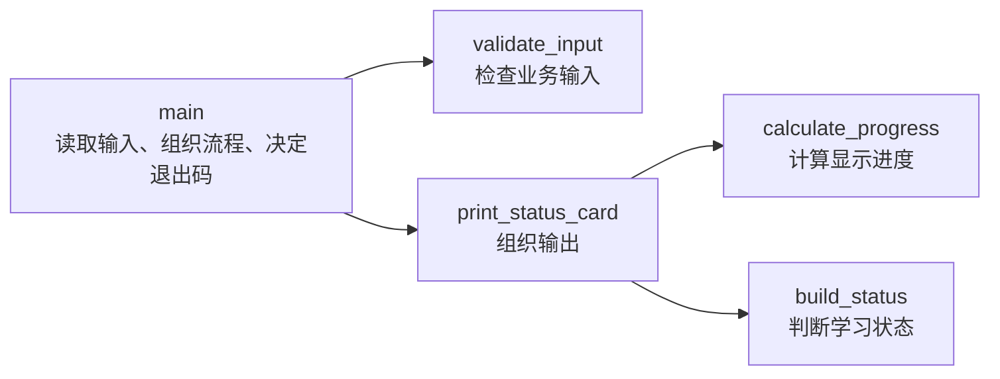

<section id="overview-function-output" class="be-page-hero be-lesson-hero" data-learning-context="overview-function-output" data-context-type="overview" markdown="1">

C++ 起步 · 第二课 · 学习进度报告器 C++ v0.2

# 函数、声明与程序组织

## 输出没变，程序里面已经换了样子

~~~text
学习状态卡
姓名：Lin Yue
计划：10.0 小时
完成：7.5 小时
进度：75.0%
状态：进行中
~~~

上一课的 `main()` 既读输入，又校验、计算和打印。现在把这些工作拆开，但保留同样的输入、输出和退出码。重构的价值不在代码行数，而在每条规则都有清楚的位置。

[先看函数怎样分工](#concept-function-responsibility){ .md-button .md-button--primary }
[直接运行函数化版本](#reproduce-function-card){ .md-button }

</section>

  
课程位置<strong>C++ 起步 · 2 / 2</strong>

  
前置<strong>C++20 构建、类型、输入输出和退出码</strong>

  
完成后留下<strong>函数化状态卡、回归矩阵和四类诊断记录</strong>

## 开始前

- 已完成上一课的单文件状态卡，并能在严格警告下重新构建。
- 能解释为什么非法输入写入 `std::cerr` 并返回非零状态。
- 本课仍使用单个 `.cpp` 文件，不提前拆头文件或引入 CMake。
- 示例以 C++20 为基线，不使用类、模板、指针或第三方库。

<section id="concept-function-responsibility" data-learning-context="concept-function-responsibility" data-context-type="concept" markdown="1">

## `main()` 负责串起来，不必亲手做完全部工作

每个箭头都是一次函数调用。计算函数只接受参数并返回结果，不反过来读取终端，也不依赖隐藏的全局变量。以后修改进度规则时，注意力可以集中在 `calculate_progress()`。

函数不是把一大段代码随便包进花括号。一个合适的函数应该能用一句话说清职责，真实输入能从参数看见，结果或副作用也有明确出口。

</section>

<section id="example-declare-define-call" data-learning-context="example-declare-define-call" data-context-type="example" markdown="1">

## 声明、定义和调用各做一件事

~~~cpp
double calculate_progress(double planned, double completed); // 声明

int main() {
    const double result{calculate_progress(10.0, 7.5)};       // 调用
    return result > 0.0 ? 0 : 1;
}

double calculate_progress(double planned, double completed) { // 定义
    const double raw{completed / planned};
    return raw > 1.0 ? 1.0 : raw;
}
~~~

| 角色 | 它告诉编译器什么 | 有没有函数体 |
| --- | --- | --- |
| 声明 | 名称、参数和返回类型 | 没有，以分号结束 |
| 定义 | 函数具体怎样执行 | 有 `{}` |
| 调用 | 这一次交给函数哪些实参 | 不适用 |

编译器读到调用点时，必须已经看见匹配的声明。定义可以写在后面，但接口不能到调用以后才第一次出现。

</section>

<section id="concept-function-interface" data-learning-context="concept-function-interface" data-context-type="concept" markdown="1">

## 一条声明就是一份最小接口

~~~cpp
double calculate_progress(double planned_hours, double completed_hours);
~~~

读这行时，按固定顺序问：

1. 函数叫什么，它的名字有没有说明工作？
2. 调用者要按什么顺序提供哪些类型？
3. 调用以后会得到什么类型？

参数名能帮助人理解顺序；参数类型和返回类型让编译器检查调用。只改返回类型不能形成两个合法重载：

~~~cpp
double progress(double planned, double completed);
int progress(double planned, double completed); // 参数列表相同，无法这样重载
~~~

调用者不能靠“准备把结果放到哪里”让编译器选择其中一个。

</section>

<section id="concept-parameter-passing" data-learning-context="concept-parameter-passing" data-context-type="concept" markdown="1">

## 小数值按值，只读字符串用 `const&`

~~~cpp
double calculate_progress(double planned_hours, double completed_hours);

std::string validate_input(
    const std::string& learner,
    double planned_hours,
    double completed_hours
);
~~~

`double`、`bool` 和 `char` 这类小型值在这里按值传递。函数得到自己的局部副本，修改形参不会改变调用者：

~~~cpp
void reset_copy(double hours) {
    hours = 0.0;
}
~~~

姓名只需读取，使用 `const std::string&`：引用避免这一份字符串复制，`const` 又禁止函数通过这个名字修改调用者对象。

不要把“引用更快”当成万能规则。接口首先要说清是否借用、能否修改；真实性能要测量。本课也不返回引用，悬空引用和移动语义留到生命周期课程。

</section>

<section id="concept-return-side-effect" data-learning-context="concept-return-side-effect" data-context-type="concept" markdown="1">

## `return` 交回数据，`cout` 改变外部世界

~~~cpp
double calculate_progress(double planned, double completed) {
    return completed / planned;
}
~~~

计算函数把结果返回给调用者，因此可以直接拿几组参数检查结果。打印函数的主要工作是产生终端输出，返回 `void`：

~~~cpp
void print_name(const std::string& learner) {
    std::cout << "姓名：" << learner << '\n';
}
~~~

把计算和输出混在一起，测试时就不得不捕获终端文字。先返回数据，再由程序边界决定怎样展示，通常更容易复用和验证。

非 `void` 函数要覆盖所有正常路径。若某条分支走到末尾没有返回值，严格警告会指出问题。别随便补一个 0；先决定非法输入应该由谁拒绝。

</section>

<section id="concept-scope-namespace" data-learning-context="concept-scope-namespace" data-context-type="concept" markdown="1">

## 局部对象只活在自己的作用域里

~~~cpp
double calculate_progress(double planned, double completed) {
    const double raw_progress{completed / planned};
    return raw_progress > 1.0 ? 1.0 : raw_progress;
}
~~~

形参和 `raw_progress` 都属于这次函数调用。离开函数后，局部对象不能再访问；返回的是一个 `double` 值，调用者可以安全保存。

不要用可变全局变量藏起输入：

~~~cpp
double planned_hours{}; // 不采用

double calculate_progress(double completed) {
    return completed / planned_hours;
}
~~~

这个函数真实依赖了两个值，接口却只写了一个。把依赖放进参数，调用点才说得清数据从哪里来。

业务名称放进 `study` 命名空间：

~~~cpp
namespace study {
double calculate_progress(double planned, double completed);
}
~~~

命名空间组织名称并降低冲突，但不会自动创建文件、模块或访问控制。

</section>

<section id="example-overload" data-learning-context="example-overload" data-context-type="example" markdown="1">

## 重载要让调用者和编译器都看得明白

~~~cpp
std::string build_status(double planned, double completed);
std::string build_status(bool completed);
~~~

参数列表不同，调用可以明确选择。但下面这组接口会让 `show(1)` 难以决定：

~~~cpp
void show(long value);
void show(double value);

show(1); // int 转成 long 或 double 都需要转换
~~~

先判断两个函数是否真的表达同一件事。语义不同就重新命名；确实需要重载时，让实参类型明确。不要用随意强制转换掩盖接口设计问题。

</section>

<section id="reproduce-function-card" data-learning-context="reproduce-function-card" data-context-type="reproduce" markdown="1">

## 编译函数化状态卡

复制[完整示例](../../../examples/cpp-start/function_status.cpp)到上一课的练习目录，然后构建：

~~~bash
clang++ -std=c++20 -Wall -Wextra -Wpedantic -Wconversion -Wshadow \
  function_status.cpp -o build/function_status
./build/function_status
~~~

GCC 把命令换成 `g++`。Windows Developer PowerShell：

~~~powershell
cl /std:c++20 /W4 /EHsc /permissive- function_status.cpp /Fe:build\function_status.exe
.\build\function_status.exe
~~~

输入：

~~~text
Lin Yue
10
7.5
~~~

进度应为 `75.0%`，状态应为“进行中”，退出码为 0。源码里能看到 `validate_input()`、`calculate_progress()`、`build_status()` 和 `print_status_card()` 各自承担一段职责。

</section>

<section id="reproduce-regression-matrix" data-learning-context="reproduce-regression-matrix" data-context-type="reproduce" markdown="1">

## 重构完成，要用旧行为回归

| 场景 | 输入摘要 | 关键结果 | 退出码 |
| --- | --- | --- | --- |
| 正常 | `Lin Yue / 10 / 7.5` | `75.0%`、进行中 | 0 |
| 刚好完成 | `Ada / 8 / 8` | `100.0%`、已完成 | 0 |
| 超额完成 | `Lin / 10 / 12.5` | `100.0%`、已完成 | 0 |
| 空姓名 | 空行 | 姓名不能为空 | 1 |
| 非数字 | `ten` | 学习时间必须是数字 | 1 |
| 零计划 | `0 / 0` | 计划时间必须大于 0 | 1 |
| 负完成 | `10 / -1` | 已完成时间不能小于 0 | 1 |

“成功编译”只能说明接口和语法基本成立。重构前后用同一组输入，比较关键输出、stderr 和退出码，才能说明外部行为没有被悄悄改掉。

</section>

<section id="modify-status-rule" data-learning-context="modify-status-rule" data-context-type="modify" markdown="1">

## 把状态分成三种

现在 `build_status()` 只有“进行中”和“已完成”。把它改成：

- 完成小时少于计划：`进行中`。
- 完成小时刚好等于计划：`刚好完成`。
- 完成小时超过计划：`超额完成`。

先单独写出三组调用和预期返回值，再改函数。`main()`、输入代码和打印格式不需要一起重写。最后重新跑 `7.5/10`、`10/10` 和 `12.5/10`，确认只改变了你想改的状态文字。

再独立增加 `bool reached_goal(double planned, double completed)`，让它只返回真假，不打印也不读取全局数据。

</section>

<section id="troubleshoot-declaration" data-learning-context="troubleshoot-declaration" data-context-type="troubleshoot" markdown="1">

## 把声明拿掉，看调用点为什么不认识函数

在临时文件里让定义出现在 `main()` 后面，又不写前置声明：

~~~cpp
int main() {
    return calculate_result(2);
}

int calculate_result(int value) {
    return value * 2;
}
~~~

编译器处理调用时还没有见过 `calculate_result`。把完全匹配的声明放回调用点之前，或把定义整体移到前面。

再试一组“声明和定义参数不同”的代码：调用需要 `double, double`，定义却写成 `int, int`。前者只有声明没有实现，通常会在链接阶段暴露缺失符号。它和“调用前完全没声明”的编译错误不在同一层。

</section>

<section id="troubleshoot-parameters-overload" data-learning-context="troubleshoot-parameters-overload" data-context-type="troubleshoot" markdown="1">

## 两个小实验看清权限和二义性

尝试修改只读引用：

~~~cpp
void rename(const std::string& learner) {
    learner = "changed";
}
~~~

编译器应该拒绝。函数只需读取姓名时，删除 `const` 会无故放宽权限，不是合适的修复。

再复现 `show(long)` 与 `show(double)` 对 `show(1)` 的二义性。阅读候选函数列表，然后分别比较“给实参明确类型”和“把两个不同语义的函数重新命名”。哪一种更好取决于真实接口，不取决于哪一种少写几个字符。

| 现象 | 先检查什么 | 常见修复 |
| --- | --- | --- |
| 函数未声明 | 调用前是否可见匹配声明 | 前移定义或补声明 |
| 链接缺失符号 | 声明和定义是否完全一致 | 统一接口并让定义参与链接 |
| 修改 `const&` 失败 | 函数是否真的应该写调用者对象 | 保持只读或重设计修改接口 |
| 非 `void` 缺少返回 | 是否有分支走到末尾 | 明确非法输入责任并补齐路径 |
| 重载二义性 | 多个候选是否同样合适 | 简化接口、明确类型或重新命名 |

</section>

<section id="project-cpp-v02" data-learning-context="project-cpp-v02" data-context-type="project" markdown="1">

## 报告器有了第一组稳定接口

上一课只有一段可运行流程；这一课把规则命名成函数。下节拆成头文件和源文件时，迁移的是已经通过输入矩阵的接口，而不是边拆文件边猜职责。

| v0.1 | v0.2 | 下一版 |
| --- | --- | --- |
| 一段 `main()` | 校验、计算、状态、输出分开 | 头文件公开声明，源文件放定义 |
| 手工观察输出 | 七类输入回归 | CMake 构建应用、库和测试 |
| 数据流藏在语句顺序里 | 参数与返回值显式表达 | 跨文件依赖保持单向 |

最终阶段作品已经有更完整的函数、容器和测试。本课保留单文件快照，专门用来理解接口形成的过程。

</section>

<section id="deepen-interface-design" data-learning-context="deepen-interface-design" data-context-type="deepen" markdown="1">

## 函数越多，不代表组织越好

如果一个函数只是把另一行代码改了名字，却没有形成稳定职责，调用链反而更难读。反过来，一个函数里仍然读取输入、修改全局状态、计算并打印，也只是把原来的混乱搬了位置。

检查函数时看四件事：名字能否说清工作，参数是否包含真实依赖，返回值或副作用是否明确，能否用少量输入单独验证。性能方面也不要凭“按引用看起来更高级”下结论，先保证权限和数据流正确。

</section>

<section id="career-refactor-story" data-learning-context="career-refactor-story" data-context-type="career" markdown="1">

## 讲重构时，先讲保持了什么

可靠的重构叙事不是“我把代码优化成了多个函数”。可以这样讲：原程序有哪些职责混在一起，为什么难以验证；你怎样划分输入、计算和输出；重构前后用了哪组数据比较；哪次声明或参数问题由编译器发现。

如果输出和退出码有意改变，也要明确说出需求变化。把所有差异都叫“重构”，会掩盖行为修改。

</section>

## 完成检查

- [ ] 能用自己的话区分函数声明、定义和调用。
- [ ] 能从一条声明指出函数名、参数顺序和返回类型。
- [ ] 能解释调用点之前为什么要看见匹配声明。
- [ ] 能为小型数值选择按值参数，为只读字符串选择 `const&`。
- [ ] 能区分返回数据和终端输出，并让计算函数保持可单独验证。
- [ ] 能说明局部作用域，并拒绝用可变全局状态隐藏输入。
- [ ] 能复现无声明、定义不匹配、只读引用修改和重载二义性。
- [ ] 能在严格警告下编译函数化状态卡并跑完七类回归。
- [ ] 能主动修改状态规则，而不重写不相关的输入和输出代码。

## 来源与版本

| 来源 | 用于核查 | 核查日期 |
| --- | --- | --- |
| [C++ working draft](https://github.com/cplusplus/draft) | 函数、声明、定义、作用域、引用与重载边界 | 2026-07-17 |
| [cppreference：Functions](https://en.cppreference.com/w/cpp/language/functions.html) | 函数声明、定义、参数和返回值速查 | 2026-07-17 |
| [cppreference：Reference initialization](https://en.cppreference.com/w/cpp/language/reference_initialization.html) | `const&` 参数的基本语义 | 2026-07-17 |
| [cppreference：Overload resolution](https://en.cppreference.com/w/cpp/language/overload_resolution.html) | 重载候选和二义性 | 2026-07-17 |
| [Clang diagnostics reference](https://clang.llvm.org/docs/DiagnosticsReference.html) | 严格警告与诊断 | 2026-07-17 |
| [MSVC compiler options](https://learn.microsoft.com/en-us/cpp/build/reference/compiler-options-listed-by-category?view=msvc-170) | Windows C++20 编译口径 | 2026-07-17 |

## 下一步

下一节进入[头文件、源文件与最小 CMake 工程](03-headers-sources-cmake.md)。这些已经验证过的函数声明会进入头文件，定义移到源文件，应用和测试再由 CMake 统一构建。
