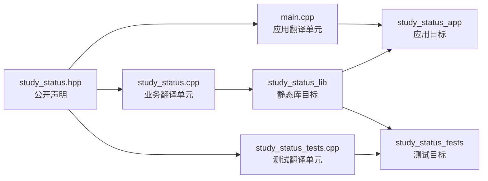
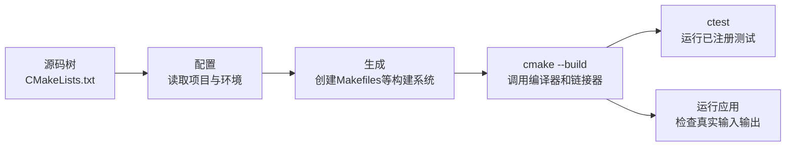

# 头文件、源文件与最小 CMake 工程

## 课程信息

| 项目 | 内容 |
| --- | --- |
| 适合人群 | 已完成C++函数组织和Python模块接口课程，准备把单文件程序迁移为可重复构建工程的学习者 |
| 前置知识 | 编译、链接、目标文件、函数声明与定义、命名空间、严格警告和终端操作 |
| 学习结果 | 能拆分自包含头文件与源文件，使用目标化CMake配置库、应用和测试，并定位配置、编译、链接与测试失败 |
| 语言基线 | C++20 |
| 构建基线 | `cmake_minimum_required(VERSION 3.20)`；本地使用CMake 4.4.0实际验证 |
| 本地工具 | Apple Clang 21、CMake 4.4.0、默认Unix Makefiles生成器、CTest 4.4.0 |
| 实践产出 | 多翻译单元学习状态卡、静态库目标、应用目标、CTest测试目标和构建证据 |

## 为什么现在进入多文件工程

上一节已经把学习状态卡拆成职责清楚的函数，但所有声明、定义和入口仍在一个文件中。继续增加代码时会出现三个问题：

- 调用者需要使用哪些函数，与函数内部怎样实现混在一起。
- 应用和测试难以复用同一份业务实现。
- 每次都手写越来越长的编译、目标文件和链接命令，容易遗漏源文件或参数。

本节做两次分离：

1. 用头文件表达公开接口，用源文件保存实现。
2. 用CMake目标表达“哪些源文件组成库，哪些程序依赖这个库”。

CMake不会替代编译器和链接器。它根据项目描述生成当前平台的构建系统，再调用Clang、GCC、MSVC和对应链接工具完成工作。

## 前置检查与工具安装

检查编译器：

```bash
clang++ --version
```

检查CMake和CTest：

```bash
cmake --version
ctest --version
```

本课程在macOS上实际使用：

```text
Apple Clang 21
CMake 4.4.0
```

macOS尚未安装时可以使用Homebrew：

```bash
brew install cmake
```

Linux应优先使用发行版官方包管理器；Windows可使用CMake官方安装程序或Visual Studio Installer。安装后重新打开终端并记录真实版本，不要只记录“已经安装”。

## 学习目标

完成本节后，你应该能够：

- 解释头文件被包含到翻译单元中的基本过程。
- 把公开声明、实现和程序入口放入合适文件。
- 编写自包含头文件和稳定include guard。
- 解释为什么源文件优先包含自己的头文件。
- 区分重复声明、重复定义和缺失定义。
- 说明CMake配置、生成、构建和CTest各自做什么。
- 使用库、应用和测试三个目标表达依赖。
- 为目标设置C++20、头文件目录和严格警告。
- 判断`PUBLIC`与`PRIVATE`是否需要传播给依赖者。
- 使用源码外构建目录，避免生成文件污染源码树。
- 依据诊断定位include目录、源文件清单、声明定义和链接关系问题。

## 头文件、源文件和链接怎样协作

下面的图回答一个问题：**应用和测试如何复用同一份业务实现？**



预处理阶段会把`#include`指定的头文件内容带入当前翻译单元。`main.cpp`和`study_status.cpp`分别编译为目标文件；库目标收纳业务实现，应用和测试再分别链接它。

头文件不是已经编译好的库。它主要让不同翻译单元看到一致的声明；函数定义仍必须在某个参与链接的源文件或库中存在。

## 声明放头文件，定义放源文件

公开头文件描述调用者可以依赖的接口：

```cpp
std::string validate_input(
    const std::string& learner,
    double planned_hours,
    double completed_hours
);
```

源文件包含自己的头文件并提供定义：

```cpp
#include "study/study_status.hpp"

std::string study::validate_input(
    const std::string& learner,
    double planned_hours,
    double completed_hours
) {
    // 实现
}
```

把自己的头文件放在源文件的第一条项目include位置，可以尽早发现：

- 头文件缺少它自己需要的标准库include。
- 声明与定义参数、返回类型或命名空间不一致。
- 实现暗中依赖了其他头文件的偶然包含顺序。

### 自包含头文件

如果头文件声明使用`std::string`，它自己就应包含`<string>`：

```cpp
#include <string>
```

调用者不应被迫猜测“要先包含哪个文件，当前头文件才能工作”。一个简单检查是建立只包含该头文件的临时源文件并编译：

```cpp title="header_check.cpp"
#include "study/study_status.hpp"

int main() {
    return 0;
}
```

## Include guard防止重复处理

课程使用标准include guard：

```cpp
#ifndef BECOME_ENGINEER_STUDY_STUDY_STATUS_HPP
#define BECOME_ENGINEER_STUDY_STUDY_STATUS_HPP

// 头文件内容

#endif
```

宏名应在项目中保持唯一。路径信息能降低不同模块使用相同文件名时发生冲突的概率。

`#pragma once`被主流编译器广泛支持，但不是本课程的基线。先掌握语言工具链长期通用的include guard，再在真实项目中遵循项目约定。

删除include guard不一定立刻报错。重复的相同函数声明可能仍然合法；但头文件会被重复处理，未来加入类型定义、某些变量定义或默认参数后可能失败。因此不能把“这一次还能编译”当作不需要guard的证据。

## 多文件中常见的三类定义问题

| 问题 | 典型阶段 | 说明 |
| --- | --- | --- |
| 声明与定义不一致 | 编译或链接 | 源文件可能定义了另一个重载，原声明仍没有定义 |
| 定义未参与目标 | 链接 | 源文件存在，但CMake目标没有编译或链接它 |
| 同一个非inline定义进入多个翻译单元 | 链接 | 链接器发现重复符号，违反单一定义要求 |

起步阶段先记住可操作规则：

- 普通函数声明可以放头文件。
- 普通函数定义放一个源文件。
- 不把普通函数体直接复制到多个源文件。
- 头文件中的模板和`inline`规则留到对应课程再展开。

## CMake的四个阶段

下面的图回答一个问题：**运行一次`cmake`是否等于已经编译和测试？**



| 阶段 | 命令 | 主要产物或证据 |
| --- | --- | --- |
| 配置与生成 | `cmake -S . -B build` | 缓存、生成器文件和目标关系 |
| 构建 | `cmake --build build` | 目标文件、库、应用和测试程序 |
| 测试 | `ctest --test-dir build` | 测试发现、退出码和失败输出 |
| 运行 | 执行应用目标 | 真实交互、标准输出、标准错误和退出码 |

配置成功只说明CMake能够生成构建系统，不说明C++代码一定能编译；构建成功也不说明测试和业务输入一定正确。

## 目标化CMake，而不是拼全局参数

本节使用三个目标：

- `study_status_lib`：业务函数静态库。
- `study_status_app`：交互式应用。
- `study_status_tests`：测试程序。

目标之间通过名字关联：

```cmake
target_link_libraries(study_status_app PRIVATE study_status_lib)
```

### `PUBLIC`与`PRIVATE`

`study_status_lib`的调用者需要包含公开头文件，因此include目录是`PUBLIC`：

```cmake
target_include_directories(
  study_status_lib
  PUBLIC "${CMAKE_CURRENT_SOURCE_DIR}/include"
)
```

应用只在自身链接时使用库，不要求它的依赖者继续链接该库，因此是`PRIVATE`：

```cmake
target_link_libraries(study_status_app PRIVATE study_status_lib)
```

| 作用域 | 当前目标使用 | 传播给依赖者 |
| --- | --- | --- |
| `PRIVATE` | 是 | 否 |
| `PUBLIC` | 是 | 是 |
| `INTERFACE` | 否 | 是 |

本节不需要单独创建`INTERFACE`目标，但保留这一行用于理解作用域完整关系。

### C++标准与警告属于目标

```cmake
target_compile_features(study_status_lib PUBLIC cxx_std_20)
```

`PUBLIC`表示库本身和链接它的消费者都需要C++20。CMake会依据编译器能力选择对应标准参数。

警告只服务于当前目标，不应随意塞入全局`CMAKE_CXX_FLAGS`。完整示例用一个小函数对每个本项目目标应用平台对应警告。

## 完整示例：多文件学习状态卡

### 目录结构

```text
study-status-cmake/
├── include/
│   └── study/
│       └── study_status.hpp
├── src/
│   ├── main.cpp
│   └── study_status.cpp
├── tests/
│   └── study_status_tests.cpp
├── .gitignore
└── CMakeLists.txt
```

所有命令从`study-status-cmake/`根目录执行。`build/`由工具生成，不手工修改，也不提交Git。

### 公开头文件

```cpp title="include/study/study_status.hpp"
#ifndef BECOME_ENGINEER_STUDY_STUDY_STATUS_HPP
#define BECOME_ENGINEER_STUDY_STUDY_STATUS_HPP

#include <string>

namespace study {

std::string validate_input(
    const std::string& learner,
    double planned_hours,
    double completed_hours
);
double calculate_progress(double planned_hours, double completed_hours);
std::string build_status(double planned_hours, double completed_hours);
void print_status_card(
    const std::string& learner,
    double planned_hours,
    double completed_hours
);

} // namespace study

#endif
```

### 业务实现

```cpp title="src/study_status.cpp"
#include "study/study_status.hpp"

#include <iomanip>
#include <iostream>

namespace study {

std::string validate_input(
    const std::string& learner,
    double planned_hours,
    double completed_hours
) {
    if (learner.empty()) {
        return "输入错误：姓名不能为空。";
    }
    if (planned_hours <= 0.0) {
        return "输入错误：计划学习时间必须大于 0。";
    }
    if (completed_hours < 0.0) {
        return "输入错误：已完成时间不能小于 0。";
    }
    return "";
}

double calculate_progress(double planned_hours, double completed_hours) {
    if (planned_hours <= 0.0) {
        return 0.0;
    }
    const double raw_progress{completed_hours / planned_hours};
    return raw_progress > 1.0 ? 1.0 : raw_progress;
}

std::string build_status(double planned_hours, double completed_hours) {
    return completed_hours >= planned_hours ? "已完成" : "进行中";
}

void print_status_card(
    const std::string& learner,
    double planned_hours,
    double completed_hours
) {
    const double displayed_progress{
        calculate_progress(planned_hours, completed_hours)
    };
    const std::string status{build_status(planned_hours, completed_hours)};

    std::cout << std::fixed << std::setprecision(1);
    std::cout << "\n学习状态卡\n";
    std::cout << "姓名：" << learner << '\n';
    std::cout << "计划：" << planned_hours << " 小时\n";
    std::cout << "完成：" << completed_hours << " 小时\n";
    std::cout << "进度：" << displayed_progress * 100.0 << "%\n";
    std::cout << "状态：" << status << '\n';
}

} // namespace study
```

业务源文件先包含自己的公开头文件，再包含实现所需标准库头文件。

### 程序入口

```cpp title="src/main.cpp"
#include "study/study_status.hpp"

#include <iostream>
#include <string>

int main() {
    std::string learner{};
    double planned_hours{};
    double completed_hours{};

    std::cout << "请输入学习者姓名：";
    std::getline(std::cin, learner);

    std::cout << "请输入计划学习时间：";
    std::cin >> planned_hours;

    std::cout << "请输入已完成时间：";
    std::cin >> completed_hours;

    if (!std::cin) {
        std::cerr << "输入错误：学习时间必须是数字。\n";
        return 1;
    }

    const std::string error_message{
        study::validate_input(learner, planned_hours, completed_hours)
    };
    if (!error_message.empty()) {
        std::cerr << error_message << '\n';
        return 1;
    }

    study::print_status_card(learner, planned_hours, completed_hours);
    return 0;
}
```

`main.cpp`只负责程序边界：读取输入、调用校验、组织输出和返回退出码。

### 标准库测试程序

```cpp title="tests/study_status_tests.cpp"
#include "study/study_status.hpp"

#include <cmath>
#include <iostream>
#include <string>

namespace {

int failures{};

void expect_true(bool condition, const std::string& message) {
    if (!condition) {
        std::cerr << "FAILED: " << message << '\n';
        ++failures;
    }
}

void expect_close(double actual, double expected, const std::string& message) {
    constexpr double tolerance{0.000001};
    expect_true(std::abs(actual - expected) <= tolerance, message);
}

} // namespace

int main() {
    expect_true(
        study::validate_input("Lin", 10.0, 7.5).empty(),
        "valid input should not return an error"
    );
    expect_true(
        study::validate_input("", 10.0, 1.0) ==
            "输入错误：姓名不能为空。",
        "empty learner should be rejected"
    );
    expect_true(
        study::validate_input("Lin", 0.0, 0.0) ==
            "输入错误：计划学习时间必须大于 0。",
        "zero planned hours should be rejected"
    );
    expect_true(
        study::validate_input("Lin", 10.0, -1.0) ==
            "输入错误：已完成时间不能小于 0。",
        "negative completed hours should be rejected"
    );

    expect_close(
        study::calculate_progress(10.0, 7.5),
        0.75,
        "normal progress should be calculated"
    );
    expect_close(
        study::calculate_progress(10.0, 12.5),
        1.0,
        "displayed progress should be capped"
    );
    expect_close(
        study::calculate_progress(0.0, 1.0),
        0.0,
        "invalid zero target should not divide by zero"
    );

    expect_true(
        study::build_status(10.0, 7.5) == "进行中",
        "unfinished study should be in progress"
    );
    expect_true(
        study::build_status(10.0, 10.0) == "已完成",
        "exact target should be completed"
    );

    if (failures == 0) {
        std::cout << "All study status tests passed.\n";
        return 0;
    }

    std::cerr << failures << " test(s) failed.\n";
    return 1;
}
```

测试程序遵守最简单契约：全部检查成功返回`0`，任一失败返回非零。CTest根据进程退出码判断测试结果。

### CMake项目描述

```cmake title="CMakeLists.txt"
cmake_minimum_required(VERSION 3.20)

project(study_status VERSION 0.1.0 LANGUAGES CXX)

function(enable_project_warnings target_name)
  if(MSVC)
    target_compile_options(
      ${target_name}
      PRIVATE /W4 /permissive-
    )
  else()
    target_compile_options(
      ${target_name}
      PRIVATE -Wall -Wextra -Wpedantic -Wconversion -Wshadow
    )
  endif()
endfunction()

add_library(
  study_status_lib
  STATIC
  src/study_status.cpp
)

target_include_directories(
  study_status_lib
  PUBLIC "${CMAKE_CURRENT_SOURCE_DIR}/include"
)

target_compile_features(study_status_lib PUBLIC cxx_std_20)
set_target_properties(study_status_lib PROPERTIES CXX_EXTENSIONS OFF)
enable_project_warnings(study_status_lib)

add_executable(study_status_app src/main.cpp)
target_link_libraries(study_status_app PRIVATE study_status_lib)
set_target_properties(study_status_app PROPERTIES CXX_EXTENSIONS OFF)
enable_project_warnings(study_status_app)

include(CTest)

if(BUILD_TESTING)
  add_executable(study_status_tests tests/study_status_tests.cpp)
  target_link_libraries(study_status_tests PRIVATE study_status_lib)
  set_target_properties(study_status_tests PROPERTIES CXX_EXTENSIONS OFF)
  enable_project_warnings(study_status_tests)

  add_test(NAME study_status_tests COMMAND study_status_tests)
endif()
```

这里没有使用`file(GLOB ...)`自动收集源文件。显式列出源文件能让新增、删除和审查变化进入CMake配置与Git差异，不依赖文件系统偶然状态。

### Git忽略边界

```gitignore title=".gitignore"
build/
```

只忽略生成的构建树，不忽略源文件、头文件、测试或`CMakeLists.txt`。

## 配置、构建与测试

### macOS与Linux

配置源码外Debug构建：

```bash
cmake -S . -B build -DCMAKE_BUILD_TYPE=Debug
```

构建全部默认目标：

```bash
cmake --build build --config Debug
```

运行测试：

```bash
ctest --test-dir build --build-config Debug --output-on-failure
```

预期关键输出：

```text
100% tests passed, 0 tests failed out of 1
```

使用默认Unix Makefiles生成器时运行应用：

```bash
./build/study_status_app
```

### Windows与多配置生成器

配置和构建命令保持一致：

```powershell
cmake -S . -B build
cmake --build build --config Debug
ctest --test-dir build --build-config Debug --output-on-failure
```

Visual Studio等多配置生成器通常把Debug程序放在配置子目录：

```powershell
.\build\Debug\study_status_app.exe
```

`CMAKE_BUILD_TYPE`主要用于单配置生成器；多配置生成器在构建和测试时通过`--config Debug`选择配置。统一命令保留`--config Debug`，在两类生成器上都可以使用。

### 查看真实编译与链接命令

```bash
cmake --build build --verbose
```

详细输出中应能看到：

- `src/study_status.cpp`、`src/main.cpp`和测试分别编译。
- 编译命令包含C++20与严格警告参数。
- 应用和测试链接`study_status_lib`。

不要把生成器输出的具体临时路径写成跨平台固定结论。

## 交互行为回归矩阵

多文件迁移后仍使用上一课相同验收：

| 场景 | 输入 | 关键结果 | 退出码 |
| --- | --- | --- | --- |
| 正常 | `Lin Yue / 10 / 7.5` | `75.0%`、进行中 | `0` |
| 姓名含空格 | `Ada Lovelace / 8 / 8` | 完整姓名、已完成 | `0` |
| 空姓名 | 空行、`10 / 1` | 姓名不能为空 | `1` |
| 非数字 | `Lin / ten / 1` | 学习时间必须是数字 | `1` |
| 零计划 | `Lin / 0 / 0` | 计划时间必须大于0 | `1` |
| 负完成 | `Lin / 10 / -1` | 已完成时间不能小于0 | `1` |
| 超额完成 | `Lin / 10 / 12.5` | `100.0%`、已完成 | `0` |

内部结构改变不应悄悄改变外部行为。课程实现额外让`calculate_progress(0.0, 1.0)`返回`0.0`，但应用仍会先通过`validate_input`拒绝非法计划时间。

## 失败实验与定位

### include目录配置错误

暂时把CMake中的`include`路径改成不存在的目录。构建`main.cpp`或业务源文件时应报告找不到：

```text
study/study_status.hpp
```

这是编译阶段问题。先检查目标的include目录和头文件相对路径，不要把机器绝对路径硬编码进源码。

### 声明与定义不一致

把源文件定义的参数改成`int`，头文件仍保留`double`。这会定义另一个函数，应用需要的`double`版本仍缺失，通常在链接阶段报告未定义符号。

### 漏掉实现源文件

从`study_status_lib`目标中暂时删除`src/study_status.cpp`。根据CMake版本和目标源文件情况，配置可能先拒绝没有源文件的普通静态库；若目标仍含其他源文件，最终会在链接时发现业务函数定义缺失。诊断发生在哪一步取决于你留下的目标内容，不能机械背成一种错误。

### 重复定义

把同一个普通函数完整定义复制到`main.cpp`，同时保留库中的定义。两个翻译单元都提供同名定义，链接器应报告重复符号。

### 测试失败

把测试中的预期进度从`0.75`改为`0.80`，重新构建和运行CTest：

```bash
cmake --build build --config Debug
ctest --test-dir build --build-config Debug --output-on-failure
```

CTest应返回非零，并显示测试程序的`FAILED`信息。恢复断言后重新构建，确认测试再次通过。

### 构建缓存与新构建目录

当你怀疑旧缓存或生成器选择影响结果时，不要对不确定路径执行删除命令。直接创建一个新的构建树：

```bash
cmake -S . -B build-clean -DCMAKE_BUILD_TYPE=Debug
cmake --build build-clean --config Debug
ctest --test-dir build-clean --build-config Debug --output-on-failure
```

确认新目录通过后，再人工核对需要清理的旧目录是否确实是生成产物。

## AI协作任务

### 可复用提示模板

```text
请把这个C++20单文件学习状态卡迁移为最小多文件CMake工程。
要求：
1. 公开声明放入自包含头文件，使用项目唯一include guard；
2. 实现放入一个源文件，main只负责输入、编排和退出码；
3. 创建静态库、应用和标准库测试三个目标，应用与测试链接同一库；
4. 使用target_include_directories、target_compile_features和target_compile_options；
5. 正确解释PUBLIC与PRIVATE，不使用全局CMAKE_CXX_FLAGS；
6. 使用C++20和Clang/GCC严格警告，MSVC使用/W4与/permissive-；
7. 使用include(CTest)和add_test，不下载测试框架；
8. 不使用file(GLOB)、机器绝对路径、安装导出、FetchContent或CMake Presets；
9. 保持原输入、输出和退出码行为。
请给出完整文件、目标依赖图、构建测试命令和失败排查顺序。
```

### 人工审阅清单

- 头文件是否独立包含它使用的`<string>`。
- include guard宏名是否在项目中足够唯一。
- 声明、定义、命名空间和参数顺序是否完全一致。
- 业务源文件是否先包含自己的公开头文件。
- `main.cpp`是否复制了业务实现。
- 所有源文件是否显式加入正确目标。
- include目录为何是`PUBLIC`，应用链接为何是`PRIVATE`。
- C++20和警告是否真正作用到库、应用和测试。
- 是否出现`file(GLOB)`、全局flags或个人绝对路径。
- CTest是否真实运行测试程序，而不只是成功构建它。

主动修改：新增“刚好完成”状态。只调整公开声明确有必要的部分和业务实现，补充测试，然后观察哪些翻译单元重新编译并完成七类输入回归。

## 核心手动检查点

### 检查点1：追踪两个翻译单元

使用详细构建输出，指出`main.cpp`和`study_status.cpp`各自产生的目标文件，以及最终应用链接了哪些目标。

### 检查点2：证明头文件自包含

编译`header_check.cpp`：

```bash
clang++ -std=c++20 -Wall -Wextra -Wpedantic \
  -Iinclude -c header_check.cpp -o build/header_check.o
```

不能靠`main.cpp`中的其他include掩盖头文件缺失依赖。

### 检查点3：区分声明与定义失败

分别制造参数类型不一致和遗漏实现源文件。记录问题在哪个阶段出现、诊断中的符号名称以及最小修复。

### 检查点4：观察增量构建

首次完整构建后只修改`study_status.cpp`，再次详细构建；再修改公开头文件并构建。比较重新编译的目标，解释依赖关系。

### 检查点5：解释目标作用域

说明为什么include目录需要传播给应用和测试，而应用对库的链接关系不需要传播给不存在的下游消费者。

### 检查点6：让CTest先失败

故意改错一个期望，确认CTest非零退出；恢复后必须再次运行，不能只凭“已经改回去”宣布通过。

### 检查点7：使用全新构建树

用`build-clean/`重新配置、构建和测试。确认源码树没有出现`CMakeCache.txt`、目标文件或可执行文件。

## 微练习

1. 把一个单文件程序拆成公开头文件、实现源文件和入口文件。
2. 创建只包含公开头文件的`header_check.cpp`并独立编译。
3. 删除include guard，观察当前声明是否仍能编译，并解释为什么不能据此移除guard。
4. 使用手写编译命令分别生成两个目标文件并链接，再与CMake详细输出对照。
5. 删除一个源文件目标关系，判断失败发生在配置、编译还是链接阶段。
6. 把include目录错误设为`PRIVATE`，观察当前应用是否仍能获得头文件路径并解释传播规则。
7. 改错一个测试期望，让CTest失败后恢复。
8. 修改实现与修改头文件各一次，对比增量构建范围。
9. 使用新的构建目录完成一次独立验收。

## 阶段作品决定

本节完成后，C++已经具备多文件构建与最小测试能力，Python也具备多模块接口与自动化测试能力。但两边的数据能力仍不对称：Python报告器处理多条结构化记录，C++状态卡仍只处理一条记录。

因此本轮不创建`exercises/`阶段作品。下一组先学习C++ STL容器与算法，再与Python容器协议、迭代器能力对照；当C++能够处理多条记录时，再沉淀双语言阶段作品，避免刚创建就整体迁移。

## 常见错误与排查

| 现象 | 常见原因 | 检查方法 | 修复方向 |
| --- | --- | --- | --- |
| `cmake: command not found` | 未安装或PATH未刷新 | 运行`cmake --version` | 按平台官方方式安装并重开终端 |
| 配置成功但构建失败 | 配置与编译是不同阶段 | 阅读第一条编译诊断 | 修正源码、类型或编译选项 |
| 找不到项目头文件 | include目录或include路径错误 | 查看详细编译命令中的`-I`或`/I` | 修正目标include目录与路径 |
| undefined symbol | 定义缺失、签名不一致或库未链接 | 对照头文件、源文件和链接命令 | 统一签名并加入目标/链接关系 |
| duplicate symbol | 普通定义进入多个翻译单元 | 搜索完整函数体 | 只保留一个定义 |
| 测试程序已构建但CTest说无测试 | 未启用测试或未`add_test` | 查看配置中的`BUILD_TESTING` | 在顶层`include(CTest)`并注册测试 |
| Windows找不到应用路径 | 多配置输出位于配置子目录 | 查看生成器和构建输出 | 从`build/Debug`等目录运行 |
| `CMAKE_BUILD_TYPE`没有效果 | 使用多配置生成器 | 查看生成器名称 | 构建时使用`--config` |
| 修改源文件后没有预期重编译 | 文件未加入目标或改错副本 | 运行详细构建并核对路径 | 修正目标源文件清单 |
| 源码目录出现缓存和目标文件 | 执行了源码内构建 | 查找`CMakeCache.txt` | 改用独立`-B`构建目录 |
| 为修复本机路径写绝对目录 | 把环境问题固化进项目 | 搜索用户名和根路径 | 使用目标关系与项目相对路径 |

## 完成标准

- 能解释头文件、源文件、翻译单元、目标文件和库目标的关系。
- 能写出自包含头文件和项目唯一include guard。
- 能把声明、定义和入口放入正确文件。
- 能区分重复声明、重复定义与缺失定义。
- 能说明CMake配置、生成、构建和CTest不是同一步。
- 能使用库、应用和测试三个目标表达依赖。
- 能解释示例中的`PUBLIC`和`PRIVATE`选择。
- 能使用目标命令启用C++20和严格警告，不修改全局flags。
- 能从Markdown原样提取项目并完成配置、构建和CTest。
- 能在严格警告下零警告构建全部目标。
- 能回归七类交互输入与退出码。
- 能复现include目录、签名不一致、遗漏源文件、重复定义和测试失败。
- 能证明头文件自包含，并观察源文件与头文件修改的增量构建差异。
- 能使用全新构建目录验收，不执行不确定路径的危险删除。
- 能审阅AI生成的CMake，拒绝至少一个全局配置、绝对路径或错误传播范围。

## 来源与版本

| 来源 | 用于核查 | 版本或日期 | 状态 |
| --- | --- | --- | --- |
| [CMake命令行手册](https://cmake.org/cmake/help/latest/manual/cmake.1.html) | `-S`、`-B`、配置生成与`--build` | CMake 4.4.0，2026-07-15核查 | 已核查 |
| [CMake Tutorial](https://cmake.org/cmake/help/latest/guide/tutorial/index.html) | 可执行文件、库、目标命令和构建流程 | CMake 4.4.0，2026-07-15核查 | 已核查 |
| [`target_compile_features`](https://cmake.org/cmake/help/latest/command/target_compile_features.html) | C++20要求与作用域传播 | CMake 4.4.0，2026-07-15核查 | 已核查 |
| [`target_include_directories`](https://cmake.org/cmake/help/latest/command/target_include_directories.html) | 目标include目录与使用要求 | CMake 4.4.0，2026-07-15核查 | 已核查 |
| [`target_link_libraries`](https://cmake.org/cmake/help/latest/command/target_link_libraries.html) | 目标链接和依赖传播 | CMake 4.4.0，2026-07-15核查 | 已核查 |
| [CTest模块](https://cmake.org/cmake/help/latest/module/CTest.html) | `BUILD_TESTING`、启用测试和注册方式 | CMake 4.4.0，2026-07-15核查 | 已核查 |
| [C++工作草案仓库](https://github.com/cplusplus/draft) | 翻译单元、声明、定义与单一定义边界 | C++20教学基线，2026-07-15核查 | 已核查 |

## 下一步

下一组进入 **C++ STL容器、迭代器与基础算法**。学习状态卡将从单条输入升级为多条记录，为与Python多记录报告器形成结构对称的阶段作品做准备。
