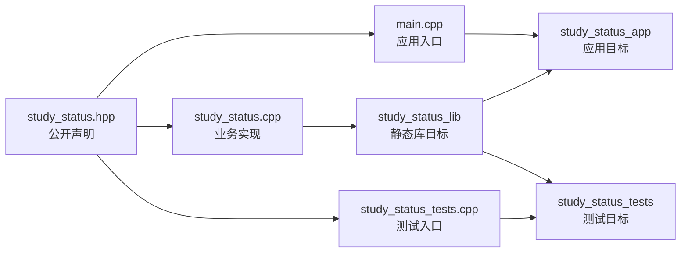
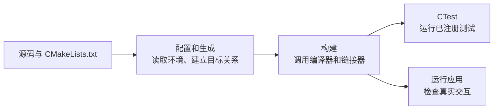

<section id="overview-three-green-lines" class="be-page-hero be-lesson-hero" data-learning-context="overview-three-green-lines" data-context-type="overview" markdown="1">

C++ 核心 · 第一课 · 学习进度报告器 C++ v0.3

# 头文件、源文件与最小 CMake 工程

## 三条命令，回答三个不同问题

~~~text
配置：Build files have been written to ...
构建：[100%] Built target study_status_tests
测试：100% tests passed, 0 tests failed out of 1
~~~

上一课已经有一组稳定函数。现在把声明放进头文件、定义放进源文件，让应用和测试共同链接同一份业务实现。CMake 记录这些关系，但它不会替编译器写代码，也不会自动替你运行测试。

[先看应用和测试怎样共用代码](#concept-files-targets){ .md-button .md-button--primary }
[直接跑最小工程](#reproduce-clean-build){ .md-button }

</section>

  
课程位置<strong>C++ 核心 · 1 / 3</strong>

  
前置<strong>编译、链接、函数声明与定义、终端操作</strong>

  
完成后留下<strong>公开头文件、静态库、应用、测试与干净构建记录</strong>

## 开始前

- 能在严格警告下编译上一课的函数化状态卡。
- 能区分“调用前没声明”的编译错误与“实现没参与链接”的链接错误。
- 本课使用 CMake 3.20 以上、C++20 和标准库，不下载测试框架。
- 构建产物放在源码树外的专用目录，不手工编辑 `CMakeCache.txt`。

<section id="concept-files-targets" data-learning-context="concept-files-targets" data-context-type="concept" markdown="1">

## 应用和测试共用一份业务实现

头文件让多个翻译单元看到一致声明；源文件提供实现；库目标收纳业务代码；应用和测试各自链接这个库。测试不会复制另一份业务实现，因此它检查的就是应用正在使用的规则。

头文件不是已经编译好的库。`#include` 会让声明进入当前翻译单元，真正的函数定义仍要由某个参与链接的源文件提供。

</section>

<section id="concept-header-source" data-learning-context="concept-header-source" data-context-type="concept" markdown="1">

## 头文件公开接口，源文件保存实现

头文件：

~~~cpp
std::string validate_input(
    const std::string& learner,
    double planned_hours,
    double completed_hours
);
~~~

源文件：

~~~cpp
#include "study/study_status.hpp"

std::string study::validate_input(
    const std::string& learner,
    double planned_hours,
    double completed_hours
) {
    // 实现
}
~~~

实现源文件优先包含自己的公开头文件。这样声明和定义不一致、头文件缺少直接依赖等问题会尽早暴露，不会被别的偶然 include 顺序遮住。

</section>

<section id="example-self-contained-header" data-learning-context="example-self-contained-header" data-context-type="example" markdown="1">

## 头文件要能独立站住

声明里使用 `std::string`，头文件自己就要包含 `<string>`。调用者不应猜“先 include 哪个标准库头，项目头文件才可用”。

用最小翻译单元检查：

~~~cpp
#include "study/study_status.hpp"

int main() {
    return 0;
}
~~~

~~~bash
clang++ -std=c++20 -Wall -Wextra -Wpedantic \
  -Iinclude -c header_check.cpp -o build/header_check.o
~~~

它只 include 目标头文件。如果仍能独立编译，至少说明当前公开声明没有依赖调用者先准备别的头。

</section>

<section id="concept-include-guard" data-learning-context="concept-include-guard" data-context-type="concept" markdown="1">

## Include guard 防止同一翻译单元重复处理

~~~cpp
#ifndef BECOME_ENGINEER_STUDY_STUDY_STATUS_HPP
#define BECOME_ENGINEER_STUDY_STUDY_STATUS_HPP

// 公开声明

#endif
~~~

宏名在项目内要唯一。删除 guard 后，只有普通函数声明的头文件可能暂时仍能编译；这不说明 guard 没用。以后加入类型定义、变量定义或默认参数时，重复处理就可能失败。

`#pragma once` 被主流工具链广泛使用，但课程先采用标准预处理能力构成的 guard。真实项目里遵循项目约定即可。

</section>

<section id="concept-definition-problems" data-learning-context="concept-definition-problems" data-context-type="concept" markdown="1">

## 多文件之后，三种“有代码”仍可能不够

| 现象 | 常见阶段 | 真正的问题 |
| --- | --- | --- |
| 声明和定义参数不一致 | 编译或链接 | 定义成了另一个接口，原接口仍缺实现 |
| 实现文件没加入目标 | 配置或链接 | 源码存在于磁盘，但构建系统没有使用它 |
| 普通函数定义复制进多个源文件 | 链接 | 多个翻译单元提供同名定义 |

起步时先守住：普通函数声明可以放头文件，普通函数定义只放一个源文件，所有需要的源文件明确加入目标。模板和 `inline` 的特殊规则留到后续深化。

</section>

<section id="concept-cmake-stages" data-learning-context="concept-cmake-stages" data-context-type="concept" markdown="1">

## CMake 配置成功，不等于程序已经通过

| 命令 | 它实际回答什么 |
| --- | --- |
| `cmake -S . -B build` | 项目描述和当前环境能否生成构建系统 |
| `cmake --build build` | 各目标能否编译、链接 |
| `ctest --test-dir build` | 已注册测试能否运行并返回成功 |
| 运行应用 | 真实输入输出与退出码是否符合约定 |

哪一步失败，就先在那一层找原因。重复运行配置命令不会修复 C++ 类型错误，构建成功也不会替你发现断言写错。

</section>

<section id="example-target-cmake" data-learning-context="example-target-cmake" data-context-type="example" markdown="1">

## 用目标表达关系，不拼一串全局参数

~~~cmake
add_library(study_status_lib STATIC src/study_status.cpp)
target_include_directories(
  study_status_lib
  PUBLIC "${CMAKE_CURRENT_SOURCE_DIR}/include"
)
target_compile_features(study_status_lib PUBLIC cxx_std_20)

add_executable(study_status_app src/main.cpp)
target_link_libraries(study_status_app PRIVATE study_status_lib)
~~~

`PUBLIC` include 目录会提供给库本身和依赖它的应用、测试，因为这些调用者也要 include 公开头文件。应用对库的链接关系是它自己的实现细节，所以这里是 `PRIVATE`。

| 作用域 | 当前目标使用 | 传播给依赖者 |
| --- | --- | --- |
| `PRIVATE` | 是 | 否 |
| `PUBLIC` | 是 | 是 |
| `INTERFACE` | 否 | 是 |

C++ 标准和警告也写在真正使用它们的目标上，不塞进全局 `CMAKE_CXX_FLAGS`。依赖传播因此更清楚，也不会误伤未来的第三方目标。

</section>

<section id="example-ctest-target" data-learning-context="example-ctest-target" data-context-type="example" markdown="1">

## 构建测试程序，还要把它注册给 CTest

~~~cmake
include(CTest)

if(BUILD_TESTING)
  add_executable(study_status_tests tests/study_status_tests.cpp)
  target_link_libraries(study_status_tests PRIVATE study_status_lib)
  add_test(NAME study_status_tests COMMAND study_status_tests)
endif()
~~~

`add_executable()` 只创建测试程序；`add_test()` 才让 CTest 知道怎样运行它。测试通过依赖进程返回 0，失败返回非 0；本课用标准库写最小断言，不让测试框架掩盖构建关系。

</section>

<section id="reproduce-clean-build" data-learning-context="reproduce-clean-build" data-context-type="reproduce" markdown="1">

## 在全新目录配置、构建、测试

课程快照在 `site-src/examples/cpp-core/cmake-minimal/`。从仓库根目录运行：

~~~bash
cmake -S site-src/examples/cpp-core/cmake-minimal \
  -B /tmp/be-cmake-minimal -DCMAKE_BUILD_TYPE=Debug
cmake --build /tmp/be-cmake-minimal --config Debug
ctest --test-dir /tmp/be-cmake-minimal \
  --build-config Debug --output-on-failure
~~~

Windows 可以把构建目录换到自己有权限的位置，例如 `build-verify`。Visual Studio 等多配置生成器通常把应用放在 `Debug/` 子目录；`--config Debug` 在构建与测试时明确选择配置。

三步都通过后再运行应用。单配置生成器通常是：

~~~bash
/tmp/be-cmake-minimal/study_status_app
~~~

输入 `Lin Yue / 10 / 7.5`，仍应得到 75.0%、进行中和零退出码。

</section>

<section id="reproduce-inspect-build" data-learning-context="reproduce-inspect-build" data-context-type="reproduce" markdown="1">

## 看一次真实编译和链接命令

~~~bash
cmake --build /tmp/be-cmake-minimal --verbose
~~~

在输出里找：

- `study_status.cpp`、`main.cpp` 和测试分别被编译。
- 命令包含 C++20 和项目警告参数。
- 应用与测试都链接 `study_status_lib`。

只修改 `study_status.cpp` 后再次构建，再修改公开头文件后构建。比较哪些翻译单元重编译，依赖关系就不再只是图上的箭头。

</section>

<section id="modify-library-test" data-learning-context="modify-library-test" data-context-type="modify" markdown="1">

## 加一条规则，同时补测试

把“刚好达到计划”改成“刚好完成”，“超过计划”改成“超额完成”。这次修改集中在库实现：

1. 先在测试里增加 `10/10` 和 `12.5/10` 两个预期。
2. 运行 CTest，确认旧实现让新断言失败。
3. 修改 `build_status()`。
4. 重新构建并运行 CTest，再跑应用。

如果公开函数签名不变，头文件不用跟着改。观察增量构建，你应该看到实现、库、应用或测试按依赖重新构建，而不是所有文件毫无区别地重来。

</section>

<section id="troubleshoot-cmake-files" data-learning-context="troubleshoot-cmake-files" data-context-type="troubleshoot" markdown="1">

## 找不到头文件或符号，先看目标关系

三次临时修改可以分别暴露不同层：

- 把 include 目录改成不存在路径：编译时找不到 `study/study_status.hpp`。
- 让头文件声明接收 `double`，源文件定义改成 `int`：调用所需接口没有定义，通常链接失败。
- 从库目标漏掉实现源文件：可能在配置阶段被 CMake 拒绝，也可能在链接阶段缺符号，取决于目标还剩什么源文件。

磁盘上“明明有这个 cpp”不代表它已经进入目标。先检查 `add_library()` 的源文件清单、声明和定义是否一致，以及应用或测试是否链接正确的库。

</section>

<section id="troubleshoot-cache-tests" data-learning-context="troubleshoot-cache-tests" data-context-type="troubleshoot" markdown="1">

## 缓存可疑时，新建构建树；测试失败时看真实输出

不确定旧缓存或生成器是否干扰时，直接换一个构建目录：

~~~bash
cmake -S site-src/examples/cpp-core/cmake-minimal \
  -B /tmp/be-cmake-clean -DCMAKE_BUILD_TYPE=Debug
cmake --build /tmp/be-cmake-clean --config Debug
ctest --test-dir /tmp/be-cmake-clean --build-config Debug --output-on-failure
~~~

不要对不确定路径执行危险删除命令。先证明新目录可以完整重建，再人工确认旧目录确实只有生成物。

把测试预期 0.75 临时改成 0.80，CTest 应返回非零并显示 `FAILED`。恢复断言后还要重新构建、重新测试；“已经改回去”不是验证结果。

</section>

<section id="project-cpp-v03" data-learning-context="project-cpp-v03" data-context-type="project" markdown="1">

## 报告器第一次有了工程骨架

| 之前 | 现在 | 下一课 |
| --- | --- | --- |
| 单文件函数接口 | 头文件、实现、应用、测试分离 | 用 STL 处理多条记录 |
| 手写编译命令 | CMake 目标表达依赖 | 容器与算法进入同一库 |
| 手工输入回归 | CTest 检查纯计算规则 | 报告文本与数据契约继续稳定 |

课程快照保持足够小，便于看清构建关系。正式[双语言学习进度报告器](../../../exercises/programming-languages/study-progress-reporters/README.md)已经沿相同骨架继续加入容器、审计和更多测试；本课不会为了演示早期版本删减正式项目。

</section>

<section id="deepen-build-contract" data-learning-context="deepen-build-contract" data-context-type="deepen" markdown="1">

## CMakeLists 也是需要维护的接口

构建文件决定源文件、公开 include、语言标准和依赖传播。如果靠个人绝对路径、`file(GLOB)` 或全局 flags 让当前机器碰巧成功，换环境和新增目标时很难解释结果。

本课暂不加入安装、导出、包管理、Presets 或下载依赖。先把“源码树可以从全新目录配置、构建、测试”做扎实，再谈更大的交付边界。

</section>

<section id="career-cmake-evidence" data-learning-context="career-cmake-evidence" data-context-type="career" markdown="1">

## 讲 CMake 时，不要只说“会写 CMakeLists”

可以拿出目标图、全新构建日志、一次链接失败定位和一次 CTest 先失败后恢复的记录。说明为什么公开 include 是 `PUBLIC`，应用链接是 `PRIVATE`，以及测试为什么必须链接同一库。

这组材料能说明你理解构建边界，而不只是从别处复制了一份配置文件。

</section>

## 完成检查

- [ ] 能解释头文件、源文件、翻译单元、静态库和可执行目标的关系。
- [ ] 能让公开头文件自包含，并使用项目唯一 include guard。
- [ ] 能区分重复声明、缺失定义和重复定义。
- [ ] 能说明配置、构建、测试和运行分别验证什么。
- [ ] 能使用库、应用和测试三个目标表达依赖。
- [ ] 能解释 `PUBLIC`、`PRIVATE` 和 `INTERFACE` 的传播差别。
- [ ] 能在全新构建目录完成配置、构建和 CTest。
- [ ] 能复现 include 路径、签名、源文件清单和断言四类失败。
- [ ] 能证明生成物没有污染源码树或进入 Git。

## 来源与版本

| 来源 | 用于核查 | 核查日期 |
| --- | --- | --- |
| [CMake tutorial](https://cmake.org/cmake/help/latest/guide/tutorial/) | 配置、目标与构建流程 | 2026-07-17 |
| [CMake buildsystem manual](https://cmake.org/cmake/help/latest/manual/cmake-buildsystem.7.html) | 目标使用要求与传播 | 2026-07-17 |
| [target_include_directories](https://cmake.org/cmake/help/latest/command/target_include_directories.html) | `PUBLIC`／`PRIVATE`／`INTERFACE` include 目录 | 2026-07-17 |
| [target_compile_features](https://cmake.org/cmake/help/latest/command/target_compile_features.html) | C++20 目标能力 | 2026-07-17 |
| [CTest manual](https://cmake.org/cmake/help/latest/manual/ctest.1.html) | 测试发现、运行和退出状态 | 2026-07-17 |
| [C++ working draft](https://github.com/cplusplus/draft) | 翻译单元、声明与定义边界 | 2026-07-17 |

## 下一步

下一节进入[STL 容器、迭代器与基础算法](04-stl-containers-iterators-algorithms.md)。报告器会从一条状态升级为多条记录，并用 `vector`、迭代器和标准算法完成汇总、排序与筛选。
