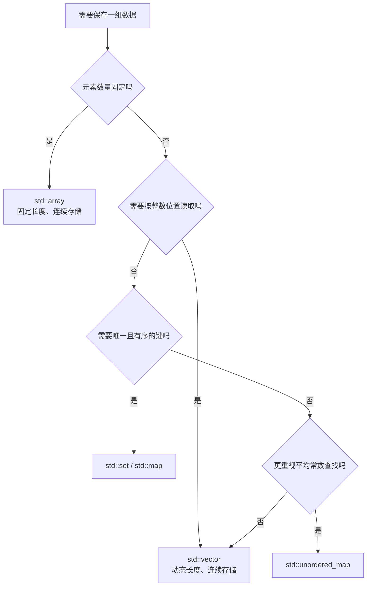
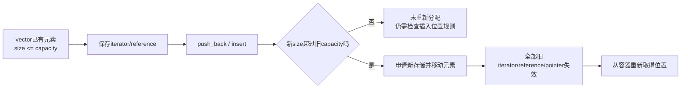

# C++ STL 容器、迭代器与基础算法

<div class="be-tutor-mount" data-tutor-lesson="cpp-core-04" aria-hidden="true"></div>

> **任务先行：** 把学习状态卡升级为多记录学习报告器。先完成一条可验证报告，再用容器、范围和算法解释每次修改。

## 任务路线

<div class="be-task-route" role="list" aria-label="本课五步任务"><span role="listitem">1 报告</span><span role="listitem">2 容器</span><span role="listitem">3 算法</span><span role="listitem">4 诊断</span><span role="listitem">5 迁移</span></div>

<section id="step-1" class="be-task-step" data-step-id="step-1" markdown="1">

## 第一步：生成第一份多记录报告

按完整示例构建并运行双语言学习报告器。**可观察结果：** C++ 输出与共同数据和报告规则一致，CTest 通过。

</section>

<section id="step-2" class="be-task-step" data-step-id="step-2" markdown="1">

## 第二步：为记录选择容器

向样例增加一条学习记录，说明为什么动态记录使用 `std::vector`，唯一标签可使用 `std::set`，按键查找才考虑 `std::map`。重新运行并确认记录进入报告。

</section>

<section id="step-3" class="be-task-step" data-step-id="step-3" markdown="1">

## 第三步：用算法完成一个可观察修改

在半开区间 `[begin, end)` 上使用 `find_if`、`count_if`、`transform`、`accumulate` 或 `sort` 中的一种，输出修改前后结果。**成功标准：** 能说明 `end()` 不是最后一个元素。

</section>

<section id="step-4" class="be-task-step" data-step-id="step-4" markdown="1">

## 第四步：故意观察迭代器失效或排序风险

保存 `vector` 迭代器后触发可能重新分配的增长，或把排序比较器临时写成 `<=` 并阅读问题。恢复安全写法。**验收：** 不持有可能失效的迭代器继续解引用。

</section>

<section id="step-5" class="be-task-step" data-step-id="step-5" markdown="1">

## 第五步：迁移验收与下一步

独立增加一种统计或筛选规则，保证输入记录不被意外修改，并与 Python 版本对比输出。完成后进入 Python 迭代器与生成器，理解惰性消费的对应关系。

</section>

上一节已经把程序拆成头文件、源文件、库、应用和测试，但学习状态卡仍然只能处理一条记录。本节把它升级为多记录报告器，并学习如何根据数据的顺序、唯一性和查找方式选择容器。

目标不是背完STL接口，而是建立三个判断：数据应该放在哪里、算法通过什么范围处理数据、修改容器后哪些位置仍然有效。

## 课程信息

| 项目 | 内容 |
| --- | --- |
| 适合人群 | 已完成C++多文件与最小CMake课程，需要处理多条结构化数据的学习者 |
| 前置知识 | C++20基础类型、函数、`const&`、命名空间、头文件、CMake和CTest |
| 学习结果 | 能选择基础STL容器，使用迭代器和标准算法处理多条记录，并解释复杂度与失效边界 |
| 环境 | Apple Clang 21、CMake 4.4.0；C++20，仅使用标准库 |
| 阶段作品 | [双语言学习进度报告器](../../../exercises/programming-languages/study-progress-reporters/README.md) |
| 事实核查 | 2026-07-15，依据C++工作草案相关章节 |

## 学习目标

完成本节后，你应该能够：

- 根据数据规模、顺序、唯一性和查找方式选择基础容器。
- 使用`std::vector`保存、追加、读取和遍历多条记录。
- 区分`size()`与`capacity()`，说明`reserve()`不会改变元素数量。
- 使用`begin()`和`end()`表达半开区间`[begin, end)`。
- 使用范围`for`、显式迭代器和`const`引用只读遍历。
- 解释`vector`重新分配为何会使旧引用、指针和迭代器失效。
- 使用标准算法完成查找、筛选、统计、转换、累计和排序。
- 编写满足严格弱序的排序比较器，不使用`<=`。
- 说明顺序容器、关联容器和无序关联容器的典型复杂度差异。
- 审阅AI生成的STL代码，发现错误容器、隐藏复制和悬空位置。

## 学习顺序

1. 从业务需求选择容器。
2. 使用`vector`表示多条简单聚合记录。
3. 用迭代器和半开区间理解标准算法接口。
4. 观察`size`、`capacity`、重新分配和失效。
5. 使用查找、计数、转换、累计与排序算法。
6. 使用`set`和`map`生成稳定的汇总结果。
7. 完成双语言多记录报告器并验证输出一致。

## 根据需求选择容器

下面的图回答一个问题：**面对一组数据，首先应该依据什么选择容器？**



这不是绝对规则。数据量很小时，简单的`vector`加线性查找往往足够清楚；不能只看到“哈希平均更快”就把所有数据放进`unordered_map`。

| 容器 | 主要特征 | 典型访问或查找 | 输出顺序 |
| --- | --- | --- | --- |
| `std::string` | 专门保存字符序列 | 按位置常数访问，文本查找取决于操作 | 保留字符顺序 |
| `std::array<T, N>` | 编译期固定长度 | 按位置常数访问 | 保留元素顺序 |
| `std::vector<T>` | 动态连续序列 | 按位置常数访问，普通查找线性 | 保留元素顺序 |
| `std::set<T>` | 唯一且有序的值 | 对数级查找、插入 | 按比较规则排序 |
| `std::map<K, V>` | 唯一且有序的键值 | 对数级查找、插入 | 按键排序 |
| `std::unordered_map<K, V>` | 哈希键值 | 平均常数查找，最坏线性 | 不提供业务可依赖顺序 |

复杂度描述的是增长趋势，不是一次运行的耗时承诺。容器元素类型、哈希质量、内存局部性和数据规模都会影响真实结果。

### 固定长度与动态长度

```cpp
#include <array>
#include <vector>

std::array<int, 3> fixed_scores{80, 90, 95};
std::vector<int> changing_scores{80, 90};
changing_scores.push_back(95);
```

`array`长度属于类型的一部分；`vector`可以增加或删除元素。本节的课程记录数量会变化，因此使用`vector`。

### 结构化记录只做简单聚合

```cpp
struct StudyRecord {
    std::string course_name;
    double target_hours;
    double completed_hours;
    std::vector<std::string> tags;
};
```

这里只把相关字段放在一起，不讲构造函数、封装或生命周期策略。对象与资源课程会继续回答“对象怎样建立和维持不变量”。

## 迭代器与半开区间

许多标准算法接收两个位置：第一个元素和结束位置。范围写作`[first, last)`，左边包含，右边不包含。

```cpp
const std::vector<int> scores{80, 90, 95};

for (auto iterator = scores.begin(); iterator != scores.end(); ++iterator) {
    std::cout << *iterator << '\n';
}
```

- `begin()`指向第一个元素。
- `end()`指向最后一个元素之后的位置，不能解引用。
- 空容器中`begin() == end()`，算法自然处理零个元素。
- `*iterator`读取当前位置，`++iterator`移动到下一个位置。

只读遍历优先使用`const`引用：

```cpp
for (const StudyRecord& record : records) {
    std::cout << record.course_name << '\n';
}
```

范围`for`更适合“全部遍历”；显式迭代器适合需要当前位置、与`end()`比较或传给算法的场景。

## `vector`容量与迭代器失效

下面的图回答一个问题：**为什么向`vector`追加元素后不能盲目继续使用旧迭代器？**



```cpp
std::vector<int> values{};
values.reserve(4);

std::cout << values.size() << ' ' << values.capacity() << '\n';
values.push_back(10);
```

- `size()`是当前元素数量。
- `capacity()`是不重新分配时最多可以容纳的元素数量。
- `reserve(4)`至少预留四个位置，但`size()`仍是`0`。
- 若重新分配发生，指向原元素的引用、指针、迭代器以及旧`end()`全部失效。

不要为了观察错误而解引用失效迭代器，那属于未定义行为。安全实验只记录扩容前后的`capacity()`，扩容后重新调用`begin()`取得新位置。

`reserve()`是容量提示，不是每个`vector`都必须调用。只有已经知道大致元素数量或需要降低重新分配次数时才使用。

## 标准算法操作范围

标准算法把“遍历机制”与“业务操作”分开。下面只介绍本节会实际使用的部分。

### `find`与`find_if`

```cpp
const auto tag_position{
    std::find(record.tags.begin(), record.tags.end(), "基础")
};
const bool has_tag{tag_position != record.tags.end()};
```

`find`查找等于给定值的元素。`find_if`接收判断条件：

```cpp
const auto course_position{
    std::find_if(
        records.begin(), records.end(),
        [](const StudyRecord& record) {
            return record.completed_hours >= record.target_hours;
        }
    )
};
```

找不到时返回传入范围的结束迭代器，使用前必须先比较。

### `count_if`、`transform`与`accumulate`

```cpp
const auto completed_count{
    std::count_if(
        records.begin(), records.end(),
        [](const StudyRecord& record) {
            return record.completed_hours >= record.target_hours;
        }
    )
};
```

```cpp
std::vector<double> progresses{};
std::transform(
    records.begin(), records.end(),
    std::back_inserter(progresses),
    [](const StudyRecord& record) {
        return record.completed_hours / record.target_hours;
    }
);
```

```cpp
const double total{
    std::accumulate(
        records.begin(), records.end(), 0.0,
        [](double current, const StudyRecord& record) {
            return current + record.completed_hours;
        }
    )
};
```

`transform`需要可写输出位置；`back_inserter`让结果通过`push_back`进入容器。`accumulate`的初始值类型会影响累计类型，因此小时数使用`0.0`而不是`0`。

### `sort`会修改传入范围

```cpp
std::vector<StudyRecord> sort_by_progress(std::vector<StudyRecord> records) {
    std::sort(
        records.begin(), records.end(),
        [](const StudyRecord& left, const StudyRecord& right) {
            return calculate_progress(left) > calculate_progress(right);
        }
    );
    return records;
}
```

参数按值传入，函数排序的是副本。若改为非`const`引用，调用者容器会被原地重排，接口必须明确表达这种副作用。

## Lambda与严格弱序

Lambda让短小条件靠近算法调用：

```cpp
[&tag](const StudyRecord& record) {
    return std::find(record.tags.begin(), record.tags.end(), tag) !=
        record.tags.end();
}
```

- `[]`是捕获列表。
- `[&tag]`按引用捕获当前函数中的`tag`。
- 参数和返回判断与普通函数相同。

排序比较器必须回答“left是否严格排在right前面”。相等元素互相比较都应返回`false`：

```cpp
return left_progress > right_progress;
```

不能写成`left_progress >= right_progress`或对升序使用`<=`。这会让元素与自己比较为`true`，破坏严格弱序，`std::sort`的行为不再满足要求。

本节用课程名作为进度相同的次级规则，使报告顺序稳定：

```cpp
if (left_progress != right_progress) {
    return left_progress > right_progress;
}
return left.course_name < right.course_name;
```

## 有序与无序关联容器

唯一标签需要去重并稳定展示，所以使用`std::set<std::string>`。状态统计需要稳定按键输出，所以使用`std::map<std::string, std::size_t>`。

```cpp
std::set<std::string> unique_tags{};
std::map<std::string, std::size_t> status_counts{};
```

`unordered_map`适合不依赖遍历顺序、重视平均查找成本的场景：

```cpp
std::unordered_map<std::string, int> fast_lookup{
    {"Python 起步", 1},
    {"C++ 核心", 2},
};
```

不能把一次运行中的哈希遍历顺序写进测试或用户可见协议。需要稳定输出时，选择有序容器，或把键复制到序列后显式排序。

## 复杂度与选择依据

设记录数为`N`，单条记录平均标签数为`T`：

| 操作 | 本节实现 | 典型复杂度 |
| --- | --- | --- |
| 按位置读取`vector` | `records[index]` | `O(1)` |
| 在`vector`查课程 | `find_if` | `O(N)` |
| 统计全部记录 | 两次`count_if` | `O(N)`，常数次遍历 |
| 累计总时间 | `accumulate` | `O(N)` |
| 按进度排序 | `sort` | `O(N log N)`比较 |
| 单条记录查标签 | `find` | `O(T)` |
| `set/map`查找 | 有序关联结构 | `O(log N)` |
| `unordered_map`查找 | 哈希结构 | 平均`O(1)`，最坏`O(N)` |

减少遍历次数不一定优先于可读性。只有性能证据说明这里是瓶颈时，才把多个清楚的算法强行合并成复杂循环。

## 完整示例：多记录学习报告器

目录和构建方式延续上一节：

```text
study-reporters/
├── include/study/study_report.hpp
├── src/main.cpp
├── src/study_report.cpp
├── tests/study_report_tests.cpp
├── .gitignore
└── CMakeLists.txt
```

以下文件与[阶段作品C++版本](https://github.com/cafelemon/become_engineer/tree/main/exercises/programming-languages/study-progress-reporters/cpp)保持一致。

### 公开头文件

```cpp title="include/study/study_report.hpp"
#ifndef BECOME_ENGINEER_STUDY_STUDY_REPORT_HPP
#define BECOME_ENGINEER_STUDY_STUDY_REPORT_HPP

#include <cstddef>
#include <map>
#include <set>
#include <string>
#include <vector>

namespace study {

struct StudyRecord {
    std::string course_name;
    double target_hours;
    double completed_hours;
    std::vector<std::string> tags;
};

struct StudySummary {
    double total_target_hours;
    double total_completed_hours;
    std::map<std::string, std::size_t> status_counts;
    std::set<std::string> unique_tags;
};

double calculate_progress(const StudyRecord& record);
std::string build_status(const StudyRecord& record);
StudySummary summarize(const std::vector<StudyRecord>& records);
std::vector<StudyRecord> sort_by_progress(std::vector<StudyRecord> records);
std::vector<StudyRecord> filter_by_tag(
    const std::vector<StudyRecord>& records,
    const std::string& tag
);
std::string build_report(const std::vector<StudyRecord>& records);
std::vector<StudyRecord> sample_records();

} // namespace study

#endif
```

### 业务实现

```cpp title="src/study_report.cpp"
#include "study/study_report.hpp"

#include <algorithm>
#include <iomanip>
#include <iterator>
#include <numeric>
#include <sstream>

namespace study {

double calculate_progress(const StudyRecord& record) {
    if (record.target_hours <= 0.0) {
        return 0.0;
    }
    const double raw_progress{record.completed_hours / record.target_hours};
    return std::clamp(raw_progress, 0.0, 1.0);
}

std::string build_status(const StudyRecord& record) {
    return record.completed_hours >= record.target_hours ? "已完成" : "进行中";
}

StudySummary summarize(const std::vector<StudyRecord>& records) {
    StudySummary summary{
        std::accumulate(
            records.begin(), records.end(), 0.0,
            [](double total, const StudyRecord& record) {
                return total + record.target_hours;
            }
        ),
        std::accumulate(
            records.begin(), records.end(), 0.0,
            [](double total, const StudyRecord& record) {
                return total + record.completed_hours;
            }
        ),
        {
            {"已完成", static_cast<std::size_t>(std::count_if(
                records.begin(), records.end(),
                [](const StudyRecord& record) {
                    return build_status(record) == "已完成";
                }
            ))},
            {"进行中", static_cast<std::size_t>(std::count_if(
                records.begin(), records.end(),
                [](const StudyRecord& record) {
                    return build_status(record) == "进行中";
                }
            ))},
        },
        {},
    };

    for (const StudyRecord& record : records) {
        summary.unique_tags.insert(record.tags.begin(), record.tags.end());
    }
    return summary;
}

std::vector<StudyRecord> sort_by_progress(std::vector<StudyRecord> records) {
    std::sort(
        records.begin(), records.end(),
        [](const StudyRecord& left, const StudyRecord& right) {
            const double left_progress{calculate_progress(left)};
            const double right_progress{calculate_progress(right)};
            if (left_progress != right_progress) {
                return left_progress > right_progress;
            }
            return left.course_name < right.course_name;
        }
    );
    return records;
}

std::vector<StudyRecord> filter_by_tag(
    const std::vector<StudyRecord>& records,
    const std::string& tag
) {
    std::vector<StudyRecord> result{};
    result.reserve(records.size());
    std::copy_if(
        records.begin(), records.end(), std::back_inserter(result),
        [&tag](const StudyRecord& record) {
            return std::find(record.tags.begin(), record.tags.end(), tag) !=
                record.tags.end();
        }
    );
    return result;
}

namespace {

std::string join_names(const std::vector<StudyRecord>& records) {
    if (records.empty()) {
        return "无";
    }
    std::ostringstream output{};
    for (auto iterator = records.begin(); iterator != records.end(); ++iterator) {
        if (iterator != records.begin()) {
            output << ", ";
        }
        output << iterator->course_name;
    }
    return output.str();
}

std::string join_tags(const std::set<std::string>& tags) {
    if (tags.empty()) {
        return "无";
    }
    std::ostringstream output{};
    for (auto iterator = tags.begin(); iterator != tags.end(); ++iterator) {
        if (iterator != tags.begin()) {
            output << ", ";
        }
        output << *iterator;
    }
    return output.str();
}

} // namespace

std::string build_report(const std::vector<StudyRecord>& records) {
    const StudySummary summary{summarize(records)};
    const std::vector<StudyRecord> sorted_records{sort_by_progress(records)};
    const std::vector<StudyRecord> basic_records{filter_by_tag(records, "基础")};
    const double overall_progress{
        summary.total_target_hours > 0.0
            ? std::clamp(
                summary.total_completed_hours / summary.total_target_hours,
                0.0, 1.0
            )
            : 0.0
    };

    std::vector<double> progresses{};
    progresses.reserve(sorted_records.size());
    std::transform(
        sorted_records.begin(), sorted_records.end(),
        std::back_inserter(progresses),
        [](const StudyRecord& record) { return calculate_progress(record); }
    );

    std::ostringstream output{};
    output << std::fixed << std::setprecision(1);
    output << "学习进度报告\n";
    output << "总计划：" << summary.total_target_hours << " 小时\n";
    output << "总完成：" << summary.total_completed_hours << " 小时\n";
    output << "总体进度：" << overall_progress * 100.0 << "%\n\n";
    output << "按进度排序：\n";
    for (std::size_t index{}; index < sorted_records.size(); ++index) {
        output << "- " << sorted_records[index].course_name << "："
               << progresses[index] * 100.0 << "%（"
               << build_status(sorted_records[index]) << "）\n";
    }
    output << "\n状态统计：\n";
    for (const auto& [status, count] : summary.status_counts) {
        output << "- " << status << "：" << count << '\n';
    }
    output << "唯一标签：" << join_tags(summary.unique_tags) << '\n';
    output << "标签[基础]：" << join_names(basic_records);
    return output.str();
}

std::vector<StudyRecord> sample_records() {
    return {
        {"Python 起步", 10.0, 7.5, {"python", "基础"}},
        {"C++ 核心", 12.0, 12.0, {"cpp", "基础"}},
        {"算法练习", 8.0, 4.0, {"算法", "基础", "基础"}},
        {"工程复盘", 5.0, 7.0, {"工程", "复盘"}},
    };
}

} // namespace study
```

### 程序入口

```cpp title="src/main.cpp"
#include "study/study_report.hpp"

#include <iostream>

int main() {
    std::cout << study::build_report(study::sample_records()) << '\n';
    return 0;
}
```

### 完整测试文件

测试覆盖空记录、重复标签、进度并列、超额完成、筛选无结果、输入不变和稳定报告：

```cpp title="tests/study_report_tests.cpp"
#include "study/study_report.hpp"

#include <cmath>
#include <iostream>
#include <string>
#include <vector>

namespace {

int failures{};

void expect_true(bool condition, const std::string& message) {
    if (!condition) {
        std::cerr << "FAILED: " << message << '\n';
        ++failures;
    }
}

void expect_close(double actual, double expected, const std::string& message) {
    constexpr double tolerance{0.000001};
    expect_true(std::abs(actual - expected) <= tolerance, message);
}

std::vector<std::string> names(const std::vector<study::StudyRecord>& records) {
    std::vector<std::string> result{};
    result.reserve(records.size());
    for (const study::StudyRecord& record : records) {
        result.push_back(record.course_name);
    }
    return result;
}

} // namespace

int main() {
    const std::vector<study::StudyRecord> records{study::sample_records()};
    const std::vector<std::string> original_names{names(records)};
    const study::StudySummary summary{study::summarize(records)};

    expect_close(summary.total_target_hours, 35.0, "total target hours");
    expect_close(summary.total_completed_hours, 30.5, "total completed hours");
    expect_true(summary.status_counts.at("已完成") == 2, "completed count");
    expect_true(summary.status_counts.at("进行中") == 2, "in-progress count");
    expect_true(summary.unique_tags.size() == 6, "duplicate tags should collapse");

    const study::StudySummary empty_summary{study::summarize({})};
    expect_close(empty_summary.total_target_hours, 0.0, "empty target total");
    expect_true(empty_summary.unique_tags.empty(), "empty tags");

    const std::vector<study::StudyRecord> sorted{study::sort_by_progress(records)};
    expect_true(
        names(sorted) == std::vector<std::string>{
            "C++ 核心", "工程复盘", "Python 起步", "算法练习"
        },
        "progress order and name tie-breaker"
    );
    expect_true(names(records) == original_names, "sorting must not mutate input");

    std::vector<study::StudyRecord> filtered{study::filter_by_tag(records, "基础")};
    expect_true(
        names(filtered) == std::vector<std::string>{
            "Python 起步", "C++ 核心", "算法练习"
        },
        "tag filter"
    );
    filtered.front().tags.push_back("changed");
    expect_true(
        records.front().tags.size() == 2,
        "filtered records must be independent copies"
    );
    expect_true(
        study::filter_by_tag(records, "不存在").empty(),
        "missing tag should return an empty vector"
    );

    const std::vector<study::StudyRecord> equal_progress{
        {"B", 2.0, 1.0, {}},
        {"A", 4.0, 2.0, {}},
    };
    expect_true(
        names(study::sort_by_progress(equal_progress)) ==
            std::vector<std::string>{"A", "B"},
        "equal progress should use name order"
    );

    const std::string expected{
        "学习进度报告\n"
        "总计划：35.0 小时\n"
        "总完成：30.5 小时\n"
        "总体进度：87.1%\n\n"
        "按进度排序：\n"
        "- C++ 核心：100.0%（已完成）\n"
        "- 工程复盘：100.0%（已完成）\n"
        "- Python 起步：75.0%（进行中）\n"
        "- 算法练习：50.0%（进行中）\n\n"
        "状态统计：\n"
        "- 已完成：2\n"
        "- 进行中：2\n"
        "唯一标签：cpp, python, 基础, 复盘, 工程, 算法\n"
        "标签[基础]：Python 起步, C++ 核心, 算法练习"
    };
    expect_true(study::build_report(records) == expected, "stable report output");

    if (failures == 0) {
        std::cout << "All study report tests passed.\n";
        return 0;
    }
    std::cerr << failures << " test(s) failed.\n";
    return 1;
}
```

### CMake项目

```cmake title="CMakeLists.txt"
cmake_minimum_required(VERSION 3.20)

project(study_reporters VERSION 0.1.0 LANGUAGES CXX)

function(enable_project_warnings target_name)
  if(MSVC)
    target_compile_options(${target_name} PRIVATE /W4 /permissive-)
  else()
    target_compile_options(
      ${target_name}
      PRIVATE -Wall -Wextra -Wpedantic -Wconversion -Wshadow
    )
  endif()
endfunction()

add_library(study_report_lib STATIC src/study_report.cpp)
target_include_directories(
  study_report_lib
  PUBLIC "${CMAKE_CURRENT_SOURCE_DIR}/include"
)
target_compile_features(study_report_lib PUBLIC cxx_std_20)
set_target_properties(study_report_lib PROPERTIES CXX_EXTENSIONS OFF)
enable_project_warnings(study_report_lib)

add_executable(study_report_app src/main.cpp)
target_link_libraries(study_report_app PRIVATE study_report_lib)
set_target_properties(study_report_app PROPERTIES CXX_EXTENSIONS OFF)
enable_project_warnings(study_report_app)

include(CTest)

if(BUILD_TESTING)
  add_executable(study_report_tests tests/study_report_tests.cpp)
  target_link_libraries(study_report_tests PRIVATE study_report_lib)
  set_target_properties(study_report_tests PROPERTIES CXX_EXTENSIONS OFF)
  enable_project_warnings(study_report_tests)
  add_test(NAME study_report_tests COMMAND study_report_tests)
endif()
```

### Git忽略边界

```gitignore title=".gitignore"
build/
```

### 构建、测试与运行

```bash
cmake -S . -B build -DCMAKE_BUILD_TYPE=Debug
cmake --build build --config Debug
ctest --test-dir build --build-config Debug --output-on-failure
./build/study_report_app
```

预期关键结果：全部目标在严格警告下零警告，CTest通过，应用输出与[阶段作品README](../../../exercises/programming-languages/study-progress-reporters/README.md)中的预期报告一致。

## AI协作任务

### 可复用提示模板

```text
请把单条C++20学习状态卡升级为多记录报告器。
约束：
1. 使用简单StudyRecord聚合和std::vector保存记录；
2. 使用标准算法完成排序、筛选、计数、转换与累计；
3. 排序按进度降序，进度相同按课程名升序；
4. 使用std::set和std::map生成稳定输出，不依赖unordered_map遍历顺序；
5. 排序和筛选不得修改调用者输入；
6. 不返回指向局部变量的引用、指针或迭代器；
7. 比较器必须满足严格弱序，不使用<=或>=；
8. 保持C++20、严格警告、CMake和CTest，不引入第三方库。
请同时给出复杂度、迭代器失效风险、测试和验证命令。
```

### 人工审阅清单

- 容器选择是否服务于顺序、唯一性和查找要求。
- 是否为了“看起来高级”引入`list`、ranges或模板抽象。
- 按值参数是否是有意复制，还是隐藏性能问题。
- Lambda捕获是否超过实际需要。
- 比较器对相同元素是否返回`false`。
- `vector`修改后是否继续使用旧位置。
- 哈希容器顺序是否进入报告和测试契约。
- 测试是否证明原始记录没有被排序或筛选修改。

主动修改：把筛选标签从“基础”改成“工程”，先更新行为测试，再修改实现并比较两种语言的输出。

## 核心手动检查点

1. 在纸上追踪`[begin, end)`处理三个元素和空容器的过程。
2. 记录一次`vector`追加前后的`size`与`capacity`；若容量变化，只重新取得迭代器，不解引用旧位置。
3. 把`sort_by_progress`改成非`const`引用原地排序，观察输入测试失败，再恢复按值副本。
4. 解释为什么标签查找使用线性`find`，状态统计使用`map`，而不是机械替换成哈希。
5. 把一次手写累计循环改成`accumulate`，先让已有测试证明行为没有改变。
6. 把比较器错误改成`>=`，说明规则为何无效；不要把未定义行为的偶然输出当成实验结论。

## 微练习

1. 用`array`保存固定三次测验分数，用`vector`保存数量会变化的练习记录。
2. 使用`reserve`预留容量，验证它不会改变`size()`。
3. 使用显式迭代器遍历空容器和非空容器。
4. 用`find_if`找到第一条已完成记录，并先检查是否等于`end()`。
5. 用`count_if`统计未完成记录，用`accumulate`累计计划时间。
6. 用`transform`生成进度数组，并与原记录数量对照。
7. 用`set`去重重复标签，用`map`统计状态。
8. 为并列进度补充课程名次级排序规则。
9. 验证筛选无结果返回空`vector`，而不是特殊占位记录。
10. 故意改坏一个CTest期望，确认非零退出后恢复。

## 常见错误与排查

| 现象 | 常见原因 | 检查方法 | 修复方向 |
| --- | --- | --- | --- |
| `vector`越界或崩溃 | 用`operator[]`读取不存在位置 | 先检查`size()`，调试时可用`at()` | 修正索引或遍历方式 |
| 查找后解引用失败 | 未判断返回值是否为`end()` | 打印或断点检查比较结果 | 先处理未找到分支 |
| 排序结果偶尔异常 | 比较器使用`<=`、`>=`或依赖可变状态 | 检查`comp(x, x)`是否为`false` | 建立严格顺序和稳定次级规则 |
| 原始记录顺序改变 | 对调用者容器直接`sort` | 排序前后比较课程名序列 | 明确原地副作用或排序副本 |
| 旧迭代器失效 | `vector`插入、扩容或删除后继续使用 | 比较操作前后`capacity`和修改位置 | 修改后重新取得位置 |
| 报告顺序跨运行变化 | 依赖`unordered_map`遍历顺序 | 搜索输出循环使用的容器 | 改用`map`或显式排序键 |
| 标签重复 | 直接输出所有记录的标签 | 加入重复标签测试 | 使用`set`或显式去重 |
| `accumulate`结果类型不对 | 初始值写成`0`导致整数累计 | 检查初始值类型 | 浮点累计使用`0.0` |
| 构建警告涉及有符号比较 | `int`与`size_t`混用 | 阅读`-Wconversion`诊断 | 索引使用`std::size_t`或范围遍历 |

## 阶段作品

[双语言学习进度报告器](../../../exercises/programming-languages/study-progress-reporters/README.md)同时提供Python和C++实现。两边使用同一数据与业务规则，分别通过mypy/unittest和编译器/CTest验收，并要求标准输出逐字一致。

这份作品整合六节课程，不是一课一个项目。现有[Python起步学习进度报告器](../../../exercises/python-basics/study-progress-reporter/README.md)继续保留，代表较早阶段的文件、异常和测试能力，不被本作品覆盖。

## 完成标准

- 能为固定序列、动态序列、唯一值和键值查找选择基础容器。
- 能解释`vector`的`size`、`capacity`、重新分配和迭代器失效。
- 能手动追踪半开区间并正确处理`end()`。
- 能使用本节要求的查找、统计、转换、累计和排序算法。
- 能说明`sort`的修改行为和按值复制的接口取舍。
- 能写出严格弱序比较器并解释为何不能使用`<=`。
- 能说明`map`与`unordered_map`在复杂度和输出顺序上的差异。
- 能在严格警告下构建课程工程并通过CTest。
- 能运行双语言阶段作品并证明输出一致、输入不变。
- 能审阅AI代码中的容器、复制、迭代器和比较器风险。

## 来源与版本

| 来源 | 用于核查 | 版本或日期 |
| --- | --- | --- |
| [C++工作草案：vector容量](https://eel.is/c++draft/vector.capacity) | `capacity`、`reserve`和重新分配失效 | C++20教学基线，2026-07-15核查 |
| [C++工作草案：vector修改操作](https://eel.is/c++draft/vector.modifiers) | 插入、删除与迭代器失效 | C++20教学基线，2026-07-15核查 |
| [C++工作草案：迭代器要求](https://eel.is/c++draft/iterator.requirements) | 迭代器、范围和算法前置 | 2026-07-15核查 |
| [C++工作草案：查找算法](https://eel.is/c++draft/alg.find) | `find`与`find_if` | 2026-07-15核查 |
| [C++工作草案：排序算法](https://eel.is/c++draft/alg.sorting) | `sort`、复杂度与严格弱序 | 2026-07-15核查 |
| [C++工作草案：关联容器](https://eel.is/c++draft/associative.reqmts) | `set`、`map`和有序复杂度 | 2026-07-15核查 |
| [C++工作草案：无序关联容器](https://eel.is/c++draft/unord.req) | 哈希容器平均与最坏复杂度 | 2026-07-15核查 |

## 下一步

下一节进入Python核心语言的 **容器协议、迭代器与生成器**。它会从Python侧解释可迭代对象、迭代器、惰性生成和能力型容器接口，并与本节的半开区间和STL算法形成对照。
