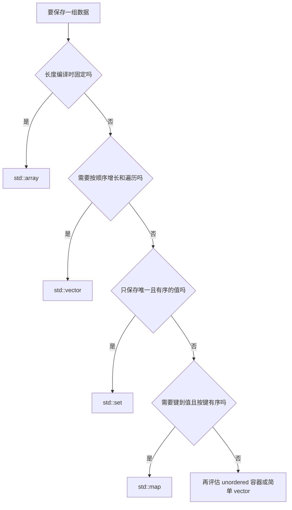

<section id="overview-multi-record-report" class="be-page-hero be-lesson-hero" data-learning-context="overview-multi-record-report" data-context-type="overview" markdown="1">

C++ 核心 · 第二课 · 双语言学习进度报告器

# C++ STL 容器、迭代器与基础算法

## 一条状态卡，长成了多记录报告

~~~text
学习进度报告
总计划：35.0 小时
总完成：30.5 小时
总体进度：87.1%

按进度排序：
- C++ 核心：100.0%（已完成）
- 工程复盘：100.0%（已完成）
- Python 起步：75.0%（进行中）
- 算法练习：50.0%（进行中）
~~~

数据从一条变成多条以后，程序要保存顺序、汇总小时、去重标签、统计状态、排序和筛选。STL 不只是容器名字和函数表，它提供了一套“数据放在哪里、算法处理哪段范围、修改后什么位置仍然有效”的共同语言。

[先选合适的容器](#concept-choose-container){ .md-button .md-button--primary }
[直接跑算法小例子](#reproduce-stl-micro){ .md-button }

</section>

  
课程位置<strong>C++ 核心 · 2 / 3</strong>

  
前置<strong>C++ 函数、引用、CMake、CTest 和基本复杂度</strong>

  
完成后留下<strong>多记录报告、容器选择、算法回归和双语言一致性</strong>

## 开始前

- 已能从全新目录构建上一课的库、应用和测试。
- 知道 `const&` 表达只读借用，按值参数会复制输入。
- 本课只使用 C++20 标准库，不提前引入 ranges、模板框架或第三方容器。
- 正式阶段作品已经包含本课代码；小例子用更小数据帮助看清算法行为。

<section id="concept-choose-container" data-learning-context="concept-choose-container" data-context-type="concept" markdown="1">

## 先问数据怎样使用，再选容器

| 容器 | 适合这里的什么数据 | 顺序与查找 |
| --- | --- | --- |
| `std::array<T, N>` | 固定三次测验分数 | 固定长度、按位置访问 |
| `std::vector<T>` | 数量会变化的学习记录 | 保持序列顺序，普通查找线性 |
| `std::set<T>` | 去重并稳定展示的标签 | 唯一、有序，对数级查找 |
| `std::map<K, V>` | 状态到数量的统计 | 唯一键、有序输出 |
| `std::unordered_map<K, V>` | 不依赖遍历顺序的键查找 | 平均常数查找，不承诺业务顺序 |

数据很小时，`vector` 加线性查找往往最清楚。看到“哈希平均更快”就把所有东西换成 `unordered_map`，会让顺序、测试和接口复杂度一起变化。

</section>

<section id="example-study-record" data-learning-context="example-study-record" data-context-type="example" markdown="1">

## 一条记录先用简单聚合表示

~~~cpp
struct StudyRecord {
    std::string course_name;
    double target_hours;
    double completed_hours;
    std::vector<std::string> tags;
};

std::vector<StudyRecord> records{
    {"Python 起步", 10.0, 7.5, {"python", "基础"}},
    {"C++ 核心", 12.0, 12.0, {"cpp", "基础"}},
};
~~~

`StudyRecord` 只是把相关字段放在一起；`vector` 保存数量会增长的记录。对象怎样维持不变量、引用和指针能借用多久，留到下一课专门处理。

</section>

<section id="concept-half-open-range" data-learning-context="concept-half-open-range" data-context-type="concept" markdown="1">

## `[begin, end)` 包含开头，不包含结尾

~~~cpp
for (auto iterator = records.begin(); iterator != records.end(); ++iterator) {
    std::cout << iterator->course_name << '\n';
}
~~~

- `begin()` 指向第一个元素。
- `end()` 指向最后一个元素之后，不能解引用。
- 空容器中 `begin() == end()`，范围自然包含零个元素。
- `[first, last)` 可以直接交给多个标准算法。

只需遍历全部记录时，范围 `for` 更直白：

~~~cpp
for (const StudyRecord& record : records) {
    std::cout << record.course_name << '\n';
}
~~~

显式迭代器适合要比较 `end()`、保留当前位置或把范围交给算法的场景。

</section>

<section id="concept-vector-capacity" data-learning-context="concept-vector-capacity" data-context-type="concept" markdown="1">

## `size` 是现有元素，`capacity` 是当前存储余量

~~~cpp
std::vector<int> values{};
values.reserve(4);
values.push_back(10);
~~~

- `size()` 现在是 1。
- `capacity()` 至少是 4，但实现可以给更多。
- `reserve(4)` 不创建四个元素。

当增长超过现有容量，`vector` 可能申请新存储并移动元素。旧引用、指针、迭代器和旧 `end()` 会失效。安全观察只记录增长前后的 `size()`、`capacity()`，扩容后重新取得位置；不要故意解引用失效迭代器，那属于未定义行为。

`reserve()` 不是固定仪式。只有大致知道数量或有重新分配证据时再使用。

</section>

<section id="example-standard-algorithms" data-learning-context="example-standard-algorithms" data-context-type="example" markdown="1">

## 查找、计数、转换和累计各有明确结果

~~~cpp
const auto first_done{
    std::find_if(records.begin(), records.end(),  {
        return record.completed_hours >= record.target_hours;
    })
};

const auto done_count{
    std::count_if(records.begin(), records.end(),  {
        return record.completed_hours >= record.target_hours;
    })
};
~~~

`find_if` 返回第一个匹配位置，使用前要和 `end()` 比较；`count_if` 直接返回匹配数量。

~~~cpp
std::vector<double> progresses{};
std::transform(
    records.begin(), records.end(), std::back_inserter(progresses),
     {
        return record.completed_hours / record.target_hours;
    }
);

const double total{
    std::accumulate(
        records.begin(), records.end(), 0.0,
         {
            return current + record.completed_hours;
        }
    )
};
~~~

`transform` 需要可写输出位置，`back_inserter` 通过 `push_back` 追加结果。浮点累计从 `0.0` 开始；写成整数 `0` 会改变累计类型。

</section>

<section id="concept-sort-copy" data-learning-context="concept-sort-copy" data-context-type="concept" markdown="1">

## `sort` 会改范围，所以报告器排序副本

~~~cpp
std::vector<StudyRecord> sort_by_progress(std::vector<StudyRecord> records) {
    std::sort(records.begin(), records.end(), compare_progress);
    return records;
}
~~~

参数按值接收，调用时生成记录副本；排序不会打乱调用者原序列。若接口改成非常量引用，原地重排就是公开副作用，名字、文档和测试都要明确。

比较器必须表达严格顺序：

~~~cpp
if (left_progress != right_progress) {
    return left_progress > right_progress;
}
return left.course_name < right.course_name;
~~~

不能写 `>=` 或 `<=`。一条记录与自己比较必须返回 `false`，进度相同时再用课程名形成稳定次级规则。

</section>

<section id="concept-associated-order" data-learning-context="concept-associated-order" data-context-type="concept" markdown="1">

## 去重和稳定输出，是这里选择 `set`、`map` 的理由

~~~cpp
std::set<std::string> unique_tags{};
std::map<std::string, std::size_t> status_counts{};
~~~

重复标签进入 `set` 后只保留一次，遍历时按比较规则有序；状态统计用 `map`，报告顺序稳定。`unordered_map` 的一次遍历看起来稳定，也不能写进用户可见协议或跨运行测试。

需要哈希查找又要稳定输出时，可以把键复制到序列后显式排序。容器选择服务于行为契约，不是按“哪个理论复杂度更低”单点决定。

</section>

<section id="concept-complexity" data-learning-context="concept-complexity" data-context-type="concept" markdown="1">

## 复杂度讲增长，不承诺一次运行几毫秒

设记录数为 `N`，单条记录平均标签数为 `T`：

| 操作 | 本课实现 | 典型复杂度 |
| --- | --- | --- |
| 按位置读取 vector | `records[index]` | `O(1)` |
| 查找课程 | `find_if` | `O(N)` |
| 统计、累计 | `count_if`、`accumulate` | `O(N)` |
| 排序 | `sort` | `O(N log N)` 次比较 |
| 单记录查标签 | `find` | `O(T)` |
| `set`／`map` 查找 | 有序关联结构 | `O(log N)` |
| `unordered_map` 查找 | 哈希结构 | 平均 `O(1)`，最坏 `O(N)` |

真实时间还受元素大小、分配、缓存局部性和数据规模影响。没有性能证据时，几个清楚算法比一个难读的“单遍万能循环”更值得保留。

</section>

<section id="reproduce-stl-micro" data-learning-context="reproduce-stl-micro" data-context-type="reproduce" markdown="1">

## 先用四个整数看清算法行为

~~~bash
clang++ -std=c++20 -Wall -Wextra -Wpedantic -Wconversion -Wshadow \
  site-src/examples/cpp-core/stl_algorithms.cpp \
  -o /tmp/be-stl-algorithms
/tmp/be-stl-algorithms
~~~

你会看到：第一项大于等于 4 的值、偶数数量、总和、转换后的序列、排序副本、原序列首项和去重标签数。先预测 `[2, 5, 3, 4]` 的结果，再运行对照。

特别看 `sorted=5 4 3 2` 与 `original_first=2`：排序发生在副本，原输入没有被改动。

</section>

<section id="reproduce-bilingual-report" data-learning-context="reproduce-bilingual-report" data-context-type="reproduce" markdown="1">

## 运行正式双语言报告器

~~~bash
cmake -S exercises/programming-languages/study-progress-reporters/cpp \
  -B /tmp/be-study-report-cpp -DCMAKE_BUILD_TYPE=Debug
cmake --build /tmp/be-study-report-cpp --config Debug
ctest --test-dir /tmp/be-study-report-cpp \
  --build-config Debug --output-on-failure
/tmp/be-study-report-cpp/study_report_app
~~~

再运行 Python 版本，比较标准输出：

~~~bash
cd exercises/programming-languages/study-progress-reporters/python
PYTHONPATH=src python -m study_progress_reporter report
~~~

两种实现不要求逐行同构，但共同样例、排序规则、状态统计、标签顺序和报告文本必须一致。

</section>

<section id="modify-report-statistic" data-learning-context="modify-report-statistic" data-context-type="modify" markdown="1">

## 增加“未完成课程数”

先在测试中写出期望，再使用 `count_if` 计算：

~~~cpp
const auto unfinished_count{
    std::count_if(records.begin(), records.end(),  {
        return build_status(record) == "进行中";
    })
};
~~~

把结果加入汇总结构和报告，保持原记录顺序与内容不变。空输入、全部完成和部分完成都要验证。若 Python 版本也加入同一公开字段，两边报告一起更新；若只是 C++ 练习，就不要宣称双语言契约已经改变。

</section>

<section id="troubleshoot-iterator" data-learning-context="troubleshoot-iterator" data-context-type="troubleshoot" markdown="1">

## `push_back` 以后，旧位置可能已经不在原来的存储上

~~~cpp
auto position = records.begin();
const auto old_capacity = records.capacity();
records.push_back(new_record);
const bool reallocated = records.capacity() != old_capacity;
~~~

如果发生重新分配，不能再解引用 `position`。即使本次容量没变，插入和删除也有各自失效规则。简单可靠的做法是完成容器修改后重新 `find_if` 或重新取得 `begin()`。

不要用“这台电脑刚好没有崩溃”证明旧迭代器安全。未定义行为没有可依赖的输出。

</section>

<section id="troubleshoot-sort-contract" data-learning-context="troubleshoot-sort-contract" data-context-type="troubleshoot" markdown="1">

## 排序异常时，先检查比较器和复制边界

| 现象 | 先检查 | 修复方向 |
| --- | --- | --- |
| 并列记录顺序变化 | 是否有稳定次级字段 | 进度相同再比较课程名 |
| 比较器对自身返回 true | 是否用了 `<=`／`>=` | 改成严格比较 |
| 原记录顺序被改 | 是否直接 sort 调用者 vector | 排序副本或明确原地接口 |
| 查找后解引用失败 | 是否先和 `end()` 比较 | 先处理未找到分支 |
| 累计小数丢失 | 初始值是否写成整数 0 | 使用 `0.0` |
| 输出跨运行变化 | 是否依赖哈希遍历 | 用有序容器或显式排序 |

比较器契约被破坏时，不要把某次“看起来还对”的结果当成通过。恢复严格顺序后，用相同进度、相同名称和空输入测试。

</section>

<section id="project-cpp-v04" data-learning-context="project-cpp-v04" data-context-type="project" markdown="1">

## 报告器开始处理真正的一组数据

| 上一版 | 这一版 | 下一版 |
| --- | --- | --- |
| 单条状态与函数 | `vector` 多记录、排序、筛选、汇总 | 对象借用、查找与 RAII 审计 |
| CMake 工程骨架 | 同一库中加入 STL 算法 | 资源离开作用域自动释放 |
| CTest 检查计算 | 输入不变和双语言输出一致 | 引用、指针和文件失败路径 |

[阶段作品说明](../../../exercises/programming-languages/study-progress-reporters/README.md)记录两种语言的共同契约。Python 通过协议和生成器表达遍历，C++ 通过容器范围和迭代器表达位置；最终输出一致，但语言机制不需要伪装成相同。

</section>

<section id="deepen-container-tradeoff" data-learning-context="deepen-container-tradeoff" data-context-type="deepen" markdown="1">

## 容器选择是一组权衡，不是一张固定答案表

顺序、修改频率、查找方式、稳定输出、元素大小和数据规模会共同影响选择。把 `vector` 换成 `list` 不会自动获得“插入更快”的整体程序；先找到位置、内存局部性和迭代方式都要算进去。

本课先建立标准容器和算法的可解释基线。真正需要性能优化时，用代表性数据、明确指标和剖析结果再改，而不是从复杂度表直接跳到结论。

</section>

<section id="career-stl-evidence" data-learning-context="career-stl-evidence" data-context-type="career" markdown="1">

## 讲 STL 时，讲选择和失败，不要背接口名

可以说明为什么记录用 `vector`、标签用 `set`、统计用 `map`；为什么排序接收副本；怎样发现旧迭代器可能失效；如何用并列进度和空输入证明比较器与算法边界。

这比说“熟悉 vector、map、sort”更能体现你知道容器和算法会怎样影响程序行为。

</section>

## 完成检查

- [ ] 能根据固定长度、动态顺序、唯一性和键值关系选择基础容器。
- [ ] 能解释 `vector` 的 `size`、`capacity`、重新分配和位置失效。
- [ ] 能手动追踪 `[begin, end)`，并在查找后先检查 `end()`。
- [ ] 能使用 `find_if`、`count_if`、`transform`、`accumulate` 和 `sort`。
- [ ] 能说明排序副本与原地排序的接口差别。
- [ ] 能写出严格比较器，解释为什么不能用 `<=` 或 `>=`。
- [ ] 能说明 `map` 与 `unordered_map` 的复杂度和输出顺序差异。
- [ ] 能通过 CTest，并证明 C++ 与 Python 主报告逐字一致。
- [ ] 能增加一项统计，同时保持输入记录不变。

## 来源与版本

| 来源 | 用于核查 | 核查日期 |
| --- | --- | --- |
| [C++ draft：vector capacity](https://eel.is/c++draft/vector.capacity) | `capacity`、`reserve` 与重新分配 | 2026-07-17 |
| [C++ draft：vector modifiers](https://eel.is/c++draft/vector.modifiers) | 插入、删除与迭代器失效 | 2026-07-17 |
| [C++ draft：iterator requirements](https://eel.is/c++draft/iterator.requirements) | 迭代器和范围前置条件 | 2026-07-17 |
| [C++ draft：find algorithms](https://eel.is/c++draft/alg.find) | `find` 与 `find_if` | 2026-07-17 |
| [C++ draft：sorting algorithms](https://eel.is/c++draft/alg.sorting) | `sort`、复杂度与严格弱序 | 2026-07-17 |
| [C++ draft：associative containers](https://eel.is/c++draft/associative.reqmts) | `set`、`map` 与有序复杂度 | 2026-07-17 |
| [C++ draft：unordered containers](https://eel.is/c++draft/unord.req) | 哈希容器平均与最坏复杂度 | 2026-07-17 |

## 下一步

下一节进入[对象、引用、指针、生命周期与 RAII](05-objects-references-pointers-lifetime-raii.md)。报告器会用引用修改一条记录、用可空非拥有指针表达“可能找不到”，并在作用域内安全写出审计文件。
